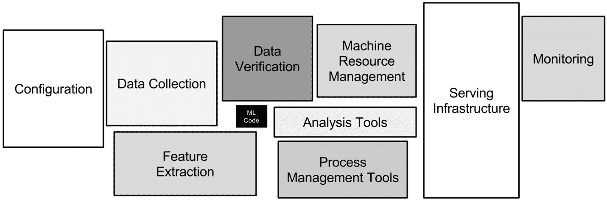

# 学习 MLOps 的 10 个绝佳资源

> 原文：<https://web.archive.org/web/20230101103007/https://www.datacamp.com/blog/10-awesome-resources-for-learning-mlops>

## 什么是 MLOps？

2015 年，谷歌发布了一篇名为《机器学习系统中隐藏的技术债务》的研究论文。在这篇论文中，斯卡利等人强调了编码预测性机器学习模型是如何在生产中构建、部署和维护机器学习系统的一小部分。这篇论文在整个领域引起了轩然大波，并通过无数数据科学家努力在生产中部署他们的模型的实例得到了验证。

# 

令人兴奋的新类别 MLOps(机器学习操作)在过去几年中出现，旨在解决数据团队面临的部署挑战。MLOps，或机器学习操作，是一套[工具、实践、技术和文化](https://web.archive.org/web/20220911042647/https://www.datacamp.com/blog/operationalizing-machine-learning-with-mlops)，确保[机器学习系统](https://web.archive.org/web/20220911042647/https://www.datacamp.com/data-courses/machine-learning-courses)的可靠和可扩展部署。随着数据科学作为一个领域的成熟，MLOps 是数据科学家可以选择的增长最快的专业之一。

鉴于 MLOps 是一个新兴的领域，没有太多成文的学习途径。无论如何，开源和机器学习社区已经提供了大量的免费资源，任何人都可以利用这些资源，这些资源非常可靠，而且非常有用。这里有 10 种免费资源，您可以从今天开始，开始您的 MLOps 学习之旅。

## 1.安德烈·布尔科夫的机器学习工程

这本[书](https://web.archive.org/web/20220911042647/http://mlebook.com/)最初于 2020 年发布，是少数几本涵盖应用机器学习基础知识的书之一。布尔科夫没有专注于任何工具或概念，而是分解了构建和部署端到端机器学习项目的艺术和科学。在整本书中，他强调了数据团队在生产中部署机器学习模型时面临的最常见挑战及其解决方案。

你可以免费阅读这本书，因为它遵循“先阅读，后购买”的原则——这意味着如果你从中获得了价值，你可以阅读并付费。

## 2.生产博客中的 ML

在当今活跃的数据科学家的时事通讯和博客中可以找到一些关于 MLOps 的最佳资源。Luigi Patruno 的 [ML in Production 博客和时事通讯](https://web.archive.org/web/20220911042647/https://mlinproduction.com/)就是最好的例子。他定期分享关于在生产中部署和维护模型的深刻内容。以下是他对自己的策展方法的描述:

*   applied——内容侧重于已经证明在生产中有效的工具、模式、平台和系统。
*   专注于最佳实践—数据科学和机器学习是快速变化的领域。缺乏拥有部署这些系统的必要技能的人员，也缺乏既定的最佳实践。时事通讯旨在向更广泛的社区展示这些最佳实践。
*   旨在提高数据科学家的工作效率-所有策划的内容旨在帮助数据科学家、ML 工程师和数据从业者获得和提高影响力大、适销对路的技能组合。

## 3.MLOps 社区

学习 MLOps 最好是一起做，并与实践。这是一个由同修组成的[社区](https://web.archive.org/web/20220911042647/https://mlops.community/),供你收听(或加入)并向该领域其他有经验的同修学习。从博客、视频和引人入胜的对话中，这个资源是在这个领域建立立足点的好方法。

## 4.全栈深度学习

这门[课程](https://web.archive.org/web/20220911042647/https://fall2019.fullstackdeeplearning.com/)在学习如何将复杂的大型模型投入生产方面提供了一些高质量的内容。它不仅由 OpenAI 和斯坦福大学的工程师和科学家等知名教授讲授，而且你还可以找到领导当今一些最鼓舞人心的机器学习公司的领导人的客座讲座，如特斯拉的 Andrej Karpathy。

本课程教授深度学习的全栈方法，包括

*   提出问题并估计项目成本
*   查找、清理、标记和补充数据
*   选择正确的框架和计算基础设施
*   故障排除培训和确保再现性
*   将模型部署到生产中

## 5.悟空莫汉达斯用 ML 做的

悟空·莫汉达斯创建了一门关于构建端到端机器学习系统的[非凡而开放的课程](https://web.archive.org/web/20220911042647/https://madewithml.com/)。Made with ML 是 GitHub 上的顶级知识库之一，超过 30K+的人正在学习他的课程。

使用 ML 的课程涵盖了机器学习的基础知识，以及在生产中部署、测试和监控模型的细节。悟空的课程涵盖了所介绍的概念背后的直觉，提供了基于项目的动手作业，并为学习者提供了一些成功担任 MLOps 角色所需的软件工程最佳实践。

## 6.牛逼的生产机器学习

这个[精心策划的 GitHub 知识库](https://web.archive.org/web/20220911042647/https://github.com/EthicalML/awesome-production-machine-learning#optimized-computation-frameworks)是为那些希望直接进入包、库和尖端工具进行实践的人准备的。所有列出的包和工具都旨在帮助您构建、部署、监控、版本化、扩展和保护您的生产机器学习系统。

无论是数据标记、模型训练编排、可解释性、服务、监控等等——这里肯定至少有几个包可以在您的项目中开始试验。它们还提供 ML 工程师简讯，让您了解机器学习从业者策划的最新框架、教程和文章。

## 7.DVC 的 MLOps 教程

DVC(数据版本控制)是一个用于机器学习项目的开源版本控制系统。DVC 将 Git 版本控制扩展到数据集和模型。此外，DVC 背后的同一个团队还开发了持续机器学习(CML)，这是一种用于调整持续集成系统的工具，如 GitHub Actions & GitLab CI 用于机器学习。

这个相对[短的 YouTube 系列](https://web.archive.org/web/20220911042647/https://www.youtube.com/watch?v=9BgIDqAzfuA&list=PL7WG7YrwYcnDBDuCkFbcyjnZQrdskFsBz)突出了 DevOps 和机器学习交汇处的重要概念。它有效地平衡了理论和实践，并向您展示了如何通过 DVC 应用数据版本控制。

## 8.机器学习操作

这种[资源](https://web.archive.org/web/20220911042647/https://ml-ops.org/)可以说是最全面的资源之一。它充斥着分解成功的 MLOps 实践的不同元素的帖子。机器学习操作提出了指导方针、框架、行为准则，并试图设定 MLOps 的标准。

虽然很短，但这是一个很好的起点，阐明了为什么 MLOps 很重要，成功的 MLOps 实践的关键原则，MLOps 中使用的工具和框架，等等。

## 9.人工智能工程的机器学习操作

对于应用机器学习来说，AIEngineering 可能是最好的之一，如果不是最好的 [YouTube 频道](https://web.archive.org/web/20220911042647/https://www.youtube.com/watch?v=K6CWjg09fAQ&list=PL3N9eeOlCrP5a6OA473MA4KnOXWnUyV_J)。Srivatsan Srinivasan 拥有超过 60000 名订户，通过讨论所有与数据相关的事情，他已经拥有了一批追随者。

他在 MLOps 和部署端到端机器学习项目上有大量深入的视频和播放列表。一定要去看看。

## 10.TensorFlow 为 TFX 的生产 ML 部署提供 ML 工程

谷歌用 TensorFlow 构建了机器学习中使用最广泛的工具之一。他们通过 TensorFlow Extended (TFX)将它带到了另一个层次。TensorFlow Extended 是一个用于部署机器学习模型的端到端平台。它由各种用于数据验证、转换、模型分析等的包组成。TFX 旨在轻松设计机器学习系统，而无需在软件工程工作中花费大量时间和精力。

这个 [YouTube 播放列表](https://web.archive.org/web/20220911042647/https://www.youtube.com/watch?v=YeuvR6m6ACQ&list=PLQY2H8rRoyvxR15n04JiW0ezF5HQRs_8F)由谷歌开发者倡导者 Robert Crowe 带领，向你介绍谷歌使用的关键 MLOps 概念和最佳实践。此外，TFX 文档也是一个很好的读物——仅仅尝试使用该软件包及其指南就可以教会你很多东西。

## 了解更多关于 MLOps 的信息

虽然 MLOps 仍处于早期阶段，但抢先了解上述资源中涵盖的最新最佳实践和工具非常有价值。如果您有兴趣了解更多关于 MLOps 的信息，您还可以查看以下资源:

*   Noah Gift 的 MLOps 实用指南
*   [与阿莱西娅·维森吉奇一起使用 MLOps 操作机器学习](https://web.archive.org/web/20220911042647/https://www.datacamp.com/community/podcast/operationalizing-machine-learning-with-mlops)
*   [与丹·贝克尔一起从预测到决策](https://web.archive.org/web/20220911042647/https://www.datacamp.com/community/podcast/from-predictions-to-decisions)

# 

