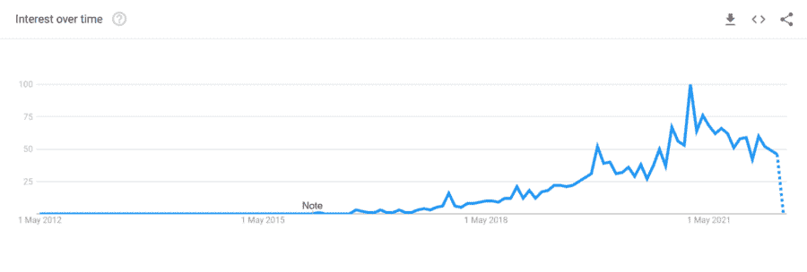
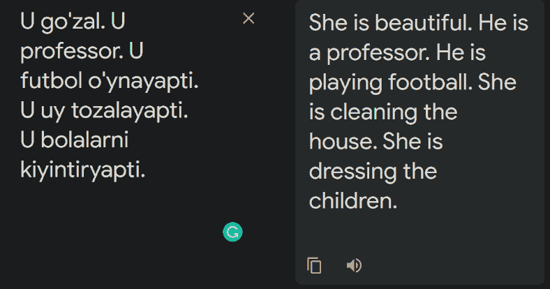
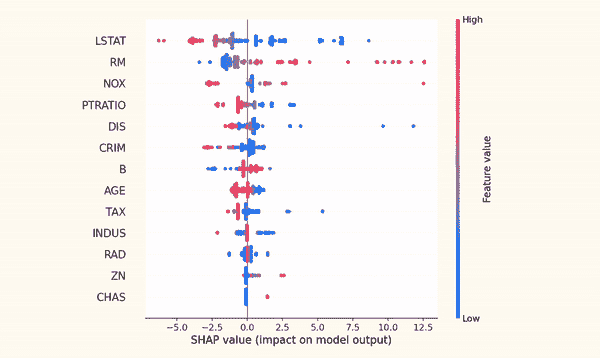
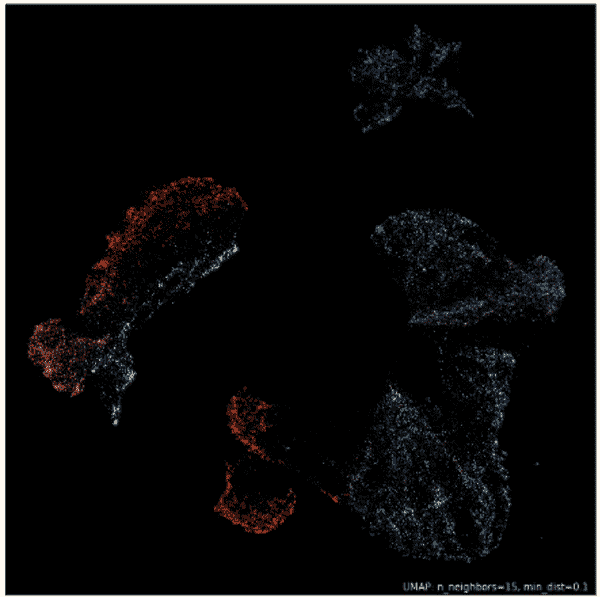
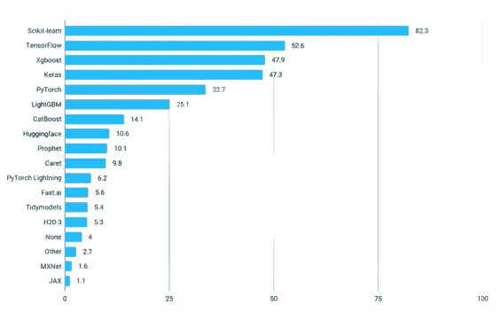
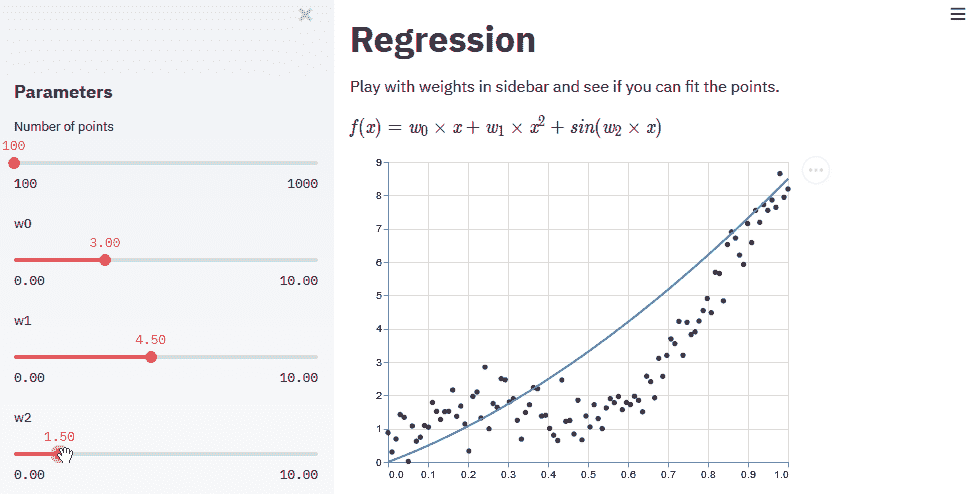
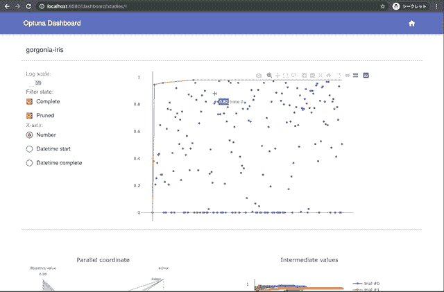
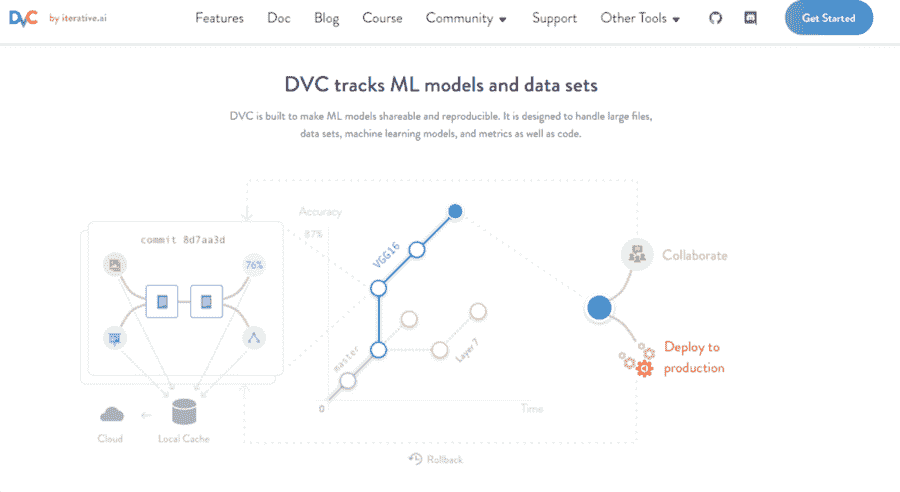

# 2022 年将有 10 个 Python 包加入您的数据科学堆栈

> 原文：<https://web.archive.org/web/20221129041532/https://www.datacamp.com/blog/10-python-packages-to-add-to-your-data-science-stack-in-2022>

随着数据科学的成熟和发展，从业者可以使用的工具也在不断发展。虽然 scikit-learn、pandas、numpy 和 matplotlib 等库是 PyData 堆栈的基础，但学习和掌握新的库和包对于在数据职业生涯中成长至关重要。

因此，本文将涵盖过去几年中出现的 Python 机器学习和数据科学生态系统中十个越来越受欢迎的包。

## 1.SHAP

随着机器学习从实验走向操作化，模型的可解释性是必须的。根据用例的不同，组织将模型的可解释性和透明性作为部署过程的一部分。

机器学习中可解释性的崛起在过去几年中一直在加速，看看过去十年中“可解释的人工智能”一词的搜索趋势就可以展示这一点:

*作者 Google Trends 截图— [链接到结果](https://web.archive.org/web/20221208071320/https://trends.google.com/trends/explore?date=2012-04-04%202022-05-04&q=explainable%20ai)*

这种对可解释的人工智能(XAI)日益增长的兴趣来自于避免与机器学习模型相关联的有害结果的需要。对于金融或医疗保健等行业的高风险用例来说，尤其如此。机器学习模型的结果可能充满了放大现有刻板印象的偏见。这可以在谷歌翻译中看到，这是世界上最常用的语言模型之一:

*机器学习模型如何放大有害刻板印象的例子*

左边的例子是乌兹别克语，一种中性语言。然而，当将查询翻译成英语时，谷歌翻译的语言模型用其结果强化了性别歧视的刻板印象。你可以观察到其他中性语言的类似结果，如土耳其语或波斯语。

这种偏见的例子在机器学习用例中可能会产生极其有害的结果，如[信用风险建模或信用批准](https://web.archive.org/web/20221208071320/https://www.wired.com/story/the-apple-card-didnt-see-genderand-thats-the-problem)。为了最大限度地降低这些风险，数据科学家正在使用可解释的人工智能(XAI)技术来理解机器学习系统的内部工作原理。

对 XAI 来说，最受欢迎的工具之一是由 Scott M. Lundberg 和 Su-In Lee 创建的 SHAP 图书馆。SHAPley Additive exPlanations(SHAP)使用博弈论的方法来解释是什么驱动了大量机器学习模型的输出。

其大众吸引力的主要部分是其 Shapley 值的优雅可视化，这可以解释模型输出的一般和个别。通过浏览[文档](https://web.archive.org/web/20221208071320/https://shap.readthedocs.io/en/latest/index.html)，你可以深入了解 SHAP 及其范例。

*图片来自 SHAP 文件-麻省理工学院许可*

🌟GitHub star:16.2k

📦问题:1.3K

🍴叉子:2.5K

🔗有用链接: [docs](https://web.archive.org/web/20221208071320/https://shap.readthedocs.io/en/latest/index.html) ，[综合教程](https://web.archive.org/web/20221208071320/https://towardsdatascience.com/how-to-explain-black-box-models-with-shap-the-ultimate-guide-539c152d3275?gi=b243d368fb2)

## 2\. UMAP

随着数据集规模的不断增长，对更好、更有效的降维算法的需求也在增长。

虽然 PCA 快速而高效，但它可能会返回过于简化的结果，因为它只减少了数据集的维数，而不必关注底层数据结构。SNE 霸王龙试图通过更加重视数据的结构来弥补这一点，但这一过程对于更大的数据集来说非常缓慢。

幸运的是，在 2018 年，利兰·麦金尼斯和他的同事们引入了 UMAP(均匀流形逼近和投影)算法，作为这两种方法之间的共同点。UMAP Python 包更灵活地减少了表格数据集的维度，强调了数据的全局拓扑结构的重要性。

该软件包在 Kaggle 上很流行，其文档概述了除降维之外的其他有趣应用，如针对更大数据集的更快离群点检测。其结果在可视化时既实用又美观:

*图片来自 UMAP 文件— BSD-3 条款许可*

🌟GitHub Stars: 5.6K

📦问题:313

🍴福克斯:633

🔗有用链接: [docs](https://web.archive.org/web/20221208071320/https://umap-learn.readthedocs.io/en/latest) ，[综合教程](https://web.archive.org/web/20221208071320/https://towardsdatascience.com/beginners-guide-to-umap-for-reducing-dimensionality-and-visualizing-100-dimensional-datasets-ff5590fb17be)

## 3 & 4.LightGBM 和 CatBoost

当 [XGBoost 库](https://web.archive.org/web/20221208071320/https://xgboost.readthedocs.io/en/stable)在 2015 年变得稳定时，它迅速统治了 Kaggle 上的表格比赛。它速度很快，优于其他梯度推进实现。然而，它并不完美。微软和 Yandex 这两家价值数十亿美元的公司受到了陈天齐在梯度增强机器和开源 LightGBM 和 CatBoost 库方面的工作的启发。

他们的目标很简单——改进 XGBoost 的缺点。虽然 LightGBM 极大地减少了 XGBoost 形成的 boosted 树的内存占用，但 CatBoost 变得比 XGBoost 更快，并使用默认参数获得了令人印象深刻的结果。

在 [Kaggle 的 2021 年数据科学和机器学习状况调查](https://web.archive.org/web/20221208071320/https://www.kaggle.com/c/kaggle-survey-2021)中，这两个库位列最受欢迎的机器学习框架的前七名。

*作者截图自[ML 的 Kaggle 状态& DS 调查](https://web.archive.org/web/20221208071320/https://www.kaggle.com/c/kaggle-survey-2021)*

🌟GitHub Stars (LGBM，CB): 13.7K，6.5K

📦问题:174，363

🍴叉子:3.5K，1K

🔗有用链接: [LGBM 文档](https://web.archive.org/web/20221208071320/https://lightgbm.readthedocs.io/en/latest)、 [CB 文档](https://web.archive.org/web/20221208071320/https://catboost.ai/en/docs)，教程— [LGBM](https://web.archive.org/web/20221208071320/https://towardsdatascience.com/kagglers-guide-to-lightgbm-hyperparameter-tuning-with-optuna-in-2021-ed048d9838b5) 、 [CB](https://web.archive.org/web/20221208071320/https://catboost.ai/en/docs/concepts/tutorials)

## 5.BentoML

将模型部署到生产中从未如此重要。在这一节中，我们将讨论 BentoML 如何简化将模型部署为 API 端点的过程。历史上，数据科学家使用 Flask、Django 或 FastAPI 等 web 框架来部署模型作为 API 端点，但这些工具通常带有相对较陡的学习曲线。

BentoML 简化了 API 服务的创建，只需要几行代码。它几乎可以与任何机器学习框架一起工作，并且可以在几分钟内将它们部署为 API 端点。尽管 BentoML 是去年发布的，目前仍处于测试阶段，但它已经积累了一个重要的社区。你可以点击查看 BentoML 的各种实例[。](https://web.archive.org/web/20221208071320/https://docs.bentoml.org/en/latest/quickstart.html)

🌟GitHub Stars: 3.5K

📦问题:395

🍴福克斯:53

🔗有用链接: [docs](https://web.archive.org/web/20221208071320/https://docs.bentoml.org/en/latest) ，[综合教程](https://web.archive.org/web/20221208071320/https://towardsdatascience.com/the-easiest-way-to-deploy-your-ml-dl-models-in-2022-streamlit-bentoml-dagshub-ccf29c901dac)

## 6 & 7.细流和梯度

机器学习解决方案应该是每个人都可以访问的，虽然 API 部署会让您的同事、队友和程序员朋友受益，但模型也应该为非技术社区提供用户友好的界面。

用于构建这种界面的两个发展最快的软件包是 Streamlit 和 Gradio。它们都提供了低代码的 Pythonic APIs 来构建 web 应用程序来展示您的模型。使用简单的函数，您可以创建 HTML 组件来接受不同类型的用户输入，如图像、文本、视频、语音、草图等。，并返回一个预测。

Streamlit 特别有用，因为您可以使用它的富媒体工具来讲述美丽的数据故事。您可以在他们的图库中查看来自 Streamlit 的各种示例。

*用于机器学习的 streamlit web 应用示例*

将 BentoML 这样的 API 服务与 Streamlit 或 Gradio 这样的 UI 工具结合起来，是 2022 年部署机器学习模型的最佳和最轻的方式。

🌟GitHub Stars (Streamlit，Gradio): 18.9K，6.6K

📦问题:264，119

🍴福克斯:1.7K，422

🔗有用链接: [Streamlit 文档](https://web.archive.org/web/20221208071320/https://docs.streamlit.io/)、 [Gradio 文档](https://web.archive.org/web/20221208071320/https://gradio.app/docs)，教程— [Streamlit](https://web.archive.org/web/20221208071320/https://docs.streamlit.io/knowledge-base/tutorials) 、 [Gradio](https://web.archive.org/web/20221208071320/https://gradio.app/guides)

## 8.PyCaret

PyCaret 是一个低代码的机器学习库，最近吸引了很多关注。使用 PyCaret，您只需几行代码就可以自动化机器学习管道的几乎任何阶段。它结合了 Scikit-learn、XGBoost、transformers 等其他流行软件包的一些最佳特性和算法。它的主要吸引力在于它能够在笔记本环境中在几分钟内完成从数据准备到模型部署的过程。

PyCaret 有独立的子模块，用于分类、回归、NLP、聚类、异常检测，还有一个专用的模块用于最新版本的时间序列分析。如果你想自动化和加速你的机器学习工作流程，PyCaret 是你的首选库。

🌟GitHub Stars: 6.5K

📦问题:248

🍴叉子:1.3K

🔗有用链接:[文档](https://web.archive.org/web/20221208071320/https://pycaret.readthedocs.io/en/latest)，[教程](https://web.archive.org/web/20221208071320/https://pycaret.org/tutorial)

## 9.奥普图纳

在倒数第二个位置，我们有 Optuna，它是一个超参数库，正在 Kaggle 上加速发展。

*Optuna 可视化示例*

Optuna 是一个贝叶斯超参数调优库，几乎可以在任何 ML 框架上工作。与竞争对手相比，它有许多优势，例如:

*   平台无关的设计
*   Pythonic 搜索空间——可以用条件和循环定义超参数
*   一套广泛的最先进的调优算法，可通过一个关键字进行更改
*   简单高效的并行化，允许您通过一个参数跨可用资源进行扩展
*   图形调整实验的可视化，可让您比较超参数的重要性
*   Optuna 的 API 基于称为研究和试验的对象。结合起来，它们提供了控制优化会话运行时间、暂停和恢复会话等功能..

🌟GitHub Stars: 6.3K

📦问题:108

🍴福克斯:701

🔗有用链接: [docs](https://web.archive.org/web/20221208071320/https://optuna.readthedocs.io/en/stable) ，[综合教程](https://web.archive.org/web/20221208071320/https://towardsdatascience.com/why-is-everyone-at-kaggle-obsessed-with-optuna-for-hyperparameter-tuning-7608fdca337c)

## 10.数据版本控制— DVC

*DVC 主页截图*

随着数据环境变得越来越复杂，清楚地了解数据集的变化变得越来越重要。这就是 DVC 的目标，像 Git 管理你的代码库一样有效地管理你的海量数据文件和模型。

虽然 Git 对于跟踪代码库的变化非常有用，但它在对大文件进行版本控制时会出现问题，这阻碍了开源数据科学的进步。数据科学家需要一个系统来同时跟踪代码和数据的变化，并在孤立的分支中进行实验，而不复制数据源。

Iterative.ai 的数据版本控制(DVC)使这一切成为可能。通过一个简单的远程或本地 repo 来存储数据，DVC 可以像捕获代码一样捕获数据和模型的变化，并跟踪指标和模型工件以监控实验。

当与 [DagsHub](https://web.archive.org/web/20221208071320/https://dagshub.com/) (即数据科学家的 GitHub)结合使用时，它成为一个改变游戏规则的工具，因为 DagsHub 为 DVC 缓存提供免费存储，并且可以通过一个 CLI 命令进行配置。

🌟GitHub Stars: 9.7K

📦问题:619

🍴福克斯:924

🔗有用链接: [docs](https://web.archive.org/web/20221208071320/https://dvc.org/doc) ，[综合教程](https://web.archive.org/web/20221208071320/https://realpython.com/python-data-version-control)，[用 DVC 和 DagsHub 做的样例项目](https://web.archive.org/web/20221208071320/https://dagshub.com/BexTuychiev/pet_pawpularity)

## 了解有关最新工具的更多信息

数据科学和机器学习领域充满活力，并且不断发展。虽然上面列出的工具越来越流行，但我们可以肯定地期待现代数据堆栈中会有更多的工具和整合。要了解有关数据科学新工具和进步的更多信息，请查看以下资源:

1.  [订阅数据框架播客](https://web.archive.org/web/20221208071320/https://dataframed.sounder.fm/)
2.  订阅我们的 Youtube 页面,关注每周综合报道，这是你每周的新闻简报
3.  [查看备忘单](https://web.archive.org/web/20221208071320/https://www.datacamp.com/cheat-sheet)