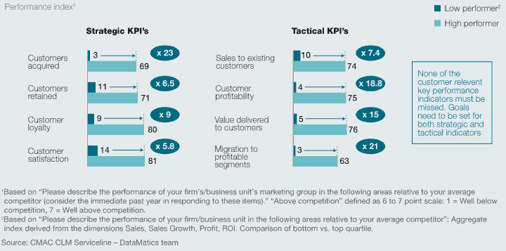
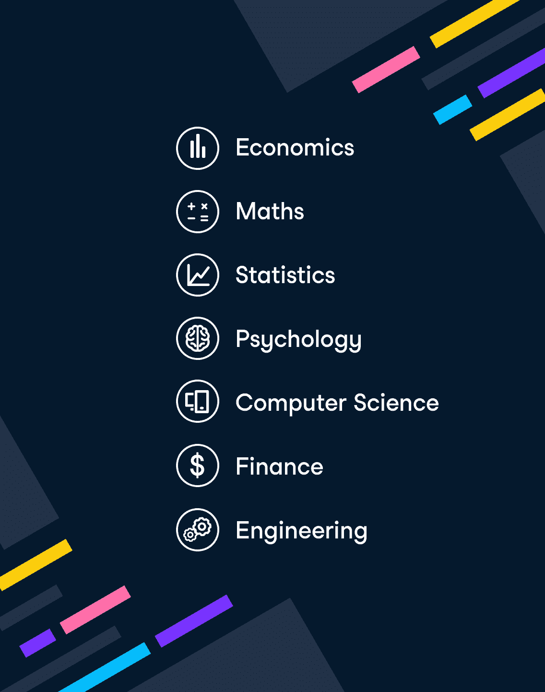

# 关于数据科学的 25 个有趣事实

> 原文：<https://web.archive.org/web/20221129045128/https://www.datacamp.com/blog/25-interesting-facts-about-data-science>

## 数据科学有趣的事实

当您想到数据时，您通常会想到代码行和数字。但是数据科学可以用于一些真正壮观的事情，你可以用其中的一些来玩两个真相和一个谎言的游戏。事实上，这正是 DataCamp 在 [Instagram](https://web.archive.org/web/20220817155917/https://www.instagram.com/datacamp/) 上一周所做的事情！

1.  一个人工智能生成的文本预测模型被训练写一部[哈利波特小说](https://web.archive.org/web/20220817155917/https://www.theverge.com/2017/12/12/16768582/harry-potter-ai-fanfiction)。
2.  数据可视化被用来影响公共政策的最早案例是在为英国士兵争取更好的卫生条件的时候。
3.  波士顿的 Wyss 研究所正在开发人工智能驱动的蜜蜂，用于农作物授粉、气候监测和监视等。
4.  芝加哥市使用 R 来[预测哪些餐馆可能在卫生检查](https://web.archive.org/web/20220817155917/https://www.datacamp.com/community/blog/three-reasons-why-all-teams-should-learn-r)中违规，基于诸如自上次检查以来的时间、附近卫生投诉的数量以及被检查的设施类型等因素。对这些网点进行优先审查，他们能够平均提前一周发现违规者。
5.  一个由人工智能驱动的软件被创造出来，它可以以 90%的准确率预测奥斯卡的结果。
6.  许多企业大量使用 Python，但 Dropbox 在 2008 年成立时几乎完全是基于编程语言构建的。Python 与 Dropbox 如此不可或缺，以至于 2013 年他们成功说服 Python 的创造者吉多·范·罗苏姆加入他们的团队。他同意了，条件是他[不会被安排到管理或领导岗位](https://web.archive.org/web/20220817155917/https://realpython.com/world-class-companies-using-python/)。

## 关于数据科学使用的事实

随着数据改变世界，企业认识到它是一股不可忽视的力量。

1.  从最初到 2003 年，谷歌已经创建了 5eb 的数据。到 2010 年，这一数量的数据是每两天创建一次，到 2021 年，每 40 分钟创建一次。
2.  地球上的每一粒沙子大约有 40 万字节的数据。
3.  根据麦肯锡的数据，利用客户分析的公司在获取客户方面比竞争对手高出 23 倍(在保持客户方面高出 9 倍)。

1.  2020 年，公司分配给营销分析的营销预算金额增加了 [198%](https://web.archive.org/web/20220817155917/https://www.datacamp.com/resources/whitepapers/becoming-a-data-driven-marketer-1) 。
2.  2019 年，据报道，只有 [27%的组织](https://web.archive.org/web/20220817155917/https://www.accenture.com/_acnmedia/PDF-115/Accenture-Human-Impact-Data-Literacy-Latest.pdf)能够充分利用他们的数据来产生可操作的见解，不断增长的数据技能差距被列为主要原因。
3.  [70%](https://web.archive.org/web/20220817155917/https://www.mckinsey.com/industries/retail/our-insights/the-how-of-transformation) 组织的数字化转型计划未能实现其既定目标。这正是[商业数据营](https://web.archive.org/web/20220817155917/https://www.datacamp.com/groups/business/data-science-for-managers-free-trial)可以提供帮助的地方！

## 关于数据科学职业的事实

考虑到以上所有因素，难怪数据科学和分析是非常令人垂涎的技能。拥有这些技能的人享有光明的职业前景和一系列可供选择的职位。

1.  根据世界经济论坛 2021 年的一份报告，数据科学被确定为技能差距最大的技能。
2.  2020 年，数据科学工作清单的数量超过了搜索此类工作的人数，比例为 3 比 1。
3.  根据美国劳工统计局的数据，数据科学家的平均工资是 10 万美元，分析师的平均工资是 7 万美元(T2)。
4.  许多数据科学家的职位只需要一个定量学科的学位。如果您拥有以下职位之一，您可能已经有资格申请这些职位:

1.  英国国家医疗服务系统估计，到 2040 年，它将要求 90%的员工具备数据素养。
2.  SQL 和 Python 以及分别在专业开发人员中排名第三和第四的技术。
3.  [数据科学家 80%的时间花在组织数据上](https://web.archive.org/web/20220817155917/https://www.infoworld.com/article/3228245/the-80-20-data-science-dilemma.html)。
4.  [有效的数据叙述](https://web.archive.org/web/20220817155917/https://www.datacamp.com/resources/whitepapers/8-rules-for-better-data-storytelling)是数据科学家可以学习的最强大的技能之一。
5.  自 2010 年以来，数据分析师的数量已经增加了一倍多。

## 数据科学培训和教育事实

1.  据《发现数据科学》报道，五年前，数据科学专业的学士学位几乎不存在。现在美国有超过 50 所高等教育机构提供这种课程。
2.  2015 年，在英国学校学生及其家长中进行的一项民意调查发现，与外语相比，大多数学生更喜欢学习 Python。
3.  63%的公司利用在线学习来培训员工掌握新技能，并保持现有技能。
4.  数据科学现在推动了 Adwords、脸书和亚马逊对大公司数字营销支出的 90%以上的竞标。像 [NeuralEdge](https://web.archive.org/web/20220817155917/https://neuraledge.digital/ppc-services/) (Adwords)和[advertio](https://web.archive.org/web/20220817155917/https://www.adverio.io/)(亚马逊广告)这样的机构使用数据科学来计算最佳广告出价
5.  [99%的组织](https://web.archive.org/web/20220817155917/https://resources.new.datacamp.com/resources/static/295ca144a35c0e1852c7a95a6ff10671/Insights_from_Data_Leaders.pdf)正在积极投资数据转型计划。

数据将改变世界，掌握数据将为你的职业带来回报。无论您是想学习如何使用数据来处理数字、讲故事，还是想让您的工作流程更加高效，我们在 DataCamp 上都有！你知道吗，我们正在开展一项限量的 [$1 月订阅促销活动](https://web.archive.org/web/20220817155917/https://promo.datacamp.com/)？立即注册，利用这一惊人的优惠！