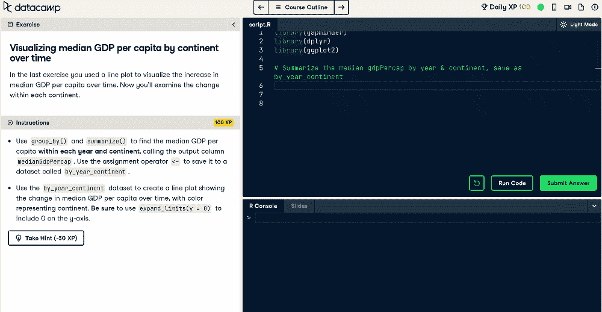
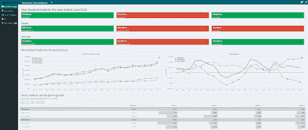

# 所有团队都应该学习 R 的 3 个理由

> 原文：<https://web.archive.org/web/20230101103145/https://www.datacamp.com/blog/3-reasons-why-all-teams-should-learn-r>

## 现代时代的数字化转型

在我们日益高度互联和数字化的世界中，每天都会从许多在线互动中产生大量数据。许多组织认识到了这一点的价值，并已着手进行数字化转型，以利用不断增长的数据量来推动其业务发展。

随着企业努力成为数据驱动型企业，有几个关键因素必须正确对待，其中之一就是为员工配备正确的数据工具，让他们能够最好地完成工作。

r 是一个强大的工具，它构成了现代数据科学工具包不可或缺的一部分。在这篇博客文章中，我们探索了 R 的能力以及为什么你应该用它来培训你的团队的令人信服的理由。

## R 是什么？

r 是一种为统计分析和数据可视化而优化的开源编程语言。它由统计学家 Ross Ihaka 和 Robert Gentlemen 于 20 世纪 90 年代初开发，现已发展成为一个著名的数据挖掘和分析生态系统。

它的目标是创建一种更加用户友好的方式来执行统计、数据分析和数据可视化。尽管 R 有着悠久的历史，但它在当今的数据科学中仍然非常流行，并且通常被认为是初学者入门门槛较低的编程语言。

r 是一个丰富的社区驱动的生态系统的所在地，该生态系统由 [CRAN](https://web.archive.org/web/20220529054229/https://cran.r-project.org/) 仓库中的 17，000 多个精选包组成。r 包类似于允许从业者在 r 上执行各种任务的应用程序。通过数据专业人员的审核贡献，存储库由许多模型和工具组成，使用户能够准备数据、构建强大的统计模型和创建漂亮的可视化效果。

下面是一些 R 的行业用例:

*   ANZ(澳新银行集团)在[信用风险分析](https://web.archive.org/web/20220529054229/https://blog.revolutionanalytics.com/2011/08/how-anz-uses-r-for-credit-risk-analysis.html)中使用 R 评估贷款违约概率

*   John Deere 使用 R 来[预测客户对其设备的需求](https://web.archive.org/web/20220529054229/https://www.slideshare.net/RevolutionAnalytics/order-fulfillment-forecasting-at-john-deere-how-r-facilitates-creativity-and-flexibility)，以便他们能够根据影响订单履行的因素进行最佳调整

*   Zillow 是美国领先的房地产市场，它使用 R 来估算房价。

*   芝加哥市使用 R[预测哪些餐厅可能在卫生检查中违规](https://web.archive.org/web/20220529054229/https://chicago.github.io/food-inspections-evaluation/)以优先审查这些餐厅。

*   AirBnB 开发了内部 R 包来[促进数据](https://web.archive.org/web/20220529054229/https://medium.com/airbnb-engineering/using-r-packages-and-education-to-scale-data-science-at-airbnb-906faa58e12d)在不同存储位置之间的高效移动(例如 Presto、AWS S3)

如果你想知道[R 的名字](https://web.archive.org/web/20220529054229/https://cran.r-project.org/doc/FAQ/R-FAQ.html#Why-is-R-named-R_003f)是怎么来的，它是基于两位创造者(Ross Ihaka 和 Robert Gentleman)的名字，以及对更老的 S 编程语言名称的戏谑，R 就是建立在这种语言之上的。

## R 怎么有用？

### ㈠易用性和可及性

R 的一个关键优势是提供了大量成熟的数据操作和统计分析包。它的开源特性也意味着任何人都可以获得 R 的丰富功能。在广泛的 R 生态系统中， [Tidyverse](https://web.archive.org/web/20220529054229/https://www.tidyverse.org/) 是最著名的数据科学 R 包集合。

Tidyverse 是一组易于使用的包，设计用于数据导入、操作、可视化和报告任务。这些包共享相同的设计、语法和数据结构，这反过来简化了 R 的学习，因为熟悉一个包可以让您轻松地过渡到下一个包。

R 还被普遍认为是数据操作更容易的编程语言之一，因此学习和应用 R 的障碍相对较低。

虽然 Excel 等电子表格软件可以执行数据分析，但它很难处理涉及大数据集的长期重复数据操作任务。如果您尝试过在 Excel 中处理超过 100，000 行的大型数据集，您就会理解程序会变得多么缓慢。

*With 3 intuitive lines of code, you can filter a dataset based on column condition, and arrange it by another column condition*

相反，R 可以有效地产生详细的分析，即使是对于大型数据集。这对于那些需要重复处理大量复杂的大型数据集，并且不能消耗太多时间或计算资源的项目很有帮助。

### ㈡数据处理和可视化

Tidyverse 集合包含为数据相关任务设计的包，包括一些流行的包，如:

*   [**dplyr**](https://web.archive.org/web/20220529054229/https://dplyr.tidyverse.org/)–包含一组易于理解的数据操作命令

*   [**tidyr**](https://web.archive.org/web/20220529054229/https://tidyr.tidyverse.org/)–提供以整齐的格式创建数据以供分析和存储的功能

*   [**【gg plot 2】**](https://web.archive.org/web/20220529054229/https://ggplot2.tidyverse.org/)–包含用于构建有效数据可视化的方法和函数

当串联使用时，这些软件包允许用户有效地执行数据操作和分析，并以高度精确和信息丰富的可视化方式有效地呈现见解。

*From the ggplot2 plot above, we can readily glean insights about the GDP per capita across continents over time.*

### ㈢报告和仪表板

在执行数据操作、分析和建模之后，最后一步(也可以说是最重要的一步)是确保有意义地交流见解。

除了使用 ggplot2 构建的静态可视化之外，还可以为利益相关者创建交互式仪表盘，以参与自助式商业智能。这些仪表板允许业务用户自己直接访问仪表板，以回答他们自己的数据问题

Shiny 是一个优秀的 R 包，它使人们能够轻松地构建和发布仪表板并与他人分享。它的易用性甚至允许那些没有太多技术经验的人创建强大和专业的仪表板。

以下是一个用于监控新西兰贸易信息的闪亮仪表板示例:

**Source:** [RStudio Shiny Gallery](https://web.archive.org/web/20220529054229/https://shiny.rstudio.com/gallery/nz-trade-dash.html)

## 用 R 民主化数据科学

根据 Forrester 的调查，公司不到 50%的决策是基于数据，而不是直觉、经验或意见。为了释放数据的价值，员工需要提升技能，用工具武装自己，以便高效地从数据中学习。

好消息是强大的数据工具根本不需要花费太多。r 是一种免费的开源编程语言，使得执行关键的数据科学任务变得容易，比如数据操作、建模和可视化。

r 对于技术和非技术员工来说是一种实用而直观的技能，因为它的准入门槛相对较低。有了这些有价值的数据技能，企业就能以数据驱动型公司的方式实现积极的业务成果。

