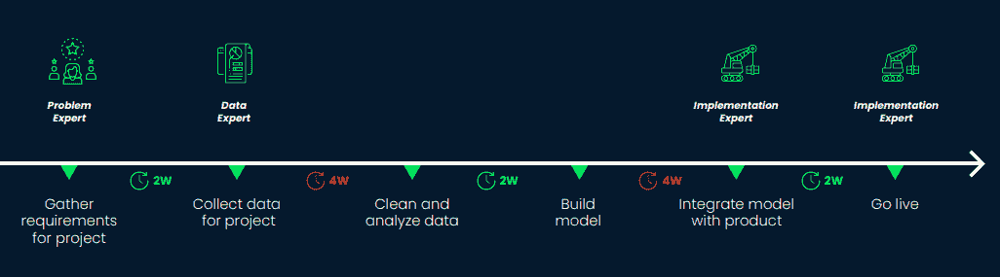

# 数据科学项目的三种合作者

> 原文：<https://web.archive.org/web/20221129045128/https://www.datacamp.com/blog/3-types-of-collaborators-on-data-science-projects>

成功的数据科学项目需要跨团队协作。如果没有与所有相关利益方的适当合作，数据科学项目就不会有影响力。在最近的 DataCamp 网络研讨会中，Lucid Software 内部工程部门的工程经理 Brian Campbell 讨论了数据科学项目跨团队协作的最佳实践。

## 三种类型的合作者

数据科学家必须与其他利益相关方合作，以提高项目的影响力。数据科学家应该依靠组织内的其他人来更好地了解他们感兴趣的问题背后的业务价值和指标，如何在复杂的数据环境中导航，以及如何向客户部署他们的模型。在网上研讨会中，Brian 讨论了三种类型的合作者:

### 问题专家

问题专家是为数据科学项目奠定基础的合作者。他们的工作是为项目提供领域专业知识，并定义问题陈述。

问题专家非常了解受数据科学项目影响的指标，以及它们如何转化为业务成果。他们也知道一个有价值的模型所需要的准确性。这些知识是非常重要的信息，因为没有一个模型是完全准确的。理解什么是合理的和有价值的目标对于在项目早期定义目标和设定期望是至关重要的。

### 数据专家

数据是任何成功的数据科学项目的关键要素。许多组织拥有复杂的数据环境，这使得了解哪些数据可用以及需要哪些数据来解决问题变得非常困难。

数据专家负责了解某个领域中有哪些数据可用，如何获取数据，以及哪些数据最适合特定的业务问题。他们自己有时也可能是问题专家，但通常在组织中担任数据工程角色。

### 实施专家

最后，实现专家负责理解如何向客户部署这些模型。他们是大规模部署模型所需的基础设施和资源方面的专家。

当与这些专家合作时，让他们提前了解项目是很重要的，这样他们就有时间确保当模型准备好被部署时有合适的基础设施。了解工作将如何被使用也很重要——作为产品中的一个特性，API 的一部分，与现有的过程集成，或者从头开始需要一个新的过程。项目的使用将决定谁是最佳的实施专家。

## 如何有效地与合作者一起工作

时间表是协作的重要组成部分。这使得参与项目的每个人都可以计划何时参与进来，以帮助推进项目的完成。

考虑一个部署客户保持模型的提议项目。该模型将识别有可能不再从该组织购买订阅的客户，并向他们发送促销电子邮件以吸引他们留下来。

该项目将需要首先了解客户保留指标和趋势，收集相关数据，清理和分析数据，建立分类模型，将其集成到自动电子邮件系统中，并将其设置为活动。所有这些步骤可能需要数周时间，并且许多步骤需要前面部分讨论的三个利益相关者的帮助。

设定一个初始时间表允许协作者在需要帮助项目时制定路线图。如果出现延迟，应立即通知合作伙伴。如果数据收集阶段出现延迟，实施专家不应该提前一个月出现，因为这将浪费他们的时间，并损害未来与他们合作的机会。

要了解有关数据科学项目管理最佳实践的更多信息，请收听[点播网络研讨会](https://web.archive.org/web/20220703055017/https://www.datacamp.com/resources/webinars/manage-data-science-projects-effectively-1)获取更多深入示例。

