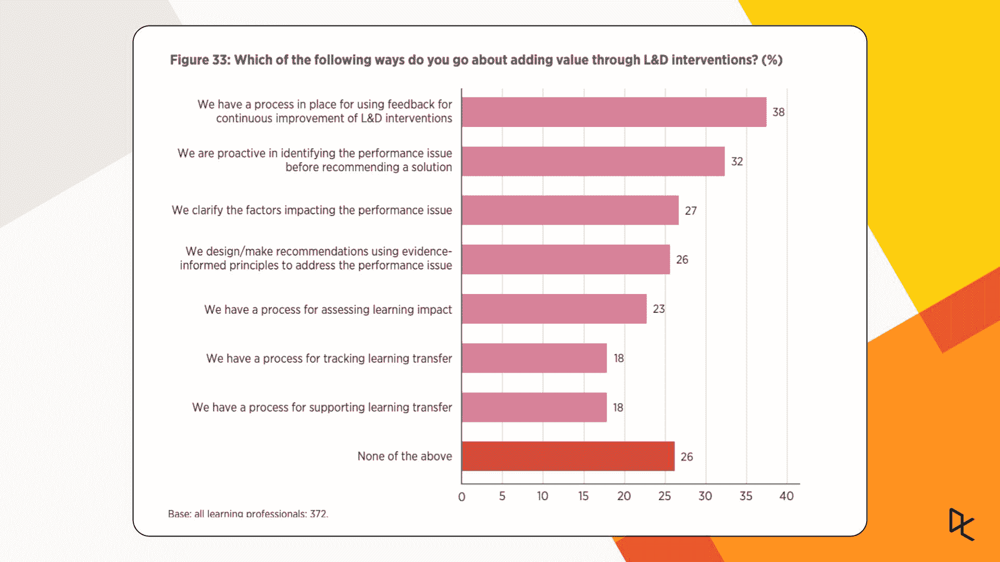
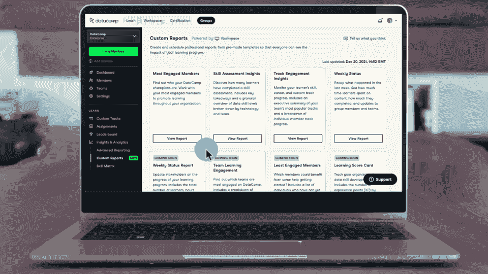
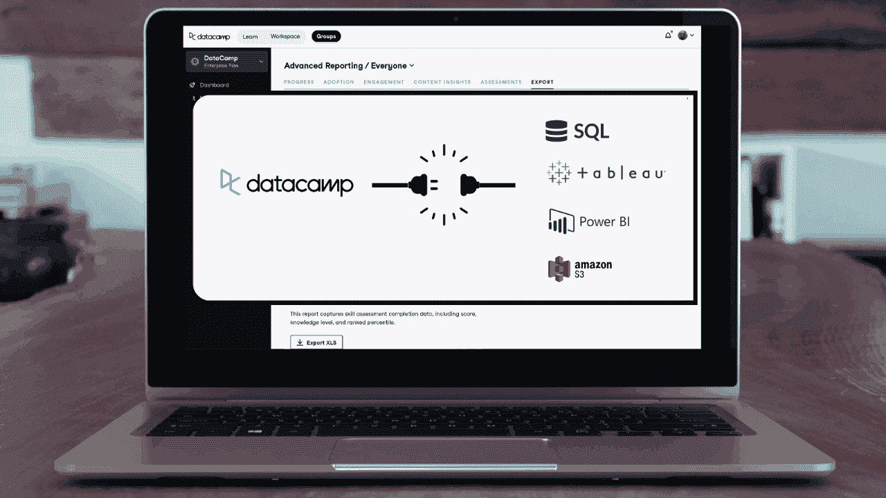
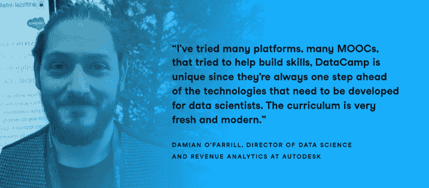

# 2022 年提升团队报告水平的 3 种方法

> 原文：<https://web.archive.org/web/20221129044127/https://www.datacamp.com/blog/3-ways-to-level-up-your-team-reporting-in-2022>

在 CIPD 的《工作中的学习和技能》报告中，三分之一的组织在 2021 年的培训预算被大幅削减。更少的预算，加上比以往更多的人在家工作，意味着团队经理和研发专业人员不得不用更少的资源做更多的事情。这导致了向数字化训练的巨大转变。CIPD 的分析表明，接受这种变化的组织正在收获回报，文化得到改善，向员工学习的需求增加。

但并不都是积极的。该报告还显示，77%的团队经理和 L&D 专业人士无法评估他们的学习计划的影响。评估培训计划最常见的自我报告方法是“参与者满意度调查”，这是一种主观报告，很难与 ROI 和您组织的业务目标联系起来。

CIPD: [Barriers to the evaluation of learning and development program and initiatives (%)](https://web.archive.org/web/20220525025912/https://www.cipd.co.uk/knowledge/strategy/development/learning-skills-work#gref)

如上图所示，提高报告质量有许多障碍——首要问题是相互竞争的优先级和时间不足。在 DataCamp，我们认为报告您的学习计划的业务影响应该很简单。这就是为什么所有面向业务部门的[data camp](https://web.archive.org/web/20220525025912/https://www.datacamp.com/groups/business)现在比以往任何时候都有更多的方式来获取您可以快速与利益相关方分享的见解。

## 如何在 2022 年提升您的报告水平:

### 1.使用自定义报告创建专业的一键式报告

我们明白了。报告学习计划的影响需要时间。这就是我们创建自定义报告的原因。它们是预先制作的报告，DataCamp 管理员可以使用它们来展示您的学习投资回报并揭示可衡量的见解，包括从每周状态报告到您最积极参与的学习者或最受欢迎的课程的所有内容，并随时添加新的报告。

根据我们的预制模板创建专业报告详细了解您的学习计划日程定期自动生成报告，这样您就不会错过截止日期

准备好改进您的报告了吗？[了解如何开始使用我们的帮助中心](https://web.archive.org/web/20220525025912/https://support.datacamp.com/hc/en-us/articles/4412251811223-DataCamp-Custom-Reports-An-Overview)。

### 2.即插即用—将您的学习数据连接到 Tableau 和 Power BI

借助我们对 Data Connector 的 2021 更新，您现在可以使用 DataCamp 内置的 Athena 连接直接在 Tableau 或 Power BI 中创建报告和仪表板。Athena 插件使直接在您选择的平台上查看、查询和可视化学习见解变得更加容易。

准备好在 Tableau 或 Power BI 中分析和可视化您的数据了吗？邀请您的工程团队[遵循以下步骤](https://web.archive.org/web/20220525025912/https://enterprise-docs.datacamp.com/data-connector/using-the-data-connector/analyzing-data)。

### 3.使用 Python 或 R with Workspace 构建定制报告

如果您的组织启用了工作空间编辑器，您可以在 Python 或 R 中从头开始构建报告，或者从我们现成的 Python 自定义报告中进行选择。

*   从您舒适的浏览器中分析您组织的学习数据
*   分享您的见解，同时控制哪些人可以看到它们
*   直接评论你的工作区报告，就像在谷歌文档中一样

想要构建自己的自定义报告吗？[了解更多](https://web.archive.org/web/20220525025912/https://app.datacamp.com/workspace/)。

让我们让 2022 年成为你超越员工满意度调查的一年，并提升你如何报告你给员工带来的变化。[了解有关 DataCamp for Business 的更多信息](https://web.archive.org/web/20220525025912/https://www.datacamp.com/groups/business)或者，如果您是现有客户，请登录尝试这些新功能。

## 您可能还喜欢:

#### 白皮书:300 多名 L&D 领导人从构建数据流畅度中学到了什么

交付组织范围的数据素养所需的两个最重要的行动是强有力的执行支持和跨多个团队展示价值。

##### [下载白皮书](https://web.archive.org/web/20220525025912/https://www.datacamp.com/resources/whitepapers/what-300-l-and-d-leaders-have-learned-about-data-fluency)

#### 客户成功案例:Autodesk

了解这家财富 1000 强软件公司如何在竞争中保持领先地位。

##### [阅读 DataCamp](https://web.archive.org/web/20220525025912/https://www.datacamp.com/resources/case-studies/autodesk-case-study) 上的案例研究。