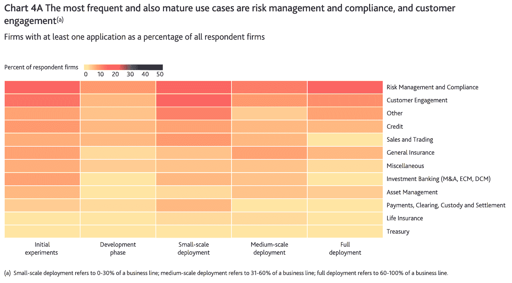

# 金融服务采用人工智能的 5 大障碍

> 原文：<https://web.archive.org/web/20221129045128/https://www.datacamp.com/blog/5-obstacles-standing-in-the-way-of-ai-adoption-in-financial-services>

数据科学和人工智能在金融服务中的应用几乎不是新闻。从根据信用评分提供贷款的银行、根据风险定价的保险公司，到根据预期风险和回报提供财务建议的投资基金，数据一直是金融部门的支柱。然而，要在数据科学和人工智能方面取得成功，金融服务机构需要深化对机器学习和人工智能的使用。在最近的一次网络研讨会中，渣打银行前集团 CDO、TruEra 现任首席战略官 Shameek Kundu 概述了如何在金融服务中加快人工智能的采用。

## 人工智能的应用很广泛但很肤浅

Shameek 解释说，今天在金融服务领域有一系列广泛的人工智能和机器学习用例。这里有一些值得注意的现实世界的例子。

*   [安盛的](https://web.archive.org/web/20220529052753/https://www.axa.com.sg/blog/innovation/machine-learning-for-predictive-underwriting)机器学习预测核保简化了保单购买流程
*   光学字符识别(OCR)帮助花旗银行加快了他们的手动文档处理
*   OCBC 银行的调查人员利用机器学习来检测欺诈交易

然而，这并不意味着金融服务机构正在充分利用数据科学和人工智能，因为需要深入采用这些技术。淡马锡报告称，几乎所有的金融服务都在一定程度上使用人工智能。然而，由于行业范围内的障碍，只有 13%的公司在大多数流程中真正使用了人工智能。

 Many AI projects remain in their infancy, unable to reach the end goal of full deployment, according to the [Bank of England Machine Learning Survey](https://web.archive.org/web/20220529052753/https://www.bankofengland.co.uk/-/media/boe/files/report/2019/machine-learning-in-uk-financial-services.pdf?la=en&hash=F8CA6EE7A5A9E0CB182F5D568E033F0EB2D21246)

## 广泛采用人工智能的障碍

#### 有限的数据质量和可用性

监管机构越来越多地审查公司如何处理数据，美国和[欧盟](https://web.archive.org/web/20220529052753/https://www.comarch.com/cyber-security/articles/gdpr-implementation-at-insurance-companies-and-banks/)通过州数据隐私法就是明证。此外，由于数据隐私法的地理差异，数据的跨境共享仍然有限。这种规定转化为机器学习模型训练和预测的有限数据。

#### 不成熟和分散的技术环境

随着新生的机器学习领域继续发展，它经历了相对不成熟和分散的技术领域形式的成长烦恼。

根据 Algorithima 的调查，如今，组织需要大约一到三个月的时间来将机器学习模型部署到生产中。交付时间长是由于缺乏成熟的[机器学习操作化(MLOps)](https://web.archive.org/web/20220529052753/https://www.datacamp.com/webinars/practical-guide-to-mlops) 工具而产生的症状。然而，鉴于其[的快速发展](https://web.archive.org/web/20220529052753/https://www.cognilytica.com/document/infographic-the-rapid-growth-of-mlops/)，MLOps 工具的发展只是时间问题。

#### 对机器学习缺乏信任

复杂的机器学习模型不容易解释或解释它们的预测。由于缺乏对黑箱模型的理解，最终用户很难相信他们的输出。

一个恰当的例子是 IBM 沃森。曾经被吹捧为医疗保健的未来，其黑箱模型未能赢得最终用户的信任。这些医生理所当然地拒绝将生死决定交给人工智能黑匣子。

类似地，从事欺诈检测等高风险决策的金融服务监管者和银行家发现很难相信黑箱模型。当透明度对于防止歧视和不公平结果以及履行披露义务不可或缺时，尤其如此。认识到这一点，美联储州长布雷纳德在 2018 年 11 月的一次演讲中说，“可解释性的挑战可以转化为人工智能方法适用性的更高水平的不确定性”，并呼吁金融服务公司在应用黑箱模型时保持警惕。

#### 最后一英里操作化

机器学习项目也会遇到最后一英里问题——在正确的时间将结果提供给正确的人的挑战。例如，期待立即得到满足的手机应用程序用户在得知某个推荐需要 10 分钟才能加载时会不高兴。

解决最后一英里操作化的问题不仅需要成熟的 MLOps 工具环境，还需要机器学习从业者关注用户体验。

#### 缺乏数据人才

人工智能项目的全面部署需要[一个数据专业人员团队](https://web.archive.org/web/20220529052753/https://www.datacamp.com/community/blog/eight-personas)——包括数据科学家、分析师、工程师和机器学习科学家。因此，[缺乏数据人才](https://web.archive.org/web/20220529052753/https://www2.deloitte.com/us/en/insights/industry/technology/data-analytics-skills-shortage.html)仍然是各行各业采用机器学习的一个障碍，包括金融服务业。

德勤的一项调查显示，23%最成熟的人工智能采用者报告称，在人工智能实施方面存在显著的人才技能差距。解决这一技能缺口需要一个针对特定人才的以[为中心的再培训和技能提升战略](https://web.archive.org/web/20220529052753/https://www.datacamp.com/community/blog/five-steps-to-building-a-learning-culture)。

## 结论

上面列出的障碍表明，只要有足够的时间和努力，它们是可以解决的。解决这些问题将使金融服务业离释放其采用人工智能的巨大潜力更近一步。

如果您对人工智能在金融服务中的应用感兴趣，请务必收听 Shameek 的点播网络研讨会“[扩大人工智能在金融服务中的采用](https://web.archive.org/web/20220529052753/https://www.datacamp.com/resources/webinars/scaling-ai-adoption-in-financial-services)”。

