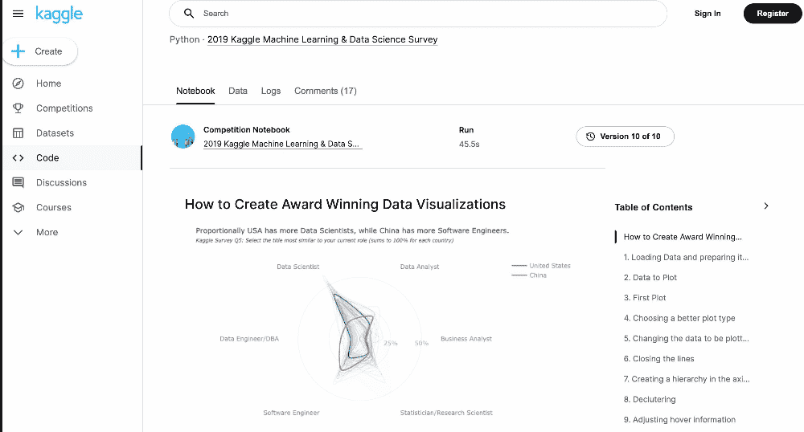
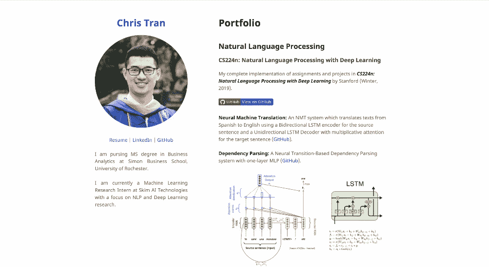

# 托管您的数据科学产品组合的 5 个地方

> 原文：<https://web.archive.org/web/20220627024316/https://www.datacamp.com/blog/5-places-to-host-your-data-science-portfolio>

## 为什么要有作品集项目？

找到从事个人项目的时间和动力是一项挑战。然而，无论你是在全职工作、自雇还是在找工作，平衡你的职业生活和你对构建数据科学项目的热情肯定是有益的。以下是您应该投入时间和精力构建数据科学投资组合的一些主要原因。如果你想了解为什么创建项目组合项目很重要，以及创建项目组合项目的最佳实践和例子，请务必阅读这篇文章。

### 培养和磨练技能

学习编码、构建模型、提高模型准确性和部署模型都是[数据科学工作流程](https://web.archive.org/web/20220604043724/https://www.datacamp.com/blog/what-does-a-data-scientist-do-breaking-down-the-responsibilities-of-data-scientists)的一部分。这些技能需求量很大，创建项目组合是磨练你的技能和强化你感兴趣领域的知识的好方法。此外，组合项目允许你建立与你的背景、工作或专业不完全一致的技能。如果你专攻[自然语言处理](https://web.archive.org/web/20220604043724/https://www.datacamp.com/tracks/natural-language-processing-in-python)应用，建立[计算机视觉辅助项目](https://web.archive.org/web/20220604043724/https://www.datacamp.com/tracks/image-processing)会让你的技能更上一层楼。可能性是无限的。

### 向招聘人员展示你的经历

想象一下，两个初级数据科学家来到招聘人员面前；第一个人说，“我知道 Python、机器学习和 MLOps，”但第二个人说，“我也知道所有这些，我在这个项目中应用了我的知识，我收集了数据，在其上应用了机器学习模型，并将其部署为 web 应用程序。”很明显哪个候选人会最突出。投资组合项目可以确立你作为数据科学家的合法性。你的投资组合越多样化，你就越能展示你可以与招聘人员和招聘经理谈论的各种技术技能。

### 展示你的软技能

创建数据科学项目组合展示了一致性、持久性、对细节的关注以及不断学习和改进的意愿。这些软技能在许多职业领域都至关重要，数据科学也不例外。更重要的是，如果你用基于内容的项目来补充技术组合项目，你将能够展示你的沟通和[数据讲述技能](https://web.archive.org/web/20220604043724/https://www.datacamp.com/podcast/effective-data-storytelling-how-to-turn-insights-into-actions)，这将进一步让你成为一名数据科学家。

### 迈出创业的第一步

在副业和创业之间，只有一步可走，那就是全职开始冒险。无数的冒险变成了百万美元的创业公司。此外，项目组合也是成为一名自由数据科学家的好方法。要了解更多关于成为自由职业数据科学家的信息，请阅读关于成为自由职业数据科学家指南的[第 1 部分](https://web.archive.org/web/20220604043724/https://www.datacamp.com/blog/how-to-become-a-freelance-data-scientist-pt1)和[第 2 部分](https://web.archive.org/web/20220604043724/https://www.datacamp.com/blog/how-to-become-a-freelance-data-scientist-pt-2)。

## 托管您的数据科学产品组合的 5 个地方

与数据科学社区共享您的项目有助于建立通用知识库，促进协作，帮助建立您的品牌，并让您参与更大范围的对话。这就是为什么就你的项目进行交流，并确保尽可能多的人可以看到它们是有好处的。托管您的数据科学投资组合有很多选择，但这些是帮助您在线展示投资组合的一些最佳工具和平台。

## 1.Datacamp 工作区

[Datacamp Workspace](https://web.archive.org/web/20220604043724/https://www.datacamp.com/workspace) 是一个基于云的协作笔记本，允许您分析数据、与其他人协作并即时发布分析结果。Workspace 使您能够只通过浏览器编写代码、分析数据和分享您的数据见解。除了通过剧本模板预先编写的代码示例之外，它还提供了 20 多个预加载的数据集供您分析。Workspace 支持 R、Python 和 SQL，可以在任何操作系统上使用。它需要零安装和零下载。创建项目后，您可以共享指向您的 DataCamp 个人资料的链接，以便人们可以立即访问它们。Workspace 上托管的高质量项目的一些示例如下

*   [比特币在三种资产组合中的角色](https://web.archive.org/web/20220604043724/https://app.datacamp.com/workspace/w/21cc7714-89b7-48e4-b1b3-7733e95e536a#the-role-of-bitcoin-in-a-3-asset-portfolio)

*   [探索英国致命交通事故](https://web.archive.org/web/20220604043724/https://app.datacamp.com/workspace/w/39b1c5ff-f516-4e84-af83-04d8ea361642)

*   土耳其的森林大火

### 2.卡格尔

[Kaggle](https://web.archive.org/web/20220604043724/https://www.datacamp.com/blog/what-is-kaggle) 是一个面向数据科学家和机器学习爱好者的在线社区平台。它允许您与其他数据科学家协作，查找和发布数据集，发布笔记本，并与其他数据科学家竞争以解决数据科学挑战。有许多数据集可供那些想要实现其算法的人使用。这个平台的优点是数据的结构和清理相对较好。因此，这是一个开始感受从事数据科学项目的好地方。注册后，您可以浏览几个类别中正在进行的不同比赛:

*   针对初学者的长期比赛是让你开始的好资源。你可以应用你的知识，并用它们来实践你所学到的东西。
*   限时竞猜奖品或名气比初学者难度高一步。
*   有奖品的限时比赛会更有挑战性。它们通常由外部组织者赞助，如网飞、谷歌等。

参加这些比赛是发展、提高你的技能和增长你的技术能力的好方法。为了展示你的工作，你需要一个笔记本(内核),详细解释你的项目的来龙去脉，以便尽可能多的人能够理解它。

由于该平台以参与人数众多而闻名，对于初学者来说，赢得奖项似乎并不容易。但是，参加比赛和出版笔记本可以让你发展技能，积累积分，从而在队伍中攀升。很容易想象，在 Kaggle 上达到特级大师的最终级别，将开启你作为数据科学家的职业生涯。你可以阅读这本[关于 Kaggle](https://web.archive.org/web/20220604043724/https://www.datacamp.com/blog/kaggle-competitions-the-complete-guide) 的完整指南了解更多信息。Kaggle 上的一些优秀笔记本可以在下面找到:

*   [如何创建屡获殊荣的可视化数据](https://web.archive.org/web/20220604043724/https://www.kaggle.com/code/andresionek/how-to-create-award-winning-data-visualizations/notebook)

*   [数据女英雄——通过数据拯救世界](https://web.archive.org/web/20220604043724/https://www.kaggle.com/code/carodias/data-heroines-saving-the-world-through-data/notebook)

*   [隐藏的宝石:一批被低估的笔记本](https://web.archive.org/web/20220604043724/https://www.kaggle.com/code/headsortails/hidden-gems-a-collection-of-underrated-notebooks)

### 3.开源代码库

从高层次来说，GitHub 是一个网站和云服务，它使开发人员能够存储和管理他们的代码库，并跟踪和监控代码库的变化。要理解 GitHub 是什么，您需要知道两个相关的原则:版本控制和 Git，它们帮助您记录项目随时间的变化，以便以后调用特定的版本。您可以查看本指南来了解更多关于 Git 的信息。该平台允许用户协作或发布开源项目，派生和共享代码，并跟踪问题。使用 [GitHub pages](https://web.archive.org/web/20220604043724/https://pages.github.com/) 建立一个 GitHub 账户并托管你的投资组合既简单又免费。只需遵循以下步骤:

1.  **创建一个 [GitHub](https://web.archive.org/web/20220604043724/https://github.com/) 账户。**
2.  **学习如何使用 Git 和 GitHub** 。通过跟随这个[教程](https://web.archive.org/web/20220604043724/https://www.datacamp.com/tutorial/github-and-git-tutorial-for-beginners)或者[Git 入门课程，你可以找到关于理解 Git 和 Github 的详细解释和教程。](https://web.archive.org/web/20220604043724/https://www.datacamp.com/courses/introduction-to-git)
3.  **通过重复以下步骤将你的网站上传到 [GitHub 页面](https://web.archive.org/web/20220604043724/https://pages.github.com/):**
    *   打开 [GitHub](https://web.archive.org/web/20220604043724/https://github.com/) 和 [新建一个公共库](https://web.archive.org/web/20220604043724/https://github.com/new) name username.github.io，其中 username 是你在 GitHub 上的用户名(或组织名)。
    *   如果不熟悉 Git 命令，可以简单下载 GitHub desktop 在 macOS 和 Windows 上使用 Git 和 GitHub。
    *   完成安装后，转到 GitHub.com 并刷新页面。点按“在桌面中设置”按钮。当 GitHub 桌面应用程序打开时，保存项目。
    *   打开文本编辑器，为项目创建一个 index.html。
    *   提交您的更改，然后按发布。
4.  给你的网站一个主题，一个引导主题或者一个 HTML/CSS 模板可以，但是 WordPress 主题不行。

传递项目的一个有效方法是使用 Github 这样的平台。创建您的 Github 帐户后，您可以开始在那里发布您的项目。在 Github 中，你的每个项目都必须有一个用户容易阅读的`README.md`文件。这是编码人员经常忘记的事情，但却是至关重要的。如果你没有一个`README.md`，读者很难理解这个项目是关于什么的。以下是 GitHub 页面组合项目示例

*   [Chris Tran 的 GitHub 组合](https://web.archive.org/web/20220604043724/https://chriskhanhtran.github.io/minimal-portfolio/)

*   [肯·吉的投资组合示例](https://web.archive.org/web/20220604043724/https://playingnumbers.github.io/Ken_Portfolio/)

### 4.个人网站

拥有一个博客或个人网站也是集中你的项目的一个很好的方式，特别是因为它相对简单，不需要花费大量的预算就可以建立一个网站。如果你决定走这条路，WordPress 是一个很好的起点，尽管另一个 CMS 如 Strikingly 或 Wix 会做得很好。虽然与在 DataCamp Workspace 或 Kaggle 等网站上托管项目相比，很难看到您的项目，但托管您的网站允许更多的控制和定制。此外，如果你努力优化你的搜索引擎优化，你可以出现在谷歌搜索相当高。

### 5.媒体(和社交网络)

尽可能多的交流你的项目是很重要的。对于基于内容的作品集项目，除了你自己的个人网站，你还可以使用博客平台。Medium 是让您的项目接触更广泛受众的最佳平台之一。此外，在社交网络如 Quora、LinkedIn、Twitter 和 Reddit 上发帖可以帮助巩固你作为数据科学家的合法性，并使你的项目获得更多的关注。

## 了解更多信息

拥有可靠的数据科学产品组合可以改变游戏规则。这是获取和学习新能力以及利用和改进现有能力的机会。追求组合项目可以让你积累新技能，获得招聘者的关注，并可能通过帮助你开始自由职业之旅而产生潜在的收入来源。向招聘人员展示你参与的项目将使你与其他数据科学家区分开来，所以花些时间磨练你的投资组合，因为投资回报绝对值得付出努力。有关投资组合项目和进入数据科学的更多信息，请查看以下资源:

1.  [订阅数据框架播客](https://web.archive.org/web/20220604043724/https://www.datacamp.com/podcast)
2.  [如何构建出色的数据科学产品组合(附示例)](https://web.archive.org/web/20220604043724/https://www.datacamp.com/blog/how-to-build-a-great-data-science-portfolio-with-examples)
3.  [查看我们的备忘单](https://web.archive.org/web/20220604043724/https://www.datacamp.com/cheat-sheet)