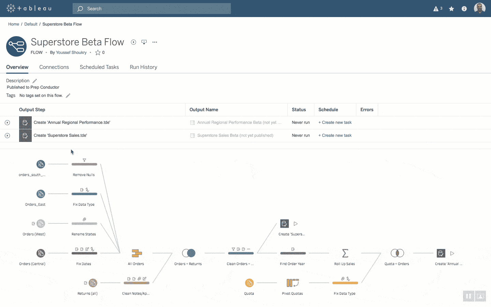
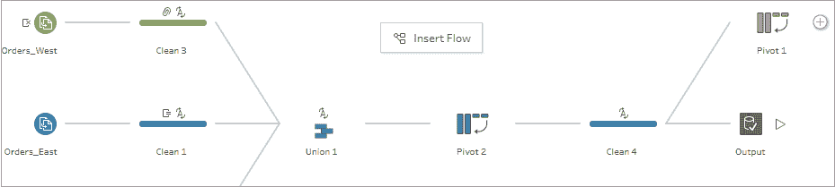

# 简化工作流程的 5 个技巧和窍门

> 原文：<https://web.archive.org/web/20221129044300/https://www.datacamp.com/blog/5-tableau-tips-and-tricks-for-streamlining-your-workflow>

数据分析正在彻底改变我们开展业务的方式，Tableau 等工具是它的核心。Tableau 允许任何人快速分析数据，提取见解，并通过易于使用的界面构建交互式仪表盘或其他数据产品。几乎任何具有基本 Excel 知识的人都可以加载 Tableau，插入 Excel 文件，并增强他们的数据工作流。

尽管它很容易使用，但成为 Tableau 专家有很大的深度。这篇博文分享了一些鲜为人知的技巧和诀窍，以帮助 Tableau 从业者简化工作流程，并始终如一地提供令人惊叹的可视化和仪表盘。这些技巧特别关注在数据准备和格式化过程中节省时间。

## 简化 Tableau 工作流程的五个技巧

### 1.使用 Tableau Prep Conductor 和 Tableau Prep Builder 自动化和重复使用数据准备流程

使用正确、最新的数据对于做出准确明智的决策至关重要。使用 [Tableau Prep Builder](https://web.archive.org/web/20221212135819/https://www.tableau.com/pricing/teams-orgs) 构建的流允许用户自动更新数据。该构建器允许用户可视化和管理整个数据准备过程。

[Tableau Prep Conductor](https://web.archive.org/web/20221212135819/https://www.tableau.com/about/blog/2019/2/tableau-prep-conductor-and-data-management-add-on-101614) 在 Prep Builder 之上工作，允许用户调度和管理这些流。这意味着分析师不需要花费时间手动运行这些流，也不需要等待数据被填充。这些流程和过程可以在整个组织内共享和重用，从而减少未来设置数据准备过程的时间。

[Tableau 为使用 conductor 工具自动化数据准备流程提供了一些最佳实践:](https://web.archive.org/web/20221212135819/https://www.tableau.com/about/blog/2019/3/starter-tips-automating-and-monitoring-flows-tableau-prep-conductor-104681)

*   **在非工作时间自动化流程:**这允许流程在使用较少计算资源时运行，并在稳定的服务器环境中工作，而不是使用桌面资源。
*   **使用 REST API 实现自动化:**如果数据更新取决于其他任务的完成，用户可以利用 REST API 在相关流程完成时触发更新。
*   **利用管理视图、服务器状态和警报:**conductor 工具提供了许多功能来监控流的性能。它还允许用户在流程失败时发送通知，并提供如何修复错误的建议。
*   **确保合适的人可以访问数据:**任何技术工具中的适当文档对于其在整个组织中的可用性都是至关重要的。用户可以用关键字标记流，以对内容进行分类，从而使它们更容易被组织中的其他人重用和访问。此外，可以通过权限和身份验证设置来管理用户特定的流访问。

Tableau prep toolkit 通过确保正确的数据可供正确的人使用，可以节省组织的时间并消除工作流的低效。

### 2.跨多个流程重复使用清洗操作和计算

在任何技术领域，[不要重复自己(干)](https://web.archive.org/web/20221212135819/https://www.earthdatascience.org/courses/earth-analytics/automate-science-workflows/write-efficient-code-for-science-r/#:~:text=DRY%20(Don't%20Repeat%20Yourself)%20is%20a%20principle%20of,single%20instance%20of%20that%20task!)是精简工作流程的一个必不可少的概念。用户不必花费额外的时间来应用相同的清理操作和在不同的流之间重写复杂的计算逻辑。他们应该努力确保流程设置正确，并且每一步第一次都能按预期工作。在这之后，他们应该相信这个步骤会被插入到其他流中。这是节省分析师时间和减少重写相同复杂逻辑的误差的最可靠的方法之一。

Tableau 允许从一个流中复制步骤，并将它们放到另一个流中。这是通过转到您想要复制的变更，将其粘贴到您想要添加它的步骤的变更中，然后拖放它来应用它。

干式编程是一个基本的技术概念，Tableau 使数据分析师能够在他们的工作流程中定期实现它。

### 3.创建样式模板以节省格式化未来仪表板的时间

每个人都有执行创造性工作的个人风格。这包括我们在表格上设置边框的方式，我们使用的字体，我们利用的调色板，以及可视化的位置。例如，看看[皮尤研究中心](https://web.archive.org/web/20221212135819/https://www.pewtrusts.org/en)或 [FiveThirtyEight 的](https://web.archive.org/web/20221212135819/https://fivethirtyeight.com/)文章。他们所有的可视化在整个网站上都有一致的风格。

如果声音设计是你的风格，一致的风格有助于其他人认可你的作品，并且可以成为一个有价值的讲故事的机制。开发一个与您的工作相关联的优秀仪表板对于有效沟通非常有用。

然而，设计仪表板的过程通常非常耗时。如果您发现自己正在制作外观相似的仪表板，您可以创建一个模板文件来显著减少规划仪表板和从头开始做出设计决策所需的时间和精力。

虽然 Tableau 上没有专门的“模板”功能，但是通过创建一个包含模拟数据的工作簿，可以将格式从一个工作表复制到另一个工作表。您可以随时引用此模板工作簿，方法是右键单击图表选项卡以“复制格式”，然后通过右键单击返回到当前选项卡以“粘贴格式”。

开发原始模板文件将非常耗时，但最终会产生更高效的工作流。

### 4.了解重要的 Tableau 键盘快捷键

能够在没有持续鼠标导航的情况下工作可以节省大量时间。Brainscape 声称,学习键盘快捷键每年可以节省 8 天(64 小时),并提高 3.3%的工作效率。Tableau 是一个用户输入非常多的应用程序，这意味着有很多机会使用快捷方式来加快工作流程。

Tableau 支持其他应用程序中的许多标准键盘快捷键，并具有用于数据操作和仪表板设计的特定快捷键。

[这里的](https://web.archive.org/web/20221212135819/https://help.tableau.com/current/pro/desktop/en-us/shortcut.htm)是 Tableau 上可用快捷键的完整列表。虽然这个列表乍一看很长，但是学习这些将有助于简化你的工作流程和提高生产力。

### 5.使用网格功能或平铺功能布局仪表板

在 Tableau 中创建仪表板时，有两种不同的方式来布局对象:浮动和平铺。浮动选项给用户更多的自由，而平铺选项以一种有组织的方式快速地编辑信息。

**浮动**

布局可视化和文本需要以一种精确和有组织的方式来做好。在没有系统的情况下，仅仅通过将可视化拖放到画布上很难做到这一点。通过打开菜单栏上仪表板下拉菜单下的网格功能，可以大大改进和简化这一过程。

一旦网格打开，还有其他几个特性可以提高网格的效用。例如，可以在“网格选项”部分的“仪表板”下更改网格之间的像素。增量 10 最适合可用的键盘快捷键。

作为浮动对象放置后，可以使用箭头键将图形移动一个像素，或者使用 Shift 和箭头键将图形移动 10 个像素。可以通过使用 alt 键和箭头键进行 1 像素大小的调整，使用 alt + shift 键和箭头键进行 10 像素大小的调整。

**平铺**

如果用户希望快速创建仪表板，可以将工作表以平铺模式放入工作表中。它将图表彼此相邻地添加到表单中。通过双击左侧窗格中的工作表，可以快速添加填充画布的图块。双击画布上对象的顶部可以选择这些图块的容器。

Tableau 正在彻底改变我们与数据交互的方式，并创建价值驱动的交互式仪表盘。我们希望这些 Tableau 提示和技巧有助于您利用其所有可用功能来简化工作流程。要获得更多关于成为更好的 Tableau 从业者的资源，您可以查看以下资源:

1.  [【播客】数据团队需要的数据讲故事技巧](https://web.archive.org/web/20221212135819/https://www.datacamp.com/podcast/the-data-storytelling-skills-data-teams-need)
2.  [[Blog]更好地讲述数据故事的七招:第一部分](https://web.archive.org/web/20221212135819/https://www.datacamp.com/blog/seven-tricks-for-better-data-storytelling-part-i)
3.  [[Blog]更好地讲述数据故事的七招:第二部分](https://web.archive.org/web/20221212135819/https://www.datacamp.com/blog/seven-tricks-for-better-data-storytelling-part-ii)