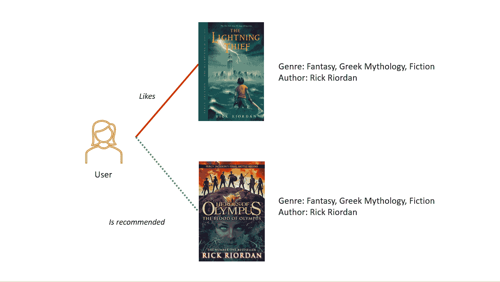
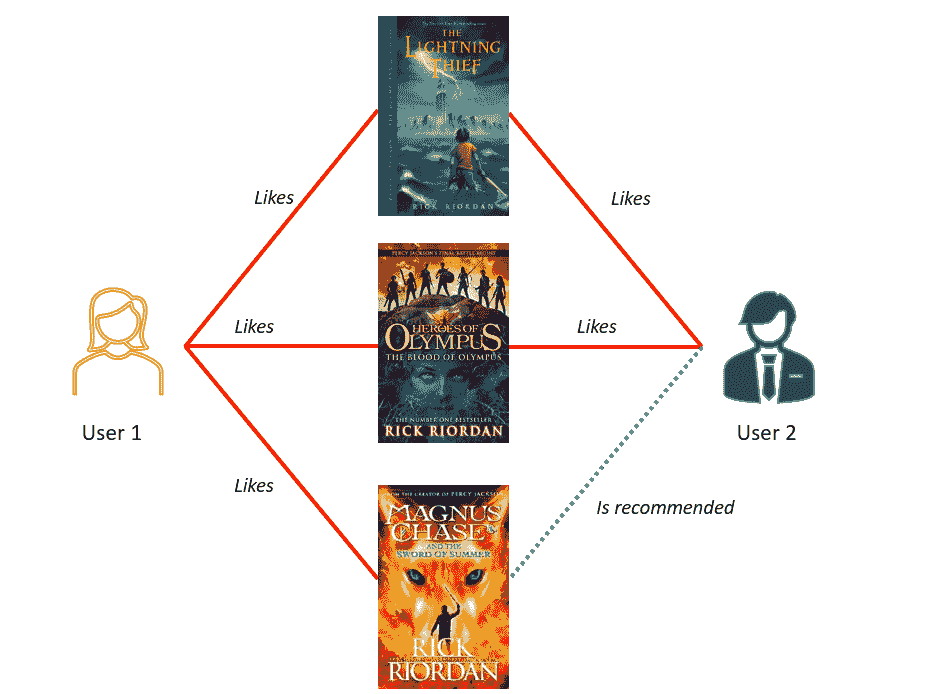
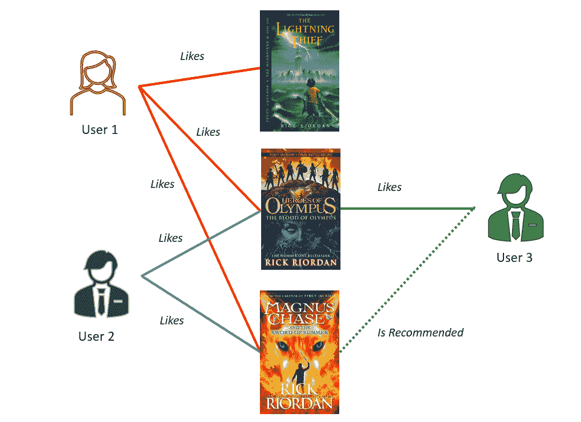
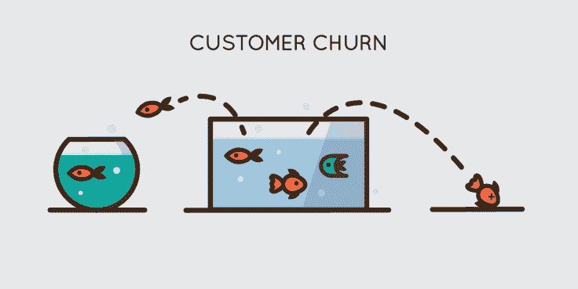
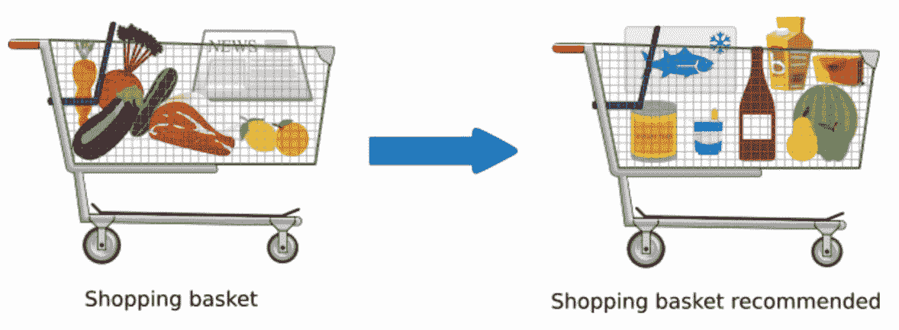
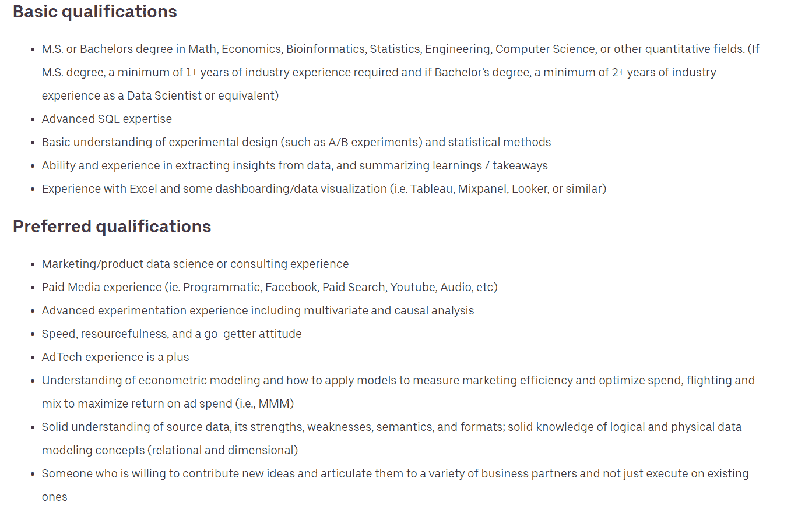

# 在营销中使用数据科学的 5 种方式

> 原文：<https://web.archive.org/web/20221210085053/https://www.datacamp.com/blog/5-ways-use-data-science-marketing>

## 市场营销中的数据科学导论

你有没有在某个网购平台购买过物品，却发现每次浏览网页都被同类商品的广告淹没？这是数据科学在市场营销中的应用。

仅在过去两年中就产生了世界上的大部分数据，公司现在有能力以前所未有的规模收集和存储客户数据。每次用户与组织的网站、社交媒体页面或 POS 系统交互时，都会创建新的数据点。

然后，这些数据被用来构建对用户行为的洞察，并向他们发送策划广告、个性化产品推荐和特别促销。

我们大多数人在日常生活中与营销数据科学应用程序进行交互，并无意识地根据它们做出决定。

在本文中，我们将介绍在营销中使用数据科学的 5 种方式。然后，我们将探索一个个人项目，您可以针对每个用例将其添加到您的数据科学投资组合中。最后，我们将谈到为什么你应该成为一名营销数据科学家，以及如何找到一份这样的工作。

## 数据科学在营销中的 5 个用例

### 1.推荐系统

网飞、Spotify 和亚马逊等公司使用推荐系统，根据用户与平台的互动为用户提供个性化的内容建议。

例如，如果你在网飞上观看了一部电影，并给了它一个积极的评价，下次你打开该应用程序时，你将被推荐相同类型、内容和演员的电影。

这是我们在日常生活中如何与推荐引擎互动的一个简单例子。

随着时间的推移，推荐系统会变得越来越强大，因为用户会继续与它们进行交互。

例如，如果你是 Spotify 的新手，你最初的音乐建议将是通用的。该应用程序将推荐对主流观众有吸引力的各种流派，因为该算法没有足够的数据来了解你的偏好。

随着你在平台上花费更多的时间，推荐引擎将了解更多关于你的喜欢和不喜欢，你的音乐建议将根据你的口味进行策划。该算法甚至可以预测你在不同季节或一天中不同时间可能喜欢的音乐类型。

#### 推荐系统的类型

推荐系统可以大致分为两种类型——基于内容的推荐系统和基于协同过滤的推荐系统。

##### *1。基于内容的推荐系统*:

作者图片

基于内容的推荐系统仅仅根据产品的内容给出建议。

例如，如果你喜欢读波西·杰克森系列的小说，你可能会被推荐《奥林匹斯山的英雄》,这是同一位作者写的，并且是一个相似的类型。

然而，像这样的算法的一个缺点是，不会向你推荐与你已经读过的书不同的书。如果你喜欢波西·杰克森，那么你只会被推荐冒险和奇幻书籍，即使你可能喜欢非虚构或悬疑小说。

您可以使用基于协同过滤的推荐系统来克服基于内容的推荐系统的这一缺点，我们将在本文后面解释这一点。

##### 基于内容的推荐系统项目构想

如果你是一个初学者，在构建推荐系统方面几乎没有经验，那么 [Kaggle 电影数据集](https://web.archive.org/web/20221129051032/https://www.kaggle.com/datasets/rounakbanik/the-movies-dataset)是一个很好的起点。该数据集包含 45，000 部电影的元数据，包括它们的海报、上映日期、类型和收入。

您可以根据 Datacamp 上 Python 教程中的[推荐系统编写代码，使用数据集中可用的电影细节构建一个基于内容的推荐系统。](https://web.archive.org/web/20221129051032/https://www.datacamp.com/tutorial/recommender-systems-python)

如果你想在建立电影推荐系统方面获得更多指导，请在 Datacamp 上注册一个[现场代码培训课程](https://web.archive.org/web/20221129051032/https://www.datacamp.com/live/lca-building-a-recommender-system-in-r)。这是一个由专家指导的研讨会，他将在 1.5 小时内教你如何在 R 中创建推荐系统，如果你在这个过程中遇到任何挑战，你可以向讲师提问。

##### 2。基于协同过滤的推荐系统

基于协同过滤的模型用于基于过去的用户行为生成建议。它们可以进一步分为基于用户和基于项目的协同过滤。

顾名思义，基于用户的协同过滤将具有相似行为的客户分组在一起。

然后，该算法根据这些客户群的共同偏好提供产品推荐，如下图所示:

作者图片

另一方面，基于项目的协作过滤根据用户偏好将相似的项目组合在一起，如下图所示:

作者图片

要了解更多关于不同类型的推荐系统以及如何实现它们，请参加 Datacamp 的[在 Python 中构建推荐引擎](https://web.archive.org/web/20221129051032/https://datacamp.com/courses/building-recommendation-engines-in-python)课程。

##### 协同过滤项目理念

您可以使用 Kaggle 上的[图书推荐系统数据集](https://web.archive.org/web/20221129051032/https://www.kaggle.com/datasets/rxsraghavagrawal/book-recommender-system)构建一个基于协同过滤的推荐系统。这个数据集只包含三个变量——用户 ID、图书的 ISBN 代码和每本书的用户评分。

这个[推荐系统教程](https://web.archive.org/web/20221129051032/https://www.datacamp.com/tutorial/recommender-systems-python)可以帮助你在不熟悉协同过滤工作原理的情况下开始项目。

### 2.情感分析

图片来自 [KDNuggets](https://web.archive.org/web/20221129051032/https://www.kdnuggets.com/2018/03/5-things-sentiment-analysis-classification.html)

情感分析，也称为观点挖掘，是确定一段文本背后的底层情感的过程，是数据科学在营销中的另一个热门应用。

下面是一个[关于情绪分析如何为组织增加商业价值](https://web.archive.org/web/20221129051032/https://www.repustate.com/blog/sentiment-analysis-real-world-examples)的例子:

南非的一家银行见证了比平常更高的客户流失率。许多用户开始转向竞争对手机构，不再想与他们做生意。银行试图在情绪分析的帮助下确定问题。

他们在社交媒体上收集了超过 200 万个数据点，以分析客户对他们的评价，并根据这些数据训练了一个情感分析模型。

根据这一分析，该机构意识到，大多数负面评论来自用户，他们不满银行在午餐时间没有足够的柜员，导致等待时间长。

然后，该银行通过在高交易量时段增加柜员来补救这种情况，从而减少了用户流失。

上面的例子说明了情感分析在帮助公司改进产品和超越竞争对手方面有多么有用。情感分析的其他应用包括产品分析、市场研究和用户评论挖掘。

要了解更多关于情感分析模型以及如何从头开始构建它们的信息，请参加 Datacamp 上的 Python 中的[情感分析](https://web.archive.org/web/20221129051032/https://app.datacamp.com/learn/courses/sentiment-analysis-in-python)课程。

#### 情感分析项目理念

首先，您可以使用 NLTK 库中的数据集创建一个电影评论情感分析模型。NLTK 是一个 Python 包，它为自然语言处理提供了一组不同的算法。

在这个项目中，您可以使用内置于库中的电影评论数据集，该数据集可以使用一行代码导入。然后，您需要构建一个算法，将电影评论数据分类为积极和消极情绪。

如果您需要入门指导，请阅读 Datacamp 上的 [Python 情绪分析](https://web.archive.org/web/20221129051032/https://www.datacamp.com/tutorial/simplifying-sentiment-analysis-python)教程。

### 3.客户流失预测

图片来自[深度笔记](https://web.archive.org/web/20221129051032/https://deepnote.com/@deepnote/Customer-churn-prediction-5fbd9526-dbfb-4be0-be29-bad6389ed248)

客户流失是当用户停止与某个实体做生意时发生的一种现象。例如，如果你是网飞用户，并决定终止在该平台上的订阅，那么你就是一个已经发生变化的客户。

对于公司来说，更换一个不满意的客户比留住一个现有客户的成本更高。因此，许多组织雇用数据科学家来识别即将流失的用户，以便他们可以防止这种情况发生。

下面是一个客户流失预测模型如何帮助公司留住用户的例子:

您向互联网服务提供商订购了服务，最近发现连接速度很慢。您提出了一些投诉，并尝试联系客户支持团队，但问题仍然存在。因此，您甚至多次开关路由器并重新连接到网络。

最后，由于您对该 ISP 的用户体验不佳，您决定改用竞争对手的品牌。

ISP 的数据科学团队收集客户行为数据，在用户连接到网络时跟踪用户活动，并收集投诉信息。在整合了所有这些数据之后，团队意识到你面临着高风险。

他们会立即提醒营销和产品团队，你可能会停止与他们做生意。

然后，该公司的营销团队会向您提供个性化的促销和打折的 WiFi 计划，甚至提供免费升级现有套餐的服务。升级后，您意识到连接速度快了很多，并且您对 ISP 的整体体验也更加愉快。然后你决定继续订阅它们，而不是换成竞争对手的品牌。

上面的例子说明了客户流失模型在留住组织现有用户方面的作用。这种应用程序为公司增加了直接的商业价值，经常被网飞和 Spotify 等基于订阅的平台使用，这些平台依赖用户续订作为其主要收入来源。

#### 客户流失预测项目理念

您可以使用 DataCamp 上的[电信客户流失](https://web.archive.org/web/20221129051032/https://www.datacamp.com/workspace/datasets/dataset-python-telecom-customer-churn)数据集来创建您的第一个流失预测项目。

该数据集包含伊朗电信公司用户的信息，如年龄、使用行为、订阅时长和投诉。使用这些数据来预测客户是否可能流失。

如果你不确定从哪里开始，就按照[客户流失率预测](https://web.archive.org/web/20221129051032/https://www.datacamp.com/blog/data-science-in-marketing-customer-churn-rate-prediction)教程来构建这个模型。你也可以看看我们关于用 Python 预测客户流失的[课程。](https://web.archive.org/web/20221129051032/https://www.datacamp.com/courses/marketing-analytics-predicting-customer-churn-in-python)

### 4.客户细分

图片来自 [Madlytics](https://web.archive.org/web/20221129051032/https://www.madlytics.com/customer-market-segmentation)

客户细分是根据共享特征将用户划分为不同的客户子群体的过程。然后，根据每个细分市场的行为，为其提供不同的促销和产品。

下面是一个客户细分如何为组织增加商业价值的例子:

某电商公司构建客户细分模型，针对不同用户进行个性化促销。

如果用户经常浏览平台，但只在有折扣时购买，他们就被归类为“促销猎人”每次有持续折扣时，该细分市场中的所有客户都会立即收到电子邮件通知，因为他们可能会在此期间购买更多商品。

另一方面，一些用户购买特定的商品，并愿意不考虑价格而购买，因为他们更看重质量而不是价格。这些客户的目标是不同的，该公司的营销团队只根据他们已经表现出兴趣的产品向这一群体宣传高端产品。

通过这种方式，购买力高的顾客会看到迎合他们兴趣的更贵的产品，从而鼓励他们花更多的钱。在促销期间，重视价格的用户会被更便宜的产品所吸引。

上面的例子很简单，但展示了客户细分如何让公司从每个用户身上获取最大利润。

客户细分模型最常见的应用之一是在营销活动中建立广告组。

例如，脸书收集其用户的人口统计和行为数据，并允许公司根据这些信息投放针对定制受众群体的广告。用户可以根据特定的特征进行细分，例如他们的位置、年龄、性别、他们喜欢的品牌以及他们所属的人。

客户细分通常通过建立无监督的机器学习模型来实现，如 [K 均值聚类](https://web.archive.org/web/20221129051032/https://www.datacamp.com/tutorial/k-means-clustering-python)。

如果您想了解更多关于客户细分以及如何构建 K-Means 聚类等算法的信息，请参加我们的[Python 中的客户细分](https://web.archive.org/web/20221129051032/https://datacamp.com/courses/customer-segmentation-in-python)课程。

#### 客户细分项目理念

你可以使用 Datacamp 的[电子商务数据集](https://web.archive.org/web/20221129051032/https://www.datacamp.com/workspace/datasets/dataset-python-e-commerce)建立一个客户细分组合项目。

该数据集由英国电子商务平台上的订单详情组成。

记录客户购买信息，如他们订购的商品、产品价格和发票日期，您可以使用这些数据根据他们在平台上的活动对用户进行细分。

### 5.市场篮子分析

图片来自 [Analytics Vidhya](https://web.archive.org/web/20221129051032/https://www.analyticsvidhya.com/blog/2021/10/a-comprehensive-guide-on-market-basket-analysis)

购物篮分析，也称为关联挖掘，是一种用于分析经常一起购买的商品的技术。这是通过处理历史购买数据来识别在交易中经常一起出现的产品组合来实现的。

零售商可以利用这一分析结果来改进商店设计，鼓励顾客在一次交易中购买更多商品。

例如，购买婴儿配方奶粉的人也可能会购买尿布，因此商店通常会将这些物品放在彼此附近，以使用户可以轻松获取。

然而，购买模式并不总是那么明显。根据地区、文化影响和人口统计因素，客户倾向于一起购买不属于同一类别的商品。这些相关性中的许多无法通过肉眼发现，这就是为什么组织依赖于数据科学技术，如购物篮分析。

下面是一个市场篮分析如何识别未被人们发现的关联的例子:

市场购物篮分析最常引用的例子是“[啤酒和尿布](https://web.archive.org/web/20221129051032/https://tdwi.org/articles/2016/11/15/beer-and-diapers-impossible-correlation.aspx)”案例研究。根据这项研究，中西部的一家杂货连锁店使用数据挖掘技术来识别经常一起购买的商品。

他们的分析显示，顾客通常在周五晚上一起购买啤酒和尿布。这种相关性可能看起来纯粹是巧合，但这里有一个可能导致它的场景:

一个年轻的父亲在办公室度过漫长的一周之后，在周五晚上去杂货店买了几瓶啤酒。他的妻子意识到了这一点，并要求他也为他们的新生儿购买尿布。这种行为变成了一种习惯，上班的爸爸们开始在周五回家前一起买啤酒和尿布。

发现这一点后，商店开始将啤酒和尿布放在同一过道上，并立即见证了销售额的增长。

这个故事最早是在 90 年代中期报道的，其真实性多年来一直受到质疑。不管是不是虚构的，这个用例都提醒我们，在揭示人类肉眼看不到的隐藏关联时，统计是多么强大。

购物篮分析不仅限于实体零售店。电子商务平台也在同一页面上展示高度相关的产品，确保它们在用户的视线范围内。

例如，如果你在网上购买黑色牛仔裤，你可能会在页面底部看到配套的鞋子，鼓励你购买一捆产品而不是一件。同样，这直接导致了公司销售额的增加，因为顾客最终购买的产品比他们想要的要多。

要了解有关购物篮分析以及如何使用机器学习技术来执行它的更多信息，请参加 Python 学习课程中的[购物篮分析。如果你更喜欢使用 R，参加 R](https://web.archive.org/web/20221129051032/https://datacamp.com/courses/market-basket-analysis-in-python) 课程中的[市场篮子分析。](https://web.archive.org/web/20221129051032/https://datacamp.com/courses/market-basket-analysis-in-r)

#### 购物篮分析项目理念

为了开始购物篮分析，您可以使用与上面客户细分部分提到的相同的[电子商务数据集](https://web.archive.org/web/20221129051032/https://www.datacamp.com/workspace/datasets/dataset-python-e-commerce)。请记住，这是在 [UCI 机器学习库](https://web.archive.org/web/20221129051032/http://archive.ics.uci.edu/ml/datasets/online+retail)上可用的数据集的截断版本，仅包含 2500 行。如果想要处理更多的数据，可以下载更大的数据集。

如前一节所述，电子商务数据集包含客户交易数据，如发票号码和购买的产品。您可以使用此信息来识别客户在同一交易中经常一起购买的商品。

你可以使用 R 教程中的[市场篮子分析来指导这个项目的实施。如果 Python 是你的首选语言，那么我们有一门用 Python 进行](https://web.archive.org/web/20221129051032/https://www.datacamp.com/tutorial/market-basket-analysis-r)[市场篮子分析的课程](https://web.archive.org/web/20221129051032/https://datacamp.com/courses/market-basket-analysis-in-python)。

## 营销中的数据科学——后续步骤:

### 你为什么应该考虑成为一名营销数据科学家？

数据科学在营销领域有广泛的应用，其中许多我们在上面讨论过。这些用例通过提高销售额、解决客户的痛点以及鼓励购买者消费更多来为组织增加直接价值。

过去，当组织无法访问大量客户数据时，营销专家会自己执行上述许多应用程序。情绪分析和市场研究是通过发出调查问卷进行的。营销人员根据他们对客户行为的理解向用户发送有针对性的广告，这更像是一个直观的过程，而不是数据驱动的过程。

如今，随着组织收集和存储的数据量激增，公司已经开始采用数据驱动的营销方法。

然而，公司雇佣数据科学家来研究营销用例是不够的。

虽然数据科学家可以处理复杂的数据集，建立高度准确的预测模型，并执行统计分析，但这些技能本身不足以从数据中获得有价值的洞察力。他们缺乏市场营销领域的知识，通常无法将手头的数据与业务问题联系起来。

另一方面，营销专家了解客户行为，知道如何制定问题陈述，可以指导营销决策。他们缺乏处理大型数据集的专业技术。

专攻营销领域的数据科学家拥有这两种角色的综合技能，这对组织来说是无价的。这些人可以弥合数据科学和营销领域之间的差距，并可以做出对公司有利的数据驱动型决策。

### 如何成为营销数据科学家

要成为营销数据科学家，您必须具备强大的技术和分析能力、营销领域知识和软技能:

#### 1.技术

*   SQL 来提取、清理和操作数据库中的数据。参加[SQL 简介](https://web.archive.org/web/20221129051032/https://app.datacamp.com/learn/courses/introduction-to-sql)课程，学习数据库操作的基础知识。
*   统计方面的专业知识以及监督和非监督机器学习技术的知识。参加[统计学简介](https://web.archive.org/web/20221129051032/https://www.datacamp.com/blog/new-courses-introduction-to-statistics)课程，了解统计分析的基础知识。
*   至少了解一种编程语言(R、Python、Java 等)。如果你不知道如何编码，可以去 Datacamp 的 [Python 编程](https://web.archive.org/web/20221129051032/https://app.datacamp.com/learn/skill-tracks/python-programming)技能赛道或者它的 [R 备选](https://web.archive.org/web/20221129051032/https://app.datacamp.com/learn/skill-tracks/r-programming)。
*   进行 A/B 测试的能力。
*   能够使用 Tableau、PowerBI 和 Excel 等工具执行数据可视化和构建仪表板。
*   了解广告活动如何在脸书和谷歌展示网络等平台上运行和优化。
*   能够进行实验设计和归因建模。

请记住，根据您加入的组织和团队，上述要求会有所不同。例如，一个专注于向用户展示产品推荐的团队不会致力于优化广告，也不会执行诸如属性建模之类的任务。

如果您不具备营销领域的知识，但想学习如何进行 A/B 测试、可视化营销指标和分析转化率，请参加 Datacamp 上的[熊猫营销简介](https://web.archive.org/web/20221129051032/https://campus.datacamp.com/courses/analyzing-marketing-campaigns-with-pandas/pandas-1?ex=1)课程。

#### 2.软技能

*   沟通能力强。
*   将复杂的技术概念分解给高级管理层并帮助决策的能力。
*   制定数据驱动的解决方案来解决业务问题的能力。

为了更清楚地了解公司对营销数据科学家的要求，以下是优步对该职位的要求:

如果您没有营销数据科学领域的经验，展示您在该领域技能的最佳方式是创建解决现实世界业务问题的项目。

我们已经为本文中解释的每个应用程序列出了相关项目，在简历中展示一些项目是一个好主意，可以向招聘经理展示您可以使用数据科学技术来提升商业价值。

最后，如果你想弥补现有的知识差距，并学习如何将数据科学方法应用于营销，你可以参加 Datacamp 的 Python 课程中的[机器学习营销，或其](https://web.archive.org/web/20221129051032/https://datacamp.com/courses/machine-learning-for-marketing-in-python) [R 等效课程](https://web.archive.org/web/20221129051032/https://datacamp.com/courses/machine-learning-for-marketing-analytics-in-r)。