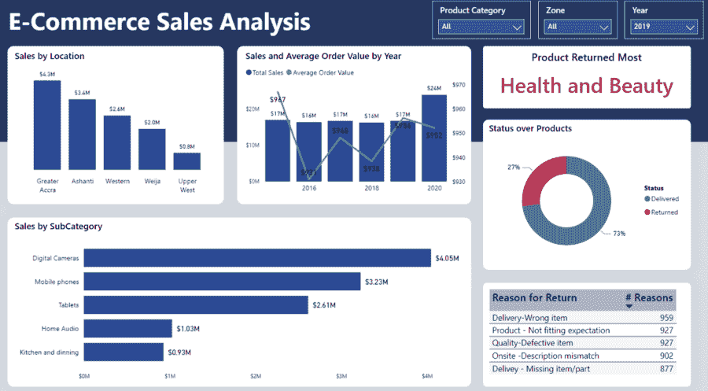
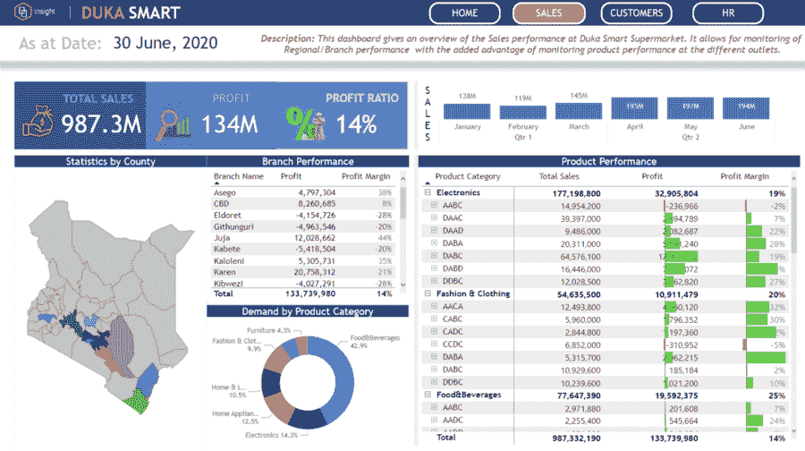
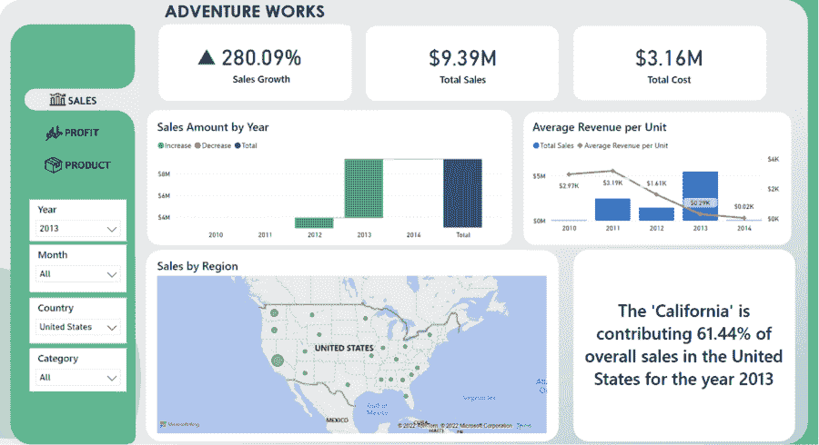
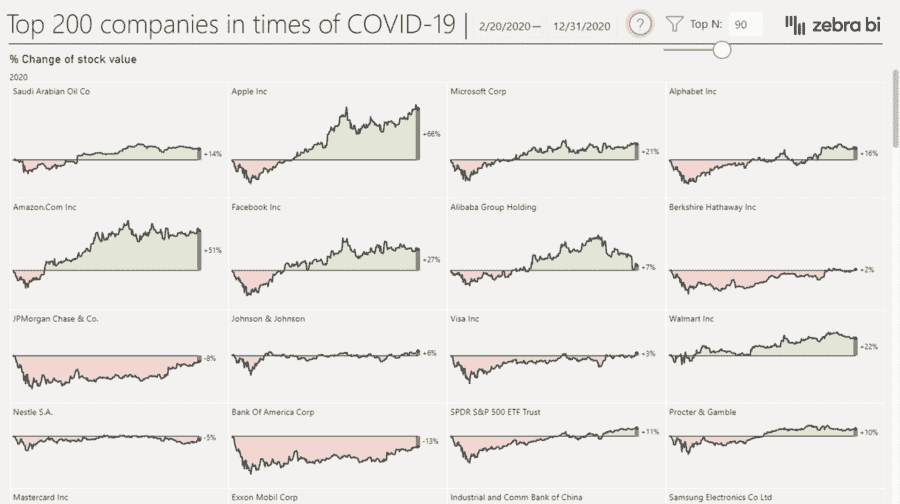
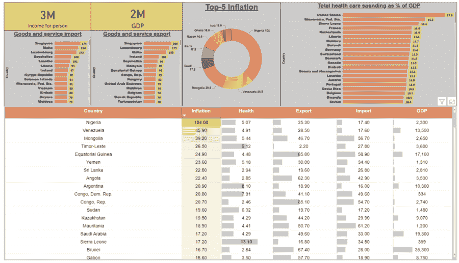
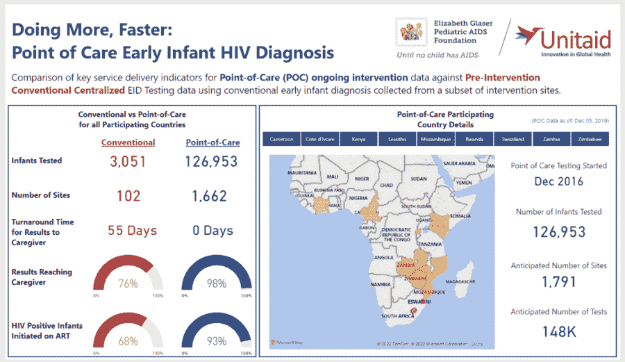
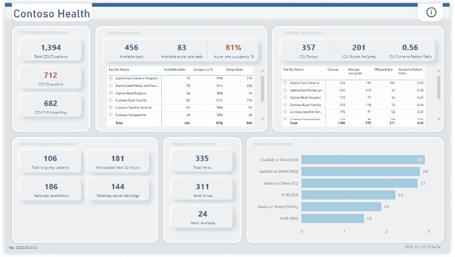

# 9 大电力 BI 仪表板示例

> 原文：<https://web.archive.org/web/20221129041202/https://www.datacamp.com/blog/9-power-bi-dashboard-examples>

Power BI 是最受欢迎的商业智能工具之一。它允许从业者创建高度美观、可定制的可视化和仪表板(不需要编码技能)，并直接与利益相关者共享。

作为微软的一款工具，Power BI 特别适合 Excel 用户，因为它具有相似的界面和与 Excel 的深度集成。此外，它为从业者提供了高级功能，允许他们转换和清理数据、大规模协作以及设置粒度访问权限。

尽管有这些出色的特性，Power BI 提供了最大的价值，它通过令人难以置信的仪表板功能，让组织和团队可以一目了然地查看他们关心的所有指标。在本文中，我们将通过展示涵盖各种主题的 Power BI 仪表盘的真实示例来展示 Power BI 的强大功能。

如果你对 [Power BI vs Tableau](https://web.archive.org/web/20221212140010/https://www.datacamp.com/blog/power-bi-vs-tableau-which-one-should-you-choose) 以及哪一个适合你感兴趣，请查看我们单独的指南。

## 是什么造就了一个强大的 BI 仪表板？

一个 [Power BI](https://web.archive.org/web/20221212140010/https://www.datacamp.com/blog/all-about-power-bi) 仪表盘不仅要美观，还要清晰实用。您可以从许多方面来评估 Power BI 仪表板。在我们关于设计仪表板的[最佳实践](https://web.archive.org/web/20221212140010/https://www.datacamp.com/blog/best-practices-for-designing-dashboards)的文章中，我们概述了在 Power BI(以及任何工具，事实上)中构建仪表板的最佳实践。以下是大功率 BI 仪表板的主要特征:

### 特定于受众的

不同的仪表板有不同的受众和不同的用途。运营仪表板监控业务运营的实时数据，并由运营团队(例如，营销团队)使用，而战略仪表板监控长期公司 okr 和 KPI，并由 C 级高管使用。伟大的仪表板总是首先考虑观众的需求。

### 简单而整洁

很容易把除了厨房水槽以外的所有东西都扔到仪表板上。任何创建仪表板的人都需要深入思考复杂性和有用性之间的权衡。因此，一定要确保仪表板尽可能提供最有用的信息，而不增加不必要的混乱。

### 使用网格布局

使用网格布局不仅有助于您在创建仪表板时提高工作效率，还能让受众进行无缝的旅程。根据 Tableau 的技术传道者和[仪表盘大全](https://web.archive.org/web/20221212140010/https://www.datacamp.com/blog/top-10-data-visualization-books)的合著者 Andy cotgreve 的说法，人类天生习惯于从左向右和从上到下看东西。使用网格布局有助于您的受众导航仪表板。

### 美学很重要

最重要的是，仪表板应该是有用的。然而，仪表板的美观(或缺乏美观)会严重影响它的采用。一般来说，要确保你的仪表盘不会使用一种以上的字体，并且创造性地使用颜色来引导观众的消费之旅。

### 快速加载时间很重要

加载时间对几乎任何数字产品的采用都很重要，仪表盘也不例外。即使仪表板勾选了所有的框，如果等待时间很长，它也几乎不会被使用。最小化加载时间的一个好方法是消除混乱，确保数据转换存储在数据库的视图中，并在复杂和简单的可视化之间取得平衡。

现在我们已经有了最佳实践，下面是来自销售、金融、医疗保健等垂直行业的顶级 BI 仪表板示例。

## Power BI 销售仪表板示例

### 1.电子商务销售仪表板

这种交互式仪表板旨在供在线零售商使用，并为他们提供对不同产品性能的高层次到精细的了解。它提供了总销售额的概览，能够展示年、季度和月增长率。此外，它允许任何人挖掘数据，了解表现最佳的产品、位置等。

[点击此处进入仪表盘](https://web.archive.org/web/20221212140010/https://community.powerbi.com/t5/Data-Stories-Gallery/E-Commerce-Sales-Analysis/m-p/2519282)

### 2.超市销售仪表板

这是一个令人难以置信的简洁而全面的仪表板，允许对肯尼亚一家连锁超市的财务状况一目了然。它提供了三个报告，涵盖整体销售数据，并能够按产品类别、客户人口统计数据以及不同超市分支机构的员工成本和人数数据进行细分。

[点击此处进入仪表盘](https://web.archive.org/web/20221212140010/https://community.powerbi.com/t5/Data-Stories-Gallery/Supermarket-Dashboard-Case-in-Kenya/m-p/1095982)

### 3.AdventureWorks 的销售仪表板

这个仪表板跟踪一家名为 AdventureWorks 的虚构自行车制造商的销售业绩。它提供了一段时间内总销售额和增长的概览，并能够按产品类别进行深入分析。此外，它还提供了不同年份和月份之间的出色比较功能，以及一个按地区划分的巨大销售地图。

[点击此处进入仪表盘](https://web.archive.org/web/20221212140010/https://community.powerbi.com/t5/Data-Stories-Gallery/Sales-Analysis-for-AdventureWorks/m-p/2549649)

## Power BI 财务仪表板示例

### 1.全球股票市场仪表板

在疫情开始时，许多组织在实现复苏之前遭受了巨大的股票市场损失。这个仪表板提供了新冠肺炎第一年前 200 家公司(以股价表现衡量)的概览。它结合了简单的视觉效果和强大的过滤功能，展示了 Power BI 仪表盘在金融领域的实用性。

[点击此处进入仪表盘](https://web.archive.org/web/20221212140010/https://community.powerbi.com/t5/Data-Stories-Gallery/Global-Stock-Market-World-s-Top-200-Companies/td-p/1482649)

### 2.通货膨胀仪表板

> “通货膨胀是衡量一个经济体中商品和服务价格上涨速度的指标。如果出现通货膨胀，导致食品等基本必需品价格上涨，就会对社会产生负面影响。”投资媒体

由于新冠肺炎和俄乌战争的影响，通胀从未像现在这样真实。该仪表板提供了不同国家的通货膨胀概况，以及其他经济指标，如进出口数据、GDP 规模等。

[点击此处进入仪表盘](https://web.archive.org/web/20221212140010/https://community.powerbi.com/t5/Data-Stories-Gallery/Inflation/td-p/2614730)

### 3.NCAA 足球财务仪表板

NCAA 代表国家大学体育协会，是一个管理美国和加拿大学生体育运动的组织。该仪表板突出显示了 NCAA 的财务状况，对总收入、总支出和总利润进行了高度概括。此外，它为观众提供了按会议和参与学校过滤这些数据的能力。

[点击此处进入仪表盘](https://web.archive.org/web/20221212140010/https://community.powerbi.com/t5/Data-Stories-Gallery/NCAA-Football-Financials/m-p/1678001)

## Power BI 医疗保健仪表板示例

### 1.新冠肺炎仪表板

可以说是过去十年最大的数据故事，新冠肺炎传播和影响是仪表板的一个主要例子。这个仪表板帮助观众了解新冠肺炎如何在各国传播，恢复和死亡率，详细的国家比较，等等。

[点击此处进入仪表盘](https://web.archive.org/web/20221212140010/https://app.powerbi.com/view?r=eyJrIjoiYjA1YzhhMjItMWU1ZS00YmRiLWI3MjUtZDVhN2ZlMzY4NjFlIiwidCI6IjJjOTJmZjI0LWI0MmMtNDgwZC1iNzRkLTY2ZmNlNzZiZDdkYSIsImMiOjl9)

### 2.POC EID 数据仪表板

护理点早期婴儿诊断(POC EID)数据仪表板旨在评估护理点早期艾滋病毒诊断对婴儿的影响。该项目涉及九个非洲国家:喀麦隆、科特迪瓦、肯尼亚、莱索托、莫桑比克、卢旺达、埃斯瓦蒂尼、赞比亚和津巴布韦。仪表板为观众提供了现场护理测试与传统方法相比的概览，可供医生和公共政策官员使用。

[点击此处进入仪表盘](https://web.archive.org/web/20221212140010/https://community.powerbi.com/t5/Data-Stories-Gallery/Early-Infant-HIV-Diagnosis-Earlier-Diagnosis-Saves-More-Lives/td-p/220513)

### 3.医院应急响应决策仪表板

该仪表板为医院管理员提供了医院当前运营和瓶颈的绝佳概览。它提供了床位占用、出院和工作人员可用性的概述，以及重要安全材料和产品的供应。除了这个概述之外，它还提供了更详细地钻取所有这些特定指标的能力。

[点击此处进入仪表盘](https://web.archive.org/web/20221212140010/https://appsource.microsoft.com/en-US/product/power-bi/powerapps_cxo.powerbi_healthcare?tab=overview)

## 借助 Power BI 成为数据分析师

本文向您展示了 Power BI 如何使任何人都能够构建极其丰富的仪表板，从而为任何消费者提供价值。Power BI 是推动组织内数据驱动决策的最重要工具之一，也是从业者最想学习的工具之一。

如果您有兴趣成为 Power BI 专家，请查看 Power BI 职业跟踪中的[数据分析师，它涵盖了在 Power BI 中自信地制作仪表盘所需的所有知识。有关 Power BI 的更多信息，请查看以下资源:](https://web.archive.org/web/20221212140010/https://www.datacamp.com/resources/webinars/become-data-analyst-with-power-bi)

*   [【网上研讨会】成为拥有 Power BI 的数据分析师](https://web.archive.org/web/20221212140010/https://www.datacamp.com/resources/webinars/become-data-analyst-with-power-bi)
*   [【文章】如何从 Excel 过渡到 Power BI](https://web.archive.org/web/20221212140010/https://www.datacamp.com/blog/how-to-transition-from-excel-to-power-bi)
*   [【备忘单】Power BI 备忘单](https://web.archive.org/web/20221212140010/https://www.datacamp.com/cheat-sheet/power-bi-cheat-sheet)