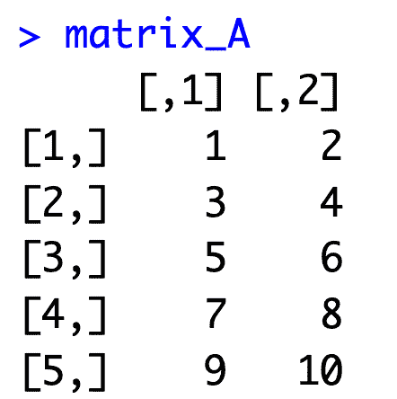
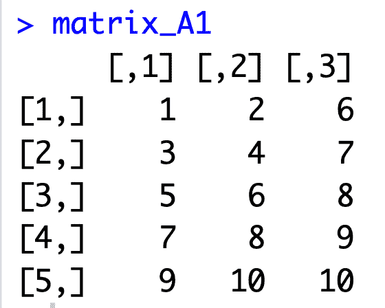
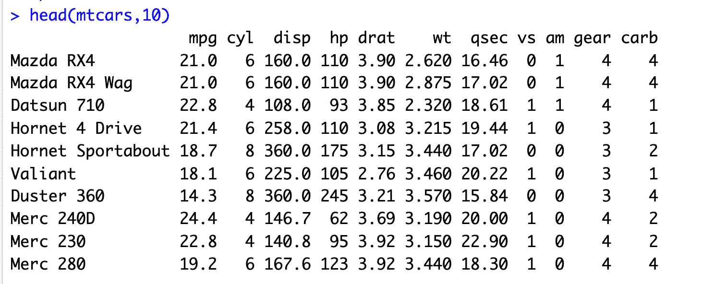
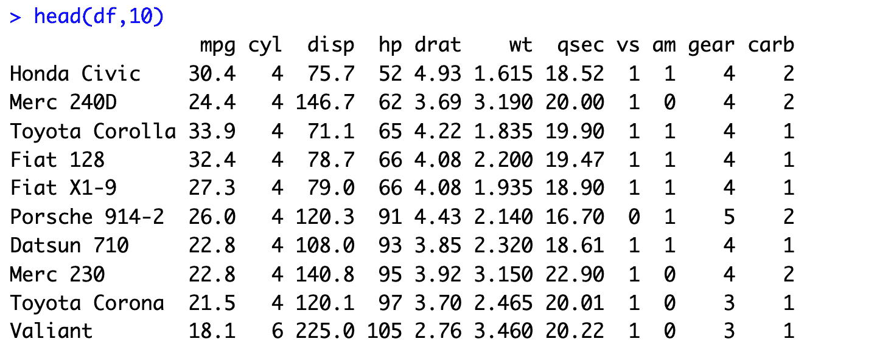

# R 是什么？-统计计算发电站

> 原文：<https://web.archive.org/web/20230101103007/https://www.datacamp.com/blog/all-about-r>


[简介](#introduction)

[什么是 R？](#what-is-r?)

R 是一种流行的编程语言吗？

R 是什么时候创造的？

[R 和 S 以及方案](#r-and-s-and-scheme)

[R 多年来是如何发展的](#how-r-has-evolved-over-the-years)

谁使用 R？

[R 基础和高级 R](#r-basics-and-advanced-r)

[四舍五入 R](#rounding-up-r)

[R 常见问题](#r-faqs)

## 介绍

r 是一个统计编程工具，专门用来处理大量数据。

使用 r 可以轻松处理大量信息并生成可供发布的图形和可视化效果。各种数据分析、挖掘和建模任务也是如此。

因为 R 最初是由统计学家为统计目的而设计的，所以它非常适合数据科学，这是当今世界的一个重要领域。

虽然 R 的核心功能是统计分析和图形，但它的用途超越了这些，进入了人工智能、机器学习、金融分析等领域。

R 一直被列为世界上最受欢迎的编程语言之一，更不用说是一种高薪语言了，它从 20 世纪 90 年代早期就已经存在，并且现在仍然很强大。

继续阅读，了解更多关于 R 编程语言的知识，包括它的历史，谁在使用它，以及拥有 R 技能的可能职业道路。

## R 是什么？

r 是一个统计计算和图形系统。这个系统由两部分组成:R 语言本身(这是大多数人谈论 R 时的意思)和运行时环境。

r 是一种解释型语言，这意味着用户通过命令行解释器来访问它的功能。

与 Python 和 Java 等语言不同，R 不是一种通用的编程语言。相反，它被认为是一种特定领域语言(DSL)，这意味着它的功能和用途是为特定的使用领域或领域而设计的。

在 R 的例子中，那是统计计算和分析。通过扩展，R 通常用于所有形式的数据科学任务。

r 配备了大量支持数据可视化的函数，因此用户可以分析数据，根据需要建模，然后创建图形。除了语言内置的图形功能之外，还有许多插件或模块来促进这一点。

## R 是流行的编程语言吗？

r 是一种流行的编程语言，尤其是在某些领域，比如数据科学、学术研究和统计学。

在撰写本文时(2022 年 3 月)，R 在 [TIOBE 指数](https://web.archive.org/web/20220630031451/https://www.tiobe.com/tiobe-index/)上排名第 11 位，2020 年 8 月，R 在第 8 位。TIOBE 索引每月更新一次，它是一种编程语言受欢迎程度的良好指标。

索引中列出了 50 种语言，已知存在的 8000 多种其他编程语言，所以可以肯定地说 R 很受欢迎！

2020 年 5 月，R 在 TIOBE 索引中短暂地失去了前二十名的位置，导致许多人猜测该语言从学术研究到商业应用的飞跃很快被 Python 取代。然而，这种受欢迎的平静并没有持续很久，正如 TechRepublic [报道的那样，到同年 7 月，R 已经进入了前十名。](https://web.archive.org/web/20220630031451/https://www.techrepublic.com/article/r-programming-language-continues-to-grow-in-popularity/)

r 是统计工程师和统计研究的首选语言。世界各地的大学使用 R 来帮助他们在许多领域的研究工作。

“R 的成功是一个例子，说明了学术界支持的社区有能力将一门语言提升到超出其预期的水平。”-斯蒂芬·奥格雷迪，雷德蒙克分析师

许多人认为 R 在 2020 年跃升至十大热门词汇是因为该语言在新冠肺炎研究中的使用越来越多。当有大量数据需要争论时，R 是理想的工具——这只是这种语言在诞生近 30 年后的今天仍然流行的一个原因。

## R 是什么时候创造的？

r 是由奥克兰大学的统计学家 Ross Ihaka 和 Robert Gentleman 在 20 世纪 90 年代初创造的。

Ihaka 和 Gentleman 当时都是新西兰大学的统计学教授，他们在他们的计算机科学实验室中看到了 Ihaka 所说的“对更好的软件环境的共同需求”。这种认识促使两人开始开发 R，这是早期 S 编程语言的一种实现。

尽管教授们在 90 年代早期就开始研究 R，但直到 2000 年 2 月 1.0.0 版本才正式发布。

### R 的名字是什么意思？

R 语言得名于两个原因:一是因为 R 是发明者名字的第一个字母，二是因为 R 是对其母语言 S 名字的一种玩法，S 最初是由贝尔电话实验室开发的。

## r、S 和 Scheme

要完全理解 R，理解 S 是很有帮助的，S 是它发展的主要语言。

### c 编程语言

s 是由约翰·钱伯斯和其他为贝尔实验室工作的人在 20 世纪 70 年代中期开发的。它的目的是提供一个交互式的统计计算方法，一个用户友好的方法，使数据分析任务更容易和更快。

在 2013 年的一次采访中，钱伯斯指出，贝尔实验室团队希望人们能够“接触到现有的最佳计算方法，不管他们来自哪里。”

他还说团队希望用户“从一个互动的环境开始，在这里他们不会有意识地认为自己是在编程。然后，随着他们的需求越来越清晰，成熟度越来越高，他们应该能够逐渐进入编程。”

s 的基本哲学和 R 的很像:提供一个软件环境，方便计算编程和统计分析，一个任何人都能学会使用的环境。

和 R 一样，S 也可以用来编写以统计任务为中心的更长的程序。不过，与 R 不同，S 及其后续版本 S-PLUS 是特许产品，这意味着它们必须从一家公司购买。

值得注意的是，R 不是一种独特的语言，而是 s 的一种方言。

#### 句法和语义

语言学家使用术语句法和语义来描述自然语言的元素，计算机科学家也将这些术语用于编程语言。

在计算机编程中，句法指的是规定一种语言的“拼写”和“语法”的规则，而语义指的是一种语言的数据或命令如何呈现。

r 的语法与 S 早年的语法非常相似。这使得使用 S-PLUS 的人很容易转向 R，这对 R 最终在学术界流行起了关键作用。然而，r 的语义更接近于函数式编程语言 [Scheme](https://web.archive.org/web/20220630031451/https://www.cs.mcgill.ca/~rwest/wikispeedia/wpcd/wp/s/Scheme_programming_language.htm) 的语义。

#### R 是低级语言还是高级语言？

r 是一种低级编程语言，这意味着一些不同的事情，包括它更接近于机器语言而不是自然的人类语言。这一点，加上其句法上的怪癖，给 R 带来了难以学习的名声。

这里有一个权衡:R 提供了强大的功能、可扩展性和灵活性，但是“代价”是一定程度的复杂性。

新手去 R 帮助页面寻求帮助可能会更加困惑，因为这些页面是针对有经验的读者的。

r 不是最容易学的编程语言，但也没有很多人想让你相信的那么难。十多年来，DataCamp 一直在教人们如何使用 R，我们已经对我们的方法进行了微调。

诀窍是先把重点放在本质上，然后随着你的进步发展你的技能和知识。如果您想尝试 R 编程，请查看我们免费的 R 课程简介[。](https://web.archive.org/web/20220630031451/https://www.datacamp.com/courses/free-introduction-to-r)

## 这些年 R 是如何演变的

r 在其生命周期的大部分时间里都是开源的，因此该语言可用的软件包数量有了很大的变化。

语言本身也经历了一些变化，从第一个版本到最新版本，使用 R 的领域也有所扩展。在深入探讨之前，让我们先来看看 R 历史上的几个里程碑:

### R 简史

*   1991 年的今天，作为奥克兰大学统计系的研究项目，罗斯·伊哈卡和罗伯特·绅士开始研究 S 的一种新方言。
*   1993 年的今天，R 的首个公告通过数据存档 StatLib 和 s-news 邮件列表与公众见面。
*   1995 年的今天，统计学家马丁·麦克勒说服 R 的发明者在 GNU 通用公共许可证下发布这种语言，使 R 既可以自由使用又可以开源。

Ihaka 和 Gentleman 发布了他们的开创性论文向世界介绍 R。

*   1997 年的今天， [R 核心团队](https://web.archive.org/web/20220630031451/https://www.r-project.org/contributors.html)成立，这个团队是唯一一个对 R 源代码有写权限的团队，他们审查并制定任何对语言的修改建议。

同年，综合 R 档案网(CRAN)成立。这个开源 R 软件包库，是语言本身的扩展，帮助专业人员完成无数的任务。

*   2000 - R 版本 1.0.0 向公众发布。
*   2003 年的今天， [R 基金会](https://web.archive.org/web/20220630031451/https://www.r-project.org/foundation/)成立以持有和管理 R 软件版权并为 R 语言项目提供支持。
*   2004 - R 版本 2.0.0 发布。
*   2009 年的今天， [R Journal](https://web.archive.org/web/20220630031451/https://journal.r-project.org/) 成立，这是一份开放存取的统计计算和研究期刊。
*   2013 - R 版本 3.0.0 发布。
*   2020 - R 版本 4.0.0 发布。

### R 社区

R 社区是世界各地使用 R 的人们，他们为 CRAN 库上的可用包做出贡献，或者两者兼而有之。

众所周知，这个社区非常活跃，有很多人经营关于 R 的论坛，写博客，回答关于栈溢出和其他地方的问题。除了所有的虚拟 R 资源和支持之外，还有许多定期举行的大型 R 会议。

如果你想用 R 做一些事情，但又不确定如何开始，那么很有可能有一个软件包可以帮助你。熙熙攘攘的 R 社区已经产生了数以千计的工具来扩展 R 的功能。

事实上，微软的 Revolution Analytics 博客[报道](https://web.archive.org/web/20220630031451/https://blog.revolutionanalytics.com/2017/01/cran-10000.html)称，2017 年，CRAN 上列出了 1 万个包。其中一些包装凭借其自身的权利而声名鹊起，包括 Tidyverse。

### R Tidyverse

如果你读过一些关于 R 的书，你很有可能听说过 Tidyverse。

Tidyverse 不是一个单独的包，而是一个由各个 R 包组成的包——非常元，对吗？这些软件包都是为数据科学和分析而设计的。

total Tidyverse 包中的每个工具都设计为与其他工具协同工作，并在数据科学任务之间提供非常清晰的流程。

Tidyverse 是 RStudio 首席科学家、《数据科学的 R》的合著者 Hadley Wickham 的创意。这个[自称为](https://web.archive.org/web/20220630031451/https://www.tidyverse.org/)“固执己见的 R 包集合”已经被证明在全球范围内很受欢迎，全世界的数据科学家现在都依赖 Tidyverse 进行他们的工作。

事实上，可以肯定地说，现在任何想与 R 或数据打交道的人都需要了解 Tidyverse。你可以在 DataCamp 的在线[tidy verse](https://web.archive.org/web/20220630031451/https://www.datacamp.com/courses/introduction-to-the-tidyverse)的介绍中查看一下。

### 数据科学的兴起

如果不更详细地提及数据科学的兴起，就无法描绘 R 的演变。

随着 20 世纪末世界从模拟系统转向数字化(使现有系统数字化)，数据变得越来越有价值。今天，它比黄金更值钱。

所有部门和行业的企业都需要了解他们的客户和潜在客户，以保持竞争力，当公共组织拥有尽可能多的信息时，他们可以做得更好。

所有这些数据都包含大量可供组织利用的见解，他们只需要合适的工具。

r 就是这些工具中的一个，Python、SQL、Power Bi、Tableau 等等也是。为了正确理解隐藏在数据中的信息，我们需要专业人士，如数据科学家和分析师。

随着数据科学在现代世界变得越来越重要，对具有阅读和解释数据的技术技能的人的需求也相应增加。例如，今天，数据科学是薪酬最高的 IT 职位之一，根据[实际上](https://web.archive.org/web/20220630031451/https://www.indeed.com/career/data-scientist/salaries)的统计，平均薪酬超过 10 万美元。

## 谁用 R？

许多专业人员在他们的工作中使用 R，这种语言被广泛应用于各个领域。在看那些之前，让我们回顾几个可能的 R 技能职业。

### r 职业生涯

*   数据科学家
*   统计工程师
*   数据分析师
*   R programmer
*   数据架构师
*   数据库管理员
*   地理统计师
*   研究员
*   商业智能
*   财政分析家
*   机器学习科学家
*   定量分析师
*   统计员
*   还有更多…

### 使用 R 的领域和行业

因为它功能强大，能够处理各种数据分析、可视化和建模任务，所以 R 被广泛应用于各种行业和部门。以下是几个例子:

#### 学术界

就像英语是世界通用语言一样，R 是许多学术机构中占主导地位的编程语言。它的用途也不仅限于统计学；许多种类的研究需要定量数据，包括相关数据、实验数据和描述性数据，这些都是跨领域的。

数字化(包含数据和相关工具的过程)和大数据的兴起触及了所有的学习和研究领域，导致 R 在学术环境中的使用增加。

例如，IBM 的社会科学统计软件包(SPSS)曾经是社会科学的首选软件。现在，R 是首选，原因有很多:

*   r 对机构和学生都是 100%免费的
*   r 兼容所有操作系统和各种文件类型的数据
*   r 支持透明和可重复的研究
*   r 使得创建数据可视化变得容易

2013 年 DataCamp [关于 R in education 的调查](https://web.archive.org/web/20220630031451/https://www.datacamp.com/blog/r-and-education-a-survey-on-the-use-of-r-in-education)显示，71.1%的受访者从事经济学或商业研究，而只有 10.5%的受访者从事计算机科学，这表明数据素养和技能是全面的。

#### 数据科学

与 Python 一样，R 也是数据科学领域的一种重要语言。在 R 的帮助下，专业人员可以建模和分析结构化和非结构化数据，他们还可以使用 R 来创建机器学习和统计分析工具，以帮助他们的工作。

r 使得处理各种来源的数据变得容易，从导入到分析。另外，R system 本身和 CRAN library 提供了大量的数据可视化功能和工具，这使得专业人员可以轻松地以有影响力且易于阅读的格式展示他们的研究和发现。

#### 统计数字

不言而喻，因为它是一种统计编程语言，但 R 是统计学和统计计算的常用语言——毕竟，它是由统计学家为此目的而设计的。

大量的软件包支持这一领域的工作，而 R 语言本身可以用来开发包含统计功能的软件工具。它的用途甚至可能更广。在一次采访中，RStudio 计算机科学家郑中指出，R 可以作为一种通用语言来实现新的统计语言。

#### 金融

凭借其灵活性和对任何数据分析任务的适应能力，R 在金融领域的应用越来越多也就不足为奇了。ANZ 和美洲银行等公司使用这种语言进行信用风险分析和建模、财务报告、处理投资组合以及许多其他任务。

诸如 jrvFinance 和 Rmetrics 这样的专用工具允许从事金融工作的人进行金融计算，即使他们的编程经验有限。

DataCamp 提供一系列的金融课程 R，包括 R 中的[金融基础，R](https://web.archive.org/web/20220630031451/https://www.datacamp.com/tracks/finance-fundamentals-in-r) 中的[应用金融。](https://web.archive.org/web/20220630031451/https://www.datacamp.com/tracks/applied-finance-in-r)

#### 社会化媒体

自从早期的 Open Dairy 和 Bolt 以来，社交媒体已经从少数精通技术的用户发展到几乎所有拥有智能手机的人。如今，很难找到不使用社交媒体平台的人。

社交媒体也是一个大行业，一个主要从事数据交易的行业。像 Meta(脸书和 Instagram)和抖音这样的公司依靠用户的习惯向其他公司提供有针对性的广告。

你在社交媒体上做的每一件事或与社交媒体互动的每一件事都会产生可用于此目的的数据，R 等工具是社交媒体公司从他们收集的大量数据中提取见解的完美方式，并管理算法，使用户返回符合他们兴趣的内容。

### 哪些公司用 R？

以下是一些在其技术堆栈中使用 R 的知名公司:

*   美洲银行
*   亚马孙
*   脸谱网
*   JP 摩根
*   谷歌
*   埃森哲
*   商务化人际关系网
*   国际商用机器公司
*   超级的
*   德勤
*   《纽约时报》
*   福特
*   大功率(High Power)ˌ高压(High Pressure)ˌ高性能(High Performance)ˌ高聚物(High Polymer)
*   还有更多…

一些代码示例

r 可以执行基本的代码，比如创建一个矩阵和它的操作，如下所示:

```py
#Let’s create a matrix

matrix_A <- matrix(1:10,nrow = 5, byrow = TRUE)

matrix_A
```



```py
#Now let’s add a column to the matrix

matrix_A1 <- cbind(matrix_A,c(6:10))
matrix_A1 
```



它还有助于数据分析和处理:

```py
#Let's load a built-in dataset 

data(mtcars)

#print first 10 rows

head(mtcars,10)
```



```py
#Let us try to sort the dataset based on ascending order of horsepower

attach(mtcars)

df<- mtcars[order(hp),]

head(df,10)
```



## 基础和高级

具有基本 R 知识的人可以使用编程语言执行基本的数据排序和分析任务，例如分配变量和使用命令行执行计算。

它们还可以生成数据的可视化表示，如饼图或图表。他们甚至可能使用 R 来帮助他们管理自己的个人财务或小公司的财务。

不出所料，拥有 R 高级知识的人可以做所有这些事情，除此之外还可以做更多的事情。

r 的用途超越了创建可视化和数据分析。因为它是一个强大的统计计算工具，R 可以用来建立预测性的机器学习模型和其他数据科学工具。

尽管它主要是一种函数式的和特定领域的语言，R 甚至可以用于一些面向对象的编程任务。专家们也可能使用 R 进行元编程，即创建可以编写或操作其他程序的程序。

无论你只是想要一个工具来更好地管理自己的消费习惯，还是想成为 R 代码的大师，DataCamp 都可以帮助你。我们广泛的 R 课程和职业轨迹适合每个人，从绝对的 R 初学者到有能力的 R 程序员，甚至更高。

## 舍入 R

r 是一种流行的编程语言，它允许人们熟练地处理大量数据，生成出版物质量的可视化效果，并执行一系列统计和分析计算任务。

R 用于数据科学、金融、学术等领域，功能强大、灵活且可扩展。它也是免费和完全开源的，这意味着有大量的软件包可以帮助 R 用户完成各种任务，并且有一个支持全世界 R 爱好者的社区。

如果你对数据方面的职业感兴趣，R 技能可以帮助你获得成功，并在数据科学领域找到一份高薪工作。DataCamp 是互联网上最全面的 R 课程的所在地。从入门水平一直到 R 的机器学习，我们已经涵盖了你。

r 是一种特定领域的统计编程语言。它是为统计分析和图形可视化设计的。

更广泛地说，R 不仅仅是一种语言，而是一个由 R 语言本身和运行时环境组成的系统，在运行时环境中，用户通过命令行执行任务。

是也不是。R 不是最容易学习或掌握的编程语言。作为一种低级语言，它不像 Python 那样直观。

也就是说，R 并不像许多人认为的那么难，基本知识也很容易掌握。从那里，你可以建立你 R 技能。

尽管它比其他语言更难，但回报可能更大。例如，因为了解 R 的人比了解 Python 的人少，所以 R 程序员和数据科学家可能会获得更高的薪水。

r 的开发者，统计学家 Ross Ihaka 和 Robert Gentlemen，以他们名字的首字母命名他们的语言。两人还表示，他们选择这个名字是对 R 的母语 s 的一种玩法。

没有一种语言比另一种语言“更好”,每种语言都有优势、劣势和更适合选择的领域。

例如，如果您想要构建移动应用程序等数字产品，您需要使用 Python 等通用编程语言。如果您想在学术环境中执行统计研究或执行数据挖掘，R 是更好的选择。

就数据科学而言，两种语言都是合适的选择。

是的。r 一直是 TIOBE 索引中最受欢迎的 20 种编程语言之一。最常坐在第十和第十五名之间。r 是包括金融分析、数据科学和学术研究在内的几个领域的重要语言。

2022 年，专家认为 R 很可能会继续在这些领域占据优势，因此学习 R 是一项有价值的投资。

处理、操作、建模和创建数据的可视化。r 是数据科学和数据分析的流行语言。它允许用户执行各种数据分析和统计计算任务。

大概不会。除非你有过目不忘的记忆力，否则要花几周时间才能掌握 R 的基础知识。快速学习 R 的最好方法是通过一门为特定领域设计的课程，这样你就可以专注于你需要知道的东西，而不必涉水过多的信息。

DataCamp 的 R 技能和职业轨迹给你在现实世界中需要的 R 技能，它们不会让你连续几年坐在电脑前。例如，我们的 [数据科学家与 R](https://web.archive.org/web/20220630031451/https://www.datacamp.com/tracks/data-scientist-with-r) 职业跟踪总共需要大约 88 小时才能完成。

r 是一种用于统计计算和图形的编程语言和软件环境。微软 R Open 是微软公司开发的 R 版本。

R 和微软 R Open 都是用于数据科学和分析的免费开源工具。

是的。SQL 被设计用于非常有限的用途:允许用户与关系数据库通信。另一方面，r 的应用范围更广，尽管它主要用于数据的统计分析和图形表示。

另外，R 是低级语言，而 SQL 是高级语言。这指的是诸如一种语言使用多少内存以及一种语言对人类来说有多容易理解之类的问题。

R 中的语法不像 SQL 那样简单，但是，如果您想从事数据科学方面的职业，这两种语言都是您的武器库中非常好的工具。或者，学习 SQL 和 R 或 Python。

这要看情况。如果您有编程经验，您可以在一周内学习 R 基础知识。如果您对数据科学和一般编程还不熟悉，那么您可以花几周的业余时间学习 r 的基础知识。

DataCamp 的[R](https://web.archive.org/web/20220630031451/https://www.datacamp.com/courses/free-introduction-to-r)入门课程教你 R 中数据分析的基础知识，只需要四个小时就可以完成。从那里，你可以继续我们的[中级 R](https://web.archive.org/web/20220630031451/https://www.datacamp.com/courses/intermediate-r) 课程，大约需要六个小时。