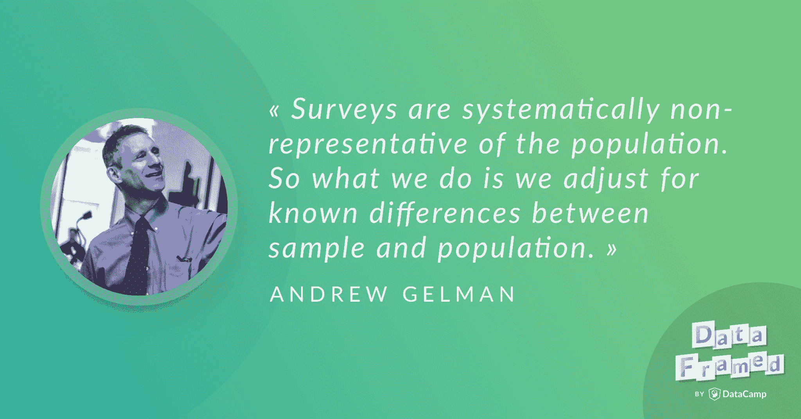

# 安德鲁·盖尔曼讨论选举预测和投票。(文字记录)

> 原文：<https://web.archive.org/web/20221129045010/https://www.datacamp.com/blog/andrew-gelman-discusses-election-forecasting-and-polling-transcript>

[https://web.archive.org/web/20220630231146if_/https://w.soundcloud.com/player/?url=https%3A//api.soundcloud.com/tracks/509583168%3Fsecret_token%3Ds-aSj38&color=%23ff5500&auto_play=false&hide_related=false&show_comments=true&show_user=true&show_reposts=false&show_teaser=true](https://web.archive.org/web/20220630231146if_/https://w.soundcloud.com/player/?url=https%3A//api.soundcloud.com/tracks/509583168%3Fsecret_token%3Ds-aSj38&color=%23ff5500&auto_play=false&hide_related=false&show_comments=true&show_user=true&show_reposts=false&show_teaser=true)

下面是播客[链接](https://web.archive.org/web/20220630231146/https://www.datacamp.com/community/podcast/election-forecasting-polling)。

## [介绍安德鲁·盖尔曼](https://web.archive.org/web/20220630231146/https://www.datacamp.com/community/podcast/election-forecasting-polling)

雨果:你好，安迪，欢迎来到 DataFramed。

安德鲁:你好。

雨果:很高兴你能来参加我们的节目，我很高兴今天你能来谈论投票和选举预测，但在此之前，我想先了解一下你的情况。我的第一个问题是，你在数据社区以什么闻名？

Andrew:什么是数据社区？

Hugo:我认为，数据社区是当今从事数据分析技术、数据科学和大型杂乱数据集工作的人的粗略广泛的集合。

安德鲁:我最出名的可能是《贝叶斯数据分析》一书的作者之一，这本书于 1995 年出版，但从那以后我们已经出版了两个版本。这是一本书，我喜欢把它看作是第一本应用贝叶斯统计的书。所以，很多研究贝叶斯统计的人都是通过我们的书，或者用这本书作为参考。

### 贝叶斯统计

雨果:太好了。也许你能告诉我们更多关于贝叶斯统计的一般知识，只是作为介绍。我想我们通常会讨论两种类型的统计，贝叶斯统计和频率统计，对吗？

安德鲁:所以，在贝叶斯统计中，所有的未知，所有的未知参数和预测都与概率分布相关联。所以你用贝叶斯推理解决问题的方法是，你把你所有的已知和所有的未知放入一个联合概率分布中，然后用概率定律，在已知的情况下，对未知做出陈述。

Hugo:所以，你实际上已经做了很多工作，用一种叫做 Stan 的语言实现了很多贝叶斯技术，对吗？事实上，在这种语言中，正如你提到的，概率分布是贝叶斯统计的核心对象。我想在 Stan 和其他所谓的概率编程语言中，分布是一等公民，对吗？

安德鲁:对。没错。所以，我可以给你一个简单的例子。假设你正在进行一项教育创新，你想在干预后看看学生的考试成绩。所以你从基本的统计学概念开始，你拟合一个线性回归模型，假设给定他们的预测试分数，预测测试分数，并给出他们是接受治疗还是控制的指标。这是回归，还不是贝叶斯。只是统计建模而已。

安德鲁:它会变得或多或少的困难，它会变得非线性，你可以控制更多的预测因素，不仅仅是你的前测，而是所有的学生特征。你可以做无数的事情。它之所以是贝叶斯，是因为这个回归模型有参数，比如治疗的效果，后测在多大程度上可以从前测中预测出来。有一些参数，比如你的方差有多大，分布的形状，等等。

安德鲁:所有这些参数都有一个概率分布。我们称之为先验分布。所以，你把这些和你的数据一起放入 Stan，然后它给你一个后验分布，代表你在看到数据后对参数的不确定性。

雨果:所以，贝叶斯数据分析和贝叶斯推理，我认为，从历史上看，我们已经看到它们非常强大，但可能还没有像贝叶斯人希望的那样被广泛采用。我认为很多学习者，很多学习数据科学和统计推断的人，可能会发现贝叶斯数据分析甚至有点可怕。首先，这是对的吗？第二，为什么会这样，我们如何纠正这种情况？

安德鲁:在贝叶斯统计中，你有点像在和魔鬼做交易。你假设一个概率模型，所以你做了一个大的假设，做了这个假设，你就可以对任何事情做出预测。所以，我认为，也许在某种程度上它有点可怕，因为它太强大了，太容易使用了，就像那些 3D 打印机一样，人们害怕它们，因为它们可以打印任何东西。因此，在贝叶斯统计中，即使你有弱数据，你也可以得到推论，然后推论由你的先验分布驱动。贝叶斯统计中有一句话，权力越大，责任越大。这意味着，在贝叶斯推理中，检查你的模型的适合度，检查你的模型的合理性是非常重要的。

安德鲁:从这个意义上说，有两种统计方法。一种方法是做出非常小的假设，另一种方法是做出最大的假设。贝叶斯方法实际上是你做出最大的假设。我想说的是，你创建一个从你的假设到你的结论的书面记录，然后如果你的结论没有意义，你会发现你的假设有什么问题。出问题的可能是你的数据模型。也许你的取样有偏差，你没有意识到这一点。但是，不管是什么，在你需要来回的地方，你需要在你的假设和结论之间进行交流。

安德鲁:很多人宁愿在没有假设的情况下工作，有时你可以，我们可以谈谈例子，但基本上，如果你有一个清晰的问题和良好的数据，那么你就不需要在大量假设的情况下工作，除非假设你有良好的数据。随着数据质量变得更差，随着你的问题变得更难回答，你需要加入更多的假设，然后贝叶斯推理变得更有用。

雨果:当然，你在文章中提到的一个很棒的事情是事后检查你的模型的能力，我们现在有足够的计算能力来做到这一点，对吗？例如，一旦我们有了模型，我们就可以模拟数据的真实情况，并与我们实际看到的数据进行比较。

安德鲁:没错。我们称之为后验预测检验。人们已经这样做了很长一段时间，他们只是没有在那个名字下。统计学家弗雷德里克·莫斯特勒(Frederick Mosteller)在 20 世纪 50 年代写了一本书，他们在书中分析了一个实验的数据，这个实验被称为随机学习实验，他们实际上是给笼子里的狗电击，然后观察狗用了多长时间才知道电击即将到来。因此，他们有这个概率模型，然后在拟合模型后，他们模拟假数据，并将假数据与真实数据进行比较。

Andrew:在 20 世纪 70 年代，统计学家 Brian Ripley 从事空间统计工作，他因为参与 R 而变得非常有名，Brian Ripley 拟合空间模型，并再次做了同样的事情。他有一个似乎有点合理的模型，他从模型中刺激复制的数据，它看起来不像真实的数据，这启发了他扩展他的模型。所以，正是这样的例子促使我们将模型检查的想法形式化。我认为人们总是检查他们的模型，但是有一种感觉是它已经在系统之外了。这并不是说人们不好意思检查他们的模型，而是人们几乎会想，“我是个好人。我是一个好公民。所以，我检查我的模型。”它还没有被正式包含到统计学中，在贝叶斯框架中，你可以做到这一点。您可以将模型检查放在过程的中间，而不会感觉到它是您正在做的一些外部事情。

Hugo:我很高兴你提到了这个原因，这是我的下一个观点，它实际上融入了贝叶斯工作流，即模型检查的思想。

安德鲁:是的。

雨果:这就是贝叶斯数据分析。在数据社区中，您还有其他什么出名的事情吗？

安德鲁:我想说的是，我因统计图表而闻名，因为在 21 世纪初，我做了大量工作，试图将统计图表与统计分析相结合。因此，传统上，有这样一种想法，探索性数据分析是看着你的数据，发现有趣的模式。验证性数据分析就像处理数字，得到你的 p 值。探索性的数据分析，又一次，在统计学之外。它的支持者经常会说，“忘记所有这些愚蠢的建模东西，让我们直接看数据吧。”

安德鲁:但是，有趣的是，如果你仔细思考，探索性数据分析会发现意想不到的东西。所以，说我发现了意想不到的东西，是相对于预期的。事实上，当探索性分析与模型联系在一起时，它是最强大的。所以，我认为探索性的数据分析和统计图表，以及从可视化的数据中学习新事物，实际上非常适合贝叶斯推理和正式的统计建模。因为你符合模型，你的模型越好，你从它的伪造中学到的就越多。

安德鲁:那么，很久以前，哥白尼就有了行星围绕太阳做圆形轨道运行的模型，这很容易被证伪。但是后来，开普勒转到了椭圆轨道，所以伪造变得更加有趣，等等。所以，每次我们有了一个模型，就会激发更复杂的图形，让我们学到更多。

### 你是如何进入数据科学和统计学领域的？

Hugo:那么，你最初是如何进入数据科学和统计学领域的？

安德鲁:我从小就擅长数学，实际上我写过这方面的文章，不过我上高中时参加了数学奥林匹克培训项目，我发现有人比我更擅长数学。那时我们有一个非常天真的观点，所以我们不知道应用数学，我们只知道这个叫做数学的东西，我们认为能力是一维的。但无论如何，我去了大学，学习物理和数学，我不想成为一个纯粹的理论家。我只是觉得我不够好，不能以那种方式做出有用的贡献。我第一次上概率课是因为它是在晚上，这符合我的时间表。

安德鲁:所以，我学了概率和随机过程，然后学了统计学，我非常喜欢。在统计学中，我关心的每件事之间都有某种连续的联系。所以，在我能做的事情之间有一种联系，比如数学，还有政治，公共卫生，经济学，社会学，所有这些事情。从这些关于我们国家正在发生的事情，世界正在发生的事情，人们如何学习，所有类似的事情，通过定性思考，统计建模，数学分析，编程，所有这些事情的定性思考中，有一种连续的线索。所以，它对我来说非常完美。

安德鲁:我有时认为统计学应该被称为数学工程。他们有电子工程和机械工程，统计学是数学工程。

雨果:我喜欢这一点，你在这里暗示或直接谈到的是，这是你的才能和数学技能的结合，也是你对政治和社会科学的浓厚兴趣。

安德鲁:对。在大学里，我辅修了政治学，所以我觉得这很有趣。政治学是一个有趣的领域，因为你不会像在技术领域那样取得进步。你可以说从技术上来说，我们可以做各种各样高斯做不到的事情，无论如何，我相信当他看到它的时候，他可以弄明白，但是我们只是知道他们不知道的东西。在政治中，我们知道哪些霍布斯不知道的事情？嗯，很难说。很多具体的东西，比如在职优势的大小等等，但是有一点不同。更像是建筑之类的东西。我们现在有建筑，但你只是建造服务于当前目的的东西，那么也许技术的原理会改变。但是总的原则没有改变。

## 数据科学和统计学作为学科面临的最大挑战是什么？

Hugo:所以，在我们开始投票和选举预测之前，我想更概括地谈谈数据科学和统计学。我只是在想，现在是 2018 年，从现在开始往前走，你认为数据科学和统计学作为学科面临的最大挑战是什么？

安德鲁:一般来说，我认为统计推断有三个挑战。第一个是从样本到总体的推广，这是一个与调查抽样相关的问题，但实际上几乎在统计推断的每个应用中都出现。人们有时会说，“等等，我有 50 个州的数据。这就是人口。我们不会很快拥有第 51 个州。”即使这样，我也会回答，“好吧，你有去年和过去 10 年的 50 个州的数据，你感兴趣的是明年的 50 个州。”所以，总会有一些概括。所以，统计抽样的想法总是会出现。

安德鲁:统计学的第二个基本挑战是从对照组推广到治疗组。很多时候，我们感兴趣的是一些治疗或干预的效果，显然是像药物、教育干预或商业决策这样的事情，但也有各种社会科学的东西。每当你问为什么事情会发生，你就是在含蓄地问如果我改变一些事情会发生什么。除了极少数例外，我们没有匹配的对照组和治疗组。通常情况下，你可以做些什么的人与没有接受治疗的人是不同的，因此需要做出一些调整。

Andrew:第三个是从观察到的测量结果归纳到感兴趣的潜在结构。所以，这在教育测试中最为明显。你想知道能力，但你得到的是考试分数。所以，我们花很多时间设计仪器，设计调查问题，实验室测量。Theranos 公司的那些人，那些欺诈性的验血人员，他们所做的一切都是为了测量。所以，当你谈到挑战时，我认为那些是旧的挑战，它们仍然是新的挑战。大数据往往是杂乱的数据。所以，这不是一个随机样本，这是一个便利样本，这是一个选择加入的样本。你没有控制和治疗小组，人们选择他们自己的决定去做什么。通常，你没有对你所关心的东西进行仔细的测量，你通常只是从另一个来源获得数据，你试图适应这些数据。

安德鲁:因此，如果你想得到好的预测和合理的答案，并学习，你需要调整样本和总体之间的差异。你需要调整对照组和治疗组之间的差异，你需要建立你所关心的和你所测量的之间的联系。所有这些都需要大量的建模工作，因此，我们通常会说，你要么得到好的数据，要么得到好的模型，要么两者兼而有之。你必须做一点数据，一点工作，你必须做数据收集的工作，你还必须做模型的工作。因此，如果你有大数据，你需要大模型，那么这将需要大量的计算，这将是昂贵的。所以，你需要算法来拟合模型，近似拟合模型。我们这边有些好东西。例如，当你得到大量数据时，你的推论通常会变得更稳定，它们不一定会收敛到正确的答案，但事情可能看起来更正态分布，这来自中心极限定理。所以，这表明当你有大量数据时，某些统计方法，某些近似法可能会很有效。这很好，因为当你有很多数据时，你就更需要近似值。因此，有很多这样的事情，在应用和研究议程之间移动，但研究是为了适应这些大模型并理解它们，这将继续是一个挑战。

雨果:所以，这些都是非常重要的观点，我们实际上会通过民意调查和选举预测的镜头看到更多的关注。在我们到达那里之前，这个统计推断和统计建模的想法，我想知道怎样才能成为那个对话的一部分。我想，我的问题是，作为人类，我们不一定有良好的统计直觉，我想知道，作为一名教育工作者和统计学家，你希望看到一般人群的统计和数据素养发生变化吗？

安德鲁:看待这个问题有不同的方式。其中一些是程序性的。所以，如果有一个期望，当你有一个分析，你把你的数据放在 GitHub 上，你把你的分析放在 GitHub 上，它都是可复制的，我认为这将有所帮助。这不会让人们的分析更好，但会让人们更容易看到哪里出了问题。令人惊讶的是，让人们说出或写出他们到底做了什么非常困难。我在学生中发现了这一点，但即使是我也曾在咨询环境中遇到过，那里可能有另一方的专家，他们进行分析，并写下他们的分析，但你无法理解他们做了什么。他们会从教科书上复印三页，然后说，“我们做到了。”他们也不说他们的数据从何而来。我开始意识到很多人甚至不知道他们做了什么。人们没有工作流程，他们只有一堆数字，他们开始摆弄这些数字，在电子表格的不同位置进行计算，然后在最后，他们拿出一个数字，写下来，输入到他们的报告中。所以，那个著名的例子，莱因哈特和罗格夫在几年前的经济学论文中犯了错误，但是许多发表的期刊文章不仅结果没有重复，而且人们回到文章中发现论文中的数字甚至与他们自己不一致。例如，他们会说有一定数量的情况，然后他们会有一个百分比，但该百分比与分母的任何比率都不对应，或者他们有估计值、标准误差和 Z 分数，但它们不对应同一事物。

安德鲁:我刚刚开始意识到人们根本没有工作流程。需要一个工作流程会有所帮助。说到理解，你可能在小时候就听说过，如果你在数学问题上有困难，在它前面放一个美元符号，然后不知何故就很难相差几个数量级。心理学家，如 Gerd Gigerenzer 和其他人，已经做了大量的工作来理解我们的认知错觉以及我们如何解决这些问题。一个想法是从概率走向频率。

安德鲁:所以，有一些经典的概率问题，比如有一种疾病，1%的人患有这种疾病，你做了一个测试，对这种疾病的测试有 98%的准确率，有人测试呈阳性，他们患有这种疾病的可能性有多大？很难在头脑中做到这一点。但是，你可以想象你有一个礼堂，里面有 1000 人，我刚刚告诉你 1%的人患有这种疾病，想象一下礼堂前排有 10 个人。他们是有疾病的人。其他的 990 没有。现在我们要做一个准确率为 98%的测试。这很难，因为你必须做 10 个人中的 98%，所以你需要更多的人数。

安德鲁:让我换个说法，假设它有 90%的准确率，只是为了保持代数简单。这项测试有 90%的准确率。那么，你看第一排的 10 个人，他们中的 9 个测试呈阳性，其中一个测试呈阴性，你看另外的 990 个人，他们中的 99 个会意外地测试呈阳性，那是 10%，然后其他人会呈阴性。如果你让所有测试呈阳性的人举手，你会看到我们有 9 个测试呈阳性的病人和 99 个测试呈阳性的健康人。所以，大多数测试呈阳性的人都是健康的。所以，令人惊奇的是，我可以通过在脑子里说话来做到这一切，但我不能解决我脑子里的第一个问题。你可以说，嗯，但是我不得不摆弄这些数字，因为 98%的数字都不工作，但是这就是问题的关键。如果你有百分之一的疾病，测试有百分之九十八的准确率，你真的不能通过思考一千个人来解决问题。你需要更多的人口。所以，我们可以想象一个有一百万人口的城市，现在，百分之一，一万人患有这种疾病，我特意讲这个来证明你可以做到。1 万人有这种病，99 万人没有。你可以把它写下来，但是你可以在脑子里试一试。那么，在这一万名患病者中，98%的人，也就是 200 人。

安德鲁:所以，我可以稍微改变一下数字，我可以用不同的方式来做，但关键是有了分母就更容易形象化，它让所有的数字更有意义。所以，吉杰伦泽的观点是，分母总是存在的，而且分母确实很重要。对 10 个人发生 10%的事情和对 1 万个人发生 10%的事情是有区别的。这是一种不同的现象。概率论很棒，所以答案是有很多方法可以更好地理解概率，从频率的角度来思考。

## 选举预测

雨果:这是我们在选举预测中实际看到的东西，所以这将是一个很好的结局。我知道 538 和内特·西尔弗的众议院模型，他们不会说我们预测民主党有 75%的机会获得众议院，他们会说四分之三的机会，因为他们觉得，启发式地，这有助于人们更好地将其正式化。他们知道四分之一的共和党人会得到，四分之三的民主党人会得到。然后你甚至可以用这些术语来思考四分之一是什么意思。这是连续出现两个头像的频率，如果发生这种情况，你不会感到惊讶，对吗？

安德鲁:哦，当然，这以前发生过，我可以告诉你一个关于内特的故事，但是首先，在 2016 年大选之前，有人说，“那么这个预测呢？”有些模型认为克林顿有 90%的胜算。嗯，百分之九十，你是怎么想的？我说，“每四年有一次总统选举。10%意味着大约每 10 次选举就会发生一次，也就是每 40 年一次。

安德鲁:我记得大约 40 年前，在 1980 年的选举中，本来应该是非常接近的，但后来又相差了 7 个百分点。所以，这是一个很大的惊喜。所以，是的，我认为这是可能的。当然可以。实际上，克林顿的表现非常接近她的民意调查，她应该得到两党 52%的选票，而她得到了 51%。所以，现在的民意调查更好，在某些方面，现在的预测比 1980 年更好。但是，我就是这样校准十分之一的。作为一名政治科学家，我经常说我不喜欢 95%的区间。因为 95%的区间在 20 次总统选举中有 19 次是正确的，而这 20 次总统选举耗时 80 年。我认为试图做出一个在 80 年内都有效的声明是荒谬的，因为政治在 80 年内都会发生变化。

安德鲁:现在，我关于内特的故事是在 2012 年，他四处走动，他说，“奥巴马有 65.8%的机会连任”，然后下周他会说是 63.2%，然后是 67.1%，它会四处跳跃。毫无意义。你可以说他有 60%的机会，但要说 65.1%，你可以做一点数学计算。你能做的就是说让我们预测一下他的投票份额。让我们假设他预计会获得 52%或 53%的选票，这是不确定的。你有一个小小的钟形曲线，如果它小于 50 %,让我们暂时忘记选举团，这不是我们真正关心的。关键是，如果他的选举人票预计少于 50%，那么他就会输，否则他就会赢。

安德鲁:让我们假设你说概率是 65.8%。这将对应于一个特定的钟形曲线，他的预期票数和不确定性。结果是，如果你想把这个比例从 65%提高到 66%，那就相当于把他的预测投票比例从 52%提高到 52.01%，我记不清具体数字了。诸如此类的小事。所以，这是一个没有意义的数字。这就像说斯蒂芬·库里身高 6 英尺 3.81724 英寸。

安德鲁:所以，我接了内特的案子，我说，“我明白，内特，你想，你需要眼球。你每周都需要新闻。消息不多。预计奥巴马会赢，但他可能不会。每周，奥巴马都领先，但他可能会输。这就是我们所知道的。这很难，创造新闻的一种方式是关注这些噪音波动。”所以，如果他转而说四分之三的机会，我认为这是一件好事。他可能会因此失去一些点击量，但我多年来一直钦佩内特的一点是他的正直。我不认为他会希望人们被噪音愚弄。所以，他这样做是一件非常好的事情。

### 什么是轮询？

雨果:那么，我们来谈谈投票吧。投票通常被认为与选举预测有关。我想知道什么是投票，更一般地说，它能告诉我们什么类型的事情。

安德鲁:调查抽样就是当你想从一个部分了解整体的时候。血液测试就像一个调查样本。他们取了你的血样，这应该是你血液的代表。如果我在街上采访人们，问他们将如何投票，那应该是代表了一般人群。嗯，可能不是。他们随机拨号，这是人口的一种代表，除了不是每个人都接电话。实际上，大多数人都不接电话。所以，它根本不能代表人口。

安德鲁:我在课堂上说我认为做民意调查而不给人报酬是有点不道德的。你做一个调查，你从你的调查中赚钱，很多民意调查者都这样做。在线调查小组付钱给人们，但你的很多电话调查只是给人们打电话，你这样做有点滥用人们的善意。然后有人说，“但是，那种只会参与你付钱的调查的人呢？他们不具有代表性吗？”我说:“你认为什么样的人会免费参加调查？他们有点奇怪，是吧？大多数人不会。大多数人会挂掉民意测验专家的电话。”所以，调查对象不具有代表性。

安德鲁:我们做了很多工作来调整样本以适应总体。我们需要这样做，因为回复率很低。但是，无论如何，这不仅仅是选举投票，这可能是公众意见，血液测试，这可能是企业，他们审计自己的记录，如果他们想做审计，他们会随机抽取记录样本，然后审计随机样本，并使用它来得出关于整个企业的结论等等。

Hugo:所以，在我们更详细地讨论投票之前，我想知道，你能告诉我们投票为什么如此重要吗？

安德鲁:嗯，乔治·盖洛普，他是民意调查的创始人，写了很多关于这个的东西。他认为投票有利于民主。有两种说法。伟大的棒球分析师比尔·詹姆斯曾经说过这样的话，“好的统计数据的替代品不是没有统计数据，而是坏的统计数据。”他认为有些棒球运动员被高估了，然后他引用了一些体育作家的话，“这个比尔·詹姆斯·克朗彻什么都不知道。这面糊太棒了。他有 300 个，所有这些时间，他得到了所有这些……”比尔·詹姆斯指出，让我们看看体育作家是怎么说的。他有什么证据证明这个人是如此伟大的运动员？这是一堆统计数据。他只是天真地使用统计数据，但这家伙不是定性先生，他开始谈论棒球运动员如何达到 300。

安德鲁:现在，类似地，假设你是一名立法者，你想了解公众意见。我觉得，第一，舆论相关。我们并不总是喜欢政客们过多地追随公众意见，但我认为我们喜欢他们了解公众意见。所以，如果他们没有民意测验，他们会怎么做？他们很可能会进行非正式的民意调查。溃疡。这过度代表了某些类型的人。这并不代表他们很难接触到的人。盖洛普的观点是，民主最终是建立在民意基础上的，在两次选举之间了解民意很重要。出现了很多问题，这应该会让政治家们做得更好，这在我看来是合理的。

安德鲁:当然，除此之外，调查在市场营销中一直被使用。所以，商务人士不必为想知道客户想要什么而道歉。所以，这样做是有意义的。营销调查非常有趣，部分原因是你会陷入这样一个问题，即把观察到的测量结果与你真正关心的事情联系起来，因为营销调查有多现实？所以，如果我给你打电话说，“你愿意为这种电动汽车支付 3 万美元吗？”你可以说是或不是，这并不意味着它真的会走出展厅，因为调查是不现实的。

安德鲁:政治调查更容易一些。你打算投谁的票？这几乎等同于在该死的投票站投票。因此，政治调查的真实性比某些市场调查的真实性更接近。

雨果:我不知道这种情况持续了多久，但我们肯定看到了民意调查的影响...在政治、投票和选举过程中有一个反馈回路。我想是的，初选，辩论，你在台上的位置，你是否在辩论中，实际上取决于你在民意调查中的表现，对吗？

安德鲁:对，还有唐纳德·特朗普，当他在初选中发表演讲时，他会谈论他的民调支持率有多高。

雨果:直到他们不是，然后他说他们不科学。

安德鲁:嗯，是的，但我不是在说他的支持率，而是说他们会投票给他的人的百分比。因此，即使外界观察者似乎没有给他太多机会，他的支持率还是很高。所以，是的，有反馈。我就说一件事，有一个有用的反馈，至少对民意调查者来说是这样的。有时问题出现了，为什么人们要对民意调查者说实话？有时你会得到，权威人士会说，“嘿，让我们都对民意测验专家撒谎。让我们搞砸他们。我不喜欢民意测验专家。告诉他们你所想的反面。”然而，人们不会这样做。这有几个原因。

安德鲁:首先，正如我所说的，民意调查是自愿的。没有人强迫你做民意调查。所以，如果你真的讨厌民意测验专家，很可能你一开始就懒得去做。但第二件事是，我认为人们认为民意测验就像一种投票方式。那么，如果我调查你，你对唐纳德·特朗普的工作表现满意吗？你认为这可能会在某个地方出现在新闻中，你会受到激励:如果你同意，你会受到激励说是，如果你不同意，你会受到激励说不。在你的回答中有一个真诚的直接激励。同样，并非所有的调查都是如此。如果我问你，你服用违禁药物吗？你可能有各种动机不诚实地回答这个问题。

雨果:我也不能在直播中回答这个问题。

安德鲁:嗯，这是不对称的。如果你的答案是否定的，你可以回答，如果你愿意，你可以在节目中回答，我不是在问你。我只是说这很复杂。所以，关于政治民意测验，有一点并不总是很好理解，那就是激励机制实际上是为了鼓励调查回应的真诚性。那是非常重要的。

## 舆论存在吗？

Hugo:现在，你提到的另一件事，我想简单谈一下，就是民意调查的想法，衡量公众意见，这更多的是在唱反调，而不一定是故意刁难。我只是在想，公众意见通常是在普通大众中普遍存在的观点。公众舆论存在吗？

安德鲁:这就像海森堡的测不准原理。所以，衡量观点就是改变它。你知道如何测量一个粒子的位置，你必须看着它，看着它意味着从它身上反弹一个轻粒子，这增加了能量，它改变了它的位置和动量？因此，类似地，如果你想知道某人的想法，你必须问他们，然后改变它。你并不总能观察到他们的行为。还有其他方法。

安德鲁:我有一个学院，马特·萨尔加尼奇，他是普林斯顿的社会学家，他最近写了一本关于社会科学数据收集的书，他谈到了...你可以调查人们，可以询问他们，也可以观察他们。那些是不同的。有时候，你可以观察一个人，但这不会改变他的行为。亚马逊可以查看你是如何购买的。可以说，一旦你知道亚马逊正在寻找，那么你可能不会购买某些东西或不搜索某些东西，因为你不想让他们知道。在那之前，你可以观察他们。

安德鲁:同样，你公寓外面的摄像头。如果你不知道它在那里，那么它正在很好地观察你。因此，在这个意义上，如果你认为我们被衡量，我们就像是在和那些试图衡量我们的社会科学家玩一场猫捉老鼠的游戏。他们试图用不打扰我们的方式来衡量我们，我们可能想知道我们是如何被衡量的。

Hugo:现在我想直接进入投票环节，这是大家都知道的。我要引用你的话，因为你在 Slate 杂志的一篇文章中说得很好，我将在节目笔记中链接到你的文章。你写道，“传统民调的统计理论令人惊叹。理论上，一千人的随机样本足以在正负三个百分点的误差范围内估计民意。”你能告诉我们这到底是什么意思吗？

安德鲁:这是从瓮中取球的数学方法。所以，如果你有一个装满球的大瓮，55%的球是绿色的，45%是黄色的，你随机画一个球一千次，那么最有可能的是，你会得到 52%到 58%的绿色球。所以，它是瓮中的 55 %,你画一千个，每次你画一个球，把它扔回瓮中，然后洗牌，再画一个，然后概率数学告诉你，你最可能看到的是 55%的绿色球，但也可能是 52%到 58%之间。大概有 95%的可能性在这个范围内。所以，我们称之为误差幅度。如果你真的可以对人们进行采样，比如从瓮中抽取，你就可以非常准确地了解公众舆论。

雨果:但是，当然，这是理论上的，对吗？该理论的一部分是它是一个随机的代表性样本。我想知道与这个理论相关的实际问题和挑战是什么。

安德鲁:实际上，你不能从骨灰盒中随机抽取人，因为没有人的名单。你可以随意拨打电话号码，不是每个人都有电话，有些人有两部电话，有些人从来不接电话，等等。此外，如果你画一个球，你可以在骨灰盒模型中看到它，但是，当你对人们进行抽样调查时，你画一个球，如果他们不想回答你的调查呢？那你就看不到了。

安德鲁:所以，我们的调查在总体上不具有代表性。所以，我们要做的是调整样本和总体之间的已知差异。所以，我们的人口中有 52%是女性，但是我们的调查中有 60%是女性，我们对此进行了调整。我们的调查得到了太多的老年人，太多的白人，太多来自一些州的人，而不是其他州的人。不同的调查有不同的偏向。有人告诉我，出口民调倾向于过度抽样民主党人，也许这与谁愿意与出口民调采访者交谈有关。愿意接电话的那种人可能不一样。

安德鲁:然后，另一件事是你需要担心得到诚实的回答或调整调查回答中的不准确性，就像我说的，这对于政治投票来说不是一个问题，但在其他调查中也会出现。

雨果:我对给人们打电话的想法很感兴趣，因为从传统上来说，很多人都有固定电话，你可以这样做。现在已经不是这样了，我的理解是，有法律规定你不能自动拨打手机，对吗？

安德鲁:我不知道关于你能做什么和不能做什么的法律到底是什么。这只是一扇窗户。当盖洛普开始做民意调查时，他们会挨家挨户敲门，因为那时很多人没有电话。所以，有一段时间很多人都有电话。在其他国家，也不是每个人都有电话。但是，再说一遍，即使你可以打电话给所有人，那又怎么样？回答者不代表人口。

Hugo:所以，调整过程也是非常关键的。

安德鲁:对，两者都有。你必须设法得到一个有代表性的样本，即使你不会得到它，因为你希望你的偏见是可纠正的。所以，如果我的偏见是我有太多的女人，我可以纠正。还是老人太多。如果我的偏见是我有太多的保守派，我能纠正吗？嗯，也许因为你可以问人们他们的党派归属，然后你可以把它与人们的党派登记数据进行匹配。这是更多的工作，对不对？如果我问的是医疗保健，而我的偏见是有健康问题的人更有可能回答调查。我能调整一下吗？嗯，那可能更难。

安德鲁:所以，即使你不能到达那里，也要努力获得完美的样本，以此为目标，这是有意义的。

Hugo:这些修正和调整方法在统计学上相对复杂吗？

安德鲁:随着我们的数据变得越来越糟糕，他们变得越来越复杂。所以，简而言之，他们需要变得更复杂有三个原因。一个是调整不准确的回答，但正如我所说的，我不会真的专注于此。其次是样本和总体之间的差异。你要适应很多因素，不仅仅是性别、年龄、种族、党派身份，还有很多因素。所以，当你想调整更多的东西，那么简单的调整方法，简单的加权方法，不要做这个工作。我们使用一种叫做多水平回归和后分层的方法，还有其他的方法，但是你需要更多的技巧来调整更多的变量。

安德鲁:然后，第三件事是我们从调查中问得更多。因此，我们可能不仅想知道公众的意见，不仅想知道人们是否愿意投票给他们的民主党人或共和党人，还想知道这种投票在所有 435 个国会选区中是如何分布的？所以，即使我有大数据，我也不一定有每个国会选区的大样本。所以，你想做统计分析来得到那些更集中的推论。所以，这就是为什么我和我的同事花了很大力气来模拟调查结果，以便能够估计人口的子群体，比如不同州的富人选民和穷人选民。

雨果:太棒了。据我所知，你的工作是跳出框框思考，如何让人们参与调查，这是一个无意的双关语，但是，因为你实际上使用了游戏技术和 box 来获得调查反馈，对吗？

安德鲁:是的，我在纽约微软研究院的同事做过。微软研究院有一些社会科学家和我的同事 David Rothschild 和 Sharad Goel，他们当时在那里工作，设计了一个调查，所以他们说服微软的人在 2012 年总统选举的最后几个月在 Xbox 上放一些东西，让人们投票并说出他们想投谁的票。所以，每隔一段时间，你就会收到提醒，说你愿意参加我们的投票吗？然后你会给出一些统计数据，说你想投谁的票。我们有一个巨大的样本量，几十万个回答，非常没有代表性。

安德鲁:这是一项不寻常的调查，因为它过多地代表了年轻男性，而大多数调查都过多地代表了老年女性。但经过调整后，首先我们能够很好地估计公众意见，事实上，我们能够比公众民调聚合器更稳定地估计公众意见。这是好消息。坏消息是，我们在 2012 年收集了数据，实际上我们直到后来才进行分析。因此，理论上，它可以实时完成，但实际上，这是一个研究项目，我们后来发表了它。

安德鲁:所以，当它发生的时候，我们没有击败民意调查。不仅如此，我们实际上还学到了一些政治学和公共舆论的知识。正如我所说的，我们的估计比报纸和网上的民意调查综合估计更稳定更好，结果是民意调查中大约三分之二的变化，像罗姆尼做得很好，或者奥巴马做得很好的波动，这些波动，大约三分之二的波动实际上是由于不同的无反应。因此，当罗姆尼有一些好消息时，共和党人更有可能回答这个调查。有道理，对吧？你想参加民意调查吗？如果我的候选人是个笑柄，也许不是。如果我的候选人做得很好，是的。

安德鲁:所以，有这个正反馈机制...负反馈稳定，正反馈放大波动。因此，一个积极的反馈机制是，如果一个候选人做得很好，更多的支持者会对投票做出回应，这意味着他们看起来做得更好。所以，你每周都会有很大的波动，但是当你真的考虑到党派偏见时，你会发现结果要稳定得多。我们发现在 2016 年。你可能会说，嗯，也许人们的党派偏见也在波动，但我们有证据表明那并没有真正发生。当我们写论文时，有各种各样的遗留问题和项目，所有这些都来自于与微软这些人的合作。

雨果:我很高兴你提到了 2016 年，因为，正如你之前所说的，大众投票，民意调查做得很好，在百分之一以内，对吗？民意测验专家说是 52 而不是 51。但是，当然，在选举团投票中，情况相对不同，我认为你写的一些东西可能是因为在几个关键州，投票给特朗普的人不一定在投票中做出回应。是这样还是我记错了？

安德鲁:没有回应的人太多了，问题更多的是州民调，而不是全国民调。也就是说，有一些人，在选举后，一些民意测验专家，加里·兰格和他的一些同事写了一篇论文，他们按州分析了他们的全国民意测验，他们实际上发现州一级的全国民意测验分析相差不远。但是，在密歇根州和其他州的一些州民意调查，没有做好足够的工作来调整无回应，所以它似乎。发生了很多事情，但部分原因是无反应调整并不完全。这是一个问题。调查回复率持续下降，因此原始调查数据，甚至是稍加调整的调查数据，并不总是足够的。

雨果:在我之前提到的同一篇 Slate 文章中，你还写道，“我们不应该把注意力集中在选举上，而应该把民意调查和公众意见更多地看作是理解政策的一个连续过程。”我觉得这很有吸引力，我只是想知道你是否能阐明这一点，并告诉我你的意思是什么？

安德鲁:嗯，我认为这在奥巴马政府中尤其明显，有各种各样的问题，如刺激计划、医疗保健计划，公众意见似乎非常重要。双方都在聚集公众舆论，以影响国会中某些摇摆不定的选票。现在就没那么好了。现在，这就像共和党人控制了众议院、参议院、总统和最高法院，所以，该做什么取决于他们。公众舆论似乎并没有直接影响事情。他们似乎愿意做各种不受欢迎的事情来利用他们所拥有的多数。

安德鲁:但是，大多数时候，政治是在立法层面上的，更多的是事务性的。有摇摆不定的选民，当然，如果一个政党控制了众议院，一个政党控制了参议院，那么你就会得到更多的权力给各种摇摆不定的选民。在这一点上，公众舆论可以有所作为。所以，这不仅仅是你要投票给谁的问题，而是人们一旦就职后会如何投票的问题。因此，民意调查者在整个过程中都会对公众意见感兴趣，因为这不仅仅是关于你打算投票给谁，而是关于你对各种问题的看法，无论是外交政策、医疗保健、移民、贸易还是其他。

### 党派忠诚是如何发挥作用的？

雨果:那么政党忠诚在其中扮演了怎样的角色呢？

安德鲁:哦，政党忠诚度非常重要，有很多证据表明选民会根据他们政党的言论改变立场。如果你看看像支持战争这样的事情，基于执政党有很大的跳跃。如果你是一个民主党人，那么你会支持共和党人不会支持的政策，反之亦然。或者事物是如何被标记的。就像经济学家说的，这是外来的。民意调查者在衡量意见，但与此同时，政治家们也在试图利用这些意见。

安德鲁:我的同事，政治科学系的鲍勃·夏皮罗，他和一位同事写了一本名为《政治家不要迎合》的书，这本书是基于他对各种政治斗争的研究，不是选举，而是立法斗争。他认为政治家认为公众舆论是一种工具...有一种天真的观点认为政客们想做公众想做的事情，但实际上政客们通常非常自信，他们觉得他们可以左右选民，他们认为公众舆论是他们可以操纵的。所以，双方都在做。就个别国会议员和参议员的参与程度而言，你还需要了解当地的公众意见，而不仅仅是全国的。

## 投票的未来是什么？

Hugo:那么，Andy，你认为投票的未来是什么样的？

安德鲁:我对未来没有太大的感觉，如果你从传统的角度来看，你会说更低的回应率是未来，付钱让人参与，在线小组。我想，也许，总的来说，我们应该把对调查做出回应的人看作更多的参与者，就像医学统计学一样。我们不应该认为我们在测量人，评估药物的效果，而人只是被移动的计数器，我们应该实际上认为病人参与了研究，真正地参与了进来。不仅仅是因为你想得到更多的服从，还因为人们有很多私人知识可以分享，如果他们有更多的联系，人们应该更有动力去帮助。

安德鲁:所以，对我来说，未来将是一个更加合作的时代。另一方面，会有很多被动的测量，比如亚马逊测量你的点击量。这也像投票一样。所以，那是从相反的方向。所以，或者，如果它是侵扰性的，我认为人们应该更多地参与进来，或者它根本就不是侵扰性的。

## 最受欢迎的数据科学技术

Hugo:那么，Andrew，我的最后一个问题是，你最喜欢的数据科学和统计技术或方法是什么？

安德鲁:我最喜欢的事情是我从没做过的事情，但我读到过。大概是 10 年前，有人造了一台机器，你可以把它放在某人的办公室里，然后，如果他们在打字，10 分钟后它就可以成为键盘记录器。据推测，它是如何工作的，你的键盘上大约有一百个键，所以它会听声音，并使用某种分类算法将这些键的声音分类成一百个簇，然后，完成后，它会使用简单的代码破译技术来估计哪个是空格键，哪个是回车，哪个是字母 E，等等。当然，它不必是完美的，你可以使用统计工具，然后它可以计算出你在键入什么。

安德鲁:所以，我一直想建造它。现在，那种东西我不知道如何建立，它还涉及到有一个麦克风和做声音分析。我只是觉得那会很酷。这些事情非常贝叶斯，你使用了很多先验信息，尤其是第二步，密码破解步骤。当然，艾伦·图灵在二战中用贝叶斯方法破解了英格玛密码。这是我最喜欢的例子，尽管我从未见过。我只是觉得这是最酷的。不过，这不是我能做的事。

安德鲁:如果你想谈论我能做的事情，那么我最喜欢的技术是多级回归和后分层，因为这是我们用来评估州级公众意见的方法。这就是我们在红州、蓝州做的调查，以及对美国不同地区不同收入人群的看法的评估。它允许我们尽最大努力调整样本和总体之间的差异。我们可以在斯坦做。所以，我会推那个。

雨果:太好了。所以，多层回归和后分层，我们会在展示笔记中包括一些链接。它也被称为 MRP 或 P 先生，对吗？

安德鲁:没错。最近我开始称之为正则化预测和后分层，因为严格来说，它是模块化的。所以，第一部分是你拟合一个模型来做调整，第二部分是做了这些之后，你对人群做推论，这叫做后分层。因此，多级回归是建立模型的一种方式，但通常情况下，您可以使用术语正则化预测，其中包括所有其他方法。

雨果:很高兴你能来参加这个节目。

安德鲁:我也是。