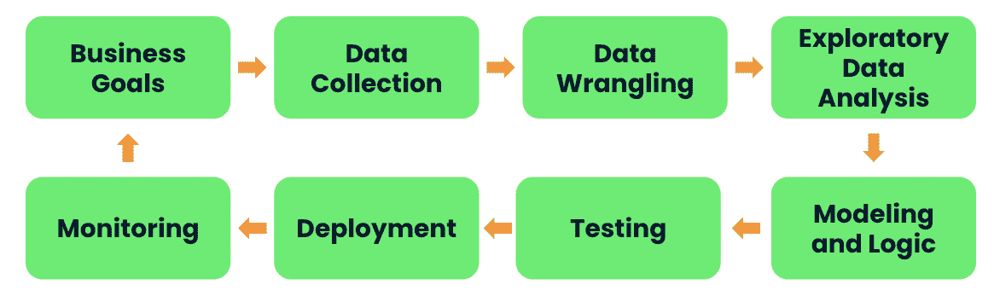

# 申请数据科学工作以及如何让自己脱颖而出

> 原文：<https://web.archive.org/web/20221129044127/https://www.datacamp.com/blog/applying-for-data-science-jobs-and-how-to-set-yourself-apart>

## 介绍

2012 年，[《哈佛商业评论》将数据科学家评为 21 世纪最性感的工作](https://web.archive.org/web/20221221030718/https://hbr.org/2012/10/data-scientist-the-sexiest-job-of-the-21st-century)。十年后，尽管出现了 AutoML 平台(如 AWS Redshift ML 和 Google Cloud AutoML)以及疫情时代的放缓，数据科学家仍然是最受欢迎的角色之一。事实上，数据科学家是科技行业薪酬最高的职位[，平均年薪为 15 万美元](https://web.archive.org/web/20221221030718/https://www.hiringlab.org/2018/03/15/data-science-job-postings-growing-quickly)。

尽管他们的具体职责可能因行业和公司而异，但大多数数据科学家都肩负着帮助组织从数据中创造价值的使命。他们通过探索大量数据中的模式和趋势，将结果传达给广泛的利益相关者，并建立和维护模型以实现自动化决策来实现这一点。因此，成为一名数据科学家需要一套独特、多样化的技能，涵盖统计、编码、商业意识和沟通，所有这些都将通过一系列面试问题和带回家的挑战来展示。

在这篇博客文章中，我们想从申请人和面试官的角度分享一些技巧，以帮助你在数据科学家面试中脱颖而出，获得你梦想中的工作。

## 秘诀 1:熟悉这个角色和公司

如上所述，“数据科学家”是一个模糊的术语，可以指任何围绕数据的角色。来自不同公司或不同行业的两位数据科学家可能会发现自己从事完全不同类型的任务。因此，通读职位描述中的职责部分是很重要的，或者问面试官:“这个职位的一天会是怎样的？这个角色会把大部分时间花在探索和可视化数据，或者构建模型上吗？”你对这个职位了解得越多，你就能越快知道这个职位是否符合你的个人资料和兴趣。这有助于你锁定更适合的职位，增加你得到真正想要的工作的机会。

你可以在像 indeed 和 linkedin 这样的职业网站上找到关于如何提高个人品牌和个人资料匹配的有用建议。如果你正在寻找为数据科学和分析量身定制的职业建议，[data camp](https://web.archive.org/web/20221221030718/https://www.datacamp.com/careerservices)的职业服务将非常有帮助-在这里你可以找到这一领域专业职业教练的个性化课程。

一旦你确定了适合自己的角色，下一步就是向公司展示你对他们业务的热情。对于那些刚开始做数据科学家或想转行的人来说，这可能有点棘手，因为在你申请的行业中，你可能没有太多解决业务问题的经验。

我们发现很有帮助的一件事是做一些与目标行业相关的项目，并在简历和面试过程中提到它们。例如，如果你从未接受过金融方面的培训，但想申请一家投资银行的数据科学家职位，那么参与像这样的指导项目[在 DataCamp 上模拟美国债券收益率的波动](https://web.archive.org/web/20221221030718/https://www.datacamp.com/projects/738)可以帮助你了解从事金融工作的数据科学家应该解决什么样的商业问题。

Kaggle 也是一个很好的平台，在这里你可以找到很多有趣的比赛和数据集。通过参与这些项目，并在面试中谈论它们，你不仅会积累该行业的基本知识，还会向公司表明你对他们的业务非常感兴趣，以至于你会利用业余时间探索他们的用例。

## 技巧 2:让你的技术专长在带回家的挑战中发光发亮

通常，数据科学家的招聘流程包括一个带回家的挑战，给候选人一个或多个数据集，以及一些要解决的业务问题。尽管提交的要求可能不同，但是候选人通常被期望共享代码、模型和分析输出。

许多候选人认为这是展示他们技能的绝佳机会。 R 和 python 是主要的数据科学语言，它们都有自己的必备包，用于数据争论、统计建模和机器学习，例如 Python 的 pandas、sklearn 和 statsmodels，以及 R 的 tidyr、dplyr 和 caret。如果您是数据科学新手， 建议参加一些类似 DataCamp 上的职业跟踪课程:[使用 Python 的数据科学家](https://web.archive.org/web/20221221030718/https://www.datacamp.com/tracks/data-scientist-with-python)和[使用 R.](https://web.archive.org/web/20221221030718/https://www.datacamp.com/tracks/data-scientist-with-r) 的数据科学家除了广泛的课程外，Datacamp 还提供了一个工作空间，人们可以在那里使用预先编写的代码模板和预先配置的数据集进行练习，以便那些希望获得一些实践经验来缩小学习和实践之间的差距。

有时可能被低估的是数据叙事的作用。优秀的数据科学家也是有效的故事讲述者，他们能够很好地交流他们的模型输出，足以说服利益相关者，从而推动真正的变革。俗话说“一图胜千言”。因此，请确保在您的分析报告中包含直观的数据可视化，以帮助面试官了解您如何发现数据中的模式，以及展示您的模型如何创造价值。除了常见的软件包如 matplotlib (Python)、seaborn (Python)和 ggplot2 (R)， [plotly](https://web.archive.org/web/20221221030718/https://plotly.com/graphing-libraries) 是一个值得尝试的图形库，如果你想建立一个基于网络的交互式仪表板。这个关于 DataCamp 的课程可能会有帮助:[用 Python 中的 Plotly 介绍数据可视化。](https://web.archive.org/web/20221221030718/https://www.datacamp.com/courses/introduction-to-data-visualization-with-plotly-in-python)

或者，你可以尝试无代码 BI 工具，如 Tableau、Power BI 和 Google Data Studio。这些工具给了你两个优势。一方面，它们是流行的可视化工具，被大多数非技术利益相关者使用，比如数据分析师和产品经理。因此，掌握这些工具表明您可以轻松地与公司使用的数据分析堆栈集成。另一方面，它们比 Python 或 R 包提供了更多的定制，这允许您轻松地构建幻灯片风格的交互式分析报告。如果你是这些工具的新手，DataCamp 上的这个[Tableau](https://web.archive.org/web/20221221030718/https://www.datacamp.com/courses/introduction-to-tableau)入门课程是一个很好的起点。

最后但同样重要的是，代码的交付也很重要。除非另有说明，在 Git 上构建您的解决方案，并将所有的依赖项整合到您的代码中总是一个好主意。没有什么比当面试官收到一个 zip 文件并试图运行代码时，却只能看到“找不到 XYZ 包”这样的错误消息更让他们沮丧的了。与此同时，确保你的代码带有干净、适当的文档，这样人们就能很容易地理解你的思路。

## 技巧 3:在分享你以前的项目经验时，记住数据产品的生命周期

大多数情况下，申请数据科学工作的候选人需要分享他们以前的项目经验。一个常见的陷阱是花太多时间描述技术工作，例如，他们如何清理数据和微调(超级)参数。这可能会让你的面试官得到他们可能无法完全理解的信息，同时分散他们发现你的商业头脑和利益相关者管理技能的有限时间。

因此，我建议在准备关于您之前项目的面试问题时，**确保您的回答遵循 [STAR 框架，并涵盖数据产品生命周期的所有阶段](https://web.archive.org/web/20221221030718/https://www.themuse.com/advice/star-interview-method)，即使您没有直接参与所有这些领域**:

*   业务目标和问题:您的项目试图解决什么业务问题？您的项目有助于实现什么目标或 KPI？
*   数据收集:你在收集数据时遇到了什么挑战，你是如何应对的？
*   探索性数据分析:你如何向非技术利益相关者展示你的分析结果？他们提出了哪些问题或批评，你是如何回应的？
*   建模和逻辑:你为什么选择最终实现的模型(讨论技术和非技术动机)？你的方法的主要限制是什么？
*   测试和部署:你是如何测试和部署你的模型的？
*   监控:您选择了什么度量来评估模型性能？你学到了什么？你是如何根据你学到的知识改进模型的？

Figure 1\. Data Product Lifecycle

此外，不要忘记突出所涉及的不同角色(例如，产品经理、数据分析师、数据工程师、QA 和业务运营经理)、他们的职责以及您如何与他们互动。听到这些，你的面试官可能会对你的商业意识和团队合作印象深刻。

## 结论

通过这篇博文，我们了解了最近对数据科学家需求的增长。然后，我们讨论了一些技巧，可以帮助您解决数据科学家面试中的技术和非技术问题。如果你渴望在未来获得一份数据科学家的工作，你可能会有兴趣尝试这些技巧，或者从[认证的数据科学课程开始，朝着你的梦想迈进。](https://web.archive.org/web/20221221030718/https://www.datacamp.com/courses-all)