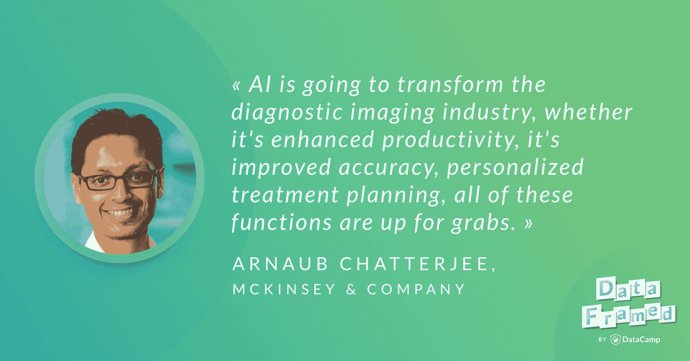

# Arnaub Chatterjee 讨论了医疗保健中的人工智能(AI)和机器学习(ML)。

> 原文：<https://web.archive.org/web/20221129045010/https://www.datacamp.com/blog/arnaub-chatterjee-discusses-artificial-intelligence-ai-and-machine-learning-ml-in-healthcare>

[https://web.archive.org/web/20220529064349if_/https://w.soundcloud.com/player/?url=https%3A//api.soundcloud.com/tracks/520227201%3Fsecret_token%3Ds-Mfbd0&color=%23ff5500&auto_play=false&hide_related=false&show_comments=true&show_user=true&show_reposts=false&show_teaser=true](https://web.archive.org/web/20220529064349if_/https://w.soundcloud.com/player/?url=https%3A//api.soundcloud.com/tracks/520227201%3Fsecret_token%3Ds-Mfbd0&color=%23ff5500&auto_play=false&hide_related=false&show_comments=true&show_user=true&show_reposts=false&show_teaser=true)

DataCamp 播客 DataFramed 的主持人 Hugo Bowne-Anderson 最近采访了麦肯锡&公司制药和医疗产品部门的高级专家兼合伙人 Arnaub Chatterjee 。

下面是播客[链接](https://web.archive.org/web/20220529064349/https://www.datacamp.com/community/podcast/ai-healthcare)。

## [介绍阿诺·查特吉](https://web.archive.org/web/20220529064349/https://www.datacamp.com/community/podcast/ai-healthcare)

Hugo: Arnaub，我真的很高兴今天你能来谈谈人工智能、数据科学和机器学习在医疗保健中的作用，以及哪些成功了，哪些失败了，但在我们到达那里之前，我想让你介绍一下你自己的旅程，让我们知道你最初是如何进入数据科学的。

阿诺:谢谢你，雨果，也谢谢数据营今天邀请我。我进入数据科学的想法是非常偶然的，就像生活中的许多事情一样，是在正确的时间和正确的地点。我认为在医疗保健领域也有一个并行的运动，数据科学在过去 10 年里真正起飞了，所以随着许多完美风暴的工作，所有这些因素都对齐了。我认为我的职业生涯有点曲折，因为我在咨询行业担任过角色，在技术和政策领域为前任政府工作，然后在制药行业，现在又回到了咨询行业。围绕我如何工作的中心主题或精神一直围绕着数据科学和数据科学的共同线索和一些链接。

Arnaub:给你一个简短的背景，我在研究生院毕业后开始了我的职业生涯，成为一名顾问，最初专注于制药跨国公司，但后来在 ACA 时代之前，平价医疗法案时代，帮助艾滋病充斥的健康数据基础设施。这实际上让我去为奥巴马政府工作。我过渡到最初从事一些围绕医疗欺诈和滥用的数据科学工作，不仅思考政策，还思考如何利用这些数据，并预测谁更有可能实施欺诈和欺骗政府。

Arnaub:从这个角度来看，事情变得更像是一个技术平台。然后我有机会与 HHS 的一些技术官员一起工作，当时托德·帕克和布莱恩·西瓦克正在围绕开放数据创建一个新的运动，并建立 API 和平台来访问政府掌握的大量数据，所以非常非常幸运地遇到了两个硅谷的家伙，他们把他们的 DNA 带到了政府，并启动了许多倡议，如健康数据倡议。我们正在 fda.gov、clinicaltrials.gov 建立平台，开放 API。这也是非常正确的时间和正确的地点，能够向那些在私营部门以技术思维做这件事的人学习。然后是制药方面，由于政府的原因，我最终转到了制药行业，并跟随一些曾在政府部门工作过一段时间的人，在默克建立了一个专注于数据科学的团队。我们在默克所做的事情主要是关于我们如何利用和识别新的数据集，这可能包括流氓数据之类的声明，但也可能包括临床和基因组和社交媒体以及审查员。它真正利用并思考了我们如何展示默克产品的临床和经济价值。这是一种全新的思考方式，以不同的方式定位药物，并思考数据科学中新方法的出现，以支持和巩固药物的价值。

Arnaub:我这样做了很多年，并与各种学术机构合作，研究不同的机器学习方法和不同的数据科学方法。所有这些最终把我带到了麦肯锡，也就是我现在的位置。在这个职位上，我不仅与制药公司的客户打交道，还与科技公司的客户打交道，了解他们如何进入医疗保健行业。我觉得以这种身份，我很幸运地站在不同公司如何在各种不同环境中部署机器学习和数据科学的第一线。希望我们今天会谈到很多。

雨果:当然。正如你所说，它需要许多移动部件，或者它几乎是你的兴趣和技术的意外收获的完美风暴，新兴的数据科学堆栈和所有可用的数据使你的职业道路成为现在的样子。我们会看到这种情况也发生在这个领域。这实际上需要很多移动部件、可用性和大规模数据的生成、计算能力、统计洞察力，这使得数据科学在健康和其他方面得以发展。

### 你是如何学习数据技能的？

Hugo:我还对你在研究生院就开始考虑这类事情的事实感兴趣，那是你开始处理数据的时候。你当时需要的和现在需要的处理数据的技能，这些技能是你在工作中学到的，还是你专门接受过这类工作的培训？

阿诺:这是个有趣的问题。我想在研究生院我花了一些时间在生物统计学和流行病学上。我的背景是商业方面的医疗保健，还有健康政策方面的。关于数据科学有趣的事情是，如果你问医疗保健领域的许多人，他们会告诉你，数据科学家是加州的统计学家，他们基本上会说，随着方法和机器学习的出现，这个概念和术语已经发生了很大变化，真正扭曲了这个定义的含义。

Arnaub:在某种程度上，我认为从事传统索赔数据工作并拥有流行病学、生物统计学等技能的人本身就是数据科学家。我认为，正如你提到的，现在发生变化的是更大的数量和不同类型的数据。有不同的方式处理和理解我们如何使用它。我的训练从那里开始，现在我想，像许多人一样，我必须根据许多学科正在融合的事实来发展和学习。计算机科学家和现在实际上有数据科学学位的事实，教授使用数据的不同方法的项目，这些都与人们使用医疗保健数据的许多旧的学校方法相融合。这就是我现在的处境。

Hugo:很好，我很高兴你提到了不同类型的数据，因为我认为数据的异质性是如此丰富，实际上，当人们问我这种情况发生在哪里时，我首先提到的临床环境是，除了来自扫描的成像数据之外，你还可以从实验和控制中获得表格数据，这一点我们将会得到，除此之外，还有来自医生对患者文件的笔记等类似内容的自然语言。

## 医疗保健中的人工智能

雨果:我认为这是进入这场关于人工智能在医疗保健中的应用的对话的绝佳时机。正如我们所知，围绕机器学习在人工智能和医疗保健中的使用有很多炒作。我想知道，从你的角度来看，这一领域实际上有哪些成功之处？

阿诺:是的，这是一个非常重要的问题，我认为当我们谈论什么实际上有效时，我认为知道这是一个非常进化的空间是很重要的，所以在某些情况下，陪审团仍然不知道。在其他情况下，我们开始看到非常有希望的迹象。只是为了承认炒作，我想在我个人看来，我们正处于医疗保健领域人工智能资金的黄金时代。我想我最近看到的统计数据是，自 2016 年以来，仅医疗保健领域就有 300 家人工智能创业公司涌现出来。这些公司涵盖了从减少保险和结算公司的行政工作，到实际创造新的药物和授权化合物开发。我认为重要的是，我们现在开始看到对人工智能的许多关注正被推向哪里，以及媒体的注意力正走向哪里。风险资金正流向那些也在精简大量运营和效率任务的公司，比如医疗保健领域的管理效率任务。他们还流向那些大胆渴望颠覆已经发生了几十年的流程的公司。

阿诺:我们试图辨别的是一个成功的结果是什么样的，我们如何思考更大的愿望是什么，我们在哪里可以看到医疗保健的切实改善，我们如何思考病人结果的改善？这次谈话，不是要泼冷水或给正在进行的伟大工作泼冷水。这只是为了试着理解，就像你在对话开始时提到的，很多关于这一点的讨论都发生在我们看到承诺的地方。

Arnaub:让我来举几个不同的例子，在我认为这已经奏效的地方，我们可以就此进行更深入的讨论。您提到的第一件事是关于成像，特别是在诊断成像和医疗保健领域，这是一个基础。我认为非常重要的是要记住，人工智能在其他行业的开创性用例实际上是从回读图片和查看照片中的人脸、图案和物体的能力开始的。这与医疗保健领域的情况非常相似，我们在其中看到巨大成功的许多灯塔使用案例正在开始发生。

Arnaub:为了让你对这个市场的增长有一点了解，人工智能辅助诊断成像到 2023 年应该是一个 20 亿美元的产业。这只是 570 亿美元的整个医学成像市场的一小部分。570 亿美元包括设备，包括软件和服务，所以这是一个巨大的市场，在医疗保健领域已经有一段时间了。我认为我们现在看到的是来自许多方面的共识，无论是医院还是技术公司，人工智能都将改变诊断成像行业，无论是提高生产力，还是提高准确性，个性化治疗计划，所有这些功能都有待实现。

Arnaub:在这一点上，为什么成像是我们看到改进的第一个地方，首先，医院每年产生大约 50pb 的数据，其中 90%的数据来自医学成像。我们讨论的是 MRI 扫描、PET 扫描、CT 扫描，所有这些也都嵌入在电子病历中。我认为这是一个原因，这种数据的可用性和普遍性。

Arnaub:我认为第二个原因是，现在医疗保健领域确实有许多令人信服的使用案例。为了挑选谷歌已经完成的一些伟大的工作，谷歌大脑在 JAMA 上发表了他们非常强大的论文，他们与来自一个眼科研究所的 13 万名患者一起工作，他们观察视网膜眼底图像。他们能够做的是提出一个更复杂的卷积神经网络，能够预测糖尿病视网膜病变，这是全球失明的主要原因之一。大约有 4 亿人患有这种疾病。

阿纳布:他们有效地做的是利用这 13 万张图像的子集，提出了一个更精确的版本，在理解视网膜病变发生在哪里以及如何实际描述背景线索方面，他们胜过了由八名眼科专家组成的小组。他们的 F 分数是 0.95。事实上，他们有一个调整后的 AUC，事实上，它是在 JAMA。有一个非常强有力的临床论点，如果我们获得更多这种类型的数据，我们能够将它构建到不同的工具和流程中，以及眼科医生如何看待他们的患者，我认为这只是一个开始。Deep Mind 在视网膜空间内有一个非常相似的研究。光是这两个例子，我认为就很有说服力。您不仅在眼科看到了这一点，而且在皮肤病学和病理学中也开始看到这一点，作为您的下一组 lighthouse 用例。

### 什么类型的公司取得了进步？

雨果:这让我觉得很有趣，我想知道你是否感兴趣，在这种情况下，是像谷歌这样的公司，在医疗保健领域传统上不为人知，却取得了这样的进步。

Arnaub:是的，我认为你开始看到许多拥有世界级机器学习和医疗保健机构的公司之间有趣的合作。硅谷的另一边是脸书。脸书刚刚宣布了他们与 NYU 医学院的合作，在那里他们利用人工智能来加快核磁共振扫描的识别速度。对你们感兴趣的人，这个项目叫做快速核磁共振成像。它最初观察大约 300 万张膝盖、大脑和肝脏的图像，并观察大约 1 万个不同的病人病例。这是最近刚刚宣布的。我们会看到劳动的成果是什么。

阿诺:我不认为这有什么好惊讶的。我认为计算能力，现在谷歌有责任弄清楚他们如何思考应用程序在哪里，用例在哪里，我认为这是你开始把成像视为他们的第一个初始灯塔的地方，因为他们可以，令人信服地...他们已经在其他行业做到了这一点，现在他们也有能力在医疗保健数据上做到这一点。

## 人工智能在医疗保健中的用例

Hugo:所以你打算告诉我们更多关于眼科和皮肤科的使用案例。

阿诺:是的。我认为我们开始看到类似的情况...眼科显然是视网膜疾病的例子。我们已经开始看到不同的乳腺癌病例。Kaggle 和英特尔以及一家名为 MobileODT 的公司之间的合作是一个很好的例子，他们开发了一种算法，可以准确识别女性的子宫颈，以及我们如何更好地筛查和治疗女性的宫颈癌。该数据由大约 10，000 个标记的子宫颈图像组成，并且它具有一型、二型和三型宫颈癌。这是一个 50 层卷积、神经网络、深度学习模型，可以准确分割子宫颈类型识别的不同部分。这是另一个例子，这个算法，仅仅通过利用群众的力量，它甚至没有受过学术训练或临床训练的人，他们能够在 75%的时间里捕捉并准确识别子宫颈类型。

Arnaub:我认为值得注意的是，这些 CNN 实际上是可复制的。你不必每次都重新组装轮子。我认为这就是你将开始看到巨大改进的地方，你将开始看到在我们如何进行成像识别和再现这些算法方面的许多增强。

阿诺:我认为第二件事是这些主要的合作伙伴关系，你开始看到科技公司与眼科研究所和拥有成像数据的大公司合作。这将是非常引人注目和强大的。

Hugo:那么当你说可重复时，你是指在迁移学习意义上的可重复使用吗？

阿诺:是的，我想我们稍后会谈到这一点，但人工智能的一大挑战是让它在医疗保健中重现。最大的障碍是医疗保健系统的许多不同部分的数据是不同的。你在加利福尼亚看到的病人将与你在得克萨斯、南卡罗来纳或波士顿看到的病人大不相同。我认为，我们试图更好地理解的是，你如何对一种可能已经在美国人口或全球人口的某一部分中使用的算法创建一种概括能力。那么能够始终如一地提出这些算法就是一个挑战，因为也有不同的方式来描述这一点，我稍后会花一些时间来讨论这一点。

阿诺:特别是对于放射学，你所寻求的结果是不同的。你可能会看到病变的概率，也可能会看到肿瘤的特征。你可能会看到肿瘤的位置。你必须一遍又一遍地用不同类型的成像数据做同样的练习，这样算法才有可能重现。我认为这就是我们开始看到的，我们必须不断地证明这个算法是准确的，可以用其他数据设置来识别。

### 其他示例

Hugo:听着，老实说，这次谈话让我更加意识到消除这些事情的神秘性是多么重要，特别是因为有这么多接触点，对吧，人工智能可以在健康方面产生影响，正如你提到的，从行政任务到 scut 工作，保险业，到所有这些诊断。在我们继续之前，我想知道您是否还记得其他例子或超级有趣的用例？

阿诺:是的。绝对的。第二，我认为，我们经常看到的是诊断预测。你如何看待那些你还没有从数据中挖掘出来的可能有助于治疗进展的新变量？

Arnaub:实际上，我们现在正在与这个领域的几个客户合作，提出可能导致疾病进展的新的预后变量，也许可以预测疾病的早期发作。我认为令人信服的是仍然有大量的误解，仍然有大量未满足的需求，我们没有在我们的患者群体中描述出来。如果我们能够使用机器学习方法更好地了解那些病人可能是谁，我们可能能够在如何让他们进出医院，更快地看医生方面做一些令人难以置信的事情。

Arnaub:一个很好的例子是:Emory 刚刚发布了一项关于脓毒症的研究，他们观察了 42000 名患者，他们观察了 65 种不同的测量方法，这些方法可能预测脓毒症的发作。他们在不同的时间间隔内观察，比如 4 小时、6 小时、8 小时和 12 小时内。最酷的是，他们能够提出与医生相同的模型和相同的准确性水平来预测脓毒症，在医生和工具之间有一个验证队列，算法基本上是不可区分的。这是一个非机器对医生的例子。更重要的是，我们不仅有能力确认和证实医生的发现。如果我们不断完善这一点，我们可能会发现更多的措施，更能预测脓毒症。

Arnaub:我想和你分享的另一个例子实际上是上周刚刚发表的，发表在美国医学协会杂志上，这是一个非常顶级的出版物。这是对 500 名患者和一些葡萄球菌感染患者的随机试验。他们在六年的时间里观察病人，他们发现一种算法在建议如何用抗生素治疗他们方面做得和医生一样好。真正令人信服的是，他们能够说接受某些抗生素治疗方案的患者在一定天数内服用了某种药物。他们可能在更短的时间内服用了一定数量的药物。你基本上是在看我们如何考虑抗生素方案，以及让患者留在医院内外的最佳做法。我认为这是你开始看到许多令人信服的证据的地方，鉴于这现在出现在顶级医学杂志上，这不是未来的事情。这些就是现在正在发生的事情。

雨果:你已经暗示过几次了，我们不一定...本质上，人类和机器之间有一个错误的二分法，对吗？

阿诺:是的。

## 人工智能在医疗保健中的未来

Hugo:我认为更有趣的是人类算法互动的想法。人工智能和机器学习模型与人类在一起的想法。你认为这是人工智能未来在医疗保健中的一部分吗？

我猜这是你的机器人和医生的对话？

雨果:当然。

阿诺:是的，我想有一些...我会给你两个有趣的轶事来证明我们是否...我们听到很多关于内科医生是否会被医生取代的说法。一个例子是，据报道，医科学生实际上并不专攻放射学，因为他们担心就业市场在 10 年内将不复存在。

阿诺:另一个例子是，中国有一家非常有趣的公司，叫做科大讯飞，这是一家相当大的中国人工智能公司。这是第一台通过医学考试的机器，它的得分大大高于学生群体。当你听到这些类型的陈述，然后你看到所有的 JAMA 证据或新英格兰杂志证据表明医生与机器处于同一水平时，将会有很多对话。它还展示了机器学习实际上已经走了多远。

阿诺:我想有几件事让我相信，我们还没有到医生被取代的地步。一个是，许多这些人工智能系统，就像你举的放射学例子，它们执行所谓的狭义人工智能。这些是单一的任务，它们正在被编程，深度学习模型正在为特定的图像识别任务设置，因此检测结节或查看胸部 CT 并寻找出血。这些是 N 个任务中的一个，它们是二元的，要么是要么不是。我认为如果我们将任务保持在这个狭窄的检测范围内，我们将会发现许多有趣的事情，但这意味着这些将会是增强工具。他们将帮助医生提高诊断的准确性，但众所周知，医生要做相当多的工作。医生如何诊断病人需要大量的脑力劳动。

Arnaub:从短期来看，我认为我们正在寻找人工智能来为许多解决方案提供动力，这些解决方案可以降低成本，提高准确性，并增强医生的决策能力。我看不出它会很快取代医生或我们的提供者所做的大量工作。

Hugo:是的，我喜欢你提到狭义人工智能，正如你所说，它是算法，人工智能模型，用来解决特定的任务。我觉得在文化意识里当人们听到 AI 的时候，他们不会想到狭隘的，弱小的 AI。他们认为一个强大的人工智能在某种意义上反映了人类的认知，这甚至不一定是我们在大多数地方想要的和我们正在努力的。对吗？

阿诺:嗯嗯(肯定)。是啊。没错。没错。它必须更加广阔。我认为另一件值得一提的事情是...我们已经讨论过这个问题，但是模型中的一致性和可移植性必须发生。我们离将此整合到医生决策中还有很长的路要走。我认为不同的供应商专注于不同的深度学习算法和各种不同的用例。甚至某些东西，我们会谈到这一点，他们是由美国食品和药物管理局批准，但他们有完全不同的焦点。直到我们可以开始标准化很多，这将需要一些时间。至于你对人工智能的狭隘和更广泛的思考，这也是等式的一部分，然后我们如何实际上使其可复制。

## 数据科学、ML 和 AI 在医疗保健领域是如何发展的？

Hugo:你多次提到的一点是，我们现在看到的很多力量都来自深度学习。你提到了卷积神经网络的使用。我将稍微后退一点，对于那些想要深度学习去神秘化的人来说，深度学习是...如果我说错了，请纠正我...是机器学习的一个子类，主要是在监督学习中，你试图预测一些事情。这种特殊类型的监督学习模型，是从我们的生理系统和大脑中的神经网络中得到启发的。Hugo:卷积神经网络本质上是一种非常擅长挑选图像模式的网络。它使用卷积技术来做到这一点。当然，人工智能先于卷积神经网络，尽管它们目前非常强大，但我相信你已经看到了趋势的出现和消失。我只是想知道你是否可以谈谈自从你在医疗保健领域工作以来，数据科学的移动部分 ML 和 AI 在医疗保健领域是如何发展的？

阿诺:是的，我认为如果我们要把它推广到医疗保健，有相当多...有各种各样不同的模式，这些模式的复杂性被用来解决不同的问题。我认为在非常基础的层面上，人工智能在医疗保健中的许多早期应用都集中在诊断和药物治疗之间的关系上。一些更基本的技术，如关联规则挖掘或监督学习，旨在发现和提取重要的关联。这些方法有很多局限性，所以我认为如果你看看我们的方法，它们只是在项目级的共现。它们并不是真正的更高层次的抽象。对于数据探索或临床决策支持来说没有太多用处。

Arnaub:我认为，如果你看看监督学习技术，他们正在从预测的角度解决这些问题。如果我们有正确的数据水平，我们可以提出更多的非预测性应用。比如疾病分类或者病人分类。随着数据变得更加有用，可能会发生一些事情，我想，没有更好的词了。我认为这就是我们实际上能够看到监督学习变得更加适用的地方，从很少观察的小数据集到更大规模的例子。这是一项伟大的工作，例如斯坦福和 UCFS 大学正在做的工作，他们在 10 年的时间里观察了数十万名患者，进行了数十亿次观察，并提出了复杂的深度学习神经网络。我认为这就是你开始看到人工智能深远应用的地方。

阿诺:在其他情况下，我们仍在解决数据问题，也就是说，我们获得了足够的数据，使这变得有趣，但某些模型或方法的复杂性可能不存在，因为坦率地说，数据不是那么好。

## 在你看来，医疗保健中的数据科学、ML 和 AI 的未来是什么样的？

Hugo:话虽如此，在你看来，数据科学、人工智能和人工智能在医疗保健领域的未来是什么样的？

阿诺:是的，所以我认为还有很多应用我们还没有谈到。我认为我们选择了两个简单的方法，一个是已经发生的事情，另一个是正在进行的工作——疾病诊断预测，然后是成像。我认为在药物开发方面有很多工作要做。我们现在关注公司的事实...有一些令人兴奋的初创公司正在这样做，他们专注于药物再利用等事情，他们使用真实世界的数据和机器学习算法来探索药物分子和疾病之间的关系。这是非常令人信服的。这就是你开始看到大量资金进入的地方，特别是来自生物技术和制药公司，有像 BenevolentAI 和 Numerate 等公司正在使用深度学习来挖掘大量数据，以查看科学论文、临床试验等一切，他们实际上只是试图了解哪些化合物在靶向疾病方面更有效。

阿诺:我认为这些类型的事情得到了相当多的投资，但是我们还没有看到劳动的成果。我提到了仁慈。他们开始确定 ALS 治疗的假设，你知道这只是一个开始，但它开始缩小药物靶点或化合物的范围。它不仅为生物技术和制药公司节省了大量时间，还加快了药物开发过程。我认为这是一个例子。

Arnaub:确实有一些有趣而强大的基因组数据的例子，我们还没有谈到，所以 DeepVariant，如果我回到谷歌一秒钟，DeepVariant 是一个开源工具，它是谷歌大脑和谷歌生命科学部门 Verily 之间大约两年的工作。他们能够有效地做的是提出一种更复杂的统计方法来发现突变并过滤掉错误。DeepVariant 所做的是，它改变了变体调用的整个任务，即试图找出哪些碱基对是你的一部分，而它们不是某种处理工件的一部分。它把它变成了一个图像分类问题。Deep variant 开始取代并超越这些基本的生物学工具，如 GATK 和 SAM 工具，并将错误数量减少了 10 倍。

阿诺:我认为，这只是开始阶段。即使像谷歌这样的公司也会告诉你，他们的基因组学工作还需要几年时间，考虑到这项工作花了两年时间。但是我对这种潜力感到非常兴奋。还有其他关于医生倦怠和医疗保健中语音技术出现的例子，我们开始了解医生在 EHR、电子健康记录数据输入上花费了大量时间，如果我们能够在未来使用机器学习和自然语言处理以及语音技术，那么我们将开始自动填充记录中的结构字段，减轻医生的工作负担，减轻医生的文档负担。这是我认为处于前沿的三个用例。在这些领域，有很多炒作和兴趣，也有非常惊人的工作正在发生，但这只是我看到的未来走向的一个简短列表。

## 观众的提问

#### 责任

雨果:太好了。在我继续之前，实际上有几个有趣的问题，Gamal 问了一个问题，关于责任呢？实际上，我想从医疗保健中数据科学、人工智能和人工智能的未来的角度来思考这个问题，特别是我们讨论的许多算法本质上都是黑盒算法，很难理解它们为什么会做出这样的预测。因此，就可解释性与黑盒而言，也许你可以讨论一下，我想，我们作为数据科学家建立的模型的责任。

阿诺:是的，我认为这是一个非常重要的问题。我想谈的一件事是未来的政策空间。FDA 批准的算法的概念实际上正在开始发生。我们现在看到的是当前模型中缺乏一致性和可转移性，因为它们关注不同的端点，它们是在黑盒设置中完成的，在那里输入数据，我们不确定会输出什么。我认为这意味着监管机构将进行干预，尽管是以积极的方式。

Arnaub:作为一个例子，美国放射学院实际上正在帮助供应商在算法上市前验证算法的有效性。我认为这是一个例子。另一个例子:关于接受算法和批准它们是诊断的一部分。他们对使用神经血管疾病算法的决策支持工具投了赞成票。他们在 4 月份对糖尿病视网膜病变做了同样的事情，然后他们为一种计算机辅助工具做了一些事情，这种工具有助于成年患者的手腕骨折。这些都是 FDA 允许市场开放的。他们允许算法实际上以一种受监管的方式帮助提供商。

阿诺:事实上，白宫和众议院监督信息技术委员会内部正在发生非常酷的事情。如果你们非常无聊，你应该读一读众议院监督委员会刚刚发布的名为“机器的崛起”的报告。这基本上是 NIH 如何确保算法的标准化。白宫也是如此。他们从政府那里推出了一个非常有趣的计划，以一种道德的方式来建立人工智能。我认为黑匣子问题会继续发生。我们已经看到这对于一些大公司来说是个问题。我们需要能够解决这个问题，虽然我们不喜欢政府干预，但我认为这是一个实例，我们实际上看到了很多积极的事情。

#### 数据科学中的伦理问题对医疗保健中的人工智能有更大的影响吗，在这个领域有没有为研究人员制定伦理指南的举措？

Hugo:接下来，我们实际上收到了听众中一个叫 Daniel 的人提出的一个关于伦理问题的很好的问题:数据科学中的伦理问题对医疗保健中的人工智能有更大的影响吗？在这个领域有没有为研究人员制定伦理指南的举措？你已经说过了，我们各自自上而下。我还想知道数据科学社区内部的实践。什么类型的利益相关方会让数据科学家承担责任？同样，事实上，在市场营销中，或者广告中...如果你给某人看了错误的广告，这并没有给某人错误的诊断那么重要，对吗？健康领域有没有特别有价值的东西？

阿诺:是的，所以我认为我们看到的是我们如何标准化疾病的本体，这是一个不断发展的问题。有一些学术团体致力于复制这些表型。所以表现型基本上就是我们如何描述一个病人和他们各自的疾病。如果学术团体和组织走到一起说这是一个普遍接受的算法，这是我们如何避免错误的癌症治疗建议，或者这是我们如何看到这是一个不安全或不正确的治疗建议，我认为这将实际上迫使更多的人在某些参数内工作，并建立符合指南和实践的算法。否则，在大量健康数据噪音中找到信号是非常容易的。我认为，有些公司在这方面经历了一些惨痛的教训。我认为，只要我们与试图这样做的组织合作，这就是解决这个问题的一种方式。

阿诺:我认为另一件事是健康数据难以置信的不一致，有一个名为 HL-7 的国家小组委员会，这是一个健康数据标准委员会。他们真的在大力推动一种叫做 FHIR 的东西，这就是快速医疗保健互操作性资源。它试图创建一个标准，让数据不再是某个人的竞争优势，而是每个人都可以使用的东西，并且是为每个人标准化的东西。你看到的不仅仅是不一致的标准。

Arnaub:医疗保险/医疗补助服务中心真的在努力推动标准的本体论。我认为 FHIR 和其他组织正试图在所有的混乱和噪音背后创造一种一致性。雨果:太棒了。这实际上回答了我们从观众那里得到的下一个问题，这个问题来自 David，他关注人工智能在医疗保健中的政策含义的研究，特别是 FHIR 是否会对人工智能的实施产生任何影响。很好，你能在我框住它之前回答这个问题。Hugo:另一个问题，我要提醒今天在这里听和看的人，一想到问题就在聊天中提出来。我从威廉那里得到了一个非常有趣的问题，我们之前已经暗示过了，但是威廉说“我注意到很大一部分炒作都集中在医疗保健的 R&D 方面。比如图像分析，药物发现。什么是炒作，更重要的是，在制造方面有前途的应用？”

阿诺:对，这是个好问题。我想这与药物开发有关，抱歉，是在药理学范围内？

雨果:对，没错。

阿诺:是的，所以我认为我们开始在这个领域看到很多活动。这有点微妙，但就制造业如何试图解决这个问题而言，我认为我们现在有能力标准化并更好地理解药物循环是如何发生的，供应链可以优化。例如，我认为这就是像 BERG 这样的公司不仅在研究应用中使用人工智能，而且在制造中使用人工智能的地方。这是我很少遇到的东西，但仍然很受欢迎。我认为有一些方法可以考虑无监督学习方法，比如我们如何试图理解药品流通，以及我们可以在哪里改进我们的供应链工作。

Arnaub:实际上，英国皇家学会正在研究机器学习在生物制造中的作用。我们真的能帮助优化时间因素吗，比如帮助制造商减少生产药物的时间，降低成本，提高复制能力？是的，仍然是一个非常受欢迎的话题。这不是我们一直回避的事情，但我现在已经看到很多资金和兴趣流向了探索。

#### 鉴于人工智能的黑箱性质和工业的专有性质，如何评估算法的外部验证和可重复性？

Hugo:我想，我们有几个关于在医疗保健中使用人工智能、人工智能和数据科学的道德本质的问题。我想问你的第一个问题来自一位名叫詹姆斯的听众。詹姆斯说，鉴于人工智能的黑箱性质和工业的专有性质，如何评估算法的外部验证和可重复性？他还说，基本上，开放科学在商业人工智能领域中处于什么位置？

阿诺:对，这是个好问题。我认为我们需要做的是提出一种跨学科、多利益相关方的方法来评估进入市场的不同算法。像 FDA 这样的大型自上而下的机构正在评估医生在实践中运用算法的能力。我认为，在学术层面上，还有其他更跨学科的组织。一个伟大的团体叫做 OHDSI，它是观察健康数据科学和信息学团体。他们试图做的是，这实际上是制药公司、学术界和创业公司之间的合作。我认为他们所做的一件事非常重要，那就是他们为医疗保健创建了一个通用的数据模型。他们查看了不同的观察性医疗保健数据库，认为电子病历对于支持临床护理非常重要。像 clean data 这样的数据库对于报销很重要，但它们都有不同的用途。我们需要创建一个通用的数据模型来容纳这两种不同类型的数据。

Arnaub:这个 CDM，通过一个叫做 OMOP 的伙伴关系，代表观察医疗结果伙伴关系，它基本上是试图从随机编码系统中提取所有这些噪音，并创建一个标准化的本体和词汇。这是试图从其他人、多个玩家、跨学科玩家那里获得买入的一种方式。我认为，这有助于应对道德挑战。

阿诺:OHDSI 是一个实际上致力于复制和出版所有这些研究的组织。所有这些都是开源的。他们创造了许多软件工具，如 Atlas 和 Achilles，它们是描述不同数据和数据质量的标准化数据库。这不是我们一夜之间能解决的事情。我认为监管机构会非常明智地决定批准什么，不批准什么。医疗保健行业往往会发生的情况是，一旦出现某种不良事件，或者出现某种临床错误，你就会看到整个行业都受到打击。没有人希望这种情况发生。我认为这是抑制创新的原因。

阿诺:我们希望尝试...这很奇怪，在我们现在所处的世界里，我们试图尽可能多地获得与人工智能相关的工作，同时也非常注意到，一旦它进入医生的手中，或者它开始成为病人护理的一部分，它的成功部署是非常具有挑战性的。这就是所有这些东西的下一步发展，是将这些算法非常仔细地实施到临床决策模型中。

#### 它是否足以证明算法或模型的有效性，或者是否需要一个完整的、全功能的描述？

Hugo:我很高兴你在这里提到了监管，因为我们有一个来自 Stephen 的相关问题，这个问题是从监管的角度来看的，它是否足以证明算法或模型的功效，或者是否需要一个完整的、全功能的描述？

阿诺:是的，我不知道我们是否有适当的指导。我认为有很多组织正试图揭开人工智能的神秘面纱，或者 FDA 应该如何思考这个问题。一些标准的东西，比如你需要证明什么。一个是你的基准数据是什么？你在吸毒吗...你用的是地面真实数据吗？意思是它是一个可信的索赔数据源吗？它是 EHR 数据的标准化本体吗？我认为公司努力选择各种不同的数据来源和收集方法。然后他们意识到他们的算法并不是那么好，或者他们希望它被认可。什么是地面真理有很好的定义。这是创建一个真正强大的模型的一种方式。

Arnaub:我认为，对于算法的预期用途，还有其他的思考方式。我们如何看待这种与医生的互动？它对下游患者有影响吗？会不会出现算法偏差？意思是你要拒绝对某一特定人群的治疗吗？这是食品和药物管理局根据它认为道德与否来考虑的事情。

阿诺:那么我认为改装模型有一整套监管方法，这样他们就能不断学习。主管 FDA 的 Scott Gottlieb 谈了很多关于患者将如何发展，以及我们如何思考公司何时必须对模型进行改装，以及如何对其进行验证。什么才是正确的改装节奏？是每小时吗？是六个月吗？是每年一次吗？我觉得一些组织已经尝试创建这些指导性的问题列表，这些问题可以帮助我们提出一个好的模型，而不是一个不合格的模型，一个更有可能被临床社区实施和接受的模型，而不是那些有很大发现但可能有一些漏洞的模型。

#### 由于医疗保健是一个受监管的领域，你认为人工智能和医疗保健将是只有像谷歌和脸书这样的大公司才能取得进展的重点领域吗？还是觉得小公司有空间？

雨果:在监管方面，我们也收到了 Harsh 的一个很好的问题。Harsh 问道，由于医疗保健是一个受监管的领域，你是否认为人工智能和医疗保健将是只有像谷歌和脸书这样的大公司才能取得进展的重点领域？还是觉得小公司有空间？你之前提到，这个领域已经有数百家初创公司。也许你可以多说一点？

阿诺:当然。我认为这是一个非常有趣的问题。我认为...我给你举一个例子，我认为这个例子令人惊讶。你对谷歌这样的大型科技公司的看法。脸书实际上在今年早些时候宣布，他们正在研究使用人工智能来监控自杀，并了解他们的哪个用户更有可能实施自杀事件。对于一家科技公司来说，这是一个极具道德挑战的领域。

阿诺:我认为大型科技公司虽然有很棒的应用程序和很棒的计算机科学，但他们非常谨慎，因为他们意识到这不是你可以轻易涉足的事情。我认为他们在进入这个市场时实际上有巨大的组织风险。第一，因为病人护理和卖广告完全不同。我认为他们运用科学和计算能力的能力面临着巨大的风险。他们要评估是否值得，但他们都想让这个世界变得更好。这是他们的愿望。

阿诺:和其他公司一样，有很多强大的科技公司。我提到了这个领域的语音技术。像虚拟助手和语音技术这样的公司将成为这个领域的主要参与者。我不只是指亚马逊，我是指像 Orbita 和其他公司正在做令人难以置信的工作，Robin AI，他们基本上是在试图帮助减轻医生的文件负担。这些都是资金充足、资本充足、得到大力支持的创业公司，正在做着伟大的事情。有患者数据和风险分析。有一些公司，像叙事者，正在做非常引人注目的工作。他们直接与医疗保健系统合作，以安全和合规的方式做到这一点，所以我不认为大型科技公司是唯一可以在这一领域发挥作用的公司。

阿诺:我认为，如果你非常有计划，有条不紊地进入一家初创公司，如果你加入了正确的伙伴关系...我的意思是，有相当多的初创公司在这个领域取得了很大进展，在药物研发领域。这些创业公司已经筹集了数亿美元，现在运作得非常好，非常成功。制药公司正在对 Numerate 和 BenevolentAI 等公司进行多年投资，并投入了大量资金。这不再仅仅是一个大型科技公司的空间。

#### 医疗保健中人工智能采用率的主要限制是什么？

Hugo:实际上有大量的精彩问题，但是我们需要在接下来的 10 分钟左右结束。我还有两个问题。第一封来自克里斯托弗，我对此非常感兴趣。Christopher 问医疗保健中人工智能采用率的主要限制是什么？

阿诺:是的。这个问题问得好。我们谈了一点什么是政策障碍，我们谈了我们如何考虑方法。我认为医疗保健中最大的限速步骤将是无处不在的高质量数据。这是最大的挑战，我认为这已经困扰了医疗保健几十年了，就是一旦一个新的数据集被发布到医疗保健界，每个人都会对此感到非常兴奋。一旦政府为 EHR 电子健康记录制定了标准，EHR 就成了任何拥有该记录的组织的竞争领域。挑战在于获取这些数据。现在基因组学也是如此。我们开始看到生物银行和拥有基因测序数据的能力，基因测序数据。这是下一个领域。这就是人们试图达到的目标，但这些都不重要，除非数据是可链接的，除非有一个标准，除非有标记的数据。我们今天谈论了很多关于成像的问题，但放射科医生苦于成像数据存储在这些 pax 仓库中，pax 是归档系统，然后它们没有被标记。我们不知道我们在看什么。所有这些都表明，在医疗保健中采用人工智能的最大障碍是高质量的数据，这就是为什么我提到了 FHIR 等标准，这些标准试图在一个非常混乱的世界中创建数据的某种和谐和一致性。

阿诺:我认为另一件事是，医院和其他拥有数据的组织非常愿意与玩家合作，但在公司承诺的方面有相当多的重叠。我们开始看到许多公司涉足不同的领域，并声称他们正在进行化合物开发，或者他们正在研究分子识别或目标验证。他们试图成为万事通。我认为这混淆了公司实际做的事情。

阿诺:我的建议是，要非常清晰、精炼地专注于你认为自己在做的事情和你擅长的事情，而不是试图涉入许多其他的浑水。也就是说，我的意思是，市场现在非常火爆，你会看到大量的合作伙伴和创业机会。最大的限制步骤是访问数据，找到正确的合作伙伴，能够演示一个用例，然后在临床实践中应用该算法。

#### 你认为人工智能会使医学民主化吗？

雨果:我还有一个听众的问题，然后我会问你最后一个问题。这是来自 Gamal 的，这是一个相对普遍的问题，我希望你以任何你认为合适的方式来解释。你认为人工智能会使医学民主化吗？

阿诺:哦，有意思。我想我们会到达一个地方...我会对世界民主化的使用持开放态度。我认为这意味着让人们能够获得医疗服务，或者这就是我们将选择使用的定义。我认为患者正越来越多地以不同的方式与卫生系统互动，事实上，大多数，绝大多数的患者上网查找健康信息，现在几乎 90%。事实上仍然有...现在有很多方法可以让病人与医生和科技公司分享他们的数据。我们都知道苹果在健康工具包和研究工具包方面所做的工作，试图获得更多的数据。我认为人工智能会发挥更大的作用，也许技术会帮助人们获得医疗服务。希望我是在回答你的问题，但请随意改变措辞。

与此同时，美国正遭受巨大的地方性卫生政策挑战，我认为人工智能无法解决这些挑战。我认为人工智能将实现并帮助某些事情。它可能会为诊断提供动力。也许随着时间的推移，它会改善健康状况。仍然有很大一部分人永远无法实现人工智能，因为缺乏更好的词，或者无法获得医疗保健资源。我认为这是我们系统中最大的障碍。

## 行动呼吁

雨果:这确实回答了问题。我最后一个问题是:对于我们所有的听众，你有最后一个行动号召吗？

阿诺:是的。我想我们已经谈了很多关于挑战的问题。我们也谈了很多关于承诺和行业发展方向的话题。我认为这个解决许多容易解决的问题的概念，我们选择了许多更性感的东西，如药物开发，但我们的医疗保健系统遭受了巨大的浪费。这些都是巨大的问题，人工智能可以解决很多这样的事情，比如保险和账单索赔。我以前的导师曾经说过，医疗保健中很多最赚钱的工作也是最不性感的，是后台应用类型的工作。

Arnaub:如果我们能够预测更好的浪费或欺诈，或者如果我们能够改善计费和文件流程，这些都是非常重要的问题，我认为这是有意义的。你应该用人工智能和你的能力去解决它们。

阿诺:我认为另一件事是，这些问题不应该孤立地解决，或者孤立地解决。你将会看到许多不同的，也许是独一无二的医疗保健合作伙伴关系的出现。医院、科技公司和与创业公司合作的病人团体。我认为整个模型都颠倒了。我鼓励每个人在如何与不同党派合作的问题上发挥创造性。有很多非传统的人正在进入医疗保健领域，所以要想一想交叉点在哪里，交叉功能在哪里。在那里，你通常会找到更有创造性的解决方案，而不是通过相同的渠道工作。

雨果:谢谢，阿诺。

阿诺:是的，谢谢你，雨果。感谢 DataCamp 抽出时间。我真的很感谢这个机会。雨果:当然。好吧。

阿诺:谢谢你。