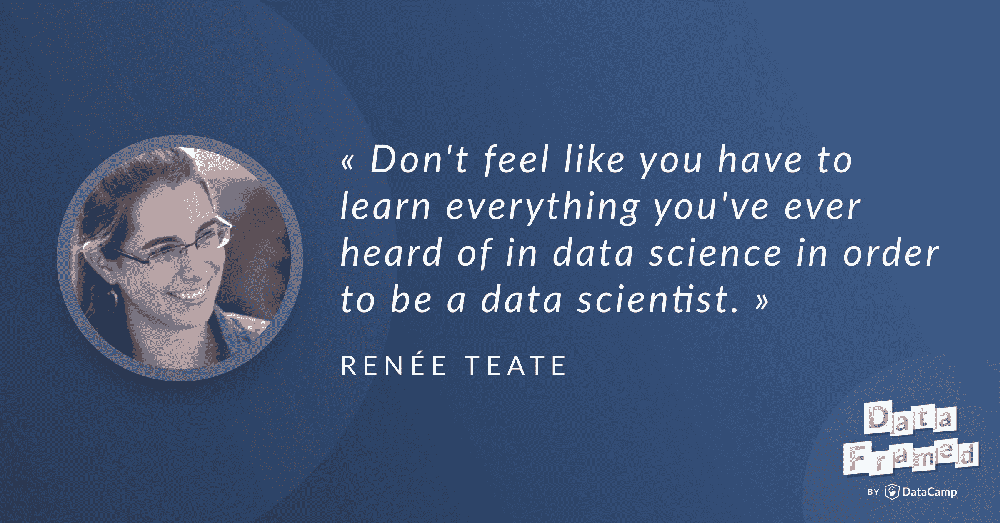

# 成为数据科学家(抄本)

> 原文：<https://web.archive.org/web/20221129045010/https://www.datacamp.com/blog/becoming-a-data-scientist-transcript>

[https://web.archive.org/web/20220703021359if_/https://w.soundcloud.com/player/?url=https%3A//api.soundcloud.com/tracks/499923051&color=%23ff5500&auto_play=false&hide_related=false&show_comments=true&show_user=true&show_reposts=false&show_teaser=true](https://web.archive.org/web/20220703021359if_/https://w.soundcloud.com/player/?url=https%3A//api.soundcloud.com/tracks/499923051&color=%23ff5500&auto_play=false&hide_related=false&show_comments=true&show_user=true&show_reposts=false&show_teaser=true)

这是播客的链接。

## [介绍蕾妮·蒂特](https://web.archive.org/web/20220703021359/https://www.datacamp.com/community/podcast/becoming-data-scientist)

Hugo:你好，René，欢迎来到 DataFramed。

雷尼:你好，雨果。很高兴来到这里。

Hugo:很高兴你能来参加我们的节目，我很高兴能和你谈谈我们今天要谈论的所有事情，你做了这么久的播客，成为数据科学家的想法，以及你的旅程和过程，但在此之前，我想先了解一下你。也许你能告诉我们一些你在数据社区中的名气。

蕾妮:当然。我想我因你提到的播客而出名。这叫成为数据科学家。我采访了一些人，询问他们在数据科学之旅中是如何到达目的地的，以及他们是否认为自己是一名数据科学家。我计划很快重新开始。我想这就是我最初出名的原因，但是很多人也在 Twitter 上关注我，他们可能是也可能不是最初的播客听众。我有一个名为 BecomingDataSci 的 Twitter 账户，我的名字是 Data Science Renée。我试图帮助那些正在向数据科学职业过渡的人找到学习资源和灵感。我建立了一个名为 DataSciGuide.com 的网站，收集学习资源，人们可以去那里评价它们。我希望最终能把它变成学习路径之类的东西。我有一个名为 NewDataSciJobs 的 Twitter 帐户，在那里我分享需要不到三年经验的工作，我试图分享关于学习数据科学和进入这一领域的文章，以帮助人们过渡。

René:最重要的是，我分享我自己的数据科学挑战和成就，并试图鼓励和激励他人，这样他们就可以看着我做什么。我真的很高兴，特别是在我感觉的最后一年，看到各种各样具有不同教育背景的人想要进入这个领域，所以我打算帮助他们也成为数据科学家，因为我认为这个领域的人的背景越广，情况就会越好。我想这就是我出名的原因，播客和推特占了大部分。

雨果:当然。我认为，我们在 Data Camp 非常认同的一条极好的主线是降低希望从事分析和数据科学的人的准入门槛。我认为你的一个很好的方法是，你知道你在播客上说你甚至会问你的人他们的旅程，但他们是否认为自己是数据科学家，这个术语是什么意思，以及他们的实践如何应用于它。它在某种程度上揭开了数据科学作为一个整体的神秘面纱，我认为这可能是一个非常难以接近的术语，周围还有许多看门人。我认为你所做的工作与我们在 Data Camp 中思考方法的方式非常相似，所以这真的很酷。

蕾妮:太好了。我绝对以此为目标。

### 你是怎么进入数据科学的？

Hugo:你最初是如何进入数据科学的？

蕾妮:这是我最喜欢的问题，因为这是我们在我的播客中一直谈论的问题，所以希望我不会说得太长，不过我会给出详细的答案。我的整个职业生涯都和数据打交道。你可以称我为数据通才。大学一毕业，我就去了弗吉尼亚州哈里逊堡的詹姆斯·麦迪逊大学，我现在还住在那里，我的专业是集成科学与技术。这是一个非常广泛的专业。在很多话题上，它的广度大于深度。我们涵盖了从生物技术到制造和工程到编程的所有内容，但你可以尝试所有内容，并找出你喜欢和不喜欢的内容。它有许多实际操作的项目，我们在 ISAT 项目的编程课程中学到的一件事是关系数据库设计。这是我以前从未做过的事情，但是当我在班上的时候，我意识到，嘿，我很擅长这个。我明白了。对我来说很有意义。大学一毕业，我就开始做这类工作。我设计数据库，构建数据驱动的网站，设计表格和报告来与数据交互。我做了大量的 SQL 工作，帮助设计了一个报告数据仓库，并构建了交互式报告，人们可以在其中与数据进行交互，我对此做了一些分析。

蕾妮:我想让我的职业生涯更上一层楼。当时，我认为系统工程硕士学位将填补我知识上的许多空白，所以在我的本科课程中，我在数学或编码方面没有太多深度。我只是上了一些入门课。这个项目是在弗吉尼亚大学，它有模拟和建模课程，最优化，统计学，那时我有点害怕数学。为了申请这个硕士项目，我不得不在社区大学的暑期课程中学习线性代数。这是本科毕业八年后。我早该知道它会比我原先想象的更加数学化，但是我发现系统工程项目中每一门课程的标题都有点像另一种数学的代码。这是非常数学密集，但我需要它。如果我全靠自学，我就不会学到这么多东西。

雨果:我有一个问题，作为一名教育工作者，我学到了很多，那就是要成为一名有效的数据分析师或数据科学家，人们需要了解多少线性代数？

蕾妮:我认为了解基本情况是有好处的。它让你了解这些算法背后发生了什么，了解数据是如何转换和处理的，然而，如果你真的要成为一名应用数据科学家，而不是像机器学习研究员那样，你不必真正了解所有这些错综复杂的事情。我很高兴我有 it 方面的背景，所以我知道这些事情是如何工作的，但我不会在日常工作中使用这些技能。它们就像是将所有这些都抽象化的软件包，所以作为一名数据科学家，我不必每天都做这些类型的计算。我会说，掌握它很好，感觉你理解了概念，但你不需要自己掌握实际的计算。我是说这就是电脑的用途。他们可以为你做很多。

雨果:对。我完全同意，我确实认为学习这些类型的东西有很多焦虑，线性代数，我想特别是多元微积分。我也鼓励人们努力一点，坚持一点，因为挑战的一大部分是语言和符号。很多概念并不一定很难，但是当你写一大堆矩阵之类的东西时，你会很快变得很难理解。

蕾妮:对。当我看到某些描述...就像你说的多元微积分和矩阵微积分。它看起来如此势不可挡，乐谱仍然吸引着我，所以我有那种感觉。

雨果:对。

蕾妮:但我很高兴我理解了它背后的概念，尽管每次看到这些我还是会不寒而栗。

雨果:是的，你可以用一些疯狂的符号来表示，它实际上指的是沿着表面的方向流动，或者类似的东西，直观上很容易理解，但是我们有很多古老的符号。

蕾妮:对，甚至不一致。我参加了一个项目，有来自不同大学不同系的教授，我丈夫是一名物理学家，有一门课，我真的很难理解这种特殊类型的计算和符号，他看着它，好像你上学期才学过。我好像从来没见过这个。他说不，这是同一个概念，只是不同的符号。那是我真正开始理解的时候，比如说数学家和工程师可能会对同一件事使用不同的符号。事情变得复杂了。我确实认为，如果你要成为一名机器学习研究人员，或者进入一个博士项目，或者你正在围绕数据科学的前沿开发东西，并真正推动该领域的发展，建立其他人将使用的算法，那么你需要真正理解这些东西，但如果你主要应用的是已经建立的算法，你就不必那么深入。对于统计学，我认为你真的需要一个坚实的统计学基础。我会说相反的话。每个从事数据科学的人都需要很好地理解基础统计学。

雨果:太好了。那么在你做这个节目的时候或之后，你的旅程中发生了什么？

蕾妮:对。当我参加这个项目的时候，弗吉尼亚大学的数据科学研究所成立了。我在任何地方都听说过数据科学，我有点想转到那个项目中去，但是如果不完全重新开始，我做不到。他们在他们的项目中有点像一个团队，所以我发现我可以选修一门机器学习课程，所以我开始选修，只是因为我想知道它是关于什么的，以及它与我已经在做的事情有多接近。感觉我的整个职业生涯都在向数据科学发展，而我从来没有听说过它。在这个机器学习课程中，它从大量的数学开始，进展非常快，老实说，我期中考试考砸了。我真的认为我会不及格，但我决定继续下去，因为课程的前半部分是数学，后半部分是编码和应用部分，这是我所期待的，所以我想即使我成绩不好，我也想学习我应该在这门课程中学习的东西，所以让我坚持下去。

雷尼:就像你说的，我甚至很难理解教科书上的抽象符号和东西，但是在课程的最后一部分，我们从头开始构建这些机器学习算法。哦，顺便说一下，所有的例子都是用 C++写的，但是教授让我们使用我们想用的任何编码语言，所以我从那时开始学习 Python。我没有很好地掌握 C++。我大部分时间都在学习 visual basic。直到那时，我还不知道 SQL 和 Python，但是我想这是我学习它的机会，所以我在学习的同时也学习了 Python，这可能是我在课堂上挣扎的部分原因。最后我们有了这个项目。那时，我对 Python 和机器学习有了一些了解。我边工作边去学校兼职，所以我问我的经理我能不能把我们在工作中使用的数据应用到我在学校做的这个项目中。他说是的，那很好。

蕾妮:所以我在 JMU 大学的进步部工作，这基本上是大学的筹款部门。在我的项目中，我预测了下一财年哪些校友最有可能成为捐赠者。教授很喜欢它，甚至提到这是我将来可以发表的东西。我想那个项目比我在课程的数学部分的表现更重要，因为我最终在那门课上得了 A，这让我大吃一惊。

雨果:太不可思议了。

蕾妮:我当时想，好吧，这是我应该做的事情。

雨果:当然。在你继续之前，我想提醒你，你实际上已经提出了一个令人难以置信的观点，那就是你并没有在真空中做项目。你正在处理对你有意义的数据，对你的雇主有意义的数据，并且实际上给了一群利益相关者一些重要的见解。

蕾妮:对，我们在课堂上已经准备好了数据集，它们都是数字列表。他们甚至和现实世界一点关系都没有。这位教授选择了这些数据集，因为答案会以某种方式出现，所以深入到一些未知的东西，至少在我们的大学里没有人真正看过，并找到一些我可以分享的见解，并实际上使现实世界发生变化，这为我将所有这些联系在一起。

Hugo:在学习过程中，做一些对你有意义并且你感兴趣的事情是非常重要的。

蕾妮:哦，当然。我总是鼓励人们找到他们感兴趣的数据集，并在整个学习过程中使用它们，因为当事情变得艰难时，它会让你保持兴趣，而且如果它是你有背景甚至感兴趣的东西，你会更好地理解输出。如果你对体育感兴趣，使用体育数据集，因为你会更好地意识到你的模型的输出在体育环境中是否有意义。

雨果:我总是说，现在很多人都戴着健身追踪器，他们可以获得自己的锻炼和睡眠模式等数据。他们可以快速对生理上发生的事情进行简单的分析或可视化。

蕾妮:对。这是一个很棒的想法，我绝对会鼓励。

雨果:太棒了。那么在你的旅程中接下来发生了什么？

蕾妮:在我的最后一节课上，我在研究生院做的大部分项目都是在线的。它是同步的，所以我实际上是在网上观看直播的讲座，那里有一门课，但上学期我通勤到校园，对我来说是一个小时。我开始听很多数据科学播客，因为那时我知道我对这个东西感兴趣。当时我在听偏导数和会说话的机器以及 O'Reilly 数据秀，线性离题，数据怀疑论，所以我只是吸收了所有这些数据科学信息，我知道这是我想做的。一毕业，我就开始钻研有关数据科学的书籍，自学在这个领域找到工作并继续前进所需的知识，当时我是一名数据分析师，我想成为一名数据科学家。我接下来就是这么做的。

蕾妮:然后我申请了一系列不同的工作，当时我刚刚开始熟悉数据科学，所以我不一定想要一份数据科学家的工作，但是我想确保这是一份朝着那个方向发展的工作，因为我的工作没有给我很多机会来真正锻炼这些新技能，并在工作中进行机器学习。我知道我擅长设计分析报告。我知道我擅长 SQL。我刚刚获得了系统工程硕士学位，但我想成长为一名数据科学家。我开始申请一些不同的工作，这些工作部分涉及数据科学，但我知道我已经具备了提供价值的技能。我最初申请的几个职位都没有拿到，但我开始通过面试了解他们会问什么，我的知识有哪些缺口，这样我就可以回去了解更多。

蕾妮:当时，有两家不同的初创公司，分别位于美国的两侧，显然需要那种既能做后端数据工程又能做 SQL 工作的通才，并进入预测建模领域。我同时收到了两份工作邀请。他们都是远程角色，就像是数据分析和入门级数据科学的结合。我不需要为他们中的任何一个做白板面试或编码面试，这很好，因为我不认为我当时做得很好，但他们需要像我这样有背景和数据库经验的人，以及善于与利益相关者沟通的人。我认为这帮助我脱颖而出，我想我们稍后会对此进行更多的讨论。

雨果:当然。

蕾妮:但是那两份工作邀请中有一份是和我以前一起工作过的人。我在罗塞塔石碑公司担任数据分析师，这家初创公司的很多人都来自罗塞塔石碑公司。我更喜欢那一个，并接受了那一个，并能够在工作中建立我的数据科学和机器学习技能。那家公司叫 HelioCampus。我们处理大学数据，如果我们感兴趣，我可以告诉你更多，但我作为数据科学家已经担任这个角色大约两年了。

雨果:太棒了。这说明你做的项目最初确实涉及到校友数据，当你第一次学习的时候。

蕾妮:对。在日光校园，我们有点...这让我进入了一个新的领域。这仍然是大学的数据，但我们在学生成功数据和录取等方面做了很多工作。我想我会简单介绍一下公司。在大学里，他们有数据库，就像各种各样的数据，当你在这所大学申请和注册的时候，你可能都想不到。会有一个招生和申请系统。通常有一个独立的系统来管理注册、课程和教员，然后他们有另一个系统来管理工资和财务，然后他们会有另一个系统来管理筹款和校友信息。他们在整个校园里都有这些数据库，领导们希望有一个大的画面，看看学生在申请、上大学和成为校友的整个经历中的轨迹。

René:要获得整个系统的指标，你必须综合这些数据。我们将它合并到一个数据仓库中，并在 Tableau 中提供指向该数据的报告。我们有一些固定的报告，然后我的工作是与最终用户合作，进行尚未建立的分析，以回答他们关于学生的问题，并进行一些预测建模。一个例子是招生组，我们有...我们将看看所有被大学录取的学生，并尝试预测他们中有多少人会被录取，或者哪些人可能处于有时录取有时不录取的学生类型的边缘。例如，他们可能需要一些额外的外联活动，以便学校引起他们的注意，或者需要额外经济援助的学生。我们通过预测模型帮助他们了解学生的整体情况，除了来他们的大学，他们还能找到什么类型的学生，以及我们对他们未来入学趋势的预期。这只是我们在 HelioCampus 与大学合作的许多不同方面的一个例子，但这正是我现在正在做的工作。

Hugo:这听起来是非常有趣和令人满意的工作，尤其是你作为一名教育工作者和投资于学习者的浓厚兴趣和使命。

蕾妮:对，绝对是。

### 有抱负的数据科学家需要思考哪些问题？

Hugo:再次发现你成为数据科学家的旅程真是太棒了，当然你会通过你的播客，通过许多不同的媒体坚持认为这只是一次旅程，每个人的旅程，特别是成为数据科学家的旅程，有许多不同的路径，没有一种适合所有人的方法来成为数据科学家，在真正决定一条路径之前，人们需要弄清楚他们在哪里，他们需要去哪里，并以某种方式将这些点连接起来。所以:我想知道的是，当有抱负的数据科学家弄清楚他们的旅程从哪里开始时，他们需要考虑哪些问题？

蕾妮:对，绝对是。这实际上是我开始我的播客的原因，因为我在听所有这些展示数据科学家正在做的很酷的东西的播客，但是没有一个专注于他们是如何做到的？他们做了什么？我开始问问题，我意识到的一件事是，无论你有哪种不同的教育背景或职业背景，你都必须评估你的起点。你需要问的那种问题来规划你的数据科学学习之路，就像你以前编码过吗？你以前用什么语言编写过代码？数据科学家通常学习 R 或 Python，经常需要了解 SQL。你对数学和统计学有多熟悉，你是否需要温习这些东西并重新学习？也许你需要从你现在的位置提升到一个新的高度？你曾经提出过基于数据的报告吗？你以前在专业场合做过分析吗？有没有用数据回答问题的？这些都是你需要的基本要素。

蕾妮:那你可能会在某个特定领域工作，你知道那个领域的行话吗？你知道在那个领域有哪些与数据相关的职业道路吗？您如何专注于数据科学学习，以实现其中一条职业道路。您可能希望与该领域的数据科学家或分析师交谈，了解常见问题和他们正在解决的问题以及他们正在询问的问题的艺术状态，这样您就掌握了这种语言。它是这些常见数据科学维恩图的所有不同部分的基线，你可以看到还有多少部分需要填充。你只是在评估你的起点，然后下一步你会看看你想去哪里，这样你就知道如何规划学习路径。

## 数据科学简介

雨果:对。因此，概括地说，本质上我们有编码印章，你是否能编程，什么语言，数学和统计的舒适，然后沟通技巧和实际演示我想说的是基于数据的报告，但我真正的意思是基于数据的报告，然后领域知识。我认为这些绝对是你自己实践中非常重要的方面，当你弄清楚你从哪里开始的时候，当然，正如我们都说过的，你需要知道你想要在哪里结束。这可能是一个相对模糊不清、不断变化的概念，但我们看到人们最终会成为什么样的典型数据科学特征呢？

蕾妮:对。正如你提到的，数据科学可能意味着很多事情。我注意到在数据科学中似乎有这些专业的分组。有一种数据科学的分析师类型:这些人通常与最终用户或领导者或业务中的其他人一起工作。他们了解可以提出的问题类型，并弄清楚如何将这些问题转化为数据问题，并确定“您是否有可用于回答这些问题的数据？”进行分析，然后展示结果，并自豪地为这些事情开发数据可视化。有工程师类型的数据科学家，他们做大量的后端工作，编码，处理数据库和数据仓库，可能做一些功能工程，处理大数据系统和可以处理大规模数据集的技术，建立支持分析的数据管道。

Renée:然后是我之前提到的研究型数据科学家:他们正在改进那些尖端的算法，开发新的工具和技术，所以这是数据科学的一个不同的焦点。我会说，大多数人最终会做这些事情的一些组合，但你最终会专攻分析部分、工程部分或研究部分。在我目前的角色中，我做了很多后端工程工作，因为我有这样的背景，但也主要专注于分析任务，并与大学、机构研究人员和决策者沟通，他们将使用我正在做的事情的结果。

### 个人应该走什么路？

雨果:是的，很好。我们已经确定了三个原型，分析师、工程师和研究员作为终点或者至少是职业道路。知道我们需要思考我们在哪里的方式，知道我们可以在哪里结束，你会推荐什么样的路径？推荐的路径本质上是什么样的？

蕾妮:是的，我希望将来能根据我在《数据科学指南》上收集的信息来更正式地阐述这一点，不过这真的取决于个人。你所评估的起点，你想要结束的终点，你喜欢自学还是参加课程，网上学习，决定你是否需要回到学校。我确实认为成为数据科学家需要博士学位是一个神话。我没有。我认识的很多数据科学家都没有。我会说，如果你觉得自学数学不舒服，需要别人帮助你理解基本概念，那就回到学校。与和你有相似背景并且已经成为数据科学家的人交谈，或者在 Twitter 上寻找那些似乎在遵循你喜欢的道路并且你想要遵循的人。

雷尼:然后像你说的那样进行基于项目的学习。找到包含您感兴趣的信息的数据集，无论是体育、统计、政治数据，还是地理空间图像、医疗数据或娱乐数据。有这么多不同类型的数据，你可以找到你真正感兴趣的东西。问一个你可以用数据回答的问题，然后学习任何你需要学习的技巧来回答这个问题。我认为项目导向学习真的很有价值，但是确切的路径和你使用的资源，我真的很难推荐任何一件事情，因为不同的事情适合不同的人，尽管我会建议继续尝试不同的事情，直到你找到适合你的事情。如果你拿起一本很多人都说很流行很棒的书，但你并没有真正理解它，它也没有让你陷入困境，不要气馁。试试别的吧。不要放弃，说哦，我不适合这个，因为这本流行的书对我来说没有意义。

雨果:对。里面有很多很棒的建议。一些我事先没有想到的事情是与有相似背景的人交谈，本质上是寻找像你这样的人。我认为这真的很酷，因为在你完成了确定你在哪里，你想去哪里，或者你想在什么时间框架内去哪里的工作后，我认为很容易忘记或认为没有像你一样的人，你在这个旅程中是孤独的，特别是在一个发展如此迅速的领域，以至于在他们的职业生涯中找到像你一样的人， 这种类型的社区在以后提供建议或成为导师或学员，这种类型的事情，是一个不可思议的想法。

蕾妮:对。我认为我刚刚想到的另一件困难的事情是，甚至定位术语。即使你在外面寻找像你一样的人，就像在数据科学中使用了很多奇怪的词，起初可能会令人困惑，你真的不知道那个人是不是在做我认为我想做的事情。我的博客上有一篇文章，讲述了我是如何使用 Twitter 做到这一点的。像你这样的播客在这方面很棒，只是听人们谈论数据科学，了解数据科学家需要考虑什么样的事情。当我准备进入这个职业生涯时，我得到了这本书。凯西·奥尼尔和蕾切尔·舒特称之为“做数据科学”。这对我来说很好，因为我对这是什么、我需要学习什么以及一些基本术语有了一个大致的了解，它还为你提供了其他学习资源。

蕾妮:对，只是去适应人们说话的方式...数据科学中重要的是，也许有些东西你其实已经知道了，但数据科学家称之为其他东西。数据科学是已经存在了一段时间的领域的结合。是的，学习这些术语，倾听数据科学家的意见，在 Twitter 上关注他们，阅读文章，找出你还不知道的东西，这是重要的第一步。

## 针对初学者的特定学习任务

Hugo:就成为数据科学家的旅程而言，你能为初学者建议一些学习任务吗？

蕾妮:对。我会说写一份报告。就像你说的，也许用你自己的合适的数据或类似的东西。只是探索一个数据集，做一些基本的统计总结，然后练习交流这些结果。当你学习的时候，你将会使用不同的工具和技术，但是你想确保结果总是可以理解的，所以看看你是否能在你学习的过程中弥补这个差距。实际上，我认为当你正在学习的时候，这是一个很好的时机，因为那时候对你来说也是新鲜的，所以你可以在技术分析和使用这些信息做决策之间架起一座桥梁，并与不太懂技术的人交谈，让他们理解你的观点。不断写博客是一个很好的方法。与朋友或你所在领域的人交谈是一个很好的方式，只需解释你所做的分析，但要让人们感到舒服，你知道你在说什么，然后让这些信息变得可用，而不用进入太多背后的统计数据。

雨果:当然。我确实认为处理与你相关的数据集非常重要。即使你认为泰坦尼克号和虹膜数据集与你相关，它们也不算数。

雨果:我们需要搬走。我认为你非常重要地消除了你需要一个博士学位来做这种事情的神话。我想知道你对旅途中的人们还有哪些潜在的陷阱或警告。

蕾妮:我认为对于你需要学习多少知识存在一些误解。一个陷阱是当你学习的时候很容易气馁。在数据科学的保护伞下有如此多的主题，以至于你很容易被淹没，不知道该去哪里，特别是在自主学习的情况下。你必须在学习和胜任你想要的工作之间找到平衡，但不要过度计划或过度学习，以至于你开始感觉完全偏离了轨道，让自己紧张起来，感觉自己永远都不会成功。

蕾妮:在我的一次演讲中，我说得好像你在计划一次旅行。你可以一圈一圈地计划，打印出方向，准确地知道你要转到哪里，以及每个转弯处会是什么样子，但你仍然希望随身携带 GPS，因为如果你遇到意想不到的交通堵塞或道路封闭，你必须绕过它。在某些时候，你会感到迷失在学习中，或者像你完全碰到了一个路障，但你可能只需要回去找其他资源让你对这个话题更舒服，然后再继续前进或决定我真的需要学习这个吗？也许你可以跳过这部分，等你有了更好的理解再回来。不要停滞不前，等着你面前的事情变得明朗，而要准备好改变路线。通往数据科学职业的道路有很多，只要做好改变方向的准备就行了。

雷尼:我认为很多人会看那些糟糕的招聘信息，这些信息就像是公司希望数据科学家能够做的所有事情的愿望清单，他们基本上是在一个招聘信息中描述整个数据科学团队。人们认为为了得到那份工作，他们需要学习所有这些东西，所以我会说不。学习一些真正重要的东西。练习将你所拥有的知识应用到现实世界的问题中，这样你就有了在实际工作中克服挑战的经验，这也将帮助你在面试中讲述你是如何克服困难并最终获得有用结果的故事。我想我想说的是不要让自己脱轨，不要觉得为了成为一名数据科学家，你必须学习你在数据科学中听说过的一切。我们中没有人知道如何做每件事。你只需要知道足够多的基础知识，这样你就能牢固地理解这些知识，并且有信心在你需要的时候学会其他的工具和技术。我想说的是学习基础知识，然后学习几个可能让你脱颖而出的专业项目，或者是你想进入的领域特有的项目。这些沟通技巧也非常重要，不仅仅是工具和技巧。

雨果:当然。在此基础上，你之前暗示的事情是出去做一些工作面试，了解市场情况和面试官想要什么，并向他们提问，找出你可能存在的差距，而不是抽象地了解你认为就业市场可能需要什么。

蕾妮:对。找不到工作可能会令人沮丧，但我记得有一次我确实找到了一份数据科学的工作，回想起来，我说所有那些我没有得到的工作，它们根本不适合我，所以我为什么要为没有得到它们感到难过呢？我不适合这份工作，或者这家公司不适合我，所以一旦我找到了一份合适的工作，我感觉很好，我喜欢我的工作，所以回想起来，我意识到如果你一直被拒绝，有时真的会感到沮丧或沮丧，但数据科学工作有这么多种不同的类型。我认为每个人都可以找到一个符合自己技能的工作，尽管这可能需要一段时间。

雨果:是的，我确实认为连续找不到一堆工作令人沮丧和恐惧。我给你的建议是，你只需要一次打击，但我觉得我自己很难接受。你在一堆机会中寻找一个成功的机会，那些没有成功的机会也可能是令人难以置信的学习经历。这并不能减少被拒绝的痛苦。

蕾妮:对。直到事后，你回首往事，才意识到你学到了多少，那些拒绝是多么有价值。

雨果:对。没错。谈到雇主在寻找什么，我认为当我们抽象地思考数据科学时，我们可以忘记的一件事是，很多时候它是用来解决业务问题的。您有一张很棒的幻灯片，演示了数据分析和科学如何从本质上作为从业务问题到业务答案的中间步骤，因此，从业务问题到业务答案的这一转变是通过数据科学来实现的。我想知道这个概念对你对数据科学整体的理解有多敏锐。

蕾妮:是的，我在我的第一次数据科学演讲中创造了这个，以说明我认为的数据分析过程是什么。我得到了很好的反馈，人们真的很喜欢它，所以我现在经常重温它。如果有人没看过，它有四个小短语，中间有箭头。它从业务问题开始，然后是数据问题，然后是数据答案，最后是业务答案。我会逐一介绍。

蕾妮:关于业务问题，我指的不一定是销售和营销类的业务，而是领域问题，你所在领域或业务的决策者可能会问的问题。作为一名分析师，你的工作就是把它转化成一个数据问题。为了回答这个问题，需要哪些数据？我们有吗？为了得到那个答案，我们可能必须先回答哪些相关的问题？需要做什么样的分析才能得到有用的答案？然后你必须做分析，这就是数据的答案。这种类型的分析将取决于您所处的领域、您的角色和技能以及可用的数据，因此分析类型会有所不同，但基本上是将数据问题转化为您正在进行分析的数据答案。

雷尼:然后你必须接受调查结果，并将其转化为商业答案。很少有人会想听你的数据回答。你必须能够用非数据科学家也能理解的术语进行交流，以便他们知道数据告诉他们什么，并能利用这些信息做出商业决策。你必须能够用商业术语传达统计结果和不确定性，并解释你的分析意味着什么和不意味着什么，这样就不会被误用。当我们谈论构建报告时，在现实世界中，最终结果通常不是某种带有模型评估指标的统计读数。这就像是对非数据科学家的人清晰可用的结果的展示。

雨果:当然，我认为记住我们总是试图回答商业问题或在这种情况下发展商业洞察力是非常重要的。我想稍微改变一下。我们有很多有抱负的数据科学家和学习者。我想知道你对人们可以在哪里学习有什么看法，特别是人们可以学习成为数据科学家所需的技能和知识的地方。

雷尼:就像我说的，我很难给出具体的建议，因为这太私人了，不过我当然听说过关于 DataCamp 的好消息。它实际上是 DataSciGuide 上评分最高的课程系统，所以使用 DataCamp 的人似乎真的很喜欢它。

雨果:太好了。我个人也是数据营的超级粉丝。我不知道这里是否有任何偏见。

蕾妮:我不是说只是为了拍马屁。真的是...人们喜欢它。还有数据查询。有可汗学院教授一些基本技能。外面有很多书。人们往往真的很喜欢奥莱利的书，还有一些其他的最爱。同样，我不太愿意给出具体建议，因为它们差异很大。如果你在寻找某种资源，可以从你现在的位置开始，人们可以发微博给我，通常我会转发，很多关注我的人会帮助回答。这确实是一种个性化的回答，但我只想说有大量的资源，很容易被这些资源淹没，所以不要害怕去问什么可能最适合你，如果有人推荐了一些东西，而你真的不喜欢它，也不要为此感到难过。继续下一件事。

雷尼:我的意思是我的网站 Data Sci Guide，我在努力收集数据科学学习者的评论，这样我们就可以知道在使用这些资源之前你需要知道什么，因为我在学习某些资源时经常犯错误，我开始时非常兴奋，好像我正在学习，然后五节课就完全不知所措，想放弃了。我认为那是危险的。是的，也许可以与在学习道路上领先于你的人交谈，找出是什么帮助他们迈出了从你所处的位置到他们所处的位置的第一步，也许不要接触已经在从事数据科学家工作的人，而是其他数据科学学习者。

## 推特

Hugo:Rene，我们一直在谈论 Twitter，它对有抱负的数据科学家来说是一个非常好的资源，所以你可以告诉我更多关于它的信息。

蕾妮:是的，除了喜欢书籍、课程和教程之外，我还经常使用 Twitter 来了解数据科学的术语。Twitter 上有一些很棒的社区，你通常可以通过搜索某些标签来使用它们。我给你几个。对于 Python 的人来说，有 pydata，pyladies，p4ds。对于学习 R 的人，有 Rstats 和 Rladies，R4ds。这些都是你可以搜索的标签。其中很多也有松弛的渠道。有一个数据科学学习俱乐部 slack 频道，是我的一些追随者根据我的播客学习活动创建的。有一个叫做民主数据的网站，是为那些想了解政治数据的人准备的。有一个关于数据伦理的标签，所以我相信在其他社交媒体上也有类似的小组，如脸书和 LinkedIn，但我主要在 Twitter 上，所以我有一篇关于使用 Twitter 学习数据科学的完整博客文章，如果你开始搜索与你所学相关的标签，你通常会找到这些社区的领导者或中心，你可以通过关注他们学到很多东西。然后，如果你问一个问题并使用这个标签，你通常会得到一个答案。挺酷的。

雨果:太棒了。我们还将在展示笔记中链接到您关于如何使用 Twitter 学习数据科学的文章。那么对于学习者来说，他们如何知道自己什么时候准备好真正成为一名数据科学家或者开始面试呢？

蕾妮:对。我认为，人们在感到完全准备好进行这一跳跃之前，就已经准备好开始申请工作了。不要等太久才开始寻找。就像我们说过的，做这些采访也很有指导意义，但我要说的是，当你对这些基础知识足够自信时，你就准备好了，这样你就知道如何做探索性数据分析和做一些统计总结。你知道基本的特征工程，如何使数据集成形，你可以用它来进行机器学习。你知道如何做一些预处理和清理。您可以构建一个良好的报告和数据可视化，并交流结果。也许你已经使用了一些基本的常用机器学习算法，如逻辑回归和随机森林，所以你对这些基础知识有足够的信心，你知道你不会在工作中完全挣扎。

蕾妮:一旦你觉得你对机器学习的工作原理有了坚实的理解，并且可以应用它，你可能还想加入一些让你脱颖而出的特定技术，或者是你觉得自己擅长的东西。也许你真的很擅长构建易读的可视化效果。也许你真的很擅长后端数据工程。当你申请工作时，你可以说这是你的专长，但你不需要核对所有的算法、工具和技术。

蕾妮:我面试过的工作包括我在职业生涯中已经掌握的、我有信心掌握的技能，还有一些我还在学习的技能。如果我知道我能理解人们想要什么，我有足够的信心在这个过程中学会那些新的工具和技术，那么我意识到在我认为自己准备好之前我就找到了一份工作，至少我希望并且我已经被告知我在那里做得非常好。如果你掌握了基本知识，你可以边走边学很多东西。不要觉得你必须成为每个领域的专家。没有人是。开始申请，你会意识到为了得到一份特定类型的工作，你还需要学习什么，但是不要等太久。

雨果:我认为这个领域非常广阔，而且有如此多的技术和新技术不断涌现，如果你试图尽可能全面地了解，你总会觉得有更多的东西要学习，而且你永远不会离开那里。

蕾妮:是的，不管你申请的时候有多高级，你都要在工作中学习。现在对拥有数据技能的人有很大的需求，所以即使你得到了一种过渡性的数据分析师类型的角色，你可能不会马上有数据科学家的头衔，但如果这是一个为你提供一些机器学习可能性的角色，是的，你可以在工作中成长。

## 最大的道德挑战

雨果:我想稍微改变一下。最近你做了一个名为“机器会是种族主义者还是性别歧视者”的演讲。使用你提出的这个问题作为跳板，你能说出你认为数据科学和数据科学家作为一个群体面临的最大的伦理挑战吗？

蕾妮:对，所以我们可以做一整集关于这个的节目。我会把你和一些我认为可以就这个话题进行广泛讨论的人联系起来，但我做这个演讲的主要目的是让人们明白，即使你使用这些数学算法和计算机来得到一个结果，这并不意味着数据科学产生的东西是无偏见的。偏见有很多种方式，也许你会说是种族主义或性别歧视，我说的是一种制度，所以不是有人在街上对某人大喊大叫，而是历史上的种族主义，它被融入到制度中。我有系统工程硕士学位，我认为我一直是一个系统思考者，所以我很快就明白了这一点，并试图与其他人分享。你可以链接到我整个演讲的所有幻灯片。我真的很难把我想举的例子都塞进去，因为这里真的有太多东西要学了。有了机器学习，你真的在做模式匹配。这就是那些算法正在做的，在数据中寻找模式，这很像刻板印象。你必须意识到哪些数据将用于做出这些决定，并确保你理解模型的输出，而且它不完全是一个黑匣子，你不理解当人们的生活受到影响时，模型为什么会做出特定的决定。在这一发展过程的每一步都可能引入偏见。数据可能一开始就被错误地记录了。它可能不能代表全部人口。这可能是一个有限的样本，你在训练你的模型，假设它会泛化，也可能不会。

雷尼:你的数据可能包含历史偏见。例如，犯罪数据库将只包含被监管地区的犯罪记录。如果某个地点的犯罪没有被警方观察到或者没有被记录到系统中，你训练的算法会认为那里没有犯罪，并做出相应的预测，所以你只是在编码，而不是真实世界中发生的事情，但你在捕捉人们捕捉到的关于你所看到的系统的信息。在进行预处理和模型训练时，某些技术可能会放大偏差。

蕾妮:有一个问题是，你到底在优化什么？例如，YouTube 就有这个问题，他们在优化观看时间。他们想让你关注他们的广告。如果某个东西特别疯狂或令人毛骨悚然或令人兴奋，人们会看得更久一点，所以那些真正极端的视频会出现在顶部，并被推荐给更多的人，因为当你观看它们时，你可能会被它们迷住并看得更久。这可能会让人们变得激进。人们可能会说到点子上，尤其是我认为的孩子们，你不一定能从不断出现在你面前的虚构故事中分离出真相，因为虚构故事令人兴奋和有趣，会让你看得更久。

雷尼:你在优化什么，会有什么样的效果是很重要的。你怎么决定什么时候停止优化或者你的模型的结果是好的？这是一个需要人工参与的决定。你如何知道你的模型的结果是否被正确地使用，并且没有被误用或曲解？在模块化开发过程的每一步都有人在做决策，所以你不能说这是自动化和计算机化的。不存在偏见。每一步都可能引入偏差。

Hugo:这些问题中有很多也是文化问题，作为一个数据科学家群体，我们现在才真正开始，之前已经在这方面做了一些工作，我不想忽视这一点，但我们现在才真正开始集体思考如何解决这些问题。

蕾妮:对，绝对是。是的，这是公司运营的文化，这确实需要我们这些数据科学家来决定我们愿意做什么。很多这样的模型都是在截止日期的压力下建立和推出的，你可能甚至不知道它最终是如何被使用的，但意识到我们正在建立的这些东西的影响是很重要的。我喜欢 Susan Etlinger 在 TED 演讲中的这段话。她说，与过去相比，我们有可能更快、更有效地做出糟糕的决定，并产生更大的影响。我们真的只是在加速这些决定。我们不一定会让它们变得更好，除非我们努力去做，所以我们必须确保作为数据科学家，我们不会造成伤害，我们现在的需求很高，所以我们很幸运，我们可以选择我们愿意为哪种企业工作，我们愿意为哪种产品做出贡献。我们可以改变我们的未来，并希望它比娱乐界想象的或者我们可以想象的更少一点反乌托邦，只要意识到这一点，并有意识地决定我们愿意建设什么。

## 行动呼吁

雨果:我完全同意。蕾妮，你对我们的听众有什么最后的呼吁吗？

蕾妮:是的，我知道有很多人在听这些刚刚进入数据科学领域的播客，但是有些人已经在 Twitter 上潜伏了很长时间，听了很长时间的播客，读了很多书，所以我呼吁他们采取行动。找一个数据集。开始使用它。如果你需要帮助，发微博给我。我将为您联系一个在线社区，帮助您入门。不要延迟实际使用真实数据。

Renée:我对不熟悉数据科学的人的行动呼吁是，我会鼓励你仔细阅读数据伦理，以便你理解你在这一领域所做的工作如何影响现实生活。现在有很多很棒的书，所以当这一集出来时，有人提醒我，我会在推特上列出一个清单，分享我收集的一堆书，这些书要么我已经读过，要么在我的 kindle 中等待阅读，因为我对这个话题非常感兴趣，这对我很重要，我认为我们行业的人应该很好地意识到这一点，所以这将是我对已经是数据科学家的人的行动呼吁。

雨果:太棒了。蕾妮，很高兴你能上节目。

雷尼:非常感谢你邀请我，雨果。我已经听了很长时间了，能站在这里真的很令人兴奋。

雨果:你能来真是太好了，因为我听了你很长时间的播客，这真是一次有趣的经历。

蕾妮:太好了。