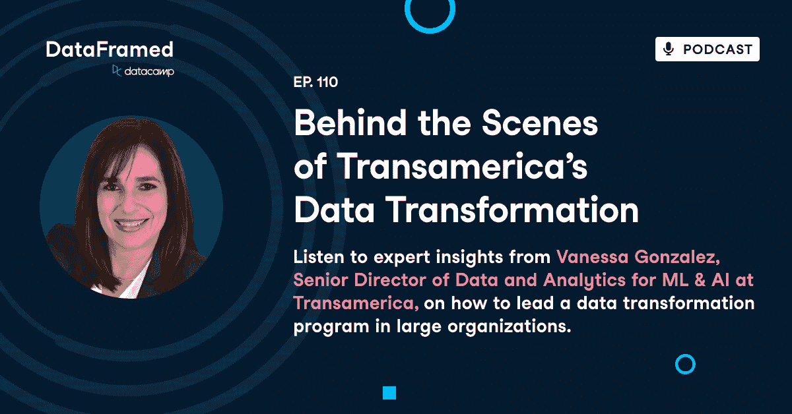

# Transamerica 数据转型的幕后

> 原文：<https://web.archive.org/web/20221212135909/https://www.datacamp.com/blog/behind-the-scenes-of-transamerica-s-data-transformation>

[https://web.archive.org/web/20221210092647if_/https://embed.podcasts.apple.com/us/podcast/110-behind-the-scenes-of-transamericas/id1336150688?i=1000583670952](https://web.archive.org/web/20221210092647if_/https://embed.podcasts.apple.com/us/podcast/110-behind-the-scenes-of-transamericas/id1336150688?i=1000583670952)

数据营的常驻数据布道者里奇·科顿(Richie Cotton)最近采访了 ML&AI at[Transamerica](https://web.archive.org/web/20221210092647/https://www.linkedin.com/company/transamerica)的数据和分析高级总监瓦妮莎·冈萨雷斯 。

# 介绍凡妮莎·冈萨雷斯

里奇·科顿:欢迎来到数据框。我是里奇，今天我们要谈论的是数据转换程序。每当我与 data camp 的客户交谈时，最常见的对话之一是这样的。嘿，我们知道我们需要更好地处理数据，我们的首席管理人员也终于明白了这一点。所以现在我们要做一个数据转换程序，但是有点难，我不确定我们到底需要做什么。

因此，在 DataCamp，我们花了大量时间指导组织了解谁需要什么样的数据技能来实现数据现代化。我认为罗宾必须一次告诉一个组织。让我们来听一个经历过这一转变过程的人的故事，并讲述她的战争故事。

今天的嘉宾是 Vanessa Gonzales，她是 Transamerica 机器学习和人工智能数据和分析高级总监，同时也在帮助 Transamerica 完成他们的数据转换计划。Vanessa 也是一名高级数据经理，所以我期待一些伟大的领导见解。

你好，凡妮莎。谢谢你今天和我在一起。我很高兴能和你聊聊你在泛美公司的近况。首先，也许你可以给我们一点背景，关于什么是泛美航空公司。

瓦妮莎·冈萨雷斯:你好，里奇。非常感谢你。所以泛美是一家金融机构。我们做退休，我们做员工福利。当你听说一家公司，例如，当你开始在那里工作，他们给你一个 401k，他们给你一些福利，你可以从中选择，这就是 Transamerica 所做的。

另一方面，Transamerica 可以直接向客户销售一些产品和年金福利。所以我们做了一点。我们在退休方面确实很出名，但我们也进入了许多其他产品，如员工福利和保险。

里奇·科顿:太棒了。所以你的职位是 ML 和 AI 的数字和分析。所以也许你可以多解释一下你的团队是做什么的。

Vanessa Gonzalez:我有一个数据科学家团队，我的团队中还有一个业务系统和分析师，我与工程师和架构师密切合作。但是我们真正做的是。想想我们该如何帮助我们在那里的生意？这非常令人兴奋，有许多不同的主题，我们有许多不同的方式来做这件事。

但是我们所做的是，我们使用机器学习。我们使用人工智能为我们的业务创造更多价值。我们帮助他们解决问题，并确保通过这样做，他们可以更好地完成工作。他们也是，我们可以更好地与客户相处，让他们有更好的服务。

里奇·科顿: 你的团队遇到过什么特殊的业务问题吗？

瓦妮莎·冈萨雷斯: 是的，我们从事许多不同的工作，而我们工作的有趣之处在于它永远不会是一样的。所以如果你今天问我，一年后问我，这些项目将会完全不同。但是，为了让您对我们的工作有所了解，我们重点关注四个不同的领域。因此，我们所做的一切都是为了增加客户的保留率或创造增长。

因此，真正发展我们的业务或改善客户服务。因此，它可能来自呼叫中心，也可能来自我们如何处理流程以及我们如何实现某些事情的自动化。如减少，您在电话上等待的时间，例如，或，或者如果您的呼叫被路由，则被路由到正确的位置。我们还努力降低业务成本。

因此，根据我们的合作对象，我们会做不同的事情。我们所做的一切都将有一个机器学习模型，它将驱动这些有助于我们业务的预测，然后我们将它们集成到我们现有的系统中。举个例子，如果我们想让我们的顾问知道谁更有可能被留用。

我们通过给他们一个预测来帮助他们，然后他们可以打电话给这个人，和他们交谈，想出我们如何帮助他们解决他们可能遇到的问题。这就是我们做的事情。我们还做了很多其他的模型来区分优先级。

例如，如果我们想知道哪些索赔可能是欺诈性的，我们可以看到，好吧，这 10 个索赔看起来更像欺诈。所以我们也可以为此做模型。

## 泛美的团队结构

里奇棉: 那真是太迷人了。您提到，您有一些数据科学家和您的团队数据架构师和工程师。所以也许你能告诉我这些人是如何一起工作的。你的团队是如何构成的？

瓦妮莎 确定。因此，我的直接团队更多的是数据科学家和业务分析师，但我们与数据工程团队、第三个体系结构团队和一个 BI 团队密切合作。所以，我们做这件事的方式是，正如我们常说的，机器学习是一项团队运动，所以你需要与所有这些团队合作才能让它工作。

因此，你要构建的每个模型或每个解决方案都有三个部分。你将有一块你把数据带进来，然后我们，我们需要那里的架构师和工程师把数据带到云中，让我们可以访问它。

然后我的团队中有数据科学家，他们将开发这些模型。他们会把数据带来。操纵数据。他们将与它一起工作，训练模型，开发它们。一旦他们准备好进行部署，我们就需要与 DevOps 团队合作，以确保我们将如何部署解决方案。

我们需要将这种模式从开发一直带到。将环境提升到生产的全过程。然后还有另一部分。我们需要将这些模型的结果或这些模型的输出整合到解决方案或应用程序中。Salesforce 也可能是，它可能只是云上的一个红移表。

我们也可以在科尔中心使用 Call Miner 等其他解决方案。这取决于我们希望输出的时间和位置。然后，我们将不得不与他们合作，我们再次需要工程师、DevOps 和建筑团队来帮助我们。这就是我们如何互动的地方。

因此，我们可能不会让每个人都在同一个团队中，但我们必须与所有这些团队合作才能实现这一目标。当然，业务是最重要的部分，或者说是最重要的团队，因为我们真的在努力让他们解释他们在处理什么，他们有什么问题，他们在整个过程中也帮助我们获得反馈，我们给他们的结果是什么。

然后我们调整我们的模型，然后我们能够在那里做更多的事情。

里奇·科顿: 这真的就像许多不同的团队参与进来，只是为了得到这些数据问题的答案。不仅仅是数据科学在孤立地工作。我喜欢那个

瓦妮莎 一点不错。所以，当你想到一个数据科学家，如果你认为他们只是躲在房间里工作，做他们的事情，嗯，不是真的。他们需要与其他团队进行大量的交流。他们需要大量的合作。所以对阿达来说，一个好的数据科学家应该是喜欢合作，喜欢在团队环境中工作的人。

如果没有，他们将无法开发出与你整合所有这些团队时同样高质量的模型。

## 推荐给数据科学家的技能

里奇·科顿:我 认为那是，那是真正有用的建议。确实需要这些沟通技巧。实际上，也许只是那件事的延续。你认为对于数据科学家来说，有没有像沟通这样的特殊技能或者其他软技能很重要？

瓦妮莎·冈萨雷斯: 是的，当然。所以有一项技能不容易找到，而且非常非常重要，那就是不仅要知道如何沟通，还要知道如何翻译。非常技术性的工作，因为你将不得不与 B 一起工作，与从未见过模型或不知道它如何工作的商务人士一起工作。

因此，你需要能够来回交流，理解他们想要告诉你什么，同时也能够用同一种语言分享你的发现和你想要告诉他们的事情。那个翻译，看起来很容易，其实没那么容易。有时候，你必须用非常简单的方式解释一个非常非常复杂的模型，有时候，业务必须解释他们的流程，对于数据科学家来说，这些流程可能非常明显，他们从未接触过这些流程，所以这并不像人们想象的那么明显。

所以，沟通技巧，绝对重要。

里奇·科顿: 你有在你的组织中做得非常好的成功案例吗？或者任何不太成功的灾难故事？

瓦妮莎·冈萨雷斯: 不，绝对是。对于数据科学家来说，你知道我们总是说，哦，这是召回，这是我们模型的精确度。嗯，这对业务没有太大帮助，因为他们不知道什么是回忆，什么是精确。或者如果我们在谈论任何人的准确性或 F 分数，我们在谈论什么？

因此，我的团队中有一位数据科学家，他令人敬畏。与他们的交流。因此，他可以说，他可以告诉企业，而不是使用真正的数据科学术语。在这种情况下，它是一个，一个与自然语言处理有关的模型。我们讨论了有多少，比如，模型如何识别通话中的主题，以及转录。

这样他才能够真正地向业务上解释。这个模型有多精确？通过使用一些更简单的术语，比如说，好吧，每 100 次呼叫中，模型将能够正确地告诉我们 20 次主题是什么，然后在另一个 20 到 20 次中就不那么确定了。但在五次中，他们很好，所以他们，他真的能够解释。

我们试图用模型的结果或模型的度量标准来表达什么，以某种方式让企业理解并说，哦，82%的情况下猜测主题对我们有好处。这甚至比我们从自己人那里得到的还要好。所以我们对这个数字非常满意。

然后我们就离开了，谈话就从那里开始了。所以那将会是一个非常成功的时期。我们曾经尝试过给出指标和。房间里鸦雀无声。所以当你知道你必须用不同的方式解释，让房间里的每个人都明白我们想说什么的时候。

还有你们，他们不应该知道机器学习。所以我们必须能够说，我们会增加什么价值，以他们更多的条款和方式去做。所以这总是一个有趣的对话，但你学习它，你会变得很好，通过练习和关注，你真的可以把翻译做得很好。

里奇科顿: 这看起来确实很重要。我认为你的观点之一是，如果业务人员不理解你在说什么，那么它对组织的其他部分没有影响。

瓦妮莎 一点不错。

## Transamerica 的数据转换程序

里奇棉: 好极了，妙极了。所以，你一直是泛美大数据转型项目的一部分。

或许你可以简单地告诉我这个数据转换计划的目标是什么。

瓦妮莎·冈萨雷斯: 是的，当然。因此，当我们谈到数据时，我们需要随着时间的推移，我们需要大量的数据，但我们需要以一种更简单的方式来访问这些数据。我们需要。快速访问它。我们需要能够在一个地方找到数据，我们需要确保或知道我们将用于任何用途的数据是准确、完整和及时的。

所以，我们是一家已经存在了很多很多年的公司，我想有一百多年了。它也是通过收购形成的，并以多种方式发展。它已经进行了多次重组。因此，我们有许多数据来源，我们需要确保我们可以访问我们拥有的所有数据。

此外，想想像我们这样的公司，我们做退休。如果有人在 30 多岁时开始使用 401K，他们可能要到 30 年后才开始使用。所以你有已经和我们在一起 30 年或 35 年的客户，这意味着我们必须保留所有的数据，所有他们在这段时间的计划中所做的交易，或者如果他们可能已经结婚，然后离婚，然后他们有了孩子。

随着时间的推移，他们的所有受益人都发生了变化。所以有很多数据。因此，我们在数据转型方面所做的实际上是将所有数据从本地服务器转移到云上，我们正在努力实现现代化，以确保我们将所有数据放在一个地方，所有数据都经过管理，可访问，真正做到。

安全方面也受到良好的监控。我们想保护我们的顾客。我们不希望他们的数据到处都是，所以我们必须确保我们做了所有这些事情。因此，通过进行数据转换和数字转换，我们可以做得更好、更仔细，并以更好的方式使用数据。

当我们将数据转移到云中时。我们还确保它的质量，确保我们正在查看我们是如何使用的。如果我们在七个地方有相同的，呃，某人的记录，我们知道那个人的七个记录是同一个人。因此，我们在那里进行控制和身份解析，最重要的是，我们试图为我们的客户提供可用且不安全的数据。

这只是我们为什么要进行数据转换的一些例子。但是你可以想象，这是一个巨大的项目，也是一个非常令人兴奋的项目。

小齐棉: 绝。我是说，我会考虑这些数据。我们在 Data Camp，这个公司已经存在了差不多 10 年了。我们已经有来自这么多不同地方的这么多不同来源的数据，所以，你所说的某人有人寿保险或退休保险，你必须在他们开始使用它之前管理数据完整性 30 年，这看起来是一个巨大的挑战。

你能不能跟我说说，你一开始是从哪里开始这个项目的，你在所有不同的地方都有数据，你试图管理这些数据。那么第一步是什么？

Vanessa Gonzalez: 所以，这方面的第一步甚至在我开始在 Transamerica 工作之前就已经开始了，我们开始思考，好吧，我们需要做些什么才能变得更现代。为了保护我们的数据安全，把它放在一个正确的地方。所以，第一件事是，决定这是我们想要的。

这对我们很重要。这将是我们战略的一部分。然后从那里，我们开始思考，好的。我们要怎么做？因为它很大。这是一个巨大的工程。这不是你能在一天内完成的事情，也不是我们能说的事情，好吧，每个人都停止他们正在做的一切。

我们会等一两年再做，然后继续做生意。我们必须让生意继续下去。对吗？所以你必须让这两件事同时发生。这也是很棘手的，所以，所以第二件事，比如首先你开始战略，你开始考虑你要怎么做，然后做的第一步是，创建那个架构，那个基础，那个，呃，就像你要放这些东西的小盒子，对吗？

所以你必须弄清楚你在云中的架构是什么？你要怎么做，你要怎么做？你会带申请表吗？你只带数据吗？你两个都要带吗？就我们而言，我们两者都在做。我们的想法是，在一年左右的时间里，我们会把所有东西都放在云端，可能在一两年内。

因此，我们已经将许多应用程序引入了云计算。现在我们带来了数据。我想说，我们大约有 25%的数据已经在云中，今年我们将在云中引入大量数据。我们的东西太多了，你带进来的时候要开始思考，好吧，我要清理什么？我要从一台服务器上下载数据，然后关掉服务器？

但是有多少流程会受到影响？通过移动这些数据。所以就想着报道吧。如果您将数据从 A 点移动到 B 点，则使用 A 点数据的每个报告都必须重构到 B 点。因此，这是同时发生的许多事情，您必须确定优先顺序，然后是什么先来，什么后来，以及您如何引入数据、应用程序和其他一切的顺序。

因此，第一步是准备好架构，准备好开始移动东西的地方，确保您拥有所需的安全性。你将如何访问这些数据和应用程序？就像你真的开始思考那个建筑。所以我们的建筑团队在思考这个问题上做了一件了不起的工作，获得了很多知识。

确保他们设置架构的方式对我们公司有用。因为每个公司都很不一样。所以我们不能说，哦，也许索尼是这样做的。我们也应该这样做。我们必须想出一个适合我们的架构，这个架构要适合我们的客户、我们合作的代理商以及我们合作的公司。

所以有很多不同的运动部件。一旦这样，你就开始把东西搬进来，你开始考虑，好的，我怎样把它们搬进来，我把它们都保留多久，或者在什么情况下我只是移动它们？我如何测试它？我如何访问这些新作品？一旦我们拥有了这一切，你就要开始考虑如何关掉旧的和遗留的东西，只保留新的。

## 按值排列数据优先级

里奇·科顿: 你提到了优先化，因为你需要决定将数据转移到云中的顺序。我在想你是如何区分轻重缓急的。首先是高价值数据，因为这是最重要的，还是低价值数据，因为风险较小？还是按团队做？或者怎样？对此你怎么看？ 你如何分清主次？

瓦妮莎·冈萨雷斯: 这是个很好的问题。因此，我们一直在做的是，在我们进行数据转型的同时，我们也在进行转型，以成为一家更好的公司。我们正在采取许多措施，努力做到更好，销售更多，更好地对待我们的客户。因此，所有这些新举措，我们正在做的是，我们认为。

这些计划需要数据，例如，我们正在改进我们的网站。嗯，网站需要这些类型的数据，所有这些片段，所以让我们把这些片段带到云上。因此，当我们创建这个新网站时，它将使用来自云的数据，而不是来自本地的数据。因此，我们根据引入新内容所需的数据进行优先级排序。

我们正在利用来自云端的数据来完成这一切。然后，我们开始思考我们在大多数系统中使用最多的数据是什么，在大多数情况下，报告我们的数据对我们来说非常重要。这也是一个数据。因此，我们正在引入我们拥有的第一组计划，我们看到了我们需要的数据。

然后我们看到，我们使用最多的最繁忙的数据库是什么？我们的退休数据库？我们引入了这一点，然后在接下来的几年里，我们将会关注，好的，在接下来的几年里，我们将会致力于什么样的计划？他们需要什么数据？我们在云中还没有哪些我们需要的数据？

然后我们把它带进来。实际上，最少使用的数据，或最少被系统列出的人，这些程序，是最后出现的一个。在一个完美的世界里，我们希望一切都在云端，这就是我们的前进方向。但是有些事情需要一点时间。我们一定要好好的。

这是一段旅程。这不会在白天发生。所以你必须有耐心，你必须坚持下去，坚持下去，让它发生。

里奇棉: 这个观点很好。我注意到，嗯，基本上在我工作过的任何地方，管理层对这些真正长期的技术项目都缺乏耐心，除非他们在早期看到了某种好处。那么，有没有什么地方，你认为你已经轻松获胜，或者你已经能够通过这种数据转换计划展示一些价值，而不是等到最后？

瓦妮莎·冈萨雷斯: 是的，没有。所以我们有一些增值的方法。你完全正确。你必须表现出一些附加值，因为如果没有，这就像投入了很多钱，然后你看不到任何结果。从来都不顺利。因此，我们正在做的是，当我们为引入这些数据建立基础时，我们开始，就像我们已经有了几个机器学习模型一样。

只是使用，就像我们所有的数据都已经在云端。还有一些其他的计划，比如我们有一个，做了一些客户掌握和数据，它已经在云中。我们制作的母版，还有一些其他的大计划，与我们的网站以及与客户的互动有关，这些都是云中所需的数据。

所以我们提前吃了一些。但是我们会继续前进，并在前进的道路上赢得更多的胜利。因此，我们的想法是，当我们创建所有这些计划时，这就是我们优先考虑这种方式的原因，这样我们就可以通过将这些数据存储在云中来获得附加值。

里奇科顿: 因此，对于这些大型技术项目，有时会感觉像是一种远离客户的后端工作。我只是想知道到目前为止对你的客户有什么影响？

瓦妮莎·冈萨雷斯: 所以我们的客户不需要或者不应该知道，他们不应该关心我们的数据在哪里。他们想要的是。数据不错吧？他们有，他们想准时举行。他们希望在需要时能够看到数据，他们希望有更好的数字资产或与我们的互动，对吗？

这就是他们看到我们正在做的事情的结果。他们不知道为什么，但是突然网站运行得更快了。或者，举例来说，突然呼叫被路由到一个更好的。他们真的不需要知道。数据从 A 点到 B 点的确切位置和方式，以及为什么需要更长或更短的时间。

但是他们看到了其中的好处。正如我在一开始所说的，通过我们所做的，通过数据转换，通过机器学习和人工智能的应用，我们所做的真的是。改善我们的客户服务，然后这样做，那么我们也能够发展我们的业务，也让我们的客户和他们保持满意，对不对？

并且，降低我们的成本，这样我们就可以。把那个也传下去。所以一切都很好。。你看，除此之外没什么不好的。这需要时间和大量的工作。我认为，当公司经历这些数据转换时，这是一件很棒的事情，我一次又一次地听到，每个人都在这样做。这有点像我们现在必须做的事情。

我们可以呆在家里，等着，对吗？我们必须尽我们所能去一个更好的地方，这就是我们。

小齐棉: 绝。所以我很好奇时间尺度超越了什么。这是一段很长的时间，所以这个项目什么时候开始，你认为你什么时候会结束？

Vanessa Gonzalez: 我想这是几年前开始的，我们希望能在几年内完成，所以我想这可能需要大约四年的时间，或者说有些作品是随着我们的进展开始的，然后它们会在稍后结束，但是，我认为这或多或少是从开始到结束的时间框架。

这是一个非常酷的转变。我认为 19 是它开始的时间，然后应该在 2023 年底或 2024 年上半年完成。在那里的某个地方。

里奇·科顿:我们永远不知道 如果一切都按计划进行，2023 年底，更现实地说，稍微晚一点。好吧。我想谈一谈使用的技术，很明显，你们正在采用一些云工具。除此之外，作为这一转变的一部分，您的技术体系有任何变化吗？

瓦妮莎·冈萨雷斯: 是的，当然。所以我们几年前就已经在使用云了。但不是，没有那么多。所以我们在开发机器学习的模型，我们使用像 Domino 这样的工具，我们使用 Hadoop 和 Bitbucket。现在，我们转向 aws，这是我们正在使用的云技术。

我们正在 SageMaker 环境下进行机器学习开发。所以我们用现在的 SageMaker，我们用红移和 S3 桶。那些，那些，那些碎片。但我们也使用投标袋，所以我们的工具堆栈它。改变一点点。这个想法是，随着我们将更多的数据转移到云中，运行我们正在运行的模型将变得更加容易，并且越来越多地实时运行它们。

嗯，现在我们做批量生产，我们批量生产品牌。所以它，它变了。我们不得不为我们开发新的基础设施，因为正如你所想象的，像每个公司一样，也必须研究他们的安全和它是什么，什么有效等等。所以你必须把已经出来的东西混合起来。然后你安装自己的护栏，并遵循你为公司制定的良好实践。

所以我们整合了这些，我们非常兴奋，因为我们完成了我们的平台，现在我们正在那里开发。在我的团队里，我们会越来越有效率。所以这是一个非常激动人心的时刻。

里奇棉: 妙不可言。嗯，因为这是一项巨大的工作，除了你的分析和机器学习团队之外，还有哪些团队参与了这项工作？

Vanessa Gonzalez: 因此，数据转换是一项巨大的工作，整个公司都在发展。我们在业务和 IT 方面的领导，我们的 CTO 在这方面发挥了重要作用。如果你，如果你想所有的团队一样，他们是需要的。你需要制作团队。

你需要战略团队。您需要开发运维团队，如架构、工程团队，因为有很多团队需要致力于这种数据转换。有些人会研究如何建造基础设施。其他人会研究我们如何带来数据，数据。治理数据质量和数据科学团队在这里很重要。

业务团队和业务分析团队也很重要，因为他们必须设定在这种环境下他们需要什么才能进行商业智能和报告。嗯，他们需要真正参与支持的业务，因为现在他们从服务器上获取数据的所有流程，现在他们将从云中获取数据，这打开了许多可能性。

但在支付方面也有很多挑战，比如确保他们参与进来，这样他们就可以准确地告诉我们，哦，这个过程正在从这个地方获取数据。让我们确保，当我们迁移到云时，我们可以继续进行这一过程，并且我们指向了正确的位置。这就是数据转换的美妙之处和挑战所在，它需要每个人，而你不能只靠自己或在孤岛中完成，因为那样做是行不通的。

所以，你还必须进行大量的协调、合作和妥协。你必须开始真正思考别人需要什么，而不是你需要什么，然后找出两者之间的平衡点。所以有很多不同的团队在努力，但绝对值得。

里奇·科顿: 好的，我知道这是很多团队之间的合作。通常是非常非常困难的事情。所以我想知道你是如何管理所有这些需要相互沟通和协作的团队的？

Vanessa Gonzalez: 所以你说有些流程，你说领导必须要对齐，所以。它始于领导层真正参与进来，让我们的首席执行官、首席信息官和首席技术官都以同样的方式思考，思考我们要去哪里。那是一块。另一件事是，当你开始更多地了解我们如何完成工作时，我们会在几个团队之间召开大量会议。

举个例子，为了计算出我们将引入什么数据，我正在非常接近那个数据。我组织了一次会议，邀请了架构、工程、业务、项目管理办公室以及我们的数据和分析团队。这样我们就明白了，好吧，数据的要求是什么？

这些流程的业务所有者。那么已经存在的数据是什么呢？因此，我们与建筑、工程以及其他领域进行了交流，我们将如何引进这些技术？所以我们也要和他们谈谈。治理真的可以帮助我们，好吧，我们该如何治理这些数据呢？

助理牧师，我们要怎么治疗？当我们考虑质量的时候，我们会关注什么？什么是正确的来源？这不仅仅是把数据带到那里，然后把它扔在那里。你。弄清楚如果你是，如果你想像名字一样，我们从这个数据库，从这个数据库，从这个数据库把名字带到哪里。

哪个是正确的名字？所以我们必须在那里做一些控制。所以这些团队之间有很多合作。我们所做的是，我们定期见面，然后把它分成碎片，对吗？他们说，你怎么吃大象？一次一口。那么，如何进行数据转换呢？一次几个数据项。

你只是开始喜欢把小块小块的东西放进去，然后移动这些东西，确保你做的每件事都遵循那个目标，你用同样的方式去做，这样就更容易到达你想去的地方。

里奇棉: 我用程序想象。一定是什么地方出了问题。所以我想知道你发现了什么具有挑战性的事情，或者有什么你希望一开始就知道的事情吗？

瓦妮莎·冈萨雷斯: 所以我认为这是一件非常具有挑战性的事情，而且我们已经了解到，在每件事情的开始，你都需要非常好的要求。你必须确保。当你把你的需求放在一起的时候，你不能跳过任何，任何部分。例如，如果你有一个项目，你要从许多不同的地方带来数据，如果你忘记了几个片段，当你遇到他们时，他们不在那里，这是很难把这些片段带进来的。

当你提前计划，然后说，好的，这些是我需要的零件时，事情就简单多了。这些是我需要做的变换，这是从 A 点到 B 点到 C 点的地方，这是它离开的最终位置。我打算这样策划。比带八成容易多了。

还有这样子的，那 20%。哦，我们还需要另一块，但是不够。因此，我认为这是一件具有挑战性的事情，在开始移动数据以真正满足这些明确的要求之前花些时间确实是有意义的。那是一块。另一个类似的挑战是，你必须继续做你正在做的事情，并为新的事情腾出空间。

所以你必须确保你是。做你的日常工作，对吗？与此同时，你必须把重点放在新的东西上，这意味着更多的工作，意味着更多的努力。完全值得，但你必须小心如何，如何去做。因此，你不会像往常一样不做你在 BAU 的工作和业务，同时，你也在创造新的东西。

然后你从什么时候开始从旧的走向新的。考不好还得真的考好。你能想象吗？你没有旧的，新的不工作，这将是非常非常糟糕的。所以我认为这是我们都学到的东西，在某些时候，当我们认为我们将投入生产时，它并不像我们想象的那样工作，因为我们错过了一些东西。

所以你有 B 计划总是好的，好的，如果我在投入生产之前，我会测试它，确保它能。然后你，你把两者都保留一会儿，然后你，你取消旧的。这些都是挑战，但绝对是我们必须思考的事情。

永远考虑 A 计划、B 计划和 C 计划，以防事情按计划进行。因为当你计划的时候，做最坏的打算，期待最好的结果，或者类似的话，俗话说，我不确定，但是你最好做好一切准备

小齐棉: 好了，。是啊。所以这看起来真的很重要，尽量避免引入新的错误。就像你移动数据一样。所以我很好奇，对于我们如何进行测试，你还有什么要说的。

瓦妮莎·冈萨雷斯: 所以，是的，所以我们有一个非常好的项目来测试。比如机器学习方面我可以多说一点。我们确保在自己的环境中进行测试。我们有一个专业的研究环境，因为我们使用专业的数据训练，但是我们。同时在一个开发环境中。

所以我们做了所有的测试，检查我们的模型是否正常。我们确保我们得到的输出是我们所期望的。一旦从那里，然后我们把它带到所有的环境。因此，我们从那里开始，进入开发模式，然后将其移至测试模式，再将其移至模型模式，然后移至专业模式。

所以在所有这些工作中，我们。一次又一次地检查一切是否正常，我们没有影响任何其他流程或任何其他部分。我们为测试做的另一件事是，我们的生产团队有一个生产流程，你必须经历它，当我们在环境中移动时，他们检查他们的扫描。

他们确保如果东西坏了，如何修复？到了生产的时候，我们很放心我们所做的是我们所期望的，不会有任何问题。我们总是有 B 计划，如果有一些问题，解决这些问题的方法是什么？

我们总是做好准备，以防万一。

Richie Cotton: 除了这种多层测试之外，你还可以找到诊断问题的方法，并制定备份计划，以备不时之需

瓦妮莎·冈萨雷斯: 是的，我们知道，好吧，如果我们突然丢失了一两天的全部数据会怎么样？嗯，我们有，哦，我们可以用这个备份，我们可以用这个。就像总有一个 B 计划来减轻我们可能遇到的问题。根据问题的严重性或重要性，有多少系统会受到影响？

然后我们。备用系统。如果出了问题，后备力量就会介入。所以我们确保我们总是在一个好的地方。所以这是一些公司做的事情，包括我们的，以确保我们满足援助，任何，任何可能发生的问题。对吗？所以这样的话，就像你想象如果，如果公司不这样做，那么你将什么也做不了，对吗？

就像你的银行突然倒闭，你什么也做不了。那不会持续很长时间。

里奇棉: 耶。当所有这些系统都瘫痪时，很难赚钱。呃。好吧。我想谈谈技能。这看起来像是因为一切。变化相当快。在您的团队中，更广泛地说，在您的组织中，这如何改变了您在团队中寻找的技能组合？

Vanessa Gonzalez: 就技能而言，我们真正寻找的是数据科学家和他们愿意学习的人。因为事情会不断变化。几年前是什么样子，是某种编程语言，后来我们改变了。然后 Python 就变成了我们现在用的这个。但是，如果您正在使用，如果您在云中，他们需要了解一点如何在云中部署。

然后视乎，所以一切都变了，对吧？工具组可能会再次改变。因此，当我为我的团队寻找人才时，我不只是寻找他们所知道的，而是。他们学习的意愿有多好，因为这是我认为数据科学家最重要的一点，至少对于机器学习和人工智能来说，你必须为变化做好准备。

我们现在可能有 Salesforce 作为 crm，但谁知道呢，也许两年后我们会改变。所以你必须准备好以一种非常开放的方式思考我们如何整合我们的输出。如果我们改变系统，或者如果我们带来一个不同的应用程序，我们不能，我们甚至不知道存在，对不对？

因此，也许两三年后，情况会完全改变。所以我们必须在技能规模上做好准备。对于我的团队来说，我一直在寻找一种强烈的统计学和数学意识。对你如何思考的科学的理解。我会有一个假设，然后我会证明它，然后我会这样做。

就像对如何解决问题有一个非常有条理的想法。我认为这非常重要。和语言，我们可以学习它们。新的软件，我们可以学习它，但是我们，难教的是学习的能力。这就是我一直在寻找的。

小齐棉: 好吧。当然，技术变化很快。你将要使用的软件每隔几年就会发生变化。这真的引起了我的共鸣。但是，是的，我喜欢这个想法，你总是需要愿意学习新事物。因此，就这一点而言，实际上，当你发现你的团队中存在技能差距时，你是在内部培训员工，还是从组织外部雇佣员工？

瓦妮莎·冈萨雷斯: 所以我们两方面都做了。就像有时我会让那些有 D 类技能的人带来他们自己的技能。其他时候我也是，我们的团队非常支持学习新技能的培训。例如，我的一个团队成员，他对自然语言处理非常感兴趣。他做到了，我们在这方面提供了很多培训，他在工作中也学到了很多。

对。在其他情况下，我的一个数据科学家，一个统计学家，带来了很多关于统计的知识。所以我认为，对于机器学习和人工智能团队来说，这是非常重要的，或者至少我认为这是非常重要的，有不同的背景，数据科学的魅力之一就是你可以成为物理学家、统计学家或计算机科学家。

就像有很多不同的背景，你如何到达那里。对我们来说，当这种情况发生时，我们会感到很惊奇，因为。我们，他们带来了不同的技能，他们可以分享和教授给团队。因此，我们做的事情和我们非常有目的的事情是，我们有很多关于分享的会议，以便他们可以互相帮助，互相学习。

要成为一个成功的数据科学团队，你需要能够做到这一点，因为没有人会具备所有的技能。这是不可能的。即使在你自己的团队中，诺博，也不是所有人。我可以拥有所有的技能。所以你需要有人在一个领域有很强的技能，其他人在另一个领域也有很强的技能，然后他们互相分享，互相教导，互相帮助。

那是我最看重的东西。我知道他们参加了数据营，并且不时会有人研究深度学习。另一个可能会调查另一个。所以根据他们想学的东西，他们会向不同的方向发展。

这也取决于他们目前专攻什么。他们不得不做的事。

Richie Cotton: 我喜欢你的团队使用 data camp 进行持续学习，并提高他们的技能。那太好了。你谈到了你的团队需要擅长翻译技术。商业人士可以理解的问题，学习心态的重要性，理解统计学和假设检验的重要性。

你认为团队中还有其他什么能让人们成功的因素吗？

瓦妮莎·冈萨雷斯: 所以我认为创造力是非常重要的，因为并不是所有的事情都像我们希望的那样发展，而且要有找到解决方案的积极态度。我们没有机会说，哦，不，这不可能。就像我们更关心如何让它工作？数据不在完美的地方。

嗯，我们让它工作。我们必须适应这种做事方式，因为。它会保护我们数据的安全。好吧，我们适应并让它发挥作用。所以在我的团队里，对我来说，这非常非常重要。当他们看到一个问题时，他们很有创造力，会找到解决方法，不会放弃，就像找出解决方法一样。

对我来说，这个解决方案非常有价值。而且发生的次数不止你一个，不止一件事。你去学校，他们给你完美的数据集，他们说，建立这个美丽的模型。它总是有效的，对吗？所以你会想，哦，是的，我，我尝试了这五种不同的技术，哦，工作真的很美。

你走进现实世界，感觉就像，嗯，我该从哪里开始呢？数据真的真的很诡异。所有这些作品都很有创意，会让你成功的。所以，呃，要满足创造力和积极的态度，那才是真正能让它发生的。

小齐棉: 绝。我喜欢这样。好了，最后，在机器学习和人工智能的世界里，有什么是你真正感到兴奋的吗？

瓦妮莎·冈萨雷斯: 所以我，我，我不得不说我热爱这一切，这让我在这个世界上感到兴奋。这真的是改变的可能性。我喜欢这种模式，当你创造它们时，你有一个输出，这个输出以一种客户甚至不需要知道的方式被使用。

或者，在这种情况下，我们的商业客户，比如我们的业务部门，你在许多方面让他们的生活变得更轻松，他们不必为此担心。这就像是自动的，AIP 做规定的事情和做决定。对我来说，这是非常令人兴奋的，令人兴奋的，能够使用实时数据，实时运行模型。

我认为这是让我每天都非常兴奋的事情，我期待着并尽可能多地努力。

里奇棉: 妙不可言。是的，所以我认为人工智能和。呃，自动驱动决策。听起来太棒了。是的，还有实时分析。美妙的东西。那么，对于其他试图开始数据转换计划的公司，你有什么最后的建议吗？

我想说的是，不要去想它有多复杂或者有多大，而是去想你会从中得到什么。所以我认为我最大的建议是，当你玩得开心的时候，这并不容易，而且很漫长，时间过得很快。所以享受旅程，让它发生吧。我想这就是我要说的关于数据转换和机器学习和人工智能，我只是。

无论你在哪里，我们都可以做很多事情，你也可以做很多改变。你是什么行业，什么类型的企业，真的不重要。总有一种方法可以帮助人们，帮助其他人，让他们的生活变得更容易，这是我们可以利用的。所以这就像，如果那是你所关心的，那是一种很棒的感觉。

里奇·科顿: 让别人的生活更轻松。听起来很棒。太好了。好吧。非常感谢瓦内萨抽出时间。那真的，真的很有启发性。非常感谢。

Vanessa Gonzalez: 非常感谢你们邀请我，并祝大家好运，他们正在数据科学、机器学习和数据转换领域建立职业生涯。超级有趣的事情。