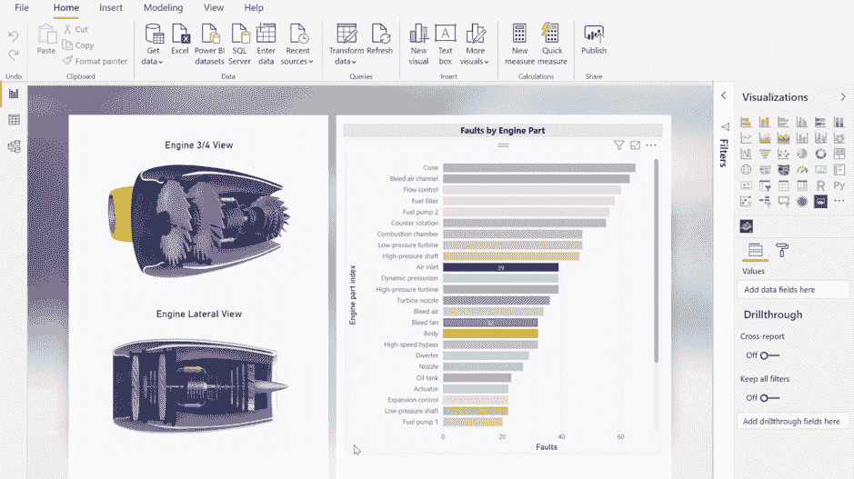
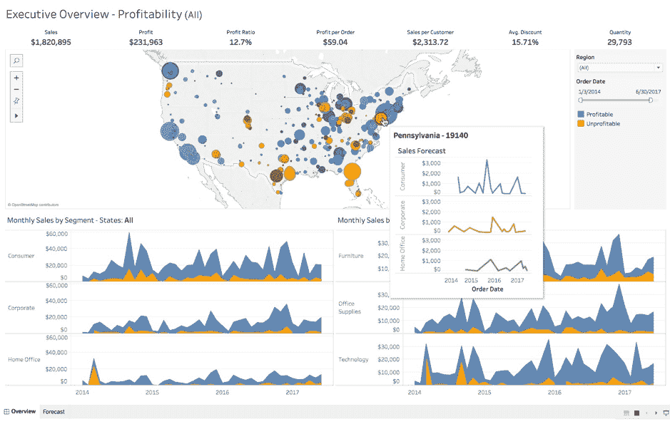
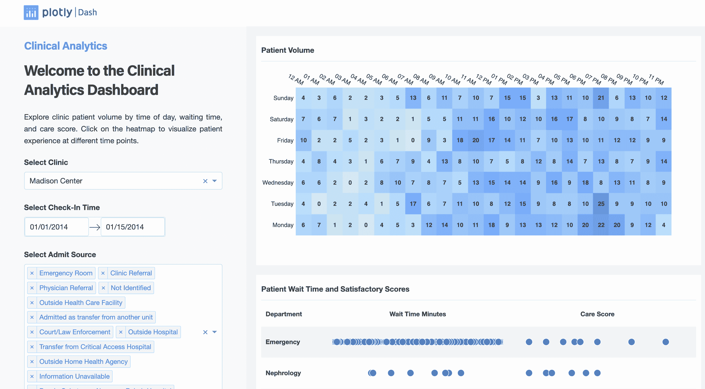
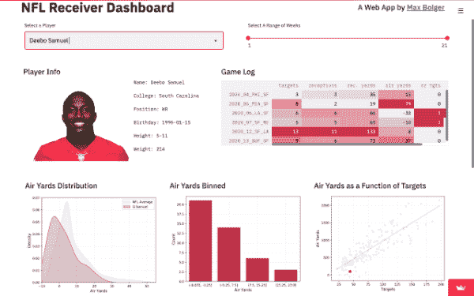
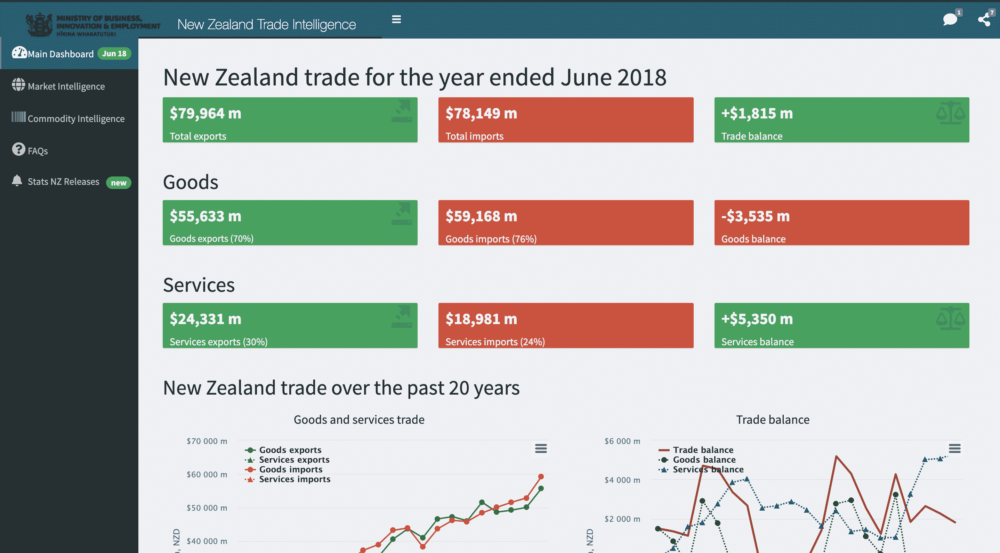

# 设计仪表板的最佳实践

> 原文：<https://web.archive.org/web/20230101103007/https://www.datacamp.com/blog/best-practices-for-designing-dashboards>

随着全球数据量的快速增长，将这些信息识别、处理和可视化为易于理解和共享的形式，从而使其具有可操作性变得越来越复杂。这就是仪表板的用武之地。

仪表板是分析过程中的一个关键组件，因为它们以易于理解的形式为各种利益相关者提供了信息的简要概述。仪表板的最终目标是帮助用户做出最佳决策，并利用这个不断增长的数据池。

本文将深入探讨设计高质量仪表板背后的艺术和科学——并概述您现在就可以开始使用来部署仪表板的工具。

## 仪表板有哪些不同的类型？

选择正确的仪表板对于提供有效的数据洞察至关重要。然而，随着[不断增加的数据量和复杂性](https://web.archive.org/web/20221212135819/https://www.statista.com/statistics/871513/worldwide-data-created/#:~:text=The%20total%20amount%20of%20data,replicated%20reached%20a%20new%20high.)以及各种不同的受众希望使用仪表盘来消费数据，人们很自然会对如何设计仪表盘感到不知所措。构建仪表板时，了解哪一类仪表板最适合您的特定受众至关重要。最常见的仪表板类型如下:

### 1.运营仪表板

运营仪表板监控实时数据，跟踪各种业务运营的端到端性能，并通过清晰的数据可视化交流见解。这些仪表板旨在用于日常工作流，并提供对时间敏感的见解和实时发展的警报。运营仪表板持续更新，有助于一目了然的决策。这些仪表板的主要受众是经理和运营团队。例子包括

*   **营销仪表板**—网站绩效指标，如跳出率、用户终身价值、平均会话时间等。
*   **软件开发** — 系统崩溃分析、正常运行时间监控、云服务计费监控等。

### 2.战略仪表板

战略仪表板主要由 C 级主管、董事或企业所有者用来监控公司的长期 okr 和 KPI。它们对整个组织或部门的绩效提供高层次的更新。这些控制面板更新数据的频率低于设计为每天查看的操作控制面板。战略仪表板的创建非常复杂，因为它们需要准确地跟踪可以在不同数据源中找到的组织范围的指标。此类仪表板的示例包括

*   **组织范围内的**—跟踪收入和公司 okr，一目了然。
*   **部门范围**—跟踪从采购到购买的营销漏斗。

### 3.分析仪表板

顾名思义，这些仪表板用于分析和使用大量复杂的数据。现代仪表板工具为消费者和从业者提供了下钻选项、广泛的过滤器和处理大量数据的能力等特性。有了分析仪表板，人们可以不仅仅浏览指标，还可以调查数据本身背后的驱动因素和动态。

分析仪表板的主要受众更具有技术头脑，可以是数据科学家和分析师等从业者，也可以是希望挖掘洞察力的经理。分析仪表板的示例包括:

*   **财务**—财务绩效仪表板，能够按渠道、产品、资产等细分收入
*   **营销** —Google analytics 仪表盘提供高级指标，并能够深入了解渠道、推荐、流量来源等

## 如何创建优秀的仪表板

仪表板的主要目的是降低复杂性和提供清晰性。一个好的仪表板通过简单明了的数据可视化简化了复杂的信息。以下是一些仪表板设计的最佳实践，可以有效地与您的受众交流见解:

### 设身处地为观众着想

如果你想创建一个有影响力的仪表板，你应该对使用你的仪表板的观众产生深深的共鸣。这意味着要很好地理解你的听众的专业领域和技术知识水平。而且，你在设计你的仪表盘的时候，要深入思考他们最关心的洞察是什么。例如，营销分析师会更关心报告特定营销活动的仪表板。相反，营销领导会更关心一个报告整个营销漏斗的仪表板。这可以说是最重要的步骤之一，因为它将保证您的仪表板的采用。

### 清理杂物

仪表盘可能会很乱。尤其是因为它很容易让观众随意使用各种类型的图形、图表和表格。为了避免让仪表盘变得不可读、混乱，问问自己你所包含的内容是否与受众相关，并尽可能删除不必要的元素。此外，要认识到构建仪表板是一个迭代的过程。因此，在构建仪表板时，请牢记受众的反馈。

### 使用网格布局功能

在设计仪表板时，您应该考虑使用网格布局。根据 Tableau 的技术传道者和[仪表盘大全](https://web.archive.org/web/20221212135819/https://www.datacamp.com/blog/top-10-data-visualization-books)的合著者 Andy cotgreve 的说法，人类天生习惯于从左向右和从上到下看东西。使用网格布局有助于您的受众独立、直观地导航仪表板。在实践中，这意味着从左上角的高级指标开始，并在网格的右侧向下深入数据。

### 注意字体

尽管使用不同的字体和大小很有诱惑力，但一般来说，坚持使用不超过 3 种不同大小的字体。你应该遵循字体层次结构，保持标题大于正文，并使用粗体突出关键元素和标题。改变字体大小和效果也是一个很好的工具，可以将观众的注意力吸引到仪表板的特定元素上。然而，确保你适度使用它。

### 创造性地使用颜色

公平地说，颜色是任何数据可视化或仪表板中最引人注目的方面之一。因此，在选择数据可视化的配色方案时要花很多心思。这意味着在可视化中使用一致的调色板，并系统地使用颜色来区分组、重要性级别和不同种类的信息层次。

### 快速加载时间是一个胜利

在数码产品中，加载时间就是一切，仪表盘也不例外。无论你的仪表盘有多么丰富的信息和吸引人的视觉效果，如果它的加载时间很长，它将很难被采用。由于大量数据、仪表板内发生的转换、大量过滤器以及需要花费时间呈现的高度复杂的可视化，可能会出现较长的加载时间。减少装载时间的一个好方法是减少混乱，并确保复杂的数据转换存储在数据库的视图中。

### 测试您的仪表板的可用性

设计仪表板最重要的元素之一是它需要被测试。一旦你建立了一个原型，你需要站在你的观众的角度考虑他们是如何理解和使用你的仪表盘的。记下这些活动，看看如何让你的仪表板更有效率和效果。对于一个成功的项目，测试是关键。你要了解你的仪表板是如何被人感知的。这允许你基于这个测试反馈来迭代你的设计。

### 迭代和协作

如果你不能一步到位，这是完全可以接受的。创建仪表板是一个漫长而复杂的过程，您必须慢慢来。为了展示您最好的仪表板，您需要给自己时间来检查它，并获得更好的视角。最好的仪表板也要经历大量的迭代，每天不断改进它们需要时间——这是完全可以接受的。

## 创建出色仪表板的工具

仪表板很容易上手，有许多工具可供使用。然而，由于选项过多，很容易陷入分析瘫痪。在这一节中，我们将分解数据从业者目前可以用来创建仪表板的最常用工具。在评估使用哪些数据工具来创建仪表板时，请考虑以下功能:

*   **数据源连接器:**将一个工具连接到不同的数据源有多容易？
*   **协作功能:**某工具是否提供评论、编辑、分享、托管等协作功能？
*   **渲染速度:**一个仪表盘渲染加载要多快？
*   **易用性:**是需要编程知识，还是入门门槛低的拖拽式界面？
*   **成本:**是开源框架还是需要购买许可证？

以下是功能丰富的工具列表，可帮助您开始构建出色的仪表板和数据可视化:

### 1.功率 BI

微软的 Power BI 是最受欢迎的商业智能工具之一。由于其简单的界面和提供的广泛功能，它已经成为数据从业者和商业用户的默认选择。它有一个精致的拖放界面，搭配一个[庞大的数据源连接器列表](https://web.archive.org/web/20221212135819/https://docs.microsoft.com/en-us/power-bi/connect-data/power-bi-data-sources)，帮助您从一开始就构建生产就绪的仪表板。Power BI 使与其他团队成员的协作变得非常容易，允许您无缝地构建、编辑和共享—这种体验类似于使用任何其他微软产品，如 SharePoint。

**主要特征**

*   **直观的用户界面:**Power BI 中的界面确实很直观，尤其是对于习惯了微软套件的人来说。
*   **低成本:**与其他全功能 BI 解决方案相比，价格合理
*   **Azure 集成:**与 Azure 云服务集成得非常好，如 [Azure Data Factory](https://web.archive.org/web/20221212135819/https://azure.microsoft.com/en-in/services/data-factory) 、 [Azure Synapse](https://web.archive.org/web/20221212135819/https://medium.com/microsoftazure/what-is-azure-synapse-e56f2a8b8d31#:~:text=Azure%20Synapse%20is%20a%20limitless%20analytics%20service%20that%20brings%20together,or%20provisioned%20resources%20at%20scale.) 和其他数据连接器
*   **AutoML 特点:** Power BI 轻松集成来自 Azure 机器学习的[自动化 ML](https://web.archive.org/web/20221212135819/https://docs.microsoft.com/en-us/power-bi/transform-model/dataflows/dataflows-machine-learning-integration#:~:text=Automated%20machine%20learning%20(AutoML)%20for,data%20for%20training%20the%20model.) 构建模型。

**Power BI 仪表盘示例**

*   [欧洲贸易](https://web.archive.org/web/20221212135819/https://community.powerbi.com/t5/Data-Stories-Gallery/Trade-in-Europe/td-p/2052846)
*   [美国的用电量](https://web.archive.org/web/20221212135819/https://community.powerbi.com/t5/Data-Stories-Gallery/Estimate-Electricity-Energy-Usage-and-Cost-Back-to-School/td-p/785961)

### 2.（舞台上由人扮的）静态画面

Tableau 是当今功能最丰富的商业智能工具之一。它于 2003 年在加州山景城成立，现已成为现代分析师事实上的商业智能工具之一。它提供了一个拖放界面，使非编码专业人员能够轻松创建仪表板。 [Tableau](https://web.archive.org/web/20221212135819/https://www.datacamp.com/learn/tableau) 支持最高数量的数据源连接器，所以从不同的数据源获取数据不成问题。它提供了项目协作的能力，并允许您使用 Tableau Server 共享和托管仪表板。通过正确的规划、对内存数据存储和数据提取的支持，可以优化渲染速度。Tableau 建议使用这些[性能技巧](https://web.archive.org/web/20221212135819/https://help.tableau.com/current/pro/desktop/en-us/performance_tips.htm)来获得惊人的渲染速度。

Tableau 还有一个非常强大和活跃的[社区](https://web.archive.org/web/20221212135819/https://public.tableau.com/app/discover)，它得到了成千上万用户的支持，并且可以免费访问 [Tableau Public](https://web.archive.org/web/20221212135819/https://public.tableau.com/) 。与其他 BI 工具相比，Tableau Desktop 专业版的价格处于高端。

**主要特征**

*   **快速渲染:**在内存存储和数据提取的支持下，Tableau 在处理大型数据集时非常出色
*   **社区:**它有一个非常活跃的社区，可以激发灵感和解决问题
*   Tableau 自 2003 年以来一直在迭代和改进，因此使用它的体验非常流畅，没有任何错误。
*   **可定制性:**多种可视化、字体、颜色大小、行、列、网格、屏幕大小等特性可帮助您制作高度可定制的仪表板
*   **数据源连接器:**您可以使用内置的 [tableau 数据连接器](https://web.archive.org/web/20221212135819/https://help.tableau.com/current/pro/desktop/en-us/basicconnectoverview.htm)连接存储在不同地方的各种数据

**Tableau 仪表盘示例**

*   [地震随时间推移](https://web.archive.org/web/20221212135819/https://public.tableau.com/app/profile/zeerak.imtiaz1587/viz/EarthQuake1965to2016/Dashboard13)
*   [人力资源仪表板](https://web.archive.org/web/20221212135819/https://public.tableau.com/app/profile/ajay.varghese/viz/RWFD1-HRDASHBOARD/Overview)

### 3.Python 的 Dash 包

[Dash](https://web.archive.org/web/20221212135819/https://www.datacamp.com/courses/building-dashboards-with-dash-and-plotly) 是由[的创作者 Plotly](https://web.archive.org/web/20221212135819/https://www.datacamp.com/courses/introduction-to-data-visualization-with-plotly-in-python) 制作的开源库。它让您无需学习 HTML、CSS 和 JavaScript 就可以构建交互式 python 仪表盘。这是一个免费使用的软件包，你可以很容易地安装。Dash 提供了一种代码优先的方法来构建图表和仪表板，而不是拖放式 GUI。它面向更具技术性的受众，如数据分析师、数据科学家、ML 工程师、python 开发人员和数据工程师。要连接到不同的数据源，您可以依赖现有的 python 包，但是您需要使用代码来配置它们，这是一种开销。

因为这个解决方案是基于 python 的，所以它允许更大的灵活性来构建高度可定制的仪表板。然而，对于不熟悉 python 及其不同包的人来说，有一个陡峭的学习曲线。由于您是独自管理事物，可视化大数据集有时会变得滞后。此外，发布使用 Dash 构建的仪表板并不像点击一个按钮那么简单——它需要你将其打包并部署在 AWS、Heroku、GCP 等云服务上

**主要特征**

*   **基于 Python:**虽然基于 Python 意味着 Dash 比拖放工具有更陡峭的学习曲线——它也可以被认为是一大优势——因为它提供了高度的灵活性
*   **版本控制:**作为一个代码优先的工具，您可以使用 Git 等版本控制工具来存储和保存 Dash 仪表板的不同迭代
*   **开源:**这是一个开源包，意思是免费使用。
*   **可定制:**在可定制性方面名列前茅，这从他们的[仪表盘图库](https://web.archive.org/web/20221212135819/https://dash.gallery/Portal)中可以明显看出

**仪表板示例**

*   [新优步骑行](https://web.archive.org/web/20221212135819/https://dash.gallery/dash-uber-rides-demo)
*   [支持向量机(SVM)探索者](https://web.archive.org/web/20221212135819/https://dash.gallery/dash-svm)

### 4.Python 的 Streamlit 包

[Streamlit](https://web.archive.org/web/20221212135819/https://streamlit.io/) 是另一个完全开源的 python 包，它更侧重于创建和部署机器学习重数据应用。然而，它也是一个很好的仪表板工具。这个可视化包是为了迎合数据科学家而设计的，对于 python 用户来说，学习曲线相当低。Streamlit 有预定义的方法来构建简单的可视化。如果你知道使用[熊猫](https://web.archive.org/web/20221212135819/https://www.datacamp.com/community/blog/how-to-learn-pandas)的基本数据操作，这个库很容易上手。它提供了一些功能，如后台刷新、加速前端的数据缓存，以及用于共享的屏幕录制功能。

**主要特征**

*   **基于 Python:**类似于 Dash，它提供了高度的灵活性
*   **低学习曲线:**构建 streamlit 仪表板类似于在 jupyter 上使用[熊猫](https://web.archive.org/web/20221212135819/https://www.datacamp.com/community/blog/how-to-learn-pandas)，因此它为任何 python 用户提供了低学习曲线。
*   **版本控制:**作为一个代码优先的工具，您可以使用版本控制工具(如 Git)存储和保存 Streamlit 仪表板的不同迭代
*   **开源:** Streamlit 免费使用

**Streamlit 仪表盘示例**

*   [新冠肺炎数据和报告](https://web.archive.org/web/20221212135819/https://share.streamlit.io/panditpranav/svm_covid_tracking/main/COVID_app.py)
*   [蒙特卡洛估算圆周率](https://web.archive.org/web/20221212135819/https://share.streamlit.io/mesmith027/streamlit_webapps/main/MC_pi/streamlit_app.py)

### 5.r 的闪亮包装

可以说是 R 的杀手级应用之一， [Shiny](https://web.archive.org/web/20221212135819/https://www.datacamp.com/tracks/shiny-fundamentals-with-r) 是最好的基于编码的仪表板工具之一。Shiny 允许从业者在没有任何 HTML、CSS 或 JavaScript 知识的情况下用 R 开发成熟的 web 应用程序。自 2012 年发布以来，Shiny 已经经历了十年的迭代和改进，这使得它成为一款极其稳定、功能丰富的开源仪表板工具。与本文中其他基于编码的工具类似，它提供了高度的灵活性和可定制性，并且与其他 R 包配合得非常好。

**主要特性:**

*   与列表中的其他编码工具相似，它提供了高度的灵活性
*   **版本控制:**作为一个代码优先的工具，您可以使用版本控制工具(如 Git)存储和保存 Streamlit 仪表板的不同迭代
*   **开源:**这是一个开源包，意思是免费使用。
*   **可定制:**在可定制性方面名列前茅，这从他们的[仪表盘图库](https://web.archive.org/web/20221212135819/https://shiny.rstudio.com/gallery)中可以明显看出

**闪亮仪表盘的例子:**

*   [在印度寻找血库](https://web.archive.org/web/20221212135819/https://shiny.rstudio.com/gallery/india-blood-banks.html)
*   [纽约地铁交通动画](https://web.archive.org/web/20221212135819/https://shiny.rstudio.com/gallery/nyc-metro.html)

## 打破规则

没有比以用户为中心的设计和高质量数据可视化的仪表板更好的数据交流方式了。每个仪表板在目标、需求和限制方面都是不同的。然而，有一个共同的因素推动着他们每一个人的成功，这是一个积极的迭代过程。请记住，没有一个仪表板第一次是完美的。不断的反馈和改进是让您的仪表板更加高效和直观的唯一途径。

此外，仪表板不一定要完全实用。美学和功能性之间的权衡常常是一个错误的二分法。因此，只要你记住你的观众，以及他们如何与你的作品互动，你就可以不遵循严格的指导方针，尽情享受你的仪表盘和可视化效果。

有关数据可视化、仪表板和数据故事讲述的更多资源，请查看以下故事:

*   [[博客]数据可视化十大书籍](https://web.archive.org/web/20221212135819/https://www.datacamp.com/blog/top-10-data-visualization-books)
*   [【播客】数据团队需要的数据讲故事技巧](https://web.archive.org/web/20221212135819/https://www.datacamp.com/podcast/the-data-storytelling-skills-data-teams-need)
*   [[BLOG]更好地讲述数据故事的七招:第一部分](https://web.archive.org/web/20221212135819/https://www.datacamp.com/blog/seven-tricks-for-better-data-storytelling-part-i)
*   [[BLOG]更好地讲述数据故事的七招:第二部分](https://web.archive.org/web/20221212135819/https://www.datacamp.com/blog/seven-tricks-for-better-data-storytelling-part-ii)