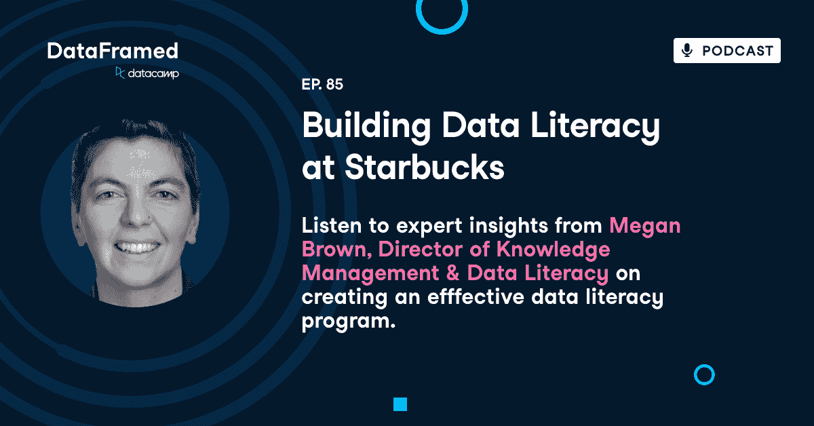

# 在星巴克培养数据素养

> 原文：<https://web.archive.org/web/20221129041532/https://www.datacamp.com/blog/building-data-literacy-at-starbucks>

[https://web.archive.org/web/20220926234434if_/https://embed.podcasts.apple.com/us/podcast/85-building-data-literacy-at-starbucks/id1336150688?i=1000561547159](https://web.archive.org/web/20220926234434if_/https://embed.podcasts.apple.com/us/podcast/85-building-data-literacy-at-starbucks/id1336150688?i=1000561547159)

DataCamp 播客 DataFramed 的主持人 Adel Nehme 最近采访了星巴克数据素养和知识管理总监 Megan Brown。

# [介绍梅根·布朗](https://web.archive.org/web/20220926234434/https://www.datacamp.com/podcast/building-data-literacy-at-starbucks)

Adel Nehme:今年早些时候，在我们的 2022 年趋势报告中，我们讨论的第一个趋势是组织将如何加快数据、文化和扫盲计划。有一件事证明了这一点，即组织内专门的数据角色的兴起，如数据、文化主管或数据素养总监，他们纯粹专注于数据素养和文化对话。

除了梅根·布朗，还有谁能更好地帮助我理解这些角色呢？Megan 是星巴克分析和洞察团队的数据扫盲总监。她成立了数据素养团队来推动分析、产品采用，并为业务利益相关者翻译复杂的概念。

在我们的谈话中，我们谈到了她的经历，推出了数据素养功能，以及她如何定义数据素养。作为她的计划的一部分，她希望改善的主要杠杆是什么，高管赞助、宣传和营销的重要性，数据扫盲计划，如何实现人工智能和数据科学的人性化，等等。

如果你喜欢这个播客，请确保订阅并评价这个节目，但只有当你喜欢它的时候，现在让我们开始吧。梅根。很高兴你能上节目。谢谢你邀请我来。今天能和你聊天，我真的很兴奋。你是真正站在数据素养对话最前沿的人，你为组织内的专业数据素养职能铺平了道路。

能否简单介绍一下你的背景，以及你将如何描述你目前在星巴克的角色？

梅根·布朗:当然。我是通过“为我而教”从一名五年级教师做起的。我没想到我会教五年级。我以为我会在高中教些东西，但我学到的是我非常擅长设计课程。

对于数学，但是对于英语语言艺术，最佳实践并不像我被告知的那样有效。所以我去了研究生院学习阅读理解，因为你要做的是研究最难的问题。获得了认知实验心理学博士学位。我工作的实验室做的是以前所知的神经网络模型。

现在深度学习语料分析。现在 NLP。然后是实验，当然，因为我们是心理学，你必须在我在的时候做实验。我也花了很多时间学习更多的 quant 方法。计量经济学，寻找我们正在建立的神经网络模型和结构方程模型之间的相似之处。

所以很有意思。那是我的爱好。2008 年后的某个时候，我的朋友们开始离开去做数据科学家。我就想，哦，这对我没用。我不一样，不管怎样。从某种程度上来说，很明显他们有更多的。工作中的乐趣。他们正在解决具有挑战性和有趣的问题，他们的发展速度比学术界快得多。

所以我穿越过来，开始做一个围绕人的数据科学家，数据科学。所以一开始，我的主要工作是为员工和大公司提供预测性流失模型，试图通过给他们一些预期，比如为什么那个人可能有风险，来帮助他们的经理更好地领导。

从那以后，我做了一些不同的事情。所以我进入了市场营销，数据科学，然后营销分析，我一直在疫情的人，领导。所以我转到了，我想我应该说现在我是知识管理和数据素养团队的一员。我的组织第一次做这样的事情。

那么，如果你想一想，知识管理正在使我们在过去三、四或五年中产生的作品变得非常容易找到。数据素养确保发现它的人知道如何使用它。

Adel Nehme:那真是太棒了。教学学术和应用数据科学的背景非常适合领导数据素养职能。

我想为今天的对话搭建一个舞台，并从某种程度上解开和分解在一个组织内推动他们的读写能力意味着什么。所以让我们从基础开始。你如何定义数据素养？

梅根·布朗:在星巴克，我们有一系列处理数据的技能。有些人对此相对紧张，而其他人只是每天都在数据中。

无法想象没有它做决定。我们的观众中有许多天才。因此，实际定义数据素养有点困难，因为有些人只是想使用仪表板。告知他们的决定。你想让其他人用正确的指标定义，对正确的数据进行编码并实际运行某种简单、直接的分析。

所以要看观众。这个回答很糟糕但是。所以在某种意义上，这是一个技能的连续体。因此，自从你的部门成立以来，你和你的团队一直致力于启动和迭代数据扫盲计划。因此，我很想了解数据素养策略的主要组成部分在哪里，以及您是如何着手设计您的程序的？

我们真的以为我们要去教授课程，对吗？这就是我们认为第一个月要做的事情。事实证明，在你可以向人们教授你的作品之前，你必须让他们能够接触到你的作品。所以我们遇到了这个问题，人们把项目藏了起来。他们从来没有正确地发射它们。

所以我们知道他们，因为我们在组织里，我们想把他们带进一个班级，但是我们没有我们需要的东西来很好地整合它。所以我们在知识分钟上投入了大量的时间。这实际上是在清理我们分享工作的习惯。

有时候，数据科学家可能对大型演示有点害羞，所以他们倾向于避开演示和发布。他们认为，像 Tableau 上的甲板或发射将跨越业务的鸿沟。但并不总是成功。我们开发了一个工具，我们称之为探路者。所以这是一个非常非常简单的搜索。

这是一个非常数据科学的知识管理问题的解决方案。你有一张桌子，上面有一个仪表板，允许人们搜索。我们做了一些发射训练。我们列出了所有的发射习惯。我们的组织为人们制作了一份菜单，这样其他人做得很好的事情就变得很明显了。

我们还涉足标准化数据工程过程，标准化我们共享代码的方式等等。这是我们第一次面对内部。我们目前的方法。所以我们认为我们要教的这些大班将会非常令人兴奋。我认为在疫情有一件事情变得非常明显，那就是人们厌倦了屏幕，对吗？

所以我们就像，好吧，我们要做的有点不同。现在我们已经两年了，我们要和团队一起努力。我们正在试行一个项目，这是一个为期六到八周的教育迷你课程，15 分钟的数据课程。我认为我们主要关心的一个问题是，点估计到底是什么？点估计是什么意思？围绕这一点的所有其他数据呢？所以深入研究一下为什么我们要用平均值。这就是使用平均值的问题？诸如此类的事情。这在团队层面非常重要，因为我们知道我们可以得到他们领导的认可，然后我们就是优秀的数据科学家，他们会衡量所有的东西。

Adel Nehme:那真是太棒了。总之，如果我一开始说错了，请纠正我，这些工作实际上是围绕构建数据团队如何与更广泛的组织进行沟通。然后你开始关注星巴克其他人的实际数据技能。

对吗？

梅根·布朗:是的。我发现，在我们倡导彼此的工作和采用之前，我们必须彼此分享我们所拥有的，即使是在组织内部。

Adel Nehme:关注打包、数据团队的输出和关注组织技能的其余部分之间的优先化过程是怎样的？

梅根·布朗:当然。我真的有点不耐烦了，所以这是我的风格。我是一个解决问题的人。如果你有问题来找我，我会努力解决，这可能是一个数据问题，一个数据科学问题。这也可能是一个文化问题。我意识到我陷入了越来越小的内部问题中，在这些问题上，我们无法获得我们第一次获得的回报。

要出去。所以我们决定转向。所以我们花了一点时间来摆脱内部的清理和组织，但是工作。但是我们已经在路上了。您在这里提到，策略的一部分是组织数据团队正在创建的知识，并使其可访问。

## 探路者

Adel Nehme:你称之为 Wayfinder 的工具，你介意告诉我 Wayfinder 是如何工作的吗？你在这个内部数据门户的工作中学到了什么？如我所说，这是一个非常合适的数据科学解决方案。我们创建了一个表，并在其上放置了一个仪表板。所以这是目前最棒的了。

梅根·布朗:随着时间的推移，我们越来越多地采用 API。从人们只是放信息的地方获取数据，并在后台将它们折叠到那个表格中。所以，如果你想一想你的利益相关者，他们在星巴克关心什么，他们会关心套牌，他们关心演示和发布视频。

他们会关心季度总结视频。他们可能会关心白皮书。他们肯定普遍关心仪表板。这些是我们在探路者中内置的第一批东西。我们还对 Wayfinder 进行了补充，这是一个分析和见解库，用于一些更具技术性的内容。

这是我们做的第二件事，从我们的代码共享平台和技术文档平台中提取。天哪，我们还能在里面找到什么？我们的售票平台也是如此。所以你可以开始看到所有的。我们项目的各个部分汇集在一起，但是我们的利益相关者不一定能够访问这些信息。

Adel Nehme:随着时间的推移，当你扩大推广时，组织的反应如何？

梅根·布朗:这让我们的差距变得明显，这是解决问题的一部分。如果你找不到关于这个项目的信息，你必须去找。希望当你和人们争论的时候，他们把他们的信息放入一个系统，你可以从这个系统中为我们的利益相关者提取信息。

我们在星巴克有这种叫做沉浸的东西。这是你认识整个组织的人的地方。你不需要一个官方的理由来沉浸，但有半个小时的时间来谈论你做什么，他们做什么，他们的狗做什么，所有这些东西。所以在紧急情况下，我会经常提起它，看看他们是否听说过它。

有一半时间人们会说，哦，我喜欢。我可以找到任何东西，然后马上应用到我正在做的事情中。这太简单了，比以前简单多了。这让我非常非常开心。其他时候我向他们介绍它。我希望下一次我和他们交谈时，他们会对此感到非常兴奋。

它确实激发了星巴克技术的一些工作，叫做搜索和发现。所以想想看，这只是为了分析。所以我们不会分享来自其他组织的东西。在这个疫情的世界里，未来我们要么是远程的，要么是混合的，我们一直在招募新人。

为什么他们必须在 70 个平台上搜索才能找到一个东西？这就是根本问题？我们如何能使这变得更容易？有趣的一点是，指标和指标定义最终成为了它的核心，因为这是要展示的东西。在其他方面，你可以谈论你的销售和交易指标，以及它显示的任何资料或视频，你应该能够将它们联系在一起。

## 星巴克的学习计划

Adel Nehme:当然，如果没有数据技能和教育，我们就不会谈论数据素养。你能告诉我你是如何在星巴克建立学习计划的吗？你最初的学习目标是什么？

梅根·布朗:所以我们有一个非常非常实用的重点。我们的主要目标是推动我们的工具和资源的采用。因此，虽然一个学习和发展组织可能关注的是，这是一个发行版和所有这些通用的东西，但我们非常关注的是，就像你在市场营销中一样。这是你的仪表板。让我们讨论一下这些仪表板中有什么，以及您可能做出的决定。

有了这些信息。这就是我们工作的核心，我们将做一些基本的数据素养构建。例如，我们将围绕机器学习做一些概念，但最终真的是服务。让人们使用我们的工具，在日常工作中做决定。

Adel Nehme:与营销团队的对话是什么样的，您如何调整您的计划的学习目标，以适应任何给定团队的业务成果或业务目标？

梅根·布朗:所以我们，我们现在只是试点。我要说的是，我们知道每个团队都有不同的需求。所以现在，在我们的试点项目中，我们正在与领导者合作，找出他们认为他们团队的机会在哪里。在未来，为了扩大规模，我们实际上需要把它变成我们自己。

Adel Nehme:我认为公司在设计数据技能计划或数据素养计划时，有时会陷入分析瘫痪，因为要教授这么多级别的能力，你需要考虑不同的角色需要不同的技能，等等。你能告诉我你是如何管理这种复杂性的吗？谁是你学习的主要角色？

梅根·布朗:我们根据人们的角色、兴趣、技能和学习方式开发了一些基于面试的人物角色。所以我们关注的基本角色是我们称之为顾客的东西。

这些人通常会带着请求来找我们，但有时在他们的工作中可能会也可能不会使用这些请求的输出。所以我们有这些合并的 8%。他们从各种各样的人到建筑商、倡导者和领导者，从那些实际上让我们的业务保持运转的人，到那些可能不使用数据的人，因为他们可以避免使用数据。

他们可能会使用一些数据，因为他们知道数据在哪里，但他们不知道其余的数据在哪里。然后也许还有。就像一个分析数据的分析师。他们知道它在哪里。他们已经问了足够多的问题来得到他们需要的一切。他们可以很容易地操纵仪表板。因此，他们已经提高了他们的技能，我们可以让他们学习其他东西，比如机器学习，让他们真正兴奋起来。

这就是，这就是我们所做的。所以我们选择了一两个人物角色来追踪。这就把空间缩小了不少。我要说的是，当我们为我们的技术人员、建造者和倡导者组织信息时，我们真的在挖掘星巴克的大部分企业人口

Adel Nehme:当接近这些不同的人群时，你是采用工具不可知的方法，还是专注于特定工具的技能提升？

梅根·布朗:我们追求星巴克使用的特定工具，我们必须非常非常实用。这对我们的许多合作伙伴和员工来说都是非常令人沮丧的。被告知事情是可能的，却没有被告知存在的事情。如果我们告诉他们事情是可能的，那会更糟。

然后他们实际上是这样的。

Adel Nehme:没错。我认为应用方法的真正美妙之处在于，你能够在人们已经熟悉的工具上获得灵感。那就是。我以前见过你讨论这个问题，你提到高管培训是如何在他们的团队中播下加速数字素养的种子的。

您能描述一下通过与高管进行这些学习会议来培养数据素养冠军的过程吗？

梅根·布朗:我认为一个组织不会改变，除非他们的领导人真的想要改变。还有。几乎可以说，我更愿意与领导喜欢的组织合作，是的，我的员工需要使用更多的仪表板来做出决策。

他们的衡量标准在每次演示中都是不同的。我从来不知道他们从哪里得到的数据。让我们解决其中的一些问题。然后，然后是一个领导者，对，数据。太酷了。所以说实话，当谈到喜欢与我们合作的团队时，我们确实会选择一些容易实现的目标，因为我的团队相对较小，我们需要在我们认为会产生影响的地方投资。

Adel Nehme:这总是来自愿意在这些数据转换项目上与您合作的领导层。

梅根·布朗:是的。如果领导不愿意对他们的团队说，使用数据做决策很重要。然后以某种方式激励，无论是社会还是积极的方面，激励人们真正转向使用数据来做决策，那么你不会得到你想要的改变。

你基本上会得到早期采用者，而不是其他人，因为其他人都像他们一样忙于自己的工作。

## 获得领导的认同

Adel Nehme:您能为我们介绍一下与一位犹豫不决并投资于团队数据技能的领导者进行的艰难对话吗？你是怎么开始那次谈话的？

梅根·布朗:我想说实际上更难的对话是人们说他们是支持的。这种情况在星巴克并不多见。他们说他们支持，但实际上，他们并不想投入时间来帮助他们的组织。所以它不会出现在第一次对话中。

没错。因为他们会说，哦，是的，数据素养。太好了。我上周在这篇文章里读到过，不管怎样。但是当你真的要求他们团队的时间时，我的心理学家就出来了，我谈论那些学习实际上发生了，行为改变实际上是如何发生的。

这就是，我想这就是我赢得人们的关键，如果他们没有实践他们日常使用的东西，这需要时间，那么他们永远不会改变他们的习惯

。对于许多商业领袖来说，在短期商业目标和长期积累利益的技能投资之间经常存在权衡。

Adel Nehme:你如何说服利益相关者投资一个长期项目，比如扩大规模？

梅根·布朗:所以我们在尽可能接近短期商业目标方面犯了错误。如果我们这周能改善人们的工作，我们真的很高兴。特别是，假设您从事营销工作，他们有，我们有三个营销仪表板，我们知道您只使用其中一个。

因为我们追踪用户。我们可以把你介绍给另外两个人。我们可以简单地谈谈这些概念，并让你使用它们。我认为我们要努力的方向实际上是拥有一群想要更多的人。那么第二层次的教育是什么样的呢？我们还不确定，但我们希望更多的拥护者向我们的分析和见解团队提出更难的问题。

所以，就像更具体的问题，不仅仅是数据透视表，可能有一个模型的东西，要达到这个模型，我们需要超越应用，但应用才是现在需要的。你在这里提到了营销，我认为在成功的数据、文化或数据素养项目中，一个未被充分讨论的杠杆是在营销中宣传的重要性，即获取数据技能的价值。

#### 挑战和最佳做法

Adel Nehme:您能向我介绍一下您在 start 推广和宣传数据素养计划的过程中遇到的挑战和获得的最佳实践吗？

梅根·布朗:数据科学家不一定是营销人员。我们在第一季度了解到的第一件事是，嗯，也许我们目前的渠道不起作用。所以我们开始拓展现有的渠道。我们已经做了很多，在我们提出新的解决方案之前，我们使用了大量的用户研究，包括内部和外部。我们提出的一个问题是，你如何获得数据信息。有时答案并不令人满意。有时他们无法从数据中获取信息，这很有挑战性，因为我知道星巴克内部有很多人试图将信息传播到世界各地，但这意味着我们没有正确的渠道。

我认为我们已经建造了很多。我们有一份非常棒的组织时事通讯，很多人都收到了，我试着让我的团队在时事通讯中加入一些东西。每次出去的时候。当前的挑战之一是疫情人民的习惯已经改变。所以，在星巴克，时事通讯曾经非常有效。

我觉得有点累了。人们一天要开几个小时的会，不一定有时间深入阅读。所以我们的信息变得更短了。驱使人们去寻找资源，但我认为我自己也有一个未解决的问题，我认为不同组织的人们正在不同的地方获取我们无法获取的信息。

所以我的部分问题是，好吧，这些地方在哪里？他们例行检查什么？作为一个局外人，我如何接触到他们？我怎么才能把我的信息放进去？所以感觉更分散一点。那是在开始的时候，很有挑战性。我们有一群只在星巴克工作过的新人。

在以前，星巴克是一家非常注重关系的公司，你可以通过关系获得很多信息，我们真的希望打破这种权利，让它脱离关系，让它成为人们可以很容易找到的系统化的东西。从没去过支持中心的人。

Adel Nehme:那真是太棒了。我认为，从你们在这里的谈话中可以看出沟通的复杂性，即大规模的矩阵组织。那么如何处理通信和大型组织的复杂性呢？

梅根·布朗:我的意思是，即使在我们自己的组织内部，也有两种主要的沟通渠道。一种是面向业务的人和担任领导职务的人使用的。另一个是技术职位较高的人使用的。因此，即使在我们自己的组织内，如果我们有什么想说的，我们必须把它放在两个地方。然后，我们可能还得把它放到我们周五的咖啡品尝会上，就像你在星巴克做的那样，我们可能还得把它放到我们所有人的手里，因为。

人们很忙。他们现在不一定接受大量的信息。所以，我们真的可以在世界上尽可能多的地方获得信息，获得有趣的信息。感觉和其他人有点不同。那么，你认为高管对你的工作的赞助有多重要呢？

疫情发生了巨大的变化。所以我要说的是，大辞职实际上首先打击了领导力。所以我们的道路非常非常清晰，然后变得不那么清晰。没错。因此，我们发现，我们认为可以成为冠军的人不再是冠军了。

不幸的是，我们真的发现自己常常是从零开始，但这就是当变化真正接管时所发生的事情。

Adel Nehme:从战略角度来看，高管赞助如何帮助您打破这些孤岛？甚至，在大辞职之前？

梅根·布朗:我们参与了一些对话，并能够向观众演示，否则我们将无法获得这些演示。

是啊，真的。我们当时的 SVP，利用他和其他人的关系让我们进入房间。我的意思是，这是令人愉快的，我们正在雇用一个新的 SVP。因此，在某种程度上，我希望再次利用这一点。

## 自动化

Adel Nehme:那么当在组织内宣传数据科学时，您是否发现更广泛的人群中存在焦虑？这需要缓和。例如，数据科学、数据技能、机器学习往往与自动化和失业联系在一起。然而，证据往往指向增强而不是自动化，你如何有效地传达信息，即数据技能增强工作，但不一定使它们自动化？

梅根·布朗:我认为实际上这是我们有时使用说明性分析的地方之一，这种方式真的会激怒人们。因为如果你开了处方，而他们在这个过程中不能像人一样做出决定，他们就会拒绝。我认为在某种程度上，我们需要讨论的是投资组合方法。

这也是来自教育。所以你的投资组合中需要数据。当你做决定时。每个决定都有它自己的一套东西。人们当然有很多经验。他们有很多我们没有的相关业务信息。我们的模型可能不会浮出水面。因此，一切都需要在上下文中进行，这是一门艺术，最难的部分是让业务人员熟练掌握如何将数据纳入他们的投资组合，或者咨询数据或决策科学家以将数据纳入他们的投资组合。然后，我们还必须与我们的数据和决策科学家合作，提高讲故事的能力和商业敏锐性，这样他们就可以成为投资组合的一部分，而不会有太多需要交叉的语言争论。

Adel Nehme:您是如何围绕自动化展开这些对话的？

梅根·布朗:我的意思是，我经常开玩笑说机器人将取代我们的工作，但老实说，也许它们会先出现。嗯，

我知道。我用了很多幽默。我认为我们在文化上也有点害怕数学。就像我在小学时约会过的那些为了逃避数学考试而把订书钉穿过拇指的人。所以数字不一定是我们感觉最强烈的地方。所以部分原因是他们担心自己的职业生涯会保不住。

随着他们对数据分析和机器学习的需求。这也是我们交流的一部分。如果我们不关注业务环境，而我们和业务受众一起深入事物的技术层面，他们不是真的在听，我们是在自言自语。

这只会增加对数学的恐惧。然后我认为围绕数据科学有太多的炒作。机器人即将到来。我们将不再需要人类来做这些决定，但事实上，叙述应该是，我们正在增加你的工作。我们可以做出这些让你很烦的非常基本的决定，我们可以帮助你做出这些决定，你可以检查我们所有你想检查的东西，但是你可以做出这一层的决定，就像，我们还没有能力推荐。

也许不应该。

Adel Nehme:我完全同意将数据科学和人工智能人性化，并使用幽默和朴实的语言来描述机器学习和数据科学。我认为数据科学家在交流中有时会犯错误，因为他们采用了技术帽子，这加强了他们对数学和许多听众的恐惧。

现在，当然，通过项目内部的交流和积极参与，你也一定会收到很多关于如何改进项目本身的反馈。所以你能告诉我们。比如数据扫盲计划。在寻求改进时，你优先考虑的主要输入是什么？

梅根·布朗:正如我之前所说，我们做了大量的用户体验研究。在过去的一年半，两年里，我们学会了用一些线框来表达一个想法，更广泛地谈论它，使用它，帮助我们做决定，然后得到。因为我们是第一个以这种特殊方式在星巴克这样做的人。

我们真的不知道。我们不知道人们是否想在团队里上很多课。我们不知道他们是否想要三个小时的时间来学习数据科学和机器学习的概念。所以我们真的会互相竞争。我们有满意度指标，喜欢人们是否喜欢它，但我们也有。

考验人。我们考他们是因为我们想看他们做我们教他们做的事情。否则我们喜欢，不管他们有多喜欢。所以，所以我们试着对它非常友好和轻松，但是我们绝对要求他们向我们展示他们刚刚学到的东西。

## 构建数据文化和数据素养

Adel Nehme:现在，展望未来。我认为你的角色非常迷人，因为你坐在一个融合了数据科学和学习变革管理的职位上。只专注于构建内部数据、文化和数据素养。我的一部分感觉数据素养角色正在经历，或者数据科学家角色在 10 到 15 年前经历过。我现在更经常地看到组织真正投资于数据文化经理或他们的素养经理。所以我想知道，随着时间的推移，你如何看待这个行业内的角色或职能的演变？

梅根·布朗:以我的经验来看，很多数据科学和组织都犯了错误。很明显，在某种程度上只是技术性的，就像你有你的领导一样，但团队中的绝大多数角色都是数据科学、决策科学家和数据分析师。我认为将会发生的是，一些数据科学家真的很棒，并且对向企业推销很感兴趣。

凭经验，随着时间的推移，他们会做得越来越好。有些人不是。所以，我认为最大的问题是，如果一个组织发现他们有一个技术人员，而这个技术人员只是想做技术方面的东西，他们将如何翻译呢？没错。又信任谁来翻译呢？

因为我觉得气氛很紧张。我经历了很多紧张，即使作为一名数据科学家，围绕着谁该为谁说话。如果，当他们做报告时，他们一直在深入技术领域。这如何影响到业务？这就有点像我们期望数据科学家讲多少故事？

这是一个大问题。我有我的答案，但其他人有其他答案。我认为我们也有丰富的经验，我在三家相当规模的公司工作过。如果人们不了解数据，他们会将他们的数据问题外包给分析团队，这些问题往往非常低级，而不是分析团队真正想花时间解决的问题。

所以真正把它们拉平。所以我们得到了更多有趣的问题，然后试图找出我们该怎么做？我们围绕讲故事做些什么？谁讲故事？我们如何把人们从细节中拉出来？我认为。对于很多数据科学家来说。我记得不久前经历过这种情况，当你向企业推销时，你已经忽略了数据的所有缺陷和特征。

建模决策。您已经忽略了特性决策。你真的只是在讲述一个非常非常高水平的故事。当你已经工作了两个月的时候，你会觉得很不满意。变成那个东西。但是如果你深入细节，也许那东西不会被使用

Adel Nehme:从某种意义上来说，您是否看到数据科学在组织中分裂开来，有些团队专注于应用数据科学，有些团队专注于数据科学的采用？

梅根·布朗 31:43

我，我愿意。我认为这取决于我们期望人们做多少数据科学，以及人们做多少交流权重。我想我们现在对此还非常不清楚。总会有人为产品编码。数据科学和那里的人需要投球，但他们不需要一直投球。

但是，你越接近业务和直接的业务需求，你就越需要沟通，也越需要更好的沟通，

## 给任何试图进入数据的人的建议

阿黛尔·奈姆:我想我们会有大把的时间去寻找答案。现在，当我们结束时，您对试图在自己的组织内参与数据、文化和数据素养对话的人有什么建议？

梅根·布朗:我是那种最后总是以失败告终的人。不管我的工作是什么，我总是以教书结束，因为这不是火箭科学。我生来就不懂分析。我不是天生就懂数据科学的。所以我只是觉得这是可以分享的东西。所以我会说第一步是尝试教学，对吗？

如果有人进入你的公司，然后辞职，他们对此一无所知，你知道，你的价值不仅仅在于你的知识。你的知识非常重要。你的知识深度非常重要。如果你花足够的时间，你很容易成为 SMI，但我不会囤积知识。

我会确保你在分享它，确保你周围的人知道你在分享它，确保你的领导知道你在分享你的信息。这是团队成员的标志。这是好公民的标志。这也意味着你没有不安全感，对吗？你不担心那个人能和你跑一样的模式，因为你在不断学习自己。

Adel Nehme:太棒了。梅根，我聊得很开心。在我们结束今天的节目之前，你有什么行动要求吗？

梅根·布朗:我发现最有价值的事情之一是花几天时间与我们的利益相关者在一起，观察他们如何使用我们的仪表板，他们通过什么工具获得信息，他们忽略了什么，因为他们在那里，他们错过了信号。

我们发出去是因为我们没有把它们放在正确的地方。因此，如果你注意到你已经建立了一个仪表板，有两个人在使用它，去问那两个人，还有谁应该使用它，问你是否可以跟踪他们。因为这样你就能准确地发现你的仪表盘缺少了什么，或者你在关于仪表盘的沟通中缺少了什么。

这会阻止其他人使用它。

Adel Nehme:谢谢你的到来，data friend。

梅根·布朗:是的。很高兴感谢你。

你一直在听数据，由数据营组织播客。通过在您最喜欢的播客播放器中订阅节目，与我们保持联系。请给我们一个评价，留下评论并分享您喜欢的剧集，这有助于我们不断提供对所有事情的见解。数据。谢谢收听，下次再见。