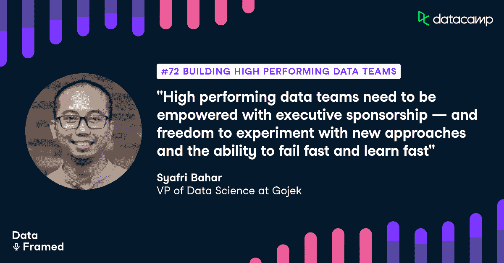

# 构建高性能数据团队

> 原文：<https://web.archive.org/web/20221129051850/https://www.datacamp.com/blog/building-high-performing-data-teams>

[https://web.archive.org/web/20221129054715if_/https://embed.podcasts.apple.com/us/podcast/72-building-high-performing-data-teams-with-syafri/id1336150688?i=1000537446823](https://web.archive.org/web/20221129054715if_/https://embed.podcasts.apple.com/us/podcast/72-building-high-performing-data-teams-with-syafri/id1336150688?i=1000537446823)

DataCamp 播客 DataFramed 的主持人 Adel Nehme 最近采访了 Gojek 的数据科学副总裁 Syafri Bahar。

## [介绍 Syafri Bahar](https://web.archive.org/web/20221129054715/https://www.datacamp.com/community/podcast/building-high-performing-data-teams)

Adel Nehme:大家好，我是来自 DataCamp 的 Adel Nehme，欢迎来到 DataFramed，这是一个涵盖所有数据及其对世界各地组织的影响的播客。无论是在网络研讨会、白皮书还是播客中，我们总是会想到 DataCamp 的一个问题是组织的数据成熟度，以及数据驱动型组织的标志是什么。

Adel Nehme:通常是基础设施、技能、工具、组织模型和流程的组合，能够实现大规模的数据驱动决策。这就是为什么我很高兴今天的节目能邀请到 Gojek 的数据科学副总裁 Syafri Bahar。Gojek 是一款印度尼西亚超级应用，提供 20 多种支持数据的数字服务，如食品配送、运输、商业、支付等。就此而言，这是该国第一个独角兽和十粒玉米，Syafri 监管着一个大型数据产品组合，并管理着各种数据角色。

Adel Nehme:在这一集里，Syafri 讨论了他的背景，高影响力数据团队的标志，他如何衡量数据活动的 ROI，每个成功的数据团队所需的技能，数据成熟组织的最佳组织模式是什么？新冠肺炎如何影响 Gojek 的数据团队。他对数据素养和数据治理的想法。数据科学和人工智能的未来趋势，以及为什么数据科学家应该在日益自动化的时代提高他们的数学和机器学习技能。

Adel Nehme:此外，我们非常欢迎您对我们如何让 DataFramed 为您提供更好的节目的反馈，以及您认为我们应该在节目中邀请哪些嘉宾。我在剧集描述中留了一个调查链接，请务必填写，我非常感谢。Syafri，很高兴你能上节目。

Syafri Bahar:是的，当然。非常感谢，事实上，我很高兴参加这个播客。

Adel Nehme:我很高兴与您讨论数据科学推动 Gojek 以及您在这样一个数据成熟的组织中开发的领先数据科学的所有最佳实践。在我们开始之前，你能简单介绍一下你的背景和 Gojek 的使命吗？

是的，所以我的名字叫赛法里。我已经在 Gojek 工作了大约三年。所以在此之前，我花了...就像我职业生涯的大部分时间实际上是在金融机构做模特一样。银行、资产管理、保险。我正在从一种风险跳到另一种类似的风险。我认为这很好，因为每种风险类型实际上都包含了不同的数学模型。所以这也让我接触到了很多不同的定量技术。

Syafri Bahar:然后，是的，现在我和 Gojek 在一起。所以，我实际上是在监督整体数据。因此，我在 Gojek 监管一个与消费者科学和分析相关的投资组合。我基本上监督几个工作阶梯。在 Gojek，我们有数据科学、决策科学和商业智能。所以，是的，这是我的一点点。我相信你也对 Gojek 很好奇。

Syafri Bahar:我认为 Gojek 本身就是一个超级应用，就像按需应用一样。尤其是与 Tokopedia 合并后，我们现在肯定是印度尼西亚最大的公司。然后加上 Gojek，我们有大约 20 多种产品，实际上，你能想到的都有。所以我们有打车服务，我们有送餐服务，我们有物流服务，实际上甚至还有流媒体服务。所以还挺多的。

Syafri Bahar:这些是我们可以向印度尼西亚客户提供的不同产品。我认为每四个印尼人中就有一个安装了 Gojek。所以这是件好事。就我们的司机而言，我们有大约 250 万名司机。所以基本上这是相当大的一笔，我想加上我们的新朋友，Tokopedia，我们已经贡献了印尼 GDP 的 2%左右。所以它相当大。是啊。

Adel Nehme:是的，这是巨大的。我认为对于我们的西方观众来说，如果我没有弄错的话，与 Gojek 最相似的可能是微信。因此，考虑到 Gojek 提供的各种工具和服务，我确信数据科学在不同 Gojek 产品和服务的价值链中扮演着重要角色。您介意简要概述一下为 Gojek 带来价值的数据科学的一些关键领域吗？无论是给客户还是内部使用？

Syafri Bahar:是的，当然。所以我认为，特别是我真正喜欢 Gojek 的地方，因为数据科学在我们提供的不同产品中发挥着核心作用。基本上，如果我们观察客户的整个生命周期，从获得、激活、保留、最大化，对吗？从他们的预订价值，甚至客户服务。我们有许多机器学习系统实际上在为这些用例提供动力。所以其实挺宽泛的。

Syafri Bahar:但如果我能说出其中的一些，那么我肯定认为 Gojek 的数据科学的第一个用例将是我们的匹配引擎。基本上，这是一个负责匹配司机和订单的引擎，对吗？我认为，从商业角度来看，它真正的好处在于它是一个多目标的项目。因此，人们实际上可以指定企业想要优化什么样的目标。然后系统会自我学习，然后给出最佳分配，这是第一点。

Syafri Bahar:你也可以在我们的搜索和推荐引擎上看到标准、简单、普通的用例。所以我们也申请那里。我认为 Gojek 最大的机器学习系统之一叫做[Gobstopper]。所以 gobstopper 本质上是一个推广分配引擎，对吗？因此，它基本上负责公司 80%的需求生成预算，这实际上是一笔巨大的预算。

Syafri Bahar:所以这个引擎要做的就是将正确的凭证分配给正确的客户。现在，我们基本上将反事实机器学习与一些抽象类型的优化相结合，以实现这一点。所以它是多种事物的结合。所以我对此非常兴奋。

Adel Nehme:是的，这是一个非常大的投资组合。一定很刺激。我想为今天的谈话做个铺垫。你现在是 Gojek 的数据科学副总裁。Gojek 是一个相当成熟的数据组织。它诞生时就考虑到了数据，许多组织将 Gojek 这样的公司视为他们想要成为的黄金标准或北极星。

## 高绩效数据团队的标志或特征是什么？

Adel Nehme:因此，成功实现数据转型和培养高绩效团队有很多方法。高性能数据团队是其中非常重要的一部分。我想知道你认为高绩效数据团队的标志或特征是什么？

Syafri Bahar:我认为，对我来说，是高绩效团队，但我描述高绩效团队的方式有几个特征，对吗？所以第一，他们需要被授权。我认为管理层的赞助在其中起了很大的作用。因为再一次，如果你看机器学习投资，有时需要几年。

Syafri Bahar:甚至不是几个月，它需要几年才能体现为可以测量的东西，对吗？因此，有一个执行赞助商是非常重要的，绝对是第一位的。这将确保团队感到被授权。我认为，授权也意味着团队应该有相对的自由去尝试不同的方法。我认为，特别是在 Gojek 内部，我们总是鼓励我们的数据科学家尝试最新的技术、最新的堆栈。然后他们带着实验结果回来给我们。

Syafri Bahar:这也非常有趣，因为这也是我们在公司层面上尝试做的事情。因此，当我们与高管交谈时，高管们已经预料到我们尝试了所有这些不同的东西。然后，当我们进行对话时，这不是关于我们是否可以开始调查它，而是，“嘿，这些是我们已经尝试过的一些新方法。这是结果，我们应该扩大规模吗？是还是不是？”

Syafri Bahar:但我认为这也影响到我们的数据科学家团队。所以赋权真的很重要。因此，能够非常敏捷地使用方法和进行实验、测量，就像非常快速的迭代一样。与赋权相关的是要有快速失败的勇气，但也要从中学习。所以这非常重要。

Syafri Bahar:第二，我认为一切都需要是可测量的。我想我们稍后会讨论它，关于可测量性。所以在我们拥有的所有不同的机器学习系统中，第一个问题是产品工程是我们想要集成的系统吗？它是否有足够的能力进行测量？我们希望在我们实际参与任何机器学习系统项目之前，确保这一点已经到位。

Syafri Bahar:所以，这也非常重要。当然，第三，我认为团队也需要被授权去做分散的决策。这也是授权的一部分，因为能够自己做决定，当然，使用科学的方法，我们将能够再次授权团队做出正确的决定，而不需要非常复杂的决策结构。是啊。

Adel Nehme:你在这里提到了产出的可测量性。我看到你们讨论的一件事，也是你们在这里提到的，就是确保高杠杆团队提高团队中每个数据科学家的投资回报率的重要性。其核心是衡量影响的能力。我认为许多数据领导者都很难量化他们的工作，尤其是在业务领导者关心的指标方面。那么，你能描述一下，为了让你的团队产出的量化值达到如此高的透明度，你必须跨越哪些步骤吗？

Syafri Bahar:是的，我认为进行数据驱动型对话的一个非常重要的因素，特别是与高管的对话，是通过问正确的问题开始一切，例如，影响是什么？在哪里可以找到数据？我们作为北极星使用的测量方法是什么？我认为这些对话实际上会渗透到团队层面的执行，对吗？所以，这绝对是第一要素，得到管理层的赞助。如果我看一下我们的首席执行官 Kevin，他在 Gojek 之前曾是 Zalora 的 BI 主管。

Syafri Bahar:当时他和另一位高级数据主管 Crystal 在一起，实际上他们建立了数据组织。因此，我们真正理解了拥有适当的数据提出正确的问题的价值。拥有正确的北极星度量标准也非常重要。因为使用这个度量标准，实际上，我们可以让每个人朝着同一个方向前进，对吗？所以毫无疑问，这是一个非常关键的问题。第二件事，比如有合适的工具也很重要。拥有合适的基础设施来进行测量。例如，我不得不说，拥有成熟的 A/B 测试能力非常重要。

Syafri Bahar:配置管理真的很重要。实际上，我们能想到的所有这些不同的基础设施，到位是非常重要的。这是第二层的数字。第三层是能够采用正确的方法进行测量，因为不是每个人都能通过 A/B 测试，对吗？这也是为什么我们有专门的工作阶梯的原因。我们称之为决策科学，实际上，他们基本上结合了许多统计技术，以真正回答我们在公司内部遇到的一些最大的问题。

Syafri Bahar:例如，我们如何衡量忠诚度的影响？你不能真的 A/B 测试忠诚度，对不对？然后我认为为了这个目的，我们求助于许多因果推理技术，为了能够做到这一点。然后，再一次，有如此多的选择，它们真的取决于我们试图回答的用例或问题。但是我想我想说的是，有一个真正合适的科学方法是非常重要的，这样才能提出问题，衡量它们，并且真正有意识地去做。有一个真正研究这个问题的专家，因为它本身就是一门学科，实际上对于达到那个阶段会有很大的帮助。

### 投资数据解决方案

Adel Nehme:既然您非常强调创建这种基础架构，并采用这种多层方法来衡量数据解决方案的影响，那么这在您的决策过程中会起到什么样的作用呢？您会进一步投资哪些数据解决方案呢？

Syafri Bahar:是的，是的，它确实影响了我们的很多决策，对吗？因为还是那句话，机器学习投资，或者说数据科学投资，总的来说，是相当昂贵的。因此，在我们开始任何机器学习项目之前，能够确定市场规模真的很重要，对吗？我们需要能够识别，我的意思是，如果我们比较五个用例，例如，我们谈论的是 1 美元对 100 美元的影响吗？或者我们说的是 40 美元，60 美元的影响。

Syafri Bahar:所以我认为这非常重要。毫无疑问，我们确实使用所有这些不同的基础设施来真正成为我们在公司内部进行各种对话的基础。这就是能够进行这种测量并能够使用它来进行正确投资的重要性。不仅如此，实际上，我在说...我是说，这还是第一层。所以第一层实际上是关于我们想投资是还是不是？

Syafri Bahar:第二层问题可以是，“好的，现在，如果我想解决这些问题，我有 10 种不同的解决方案，不同的数据科学，会有不同的方法来构建这些问题，对吗？”例如，我可以把它框架为无监督的，监督的，强化学习。每一种都有自己的复杂程度。我认为能够衡量这种努力是非常重要的；真的要衡量努力和影响之间的权衡，放入尼斯象限，然后真的，“好吧，这是我们想要做的方法。”这就是我们进行决策的深度，基本上使用所有这些不同的基础架构来对我们的数据科学项目进行决策。是啊。

Adel Nehme:你在这里提到了决策科学家的使用。因此，从技能的角度来看，考虑到 Gojek 内部数据科学的流行程度和多样性，您认为每个数据团队应该雇佣哪些不同的角色和不同的技能组合？

Syafri Bahar:是的，实际上这是一个有趣的问题。首先，我们想要一个，和这个播客特别相关的是数据科学家。好吧，所以我认为对于我们 Gojek 的数据科学家来说，他们擅长构建可扩展的机器学习系统。因此，从本质上来说，Gojek 的数据科学家有望成为全栈科学家，并且能够在构建这个机器学习系统时应用良好的软件工程原则。

Syafri Bahar:这就是数据科学家，如果我说得对的话，我会说得更清楚，Gojek 的数据科学家专门帮助公司快速、频繁地做出微观决策。好吧。现在，轮到决策科学家了。所以决策科学家，如果我想和数据科学家对比的话。决策科学家将专门帮助制定不太频繁的重大决策，这本质上需要大量类似的统计知识，以便能够找到问题并应用正确的技术。

Syafri Bahar:基本上我们还有商业智能。因此，商业智能在 Gojek 中的作用实际上是确保你有一个单一版本的真理，我们在这个版本中看待事物。然后，他们还负责定义正确的指标，确保数据可用。在某种程度上，他们也做[听不清]。能够绘制我们拥有的不同业务流程，并将其转化为我们拥有的表格。

Syafri Bahar:只是为了确保我们有一个合适的数据模型。因为我认为这也是非常重要的，因为如果你没有非常坚实的数据基础，我们就不能真正做很多我们想做的高级分析，对吗？拥有单一版本的真相真的很重要。拥有每周不会中断一次的可靠数据非常重要。所以是的，这些是不同的角色。当然，你也可以操作我们在 Gojek 内部雇佣的机器学习工程师。

Adel Nehme:当我们谈到数据团队时，我很高兴能够对此进行更多的讨论。通常，经历数据或数字化转型的组织都在努力寻找组织其数据人才的最佳方式。一些组织倾向于集中式卓越中心模式，其他组织则倾向于嵌入式模式，在这种模式下，数据科学家被整合到职能团队中。Gojek 的数据人才是如何组织的？

是的，我认为对我们来说，这也是一种进化。所以我们实际上尝试了各种不同的模型。我们从度量组织开始，我认为这对一个非常小的团队很好，因为我们想确保每个人都遵循相同的实践。因此，在我们应该如何做事的问题上，需要有一个集中的声音。

Syafri Bahar:基本上，我们当时所做的是，我们有一个中心团队，我们将他们分派到不同的产品上。但那时我们几乎是在扮演顾问的角色。但是随着团队的成长，随着 Gojek 内部用例的增加，这种模式不再可持续。所以我要说，我们现在所做的是根据联邦系统来运作的。

sy afri Bahar:Gojek 的每个数据主管或数据负责人都有自己需要关注的领域，我们在业务团队和产品团队中非常深入，只是为了确保我们真的感受到压力，就像我们真的投入了一样，我们也参与到了这场游戏中。这也让我们能够思考比我们试图解决的问题更大的问题。

Syafri Bahar:这也非常重要，对吗？为了确保我们在实践和职业道路等方面的一致性，我们在 Gojek 的数据领导者中成立了一个委员会，以确保我们也遵循相同的实践和标准。但目前，我们已经完全融入了业务团队和产品团队。

Adel Nehme:那么您认为随着组织数据成熟度的提高，运营模式需要随着组织的数据能力而发展，并转向更加混合的方式吗？

Syafri Bahar:是的，我会说，即使这是不可避免的，我会说。因为否则，组织会变得太复杂而难以管理，对吗？对于职能部门的领导者来说，这也是非常困难的。尤其是在数据科学领域，对吗？这就像，如果你想进行有意义的对话，数据领导者需要有两到三个层次，更深的背景深度，基本上是为了能够与团队和他们的业务领导者进行有意义的对话。

Syafri Bahar:然后，如果我们这样说，在这里很难保持知识，比如有一个背景，特别是在 Gojek 的各个领域。我认为这种模式是不可避免的。

Adel Nehme:正如你所说，游戏中的皮肤非常重要，因为否则，数据科学家只是在特定或运动的基础上创建分析，这不一定会使影响最大化。

Syafri Bahar:正确。我想我还想鼓励的一件事是，我试图鼓励传统的数据人员，一般来说，数据专业人员，被视为服务提供商，但我试图在组织中树立的是，数据人员不是服务提供商，我们是思想伙伴，对吗？这意味着我们需要在问题形成的最开始就参与进来。因为这样我们才能给出一份好的推荐信。我们在游戏中有一个皮肤，等等，等等。我认为这样做有很多好处。

## 结合商业智慧和数据

Adel Nehme:那么你是否认为数据科学家最终往往没有真正打造出商业敏锐感或对他们正在研究的用例的理解？你认为数据团队应该专注于向他们的数据团队灌输商业智慧吗？

是的，我也这么认为。我认为，让我们的数据团队了解全局对我们来说非常重要，这也有助于我们超越给我们的预定义问题陈述。所以，是的，但我认为这真的很重要。我并不是说所有的组织都是这样工作的。我认为这真的取决于我们解决的问题的类型。我认为对于一个非常超优化类型的问题，这是有意义的，对不对？

Syafri Bahar:第一，我们只是基本上坚持问题，我们真正深入问题 100 层，然后真正解决它。但特别是对于有很大程度模糊性的问题，我认为参与对话真的很重要，对吗？因为它可以走向多个方向，特别是在我们想要解决的目标中，所以我认为这就是我如何区分何时特别是数据团队需要从一开始就参与。

Syafri Bahar:或者也可以是问题陈述非常清楚，对吧？我们希望优化转化，例如，通过建立我们的推荐引擎，然后很明显，我们需要高度关注这个问题。

Adel Nehme:作为一名数据领导者，作为一名管理多个数据团队的人，这些团队负责不同产品和服务的组合，我确信新冠肺炎·疫情极大地影响了您的团队以及您所从事和维护的不同数据科学解决方案。你介意向我们介绍一下你是如何处理影响你的模型的概念漂移的，更重要的是，你是如何在巨大的不确定性和压力下设法维持高绩效的数据科学家的？

Syafri Bahar:所以我主要从两个角度来阐述这个问题。第一，这就是疫情对我们团队的影响。所以我认为，就疫情本身的影响而言，或者更具体地说，我们需要远程工作的事实，它并没有对我们的团队产生太大影响，因为即使在疫情之前，我们已经是一个分布式团队了。所以我们的团队其实分布在几个城市。我们在新加坡、泰国、越南和班加罗尔都有团队。例如，我们的一些同事甚至也在亚洲以外的地方工作。所以这对我们来说不是问题。

Syafri Bahar:我们加倍努力的一件事是我们需要非常擅长文档。每个人都需要非常擅长文档，因为每个人都需要远程工作，这意味着一个强大的通信手段将是通过文档。所以我们非常重视文档，这是肯定的。我们总是在 confluence 上更新，只是为了确保模型有适当的文档，它可以被遵循。有链接到我们的数据源，到 GitHub，和许多其他东西，对不对？这是第一点。

Syafri Bahar:第二，对模型的影响。我认为，即使在疫情会议之前，如果你看看市场，我们也承认并意识到我们已经在不稳定的环境中工作。尤其是我们在一些市场占据主导地位的事实，这意味着我们对模型所做的任何改变都有可能改变客户的行为，这意味着还有很多反馈回路，对吗？这意味着市场无论如何都会改变。然后我们需要像往常一样处理这件事。不是作为一种现象，对吗？

Syafri Bahar:但是我们总是需要确保我们的特征没有漂移。我们需要确保我们有一个频繁的培训。我们越来越意识到，我们需要在建模中采用更多的适应性学习技术，以便能够捕捉不断变化的市场形势。所以我认为对我们来说，现在可能只是总结一下，一切如常。但当然，就业务本身而言，它在很大程度上受到了疫情的影响，对吗？所以这是肯定的。我们看到了。但是就我们如何工作，以及我们基本上如何创建和监控我们的模型而言，没有什么显著的变化。

Adel Nehme:是的，我认为这就是 Gojek 的数据成熟度发挥作用的地方。我认为，许多组织今年意识到，他们确实需要投资于 MLOps 以及在生产中监控和更新模型的能力。这在 Gojek 可能不是问题，因为这是你们已经具备的能力。

Syafri Bahar:对，没错。我还必须称赞数据科学平台团队。我认为他们做得很好，为我们提供了我们需要的所有不同的基础设施，以便通过反馈回路、部署技术等来实时监控模型性能。所以他们很棒。

## 一个数据成熟的组织有什么特征？

Adel Nehme:太不可思议了。我很乐意将我们的对话扩展到创建高影响力团队之外。正如我们在本集前面所讨论的，Gojek 是一个真正高度数据成熟的组织，它生活和呼吸着数据。您认为在高影响力团队之外，数据成熟组织的特征是什么？

Syafri Bahar:我认为它不仅在于我们可以看到和触摸到的有形的东西，而且我认为，在精神上，它也是非常重要的。我认为，一个特征是，这与数据团队关系不大，但它只是整个组织。我们需要生活、呼吸，然后我们需要在日常对话中使用这些词汇，对吗？

Syafri Bahar:我们真的需要问一下相关性与位置、偏差、值、贝叶斯漂移是什么？我认为这应该是日常对话的一部分，这样一个组织才能被贴上数据成熟组织的标签，对吗？所以这是文化中固有的。我认为这不仅仅是工具和仪表板。我认为这确实是一个特征。

Syafri Bahar:我认为这也非常重要，我怎么强调都不为过，你的领导要树立榜样，对吗？因为一切都始于向产品团队和数据团队提出正确的问题。因为这些问题实际上会影响很多事情。我也许可以举一些早期的例子，当我们说，“嘿，我们想衡量一下，例如，拥有一定的忠诚会员会有什么影响，对吗？”

Syafri Bahar:这让我们想到，“嘿，我们还没有任何基础设施来测量这些东西。所以我们需要开发更多的东西，对吗？”然后我们开始探索，我们看到，“嘿，也许我们可以使用工具变量。比如随机鼓励，对吧？”这也引发了我们围绕这一点构建能力。比如，“嘿，作为一家公司，我们可以产生哪些工具变量来帮助我们衡量某一现象的边际影响，而这种影响无法用传统的 A/B 测试来处理，对吗？”

Syafri Bahar:我想再次说明提出正确的问题是多么重要，特别是对于数据成熟的组织，因为这将揭示我们需要从数据角度构建的所有流程。是啊。

Adel Nehme:当谈到创建数据驱动的组织时，我完全同意精神和文化的重要性。我真的认为这是主要的区别。你在这里提到了基础设施。关于 Gojek，令人印象深刻的一点是基础设施如何适应创建高影响力的数据科学。

Adel Nehme:我看到你在其他采访和小组讨论中谈到了这一点，这也是 Gojek Medium 博客中的重点内容。您介意向我们介绍一下 Gojek 为了促进高效数据科学而采用的不同技术和基础架构级别的创新吗？

Syafri Bahar:对。所以我认为有几个...所以我们可以从 MLOps 的角度来谈。我们也可以从我们现有的下游数据工程堆栈来讨论它，对吗？因此，我认为我真正喜欢 Gojek 的一点是，我们喜欢开发自己的解决方案，尤其是当我们认为第三方解决方案实际上无法满足我们的需求时，对吗？所以我们实际上也开发了很多内部系统。

Syafri Bahar:它是必不可少的，也像包装最近的一些技术，例如，我们谈论存储轨道，例如。所以我们围绕它做了很多包装。仅举一个例子，为了帮助我们将数据从一个地方移动到另一个地方，我们在 Gojek 内部构建了大约 20 到 30 个数据工程工具。我们希望得到不同的转换，例如，数据编目，我们也有一个解决方案。

Syafri Bahar:例如，我们还构建了 Optimus，这是用于进行数据转换的 CLI。所以我们制造了相当多的工具，对吗？这只是从数据工程的角度来看。所以 20，30 个工具。当我们看 MLOps 团队时，数据科学平台实际上已经为我们构建了相当多的工具。我也许能告诉他们中的两三个。

Syafri Bahar:比如梅林。所以 Merlin 是数据科学家用来部署模型的工具。过去部署一个模型需要两到三周时间，现在我们只需 10 分钟。我们需要做的就像保存 pico 文件一样，二进制文件。然后，我们将 MLFlow、Kubernetes deployment、Docker 等不同的技术结合在一起，实际上将它们整合为一个简单的数据科学抽象。

Syafri Bahar:所有这些都由我们的数据科学平台团队管理。以 Merlin 为例，数据科学家只需保存来自 scikit-learn 或 PyTorch 的二进制文件，例如 TensorFlow，然后放入它，现在我们需要调用某个 API 链接。它会自动上传它部署在 Kubernetes。集群，它将创建测井系统，监测系统，以及漂移监测。就像一气呵成。挺好看的。

Syafri Bahar:我们也有，例如，Feast 是我们的另一个重要产品，我们与谷歌共同开发，现在也有几家公司在使用它。因此，Feast 基本上允许我们分离特征冲浪和模态冲浪，基本上只需为培训创建一个层 00:30:47]。

Syafri Bahar:例如，我们可以使用相同的抽象来服务模型。它还提供了一些很好的特征注册的可发现性，例如，能够进行历史冲浪或历史批量计算，或者像在线实时冲浪一样，对吗？只是使用一个通用的抽象。所以这非常非常酷。我们做了很多事情。当然，我们也有图灵，还有很多其他的东西，比如发条，这也是另一个产品。但是我建议观众们去看看我们的博客，看看我们制作了哪些不同的工具。

Adel Nehme:是的，我强烈建议大家去看看 Gojek 博客，这是一个展示团队开发的令人惊叹的专有技术和工具的真正橱窗。这些解决方案是开源的吗，Syafri？

Syafri Bahar:是的，我想大部分人现在都知道了。是啊。所以我认为尤其是我们的数据工程工具。我想就在最近，大概一两个月前，我们开始开源我们自己开发的工具。是啊。

## 数据治理

Adel Nehme:显然，以上我们都没有谈到。到目前为止，如果没有高水平的数据清洁度、质量和组织范围的数据治理，您介意描述一下数据治理对于扩展数据成熟度有多重要吗？

Syafri Bahar:是的，当然。实际上，我认为数据治理经常被忽视。人们通常认为这是理所当然的。嗯，对我们来说，这真的很重要，因为特别是，如果你看看印度尼西亚的监管框架，我们基本上是非常严格的。我们真的也想保持消费者对我们的信任。因此，我们实际上非常重视数据治理，甚至我们有自己的数据保护官。我们有一个数据治理委员会，它决定谁应该访问哪个列。

Syafri Bahar:在我们进入 NDA 之前，我们需要签署任何文件。最近，你们还推出了一个名为[海洋]我们的数据仓库的工具。新的数据仓库工具。有了海洋，我们基本上可以分离实体，我们真的可以治理，例如，我们可以在表示层和数据标记层之间进行分离，并提供非常具体的访问权限。

Syafri Bahar:所以我认为对我们来说，我想说的基本上是，这对我们来说是非常重要的事情。我们确实有一个委员会，我们确实有一个关于如何利用现有数据的管理流程。当然，我们内部也开发了各种工具来帮助解决这个问题。我认为我们的工作方式总是首先，我们讨论在拥有适当的数据治理和数据保护方面我们需要什么，然后我们会根据这些要求构建工具。

Adel Nehme:您认为在整个组织中实现高质量数据时，数据领导者的角色是什么？您能简要描述一下 Gojek 的数据治理计划的一些特点吗？

Syafri Bahar:事实上，这非常重要，因为我认为数据领导者在整个纵向数据治理中扮演着几个角色。我认为第一点就是设定期望值。我认为这很重要，对吗？

Syafri Bahar:因为没有明确的预期，这是一个有时被人们忽视的领域。所以设定期望值是一回事。第二，也是关于教育，关于我们为什么需要教育，对吗？例如，为什么一家公司在上市前需要适当的数据治理。

Syafri Bahar:所以我认为这是第二件事。我认为第三件事是需要在各利益相关方之间架起一座桥梁，基本上是在数据治理方面，对吗？因为我们需要从监管角度和消费者角度沟通多个利益相关方。消费者也是我们的利益相关者，但也喜欢不同的功能，不同的产品。所以我觉得搭桥也很重要吧？这实际上是三件事。设定期望，桥接，第三个是认证。

Adel Nehme:就工具而言，您在 Gojek 使用哪些工具进行数据治理？

Syafri Bahar:我们在内部开发了许多这些功能。我们围绕它创建了许多包装器。还有创造，例如，能够真正显示数据谱系的工具。并且也要理解，例如，这是否来自我们也定期维护的可靠的表。因为从历史上看，从我们拥有的超增长遗产来看，我们有数据有机增长的问题，真的就像它无处不在。

Syafri Bahar:例如，我们从派生表创建一个派生表。所以你最终创造了一个桌子的森林。所以我们也在清理过程中。所以，是的，但我认为就工具而言，我们试图在内部开发许多这样的功能，对吗？我们可能会使用第三方工具，但老实说，我对此知之甚少。

## 数据素养

Adel Nehme:我想重点讨论一下组织数据素养。作为一名数据科学高管，你的角色包括获得高管的认同，证明资源分配的合理性，以及所有这些有趣的事情。您认为高管需要具备什么样的数据素养才能在这些对话中富有成效，并批判性地评估数据项目计划的成功？

Syafri Bahar:但我认为这是我们无法真正控制的事情。我认为，总的来说，如果你看看这些公司，对吗？尤其是，当你看到不同类型的公司时，会有不同类型的领导。这些公司的领导层也将来自不同的背景，对吗？所以这有点像我们无法真正控制的事情。但我认为，这真的取决于数据领导层能够向他们清楚地表达这一信息...

Syafri Bahar:我真的希望有一些基础知识，至少在数据方面。但是，假设基础已经存在，就他们希望如何基本上尝试在数据方面提出某些议程而言，这实际上取决于数据领导者，以便迎合他们的受众。这作为一个例子，如果例如，如果我想为数据科学推动更多的资源，那么我会做什么，只要同行是理性的，我们基本上可以进行基于事实的对话。

Syafri Bahar:我会带着我的数据说，“嘿，这就像是三个人的团队，我们为每个用户，每个数据科学，实际上已经产生或者节省了这么多钱……”因此，我们实际上可以将其归一化为每数据科学的收益。然后，是的，我可以用它作为论据来推动更多的资源。所以这只是在数据科学的背景下。但是我认为在项目的背景下，比如在数据治理中，我认为，尤其是在数据治理方面，这正是我们需要做的事情。这是卫生用品，对吗？所以真的没有其他方法可以不这样做。说实话。

Syafri Bahar:我认为，为了在这个问题上进行富有成效的对话，我认为对方肯定需要对数据有一定的了解。我认为，特别是对于领导层，他们基本上是在上个世纪形成的，所以我要说，我认为他们在数据方面的素养应该没问题。

Adel Nehme:太好了。在我们的交谈中，您多次提到了数据文化、数据精神以及这一点的重要性。我相信这也与在组织内创建非常强大的自助服务分析能力有关。您认为数据团队在更广泛的组织中创造和打造这种文化以及使用自助分析方面的角色是什么？你在 Gojek 采取了哪些最佳实践来保持这一点，你有什么经验可以分享吗？

Syafri Bahar:是的，实际上这是一个非常好的问题。因此，在自助服务分析方面，我们正在尝试做几件事情。所以第一件事就是要有一个正确可靠的数据。这确实是第一位的。所以我们做的第一件事实际上是，我们试图先解决基本问题。你可能还记得过去成千上万的有机增长的表的所有这些不同的问题，对吗？

Syafri Bahar:我们试图先整理一下，对吗？首先要确保它是可靠的，基于可靠的数据来源，然后能够在此基础上创建适当的数据标记。所以这绝对是我们需要注意的基本问题。然后，当我们进行信息检索时，我们基本上会尝试做几件事情。

Syafri Bahar:所以第一，也鼓励我们的分析师或商业智能人员能够创建更动态的仪表板。因此，我们使用像 Streamlit 这样的工具，例如，能够创建一个复杂的可视化效果，以便能够满足商业人士的需要，例如，如果他们想创建一个故事，只需点击几次，就足够直观了。

Syafri Bahar:例如，一旦他们对某个领域感兴趣，按钮就会出现。只是为了帮助他们利用我们在 Gojek 获得的各种信息。这是我们尝试做的另一件事。另一件事是，我们试图开发另一个内部工具，基本上，也许我现在不能具体说明名称和它的作用，但基本上我们需要的功能是定义尺寸和测量，然后是过滤器。所以企业只需要知道三件事。

Syafri Bahar:所以他们可以拖放东西，他们可以增加尺寸，他们可以增加尺寸，然后里面的需求可以很好地产生。但这也需要我不是说我们 100%在那里，而是因为它需要大量的标准化。特别是考虑到我们有大约 20 多种产品，这不一定是最容易做的工作。能够标准化一切以达到那种状态。是的，但这些是我们目前正在思考和积极做的一些事情。

Adel Nehme:在消费者方面，数据教育在更广泛的组织中处于什么位置？在 Gojek，他们的文化教育有多重要？

Syafri Bahar:是的，这是一个有趣的问题，对吗？因为我们也意识到我们的许多消费者来自不同的背景。因此，我们也在积极推动数据扫盲。我可能会提到一个项目。我们有一个名为[数据英雄]的项目。因此，这实际上是一个旨在从根本上教育数据消费者的计划，教他们 SQL，教他们数据的基础知识。

Syafri Bahar:什么是你的数据仓库，数据集市，数据湖，和类似的东西，基本上是为了帮助他们自助。所以，这真的很重要，我认为你在创造这种意识。当然，这也很有帮助，因为我们的大多数领导(如果不是全部的话)都有很高的数据素养，对吗？因此，高层领导总是鼓励他们不断向下属询问数据，这样人们就会意识到进行数据驱动的对话有多么重要。这也给他们自己创造了教育自己如何正确使用数据的紧迫性。

## 趋势和见解

Adel Nehme:太好了。我想通过讨论一些趋势和见解以及你对数据科学和人工智能在未来扮演的角色的看法来结束我们的谈话。因此，Gojek 通过其技术在印度尼西亚和其他地方产生了如此大的影响，您如何看待人工智能和数据科学的进步进一步推动了 Gojek 客户的价值？你最感兴趣的进步是什么？

Syafri Bahar:是的，我认为有一些事情是正确的。所以我对因果机器学习的使用感到非常兴奋。因为我们做的很多事情都是固有的，例如，查看推广优化引擎的特定领域，对吗？把它框架为因果问题实际上是非常自然的，只是给你一个例子，例如，如果你想做流失预防，预测流失不会很有用，因为它会造成恶性循环，对吗？你预测那些天生就很难约束的人。

Syafri Bahar:所以我们需要做的是能够预测它们何时会被搅动，然后了解哪些治疗方法最有效地防止它们被搅动，对吗？所以能够以这种方式表达出来。我想我真的很高兴，特别是在最近几年，我们能够将因果推理重新构建到机器学习中，这样就可以利用机器学习在处理高维数据等稀疏数据方面的优势。这非常重要。

Syafri Bahar:在过去，我们需要手动指定混杂因素，但现在随着因果机器学习的最新进展，我们只需将数据放在那里，然后就可以获得边际影响估计。这个算法基本上会学习哪些是最可能的混杂因素，如果你在技术中使用混杂因素的话。

Syafri Bahar:这是第一条规则。我认为第二点，我也看到强化学习类型的算法有一个很有前途的未来。实际上我对此非常兴奋。如果你愿意的话，再深入一点，特别是关于马尔可夫决策过程，我认为它也有很好的应用前景，尤其是在动态市场的背景下。因为我们希望能够拥有可以在线学习的算法，基本上，我们不需要先下载它，进行动态训练，然后再将其推向生产。因此，我们希望尽可能地推进这种状态，基本上就像是一种自我学习。

Syafri Bahar:特别是在行为建模领域，特别是在营销和促销优化引擎的背景下，我们至少可以探索很多领域的潜在应用。所以，我也很兴奋。当然，最近的进展也在 GPT-3，你提到了与 AutoML，对不对？我认为这也是一个非常令人兴奋的发展，在这个领域也是如此。尤其是 GPT-3，我认为，我们仅仅是抓了抓我们能做的。

Syafri Bahar:是的，我认为我看到了一个数据科学解决方案将被商品化的世界，将会有许多开箱即用的解决方案，这样，作为数据科学家或数据专业人员，无法取代的将是真正的创新部分。因此，我强烈建议，尤其是那些有抱负的数据科学家，要真正提高解决问题的技能，比如创造力，要能够使用这些不同的工具。因为同样，我们可能只在一次点击中估计模型，但仍然需要对数学和统计学的深入理解，以便能够解释那些模型，那些解决方案，并能够从中做出决策。

Adel Nehme:是的，我知道你是一个超级数学迷，我也看到你争论为什么数据专业人员应该对他们正在处理的模型进行更深入的技术理解。您如何将这种世界观与数据科学家日益增长的自动化技术相协调？

Syafri Bahar:顺便说一下，我认为它有一个很好的目的，有各种不同的优化。它的基本目的是让机器学习和人工智能民主化，对吗？我认为对于某些特定的问题领域，这是有意义的。因为它基本上会特别是在重复性的东西上。我想我还记得吴恩达引用的话，所有可以在一秒钟内完成的事情，现在实际上就像是机器学习或人工智能的主要用例，对吗？

Syafri Bahar:但我认为也有越来越多，我们也发现了许多不同类型的问题，这些问题无法在一秒钟内真正解决。这些都是非常模糊的问题，例如，分发代金券，如何将用户发展到更成熟的状态。所以这是一个非常棘手的问题，对吗？所以，我想说的是，它有一个好的目的，但它可能无法解决我们目前面临的所有行业问题，特别是在可以产生很大影响的各个领域。这是第一点。

Syafri Bahar:第二，我认为，即使将来会有很大程度的自动化。但我认为，理解这些自动化解决方案背后的机制也是非常重要的，实际上，对于人类来说，能够就如何正确使用它做出明智的决定。例如，能够解释那些估计的副产品也是非常重要的；如何，而不是喜欢盲目套用。但是，在某些领域，我们可以轻松做到这一点。但也有另一个领域，你不能只是盲目地应用一些力学，对不对？因此，理解其机制并真正理解其功能非常重要。

## 行动呼吁

Adel Nehme:太棒了。最后，Syafri，在我们今天结束之前有什么行动要求吗？

西亚夫里·巴哈:对，我认为有很多...我也想和机器学习自动化的进步有一点点联系。我想有些人可能会想，“嘿，我们的工作将被取代，它将不再性感。”但我认为相反，我会说，未来将会需要越来越多不同种类的数据科学家；能够运用第一原则解决问题的人，他们试图将各种可用的解决方案结合起来，并能够决定哪些解决方案实际上能够解决特定的问题。

Syafri Bahar:所以这是一句鼓励的话，基本上，仍然要投资于该领域，特别是在一些新兴国家，如印度尼西亚，我们几乎没有注意到我们在影响方面可以做什么。尤其是如果你看到其中一些国家的结构性低效，数据专业人员就有巨大的机会在那里创造影响。

Adel Nehme:是的，非常感谢你的真知灼见，Syafri。我真的很感激。

Syafri Bahar:是啊，不客气。

Adel Nehme:今天的 DataFramed 节目就到这里了。谢谢你和我们在一起。我非常喜欢 Syafri 关于数据科学驱动 Gojek 的见解。如果你喜欢这个播客，一定要在 iTunes 上留下评论。下一集，我们将采访渣打银行前集团首席技术官、TruEra 现任首席战略官 Shameek Kundu。我希望这对你有用，我们下次在 DataFramed 上再见。