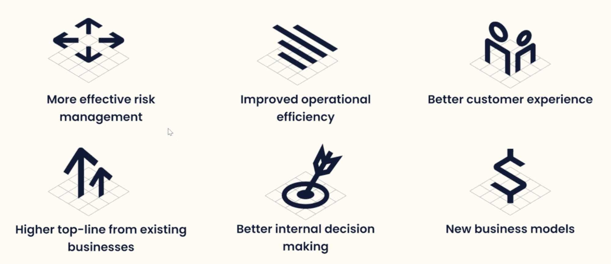
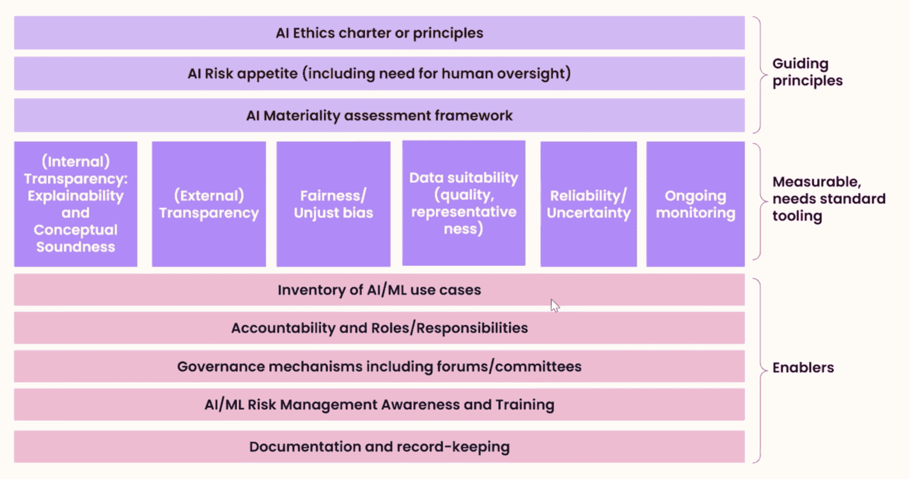

# 建立对人工智能的信任以加速其采用

> 原文：<https://web.archive.org/web/20221129045128/https://www.datacamp.com/blog/building-trust-in-ai-to-accelerate-its-adoption>

金融服务业坐拥大量数据。难怪这个行业充满了有前途的人工智能和机器学习用例。根据麦肯锡的估计，如果成功推出，人工智能可以在银行业产生高达 2 万亿美元的价值。在[最近的一次网络研讨会](https://web.archive.org/web/20220525041217/https://www.datacamp.com/resources/webinars/scaling-ai-adoption-in-financial-services-1)中，渣打银行前 CDO 集团、TruEra 现任首席战略官 Shameek Kundu 概述了如何加速人工智能在金融服务中的价值。

Shameek 解释说，数据科学和人工智能在金融服务中的价值可以分为三大类:

*   **通过更好的客户体验和更好的决策提高收入**
*   **通过更有效的风险管理和更高的运营效率降低成本**
*   **发掘未实现的潜力**和商业模式。

## 人工智能在金融服务中的应用很广泛，但很肤浅

今天，金融服务中的许多人工智能项目仍处于起步阶段，由于各种原因，无法达到全面部署的最终目标。这些问题包括数据可用性和质量有限、部署人工智能系统的技术瓶颈等技术问题，以及缺乏数据人才和对人工智能系统的信任有限等非技术障碍。

## 解决人工智能系统中缺乏信任的问题

虽然复杂的机器学习模型，如[深度学习模型](https://web.archive.org/web/20220525041217/https://www.datacamp.com/tracks/deep-learning-in-python)可以为以前难以解决的问题，如[蛋白质折叠](https://web.archive.org/web/20220525041217/https://www.nature.com/articles/d41586-020-03348-4)提供深刻的解决方案，但它们并不擅长解释它们的预测。

如果这些黑箱的结果被盲目地应用在高风险决策中，如反洗钱和信用评分，它们会带来社会风险。不知道黑箱模型如何得出他们的预测，最终用户发现很难相信他们的输出，特别是考虑到高调的[偏向人工智能系统](https://web.archive.org/web/20220525041217/https://www.datacamp.com/resources/whitepapers/data-literacy-for-responsible-ai)的事件。

根据 Shameek 的说法，三个关键行动可以培养对人工智能的信任。

### 通过教育揭开机器学习的神秘面纱

*全民教育*教育是解决对人工智能恐惧的长期策略。随着内部利益相关者、监管者和客户对人工智能如何影响他们有了大致的了解，他们变得更有可能接受人工智能。

*旨在解决技能差距的专业教育*技术人才的缺乏阻碍了公司大规模实施人工智能系统。因此，旨在从人工智能系统中提取价值的公司必须愿意雇佣数据人才或提供专业培训来提升现有员工的技能。

### 为人工智能系统设置内部护栏

内部护栏是实现、评估和监控人工智能系统的指导方针。

这些护栏有三个主要部件。

*   **一套指导原则**定义了人工智能在公司内部可以做什么的界限。
*   **内部利益相关者的促成因素**促进人工智能的安全实施
*   **标准工具和技术**评估人工智能系统的公平性

### 使用工具和技术提高人工智能质量

人工智能生命周期中的差距导致质量问题蔓延到人工智能系统中。幸运的是，有工具可以减轻它们。

*解释黑盒模型*[可解释人工智能领域](https://web.archive.org/web/20220525041217/https://www.datacamp.com/community/news/explainable-ai-xai-d8tueh7c60j)仍然是一个活跃的研究领域。它有望打开黑匣子，揭开预测生成过程的神秘面纱并建立信任。

*解决数据和标签质量低的问题*学生可能在一个不熟悉的话题上考试不及格；如果在错误的数据上训练，机器学习模型可能表现不佳。如果用于训练人工智能系统的数据与它在部署中看到的数据截然不同，人工智能系统可能会失败。微软的 python[Responsible AI Widget](https://web.archive.org/web/20220525041217/https://techcommunity.microsoft.com/t5/azure-ai/responsible-machine-learning-with-error-analysis/ba-p/2141774)可以帮助识别和解决这类问题。

*测试模型的透明度和公平性*由于用于训练模型的数据中存在隐藏的偏见，模型可能会对某个群体产生不公平的偏见，如少数民族或特定性别。像 [fairlearn](https://web.archive.org/web/20220525041217/https://github.com/fairlearn/fairlearn) 和 IBM 的 [AI Fairness 360](https://web.archive.org/web/20220525041217/https://github.com/Trusted-AI/AIF360) 这样的开源解决方案可以帮助解决这些差距。

## 结论

在公司内部建立对人工智能的信任需要协作和时间。组织需要提升人工智能人才的技能，并建立人工智能安全的保障措施，而人工智能从业者需要充分利用他们可用的工具，使人工智能对所有人公平。只有当人工智能成功赢得用户的信任，人工智能系统才能被广泛采用。

如果你对人工智能在金融服务中的应用感兴趣，请务必查看 Shameek 的点播网络研讨会“[在金融服务中扩大人工智能的采用](https://web.archive.org/web/20220525041217/https://www.datacamp.com/resources/webinars/scaling-ai-adoption-in-financial-services)”。它提供了对人工智能应用的见解和加速其采用的实用建议。

