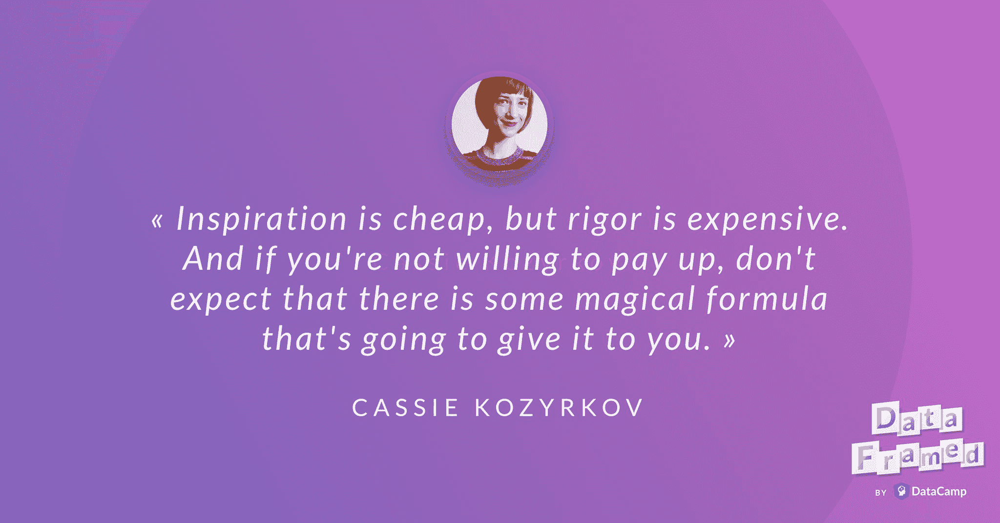

# Cassie Kozyrkov 讨论决策和决策智能！

> 原文：<https://web.archive.org/web/20221129045010/https://www.datacamp.com/blog/cassie-kozyrkov-discusses-decision-making-and-decision-intelligence>

[https://web.archive.org/web/20220615200135if_/https://w.soundcloud.com/player/?url=https%3A//api.soundcloud.com/tracks/516368949%3Fsecret_token%3Ds-zgV8g&color=%23ff5500&auto_play=false&hide_related=false&show_comments=true&show_user=true&show_reposts=false&show_teaser=true](https://web.archive.org/web/20220615200135if_/https://w.soundcloud.com/player/?url=https%3A//api.soundcloud.com/tracks/516368949%3Fsecret_token%3Ds-zgV8g&color=%23ff5500&auto_play=false&hide_related=false&show_comments=true&show_user=true&show_reposts=false&show_teaser=true)

数据营播客 DataFramed 的主持人 Hugo Bowne-Anderson 最近采访了谷歌首席决策科学家 Cassie Kozyrkov。

下面是播客[链接](https://web.archive.org/web/20220615200135/https://www.datacamp.com/community/podcast/decision-intelligence-data-science)。

## [介绍凯西·科兹尔科夫](https://web.archive.org/web/20220615200135/https://www.datacamp.com/community/podcast/decision-intelligence-data-science)

雨果:你好，凯西，欢迎来到 DataFramed。

凯西:嗨。谢谢你，雨果。很荣幸来到这里。

雨果:很高兴你能来参加我们的节目。我真的很高兴你们能在这里谈论数据科学、决策、决策科学和决策智能。但在此之前，我想先了解一下你。首先我想知道你的同事会怎么说你。

凯西:哦，天哪。嗯，我想这取决于同事。但我认为他们的共识是，我在应用数据科学方面有一些专长，尤其是。我帮助谷歌团队和我们的云客户有效地应用机器学习。

### 应用数据科学

雨果:太好了。你能告诉我应用数据科学对你意味着什么吗？

凯西:是的，所以当谈到数据科学时，让我们从数据科学的含义开始，然后我们会深入了解它。因此，对我来说，数据科学是一个伞状学科，其下有统计推断、机器学习和分析或数据挖掘。对我来说，这三者之间的区别不在于它们使用的算法，因为如果你聪明，你可以对它们使用任何算法。也不是因为工具，而是因为在不确定的情况下，你想用工具做出多少决定。有了数据挖掘，你真的想得到启发。还没有你想要的具体决定，但是你想看看你的数据激发你开始思考和梦想什么。统计推断是在不确定性下的一些真正重要的决策，然后机器学习和人工智能，它们归结为重复决策的处方。很多很多不确定的决定。

凯西:实际上，我认为数据科学是一门决策学科，将信息转化为行动。现在，这是应用还是研究方面的事情？研究人员更关注启用其他人将用来解决业务问题的基本工具。而应用人员会去寻找可用的工具，他们需要什么来解决这些问题。所以我不关注如何开发一个新的神经网络架构。我更关注的是，在商业领袖身上似乎有这种想法的萌芽。我们如何实现它，让它成为现实，建立一个团队来完成这项工作，然后确保从开始到结束的整个过程都经过深思熟虑并得到执行，最后，有一个安全可靠的结果。

### 你是做什么的？

Hugo:我认为，将这种形式的数据科学和应用数据科学作为一个分支学科，就像决策一样，是我们在这次对话中会越来越多地展开的内容。所以这真的很好地设置了场景。所以你说你的同事会将你视为应用数据科学的专家，并思考如何有效地使用机器学习。现在，你实际上是做什么的？他们对你所做的事情很满意吗？

凯西:他们很接近了。但我认为我关心的核心是统计学中第三类错误的概念。对于那些不记得你的错误的人，让我们快速提醒一下。第一种错误地拒绝了一个零假设。第二类错误地拒绝了无效假设，第三类正确地拒绝了错误的无效假设。或者，如果你更喜欢对同一件事的贝叶斯陈述，这是解决完全错误的问题的所有正确的数学。

雨果:太好了。你能给我举个第三类错误的例子吗？

凯西:是啊。因此，这是一个数据科学家小心翼翼地钻下去的兔子洞，小心翼翼地回答一个不需要回答的问题。因此，这可能是一些数据科学家听起来很熟悉的事情，我希望你不要太痛苦，因为这有点像新手抓住你，但它是这样的:你在那里，完成了本周的大部分工作。这可能是一个周五的下午 4 点，你为一个美好、自由的周末而兴奋，因为这是进入工业界而不再是学术界的全部意义。对吗？开玩笑的。不管怎样-

雨果:你一点也没开玩笑。

凯西:我是...好吧。我是开玩笑的。

雨果:当然。一点点。

凯西:是啊。好吧。

雨果:太好了。继续，继续。

凯西:好吧。我一点也没开玩笑。所以你在那里，你正准备回家，说一个产品经理来找你。带着这种紧迫感，他们想从您这里得到一个具体的测量值。或者回答的某个具体问题。你对自己说，“我的天哪。但这很难。那至少要花掉我整个周末。一直到深夜。我首先要想办法获取数据，然后我必须与数据工程师保持同步。我得在教科书上查找所有这些方法。这将是一件困难的事情。但你看，我是一个伟大的数据科学家，我可以做到这一点。我可以正确地做到这一点，我可以确保所有的统计假设都得到满足。到了周一早上，我会完美地交付这个东西。”所以在周一早上，你跪下来，向产品经理汇报这个结果。他们伸出头看着你，说，“哦。我甚至没有意识到这就是我所要求的。”

凯西:所以你在那里，一丝不苟，非常正确地解决了这个问题，但也相当无用。它没有任何发展，产品经理没有使用 ut 做任何事情，它只是被遗弃在丢失结果的沙发后面。这是第三类错误。

## 沟通和流程

雨果:那你怎么阻止这种事情发生呢？大概是在周五下午。大概涉及到沟通。对吗？

凯西:沟通是其中之一，但也是过程。因此，数据科学团队应该知道他们所依赖的其他利益相关者负责什么，以及这些工作看起来如何才能正确完成。所以我想谈谈这种数据科学的广度和深度方法。因此，一个严格的方法与一个更肤浅的，收集灵感的方法。第二个总是好的，只要你不会在上面浪费你的数据，希望你能尽快提醒我。但是，只要你有分配给灵感的数据，轻松、温和地查看它总是一个好主意。把你的眼睛放在那些数据上，看看它能激发你思考什么。它帮助你构建你的想法。

雨果:所以在这种情况下，我们正在考虑某种快速原型制作，以便-

凯西:我们在考虑一些更基本的东西。我们在考虑策划这件事。这与对一个具体而重要的目标的非常谨慎、严格的追求是分开的。首先，把这两者分开，说前者，那种宽泛的，浅显的方法，总是...这对每个病人都适用。我们就这么说吧。医生总是这样规定。只要你有多余的数据，就去做吧。但是不要把自己的结果看得太重，也不要做得太细致。

凯西:另一方面，这种更严格的方法需要付出很多努力。这不仅需要数据科学团队付出大量努力。这种情况下，问题是如何提出的，什么样的假设是可以接受的，等等，这实际上是决策者，商业领袖的责任。他们必须恰当地做好自己的工作，才能让这项细致的工作有意义。因此，如果你要去做一些严谨的事情，你需要确保这项工作是为你设计的。

雨果:对。因此，在这种情况下，数据科学家花了一个周末来解决这个问题，做了产品经理认为他们不会做的基本工作，解决这个问题的方法是做一些快速数据可视化，探索性数据分析，然后与产品经理就他们真正想要的进行对话。

凯西:我会说，事实上，正好相反。先和产品经理谈谈他们真正想要的是什么。如果他们想要的是情感上的东西，去感受一些东西，那就需要多打开一点，也许他们想要的是可能的，也许不是。也许看一看这些数据会产生他们想要的东西所需要的灵感。也许他们希望数据科学家是神灯中的精灵，可以实现不可能实现的愿望。因此，与他们交谈并弄清楚他们想要什么实际上应该是第一步。但比这更好的是，一个没有这种敌对关系的组织，假设产品经理不知道他们的角色。更好的方法是给项目配备训练有素、技术娴熟、知道如何做好本职工作的决策者，而数据科学家只需检查传入的请求。如果请求具有某种特征，他们会倾向于不做工作或做轻松的工作，如果请求具有不同的特征，他们会按照熟练的业务领导者所要求的严格和复杂程度，仔细、严谨和一丝不苟地做事。

雨果:我喜欢。因此，我们实际上是在明确地谈论，定义角色和定义围绕工作的流程-

凯西:当然。所以这可能会变得非常大和有趣，关于你如何安排这些团队，以及你如何安排这些过程。在最简单的形式下，它可以是谁以什么顺序与谁交谈的问题，但它可以比这大得多。

## 浪费数据

雨果:太好了。这是我们将在稍后的对话中深入探讨的，是这类工作的常见组织模式。但在此之前，我想提醒你一下，你之前提到的浪费数据的想法。或许你可以告诉我你这么说是什么意思。

凯西:当然。嗯，我们都在统计学和数据科学课上学到了一些相当简单明了的东西。不幸的是，我们最终有点忘记了。这是我们真的不应该忘记的事情。那就是，一个数据点可以用来激发灵感，或者严谨，但如果你在处理不确定性，如果你想超越你的数据，就不能两者都用。因为当你进行评估时，不管你的观点是否在现实和总体上成立，你都需要确保你检查了你的观点，而不是你用来形成观点的东西。因为我们人类是那种能在一片吐司中找到猫王的脸的生物。如果我们用同一块吐司来启发思考吐司是否看起来像猫王，然后回答吐司是否，总的来说，看起来像猫王，我们就有问题了。你需要去吃不同的吐司。

凯西:所以你可以用数据来获得灵感或严谨，但不能两者都用。所以，如果你用你所有的数据来获得灵感，找出你想问的问题，那么你就没有数据来严格地回答它们了。

Hugo:我认为可以对零假设显著性检验进行类似的比较。对吗？例如，你会做探索性的数据分析，开始注意到一些东西，然后在那里做一个测试，因为你在原始数据的零假设和替代假设中受到启发，你可能实际上过度拟合你的世界模型到那个数据集。

卡西:是的，我认为这种事情在现实世界中实际上会发生，因为学生在课堂上被教导的方式。所以在课堂上，让你看看一个玩具数据集的条件是有意义的，看看在那个数据集中什么样的假设可能成立，什么样的假设不成立，然后看看当你把一个特定的方法应用到那个数据集时是什么样子。这个可怜的玩具数据集会被撕成碎片，而你实际上可以合理地从中学习到什么，被学生和教授成千上万次地折磨这个可怜的小数据集。但这没关系，因为你在课堂上应该做的就是看看数学是如何与数据互动的。但是你会习惯这个想法，你首先被允许查看和检查这个数据集，然后你被允许对它应用算法或统计测试。

凯西:然而，在现实生活中，你最终会遇到这个问题，在这个过程中，你会使自己的结论无效。您真的不应该将同一个数据集用于这两个目的。你不应该选择你的统计假设，并当场测试它。我的意思是，像这样考虑一下:你在这里，有 x 变量和 y 变量，很好的散点图。你拿着这个小数据集，把它画出来，在你刚刚画出来的这个点云中，你会看到一个向上的，向上的，向右的上升的影子。你刚刚看到了这个，所以你问自己，"也许我可以画一条直线，看看我是否在统计上有显著的正相关。"恭喜你，你将会得到这样的结果，是的，你确实在统计学上有显著的正相关性，因为你首先被这些特殊的点是如何落在你的散点图上的启发而提出这个问题。你得出的结论可能与现实完全无关。如果你受到这个数据集的启发，去从物理现实中的相同过程中获得另一个数据集，并确保你的灵感在那里成立。

凯西:我们人类，我们确实看到方便、有趣的模式，无论我们对什么感兴趣，并且可能根本不触及现实。

Hugo:我们有几种方法来解决这个地方性的问题。当然，你提到的一点是，在对你的数据集进行探索性分析并提出假设之后，然后去收集更多的数据，这些数据是由相同的过程生成的。另一个当然是在开始查看任何数据之前的预注册技术。我想知道你有没有想过，或者你认为值得讨论的其他方法来帮助应对这个挑战。

凯西:实际上，问题在于数据分析的心理因素。你在找什么东西。当你寻找东西的时候，你的大脑是如何欺骗你的。数学技术应该帮助你做一些事情，比如在极端情况下用交叉验证进行验证，这些真的很容易被打破。从心理上来说，它们实际上并不能保护你不去做错误的事情。

凯西:所以我建议人们开始思考这个问题时，如果你与一个绝对想把你引入歧途并欺骗你的数据科学家竞争，当你给他们的过程施加某些约束时，他们还能给你一个坏结果吗？他们还能惹你吗？他们还能骗你吗？这些方法中的大部分...事实上，我想不出一个不是这样的，他们中的大多数人都容易受这种胡闹的影响。不幸的是，作为一名优秀的数据科学家，你可能会以同样的方式欺骗自己。

雨果:这非常有趣，因为我认为这暗示了一个事实，即由于我们的认知和心理偏见，我们不一定有好的技术。我们需要开发流程，但是我们还不一定有好的技术来处理这个问题。

凯西:当你谈到一项研究的预注册时，这与其说是一种技术，不如说是一种声明，即在这些数据中，你不会去调整你的观点和问题。所以你是说，在收集和处理这些数据之前，无论你的假设来自哪里，它现在都是固定的。不管怎么说，应该是这样的。所以即使你提出这个问题，把两者分开，实际上也是在说同一件事的两个方面。如果你想形成一个假设，去探索数据，但如果你打算去做一些严格的过程，你打算认真对待自己，就从轨道上抛弃数据集。你应该有你的整个问题，所有的假设，甚至所有的代码，最好在数据收集之前提交，但是一定要在数据碰到代码之前。

## 什么是决策智能？

Hugo:现在我想谈谈决策智能，你是谷歌云的首席决策科学家，你在决策智能领域工作。我想知道你能否为我们框定，决策智能实际上是什么，以及它与数据科学在整体上有何不同？

凯西:所以我喜欢把决策智能看作是数据科学，再加上社会和管理科学。专注于解决实际业务问题并将信息转化为行动。所以它以决策为导向。如果我们必须重新开始设计这样一门学科，我们会问每一门科学，这门科学对我们如何将信息转化为行动有什么看法？因为我们是一种动物，我们实际上是如何做到的呢？如果我们想要为一个特定的目标建立一个可靠的系统或可靠的结果，我们如何以一种实际上达到目标的方式去做，而不是走一条讨厌的弯路？

凯西:所以它非常面向过程。它非常注重决策。当然，其中很大一部分是应用数据科学。

### 为什么选择 data science plus plus？

Hugo:那么你能告诉我为什么数据科学 plus plus 吗？为什么这里有两个加号？

凯西:啊，我想是升级版的 plus plus。和语法中一样，你会得到 I+plus。我想，那只是一些可爱之处。但是想象一下这样的升级:一个数据科学家被教导如何分析调查数据，如何仔细思考大量的数学问题，如何处理如果他们的数据是连续的，如果他们是分类的，会发生什么。如果这个人使用了滑动标尺，等等呢？有多少问题？我们如何纠正这么多问题？诸如此类的事情。但是在他们的培训中，没有直接教给他们的是，如何构建这个调查？你如何确保调查最大限度地减少，比如说，回答偏差，也就是用户或参与者对你撒谎，给你错误的答案？你认为这项调查的最初目的是什么？我们为什么要这样做？调查是正确的方式吗？我们如何决定什么是值得衡量的？这些东西通常不会教给数据科学家。

凯西:所以，如果数据科学家希望他们的工作有用，那么有人，无论是他们自己还是队友，谁有能力彻底思考这些东西，就必须参与进来。

雨果:对。数据科学家参与从数据收集、实验设计、问题设计到实际决策过程的每一步，这重要吗？或者说，这是最好的情况吗？

凯西:那取决于你的预算是多少。对吗？如果你有无限的钱，也许你可以雇佣一个非常非常罕见的独角兽，他真的考虑过所有的事情，并且精通所有的事情。没有那么多这样的人。如果你打算雇佣他们，你必须付钱给他们。因此，打算以这种方式为你的项目配备人员，难怪你会抱怨人才短缺。所以事实是，你将不得不与跨学科团队合作。此外，即使你有一个人什么都懂，在一个大规模的项目中，仍然有比某人一天中几个小时所能做的更多的工作。那么，如果他们在任何情况下都必须在流程的不同部分工作，为什么你真的需要这些完全知识工人的完全相同的副本呢？因此，数据科学家将技能提升到极致，然后拥有一切，这是一个美好的梦想，但听起来不太现实。

凯西:相反，我认为他们最适合他们花了最多时间学习的部分。他们真正应该更担心的是，如何从负责流程其他部分的同事手中接过接力棒，并拥有检查该部分是否做得足够好的技能，以确保他们自己的工作是值得的。因为不幸的是，数据科学正处于这个过程的中间。它依赖于书挡。如果书立，比如决策方面、产品领导方面和社会科学方面，如果没有正确完成，或者如果在下游，你没有办法把它可靠地投入生产，即使原型有漂亮的数学，它在实践中实际使用起来也太乱了。那么数据科学家的工作就没有意义了。这就变成了第三类错误。

凯西:所以他们可能会和一个跨学科的团队合作。他们应该把重点放在能产生最佳影响的部分。

## 组织模式

雨果:太好了。所以就决策而言，我想了解这些团队。我喜欢你对我之前问题的回答是，“现实情况是……”我想更多地了解现实，我想更多地了解数据科学家及其工作如何被纳入或嵌入决策过程的实际性质。那么，你能告诉我一些最常见的组织模式吗？数据科学家是如何参与其中的？

凯西:是的，当然。一个显而易见的方法是收集大量的数据科学家，并将他们放在一个集中的数据科学团队中，这往往由他们的数据科学总监谨慎地指导，他将他们从最恶劣的第三类错误请求中缓冲出来，并确保组织的其他人将他们用于良好的目的，或者至少用于最有影响力的业务目的。这种结构中的初级数据科学家不需要驾驭政治。

凯西:还有另一种模式，就是在一个大型工程团队中安插一名数据科学家，让他们变得有用。

凯西:还有决策支持模型。在这种情况下，您可以将数据科学家添加到领导者中，数据科学家可以帮助领导者做出决策。

凯西:当然，还有数据科学家拥有大部分流程，尤其是决策。因此，在这里，数据科学负责构建决策环境，找出哪些问题甚至值得问，然后负责回答这些问题。

Hugo:我们有纯粹的数据科学团队、嵌入式工程、决策支持和作为决策者的数据科学家。我认为-

凯西:第五个将是决策智能选项，这是没有这些。

雨果:我期待着讨论这个问题。一般来说，数据科学家的决策顺序似乎是从少决策到多决策。这样说公平吗？

凯西:啊，很公平。

雨果:那么在这个光谱的不同点上有什么好处和坏处呢？

凯西:超级集权的一个明显的缺点是，如果你是一个小而杂乱的组织，那就忘了它吧。你不可能有这么大的数据科学组织。另一个不利之处是，他们倾向于做企业已经知道值得去做的事情。所以从某种意义上来说，这是一个亲。他们将与业务中最微妙或高价值的问题联系在一起。缺点是，可以灵活地帮助更广泛的组织抓住不寻常的机会，因为所有的请求都是通过这种单点发出的。这有助于使请求变得更加一致。这也意味着个体数据科学家与决策功能的接触非常少。那可能对他们有利。对于一个初级数据科学家来说，这可能是一件压力很大的事情。但是他们的工作和贡献很难通过这种方式得到关注。

凯西:所有这些真的都在数据科学领导的掌握之中。因此，如果他们的数据科学主管不知道他们在做什么，我们就有麻烦了。该行业确实面临着数据科学领导者短缺的问题。有些人自称为数据科学领导者或分析经理，但这些人可能并不真正知道如何玩组织政治。他们可能没有良好的商业意识。或者也许他们主要是领导者，他们拥有所有这些...他们渴望影响力，但他们不明白如何让数据科学团队变得高效。所以这可能会有一些问题。

凯西:嵌入工程:专业是你可以影响工程。然而，你最终会完成各种各样的任务，这些任务可能与数据科学有关，也可能无关。通常，工程团队并不真正知道你是哪种动物，也不真正知道你是干什么的，不知道你是否有用。他们认为你是一个不怎么样的程序员。“你怎么了？你一直在白板上忙乱的东西是什么？”你可能不被认为是非常有用的，你可能会发现自己承担了你可能不想做的产品管理任务，你不认为你将不得不做，你没有接受过培训。因此，你最终只能完成非专业的任务，而且没有针对你的政治缓冲。

Hugo:随着我们越来越多地向从事决策支持和决策者工作的数据科学家靠拢，这种情况也会发生吗？

凯西:这里也有一些元素。有了决策支持，领导者，一个好的领导者会很快想出如何让你变得有用。所以你不用花太多的时间四处游荡，甚至不去想如何在第一时间做出贡献。现在，你最好的贡献可能与你在研究生院花了这么多年学习的复杂方法无关，你的数据科学任务可能最终会被你可能正在做的其他事情冲淡。但是在这种情况下，你的价值会得到更好的保护。

Hugo:那么作为实际决策者的数据科学家呢？

凯西:当然，好处是在数据科学、工程和决策功能之间转换不会有这种损失，因为数据科学家拥有所有这些东西。缺点是，为了做到这一点，你需要真正获得几个黑带。如果你没有它们，你可能会认为你是有用的，但你可能弊大于利。因此，也许你认为你擅长理解业务影响，但实际上，你更擅长的是计算。你最终会把组织推入兔子洞，比没有你的时候更糟糕。所以你真的需要这些多重黑带，你需要明白你必须为这些事情分别培训。因为一个标准的培训计划并不能让你成为二合一或三合一的工人。

凯西:所以实际上，这是一种稀有动物。

### 作为决策情报人员的数据科学家

Hugo:当然，你提到的第五个模型，我现在想重点介绍一下，是作为决策情报人员的数据科学家。这里发生了什么？

凯西:所以将会有一些时间和人力资源分配到数据科学的分析或数据挖掘方面。因此，将对公司进行持续的暂停检查。因此，这种广泛的轻度接触分析将一直存在，无论谁最擅长在数据科学下工作，都会这样做，这在一定程度上是由领导层的需求驱动的，但也是由探索而不是利用的态度驱动的。

凯西:然后，如果需要其他的东西，为了完成这项工作，项目生命周期中会有一些必须完成的阶段。因此，这有点像这两种模式的结合，在这两种模式中，你被嵌入到工程中，或者你被嵌入到决策中，但是这种匹配发生在一个集中的劳动力池中，并且它发生在以所需的方式构建项目的基础上。例如，当你在一个项目中需要统计帮助时，你可能有决策支持框架。为了做到这一点，必须有一些特定的步骤，比如选择，如果你要走频繁主义的道路，选择默认的行动，决策者默认想要做什么，了解如何说服他们，他们的衡量标准是什么，这有点像通过社会科学的功能。他们在考虑什么样的人口。他们愿意处理哪些假设。这将是来自社会科学或数据科学的人与决策者一起工作，帮助他们构建决策环境。

凯西:一旦这些都准备好了，你就可以给项目配备真正能做繁重工作、计算和数据工作的员工。当然，您还需要为该项目配备数据工程人员。所以大家走到一起，就知道自己在那里是为了什么。

雨果:这实际上是一种更广泛的挑战。我的意思是，我们以前讨论过这个问题，但这种想法是，很多人在知道他们想回答什么问题之前，就想雇用数据科学家或进行机器学习或最先进的深度学习或人工智能。对吗？

凯西:是啊。所以你应该做的是...这是我给大家的建议。如果你不知道你想要什么，就把你的数据想象成阁楼上的一大堆旧照片。将分析或数据挖掘想象为将要进入阁楼的人或职能部门，他们实际进入阁楼查看数据的机会将得到数据工程的支持。他们会去阁楼，他们会把地板上那些大盒子的照片倒过来。他们会查看这些照片，然后向耐心等待的人总结他们所看到的，并询问这些人是否考虑用它做更多的事情。这种方法总是有意义的。你永远不会知道这堆照片里有什么。你永远也不会知道是否值得用它做任何严肃的事情。还因为这是一堆照片，你不知道是谁拍的，也不知道是出于什么目的，所以除了照片之外，你不应该了解任何东西。

凯西:所以，作为公民，我们已经知道如何思考一堆照片，或者你在路边发现的一张照片。你唯一能合理解释的是，“嘿，这就是这里的东西。”这启发了我吗？它让我做梦了吗？它让我想问关于这个世界的其他问题吗？当然可以。也许吧。但是我会认真对待这些吗？不，当然不是。这是一些照片，众所周知，数据科学本质上是 Photoshop，我们不太清楚那张照片是如何拍摄的，也不知道为什么拍摄。我们不能据此做出严肃的决定。但是看一看总是有意义的。只要你继续合理地思考它，就像你思考那些照片一样。所以这对每个项目都有好处。如果任何团队，任何组织说，“我想多了解一点我的数据。我想挖掘我的数据，看看我的数据，找出里面有什么，”这总是一件好事。

凯西:但是现在，如果你不能真正控制这些数据的质量，你可能会非常小心、严格地处理这些数据。照片都是空白的。对吗？没有任何意义。或者也许它们都是以一种完全不可靠的方式拍摄的，对于你想要回答的问题，因为你实际上没有计划数据收集，所以如果你看我在旅行中拍摄的照片，你会注意到所有这些超级旅游地标。然而，不知何故，我是唯一一个在那个地标拍照的人。根据我的一堆照片，你无法断定有多少人会去这些地标。但是你仍然可以看一看，只要你不把它们看得太重，然后你可能会开始考虑你可能想用它们做的事情。当你开始弄清楚你可能喜欢做什么时，你就开始朝着那个目标计划整个过程。然后开始考虑雇佣能做额外工作的人是有意义的。

### 为什么如此多的组织无法正确使用数据科学？

Hugo:那么 Cassie，考虑到在决策过程中嵌入数据科学家的各种不同模型，我想知道为什么这么多组织未能使用数据科学来正确和可靠地制定决策。

凯西:嗯，这归结为一个将信息转化为行动的问题，以及决策者如何组织和培训来做到这一点。因此，这可能是因为决策者实际上不知道他们自己在流程中的角色是什么，他们不知道如何正确地为数据科学项目构建决策环境，而不仅仅是数据挖掘和分析，这种广泛而肤浅的方法。在没有决策者控制过程的情况下，有意义的是一个好的、肤浅的、广泛的数据挖掘方法。挖掘一切寻找灵感，不要太把自己当回事。不要花费太多精力。如果你只是坚持这一点，你真的，真的不把自己看得比你应该的更重要，最大的危险是在人事上超支。也许你已经雇佣了一群教授，现在你已经用他们完成了一些任务，这些任务在他们看来太简单了，因为他们受过严格的训练。

凯西:但是，往往会发生的是，决策者最终没有正确地深入细致、严谨的工作。所以，也许他们只是雇了一群数据科学家，然后把他们留在一个房间里，独自一人。他们没有给他们任何指示，然后当从那个房间出来的唯一东西是研究白皮书时，他们感到惊讶。也许有这样一种情况，所有那些为了追求研究和严谨而追求研究的人，因为这是最舒适的事情，他们在研究培训中的舒适模式，这些人并不真正有资格诊断什么对业务有用，决策功能只是让他们自己去做。

凯西:这可能是整个组织不理解灵感和严谨之间的区别，以及如何在这些事情上使用数据，以及每个需要多少努力的情况。所以另一个失败是你得到相反的结果。你最终使用数据来获得灵感，然后你认为你已经做了一些严谨的事情，而你实际上并没有。你开始把这些结果看得比你应该的更严重。你变得过于自信，一头撞墙。

凯西:组织面临的另一个问题是，使用数据科学工作的成果作为一种在会议上打击决策者的方式非常方便。所以每个人都想就一个无法用数据解决的问题进行辩论并提出自己的个人观点，真的。这可能与组织的战略有关，而不是谦逊地坚持，拥有你不知道的东西，并使用争论来与你的决策者同事讨论下一步应该做什么，你带来一些高深莫测的报告，这些报告被方程覆盖，你说，“因为我的神奇数据科学家说过，这是事实。”但是，你知道统计推断，你知道问题几乎比答案更重要。如果你所做的只是带来一个答案，那么，这个答案可能是，也可能不是，其他所有人都在问或假设的问题的答案。这就像道格拉斯·亚当斯的事情，你只是把 42 带到会议上，你说看看所有这些让我们达到 42 的方程。因为上面写着 42，所以我是对的。其实没多大意义。需要很大的努力。而且浪费了很多时间。

凯西:此外，还有一个错误的决策责任委派的因素。在这种情况下，有些人希望承担决策责任，他们希望严格地制定决策，但他们希望更多的决策超出他们实际上有时间处理的范围。因此，他们有点自欺欺人，认为自己可以成为决策者，而无需花时间来实际构建决策环境、通过假设进行思考、与数据科学团队合作等等。所以最终发生的是，职位比他们低的人最终篡夺了这些角色，并以他们自己的方式做出决定。也许他们做得很严谨，也许没有，然后花费数据科学团队的所有精力来说服或说服这个假装的决策者，这实际上是他们的想法。现在，有一个大惊小怪的因素，如果决策责任被适当地委派，这是可以避免的。没必要搞这种篡夺的东西。如果你没有时间付出必要的努力，那么把这个决定交给有时间的人，如果他们打算以这种密集的统计方式仔细、严格地追求它。或者说，“我们将基于灵感。这将是一个轻松的分析和策划案例，但我们不会让自己变得比我们的方法更自信。”

凯西:所以，实际上，大多数脱节要么与被雇佣的人有关，要么与决策者自己不知道他们自己的角色是什么有关，因为他们是启动整个过程的人。他们有能力做到这一点真的很重要。

## 数据素养

Hugo:关于一个组织中有多少人能说数据，是否存在另一种脱节，即数据素养和数据流畅性不一定在组织中传播或分布。我想我的问题是:在你见过的组织中，数据素养是如何在组织中传播的，你希望看到这种变化是怎样的？

凯西:所以我在这里不会特别针对谷歌。我要说得更笼统一些，一次说我们所有人。

凯西:在这个世界上，数据素养处于一种令人遗憾的状态。至少从我的角度来看，我真的希望我们在这方面做得更好。我们惊人地擅长通过照片数据进行思考。我们很讲道理，很讲道理...我们仍然可能做一些愚蠢的事情。但是我们对此是相当合理的。我们相当合理地笑着说，“哦，哈哈，书里说的并不意味着这是真的。”但不知何故，当它涉及到数学和数据时，我们开始用大写的 D 来读数据，好像它是一些客观真理的来源，与最初决定收集它的人类完全无关，并决定他们将如何收集它以及为什么收集它。所以数据素养处于一个令人遗憾的状态。我在这个世界上不断看到的是，我们缺乏谦逊地说，“嗯，如果我们的团队中没有人可以扮演这个角色，没有人有能力承担决策者的角色，那么我们就不应该太把自己当回事。”

凯西:相反，你在野外看到的是，这些团队配备了非常细致的数学头脑和不熟练的决策者，整个团队，整个团队...因此，我看到世界上缺少的是谦逊地说“认真对待我们自己实际上需要工作，需要技能”的团队。如果我们缺乏这些技能，我们将无法做到。我们能从中获得的最好的东西与我们从一堆照片中获得的东西是一样的。”这实际上还是有意义的。令人惊讶的是，我们有能力拿一个 SD 卡，当它放在你的手掌中时，对你来说毫无意义，你把它插到你的计算机上，你使用一些可视化软件，我不知道，微软画图，或其他东西，现在你可以得到灵感，看看那里有什么。这是一件非常强大的事情。这对每个人都有好处。每个人都应该在更多的数据类型上做更多的工作。

凯西:但不要以为任何旧数据加上非常复杂的数学就能无中生有。例如，不确定性中的确定性。缺乏基本初始技能的良好决策过程。我喜欢说灵感是廉价的，但严谨是昂贵的。如果你不愿意付钱，不要指望有什么神奇的公式会给你。没有数据素养，请不要尝试做非常复杂的事情。

## 数据科学和决策科学的未来

Hugo:对，这就是数据科学、决策、决策智能和数据素养的现状。在你看来，数据科学和决策科学的未来以及它们的交集是什么样的？

凯西:随着我们开始用数据做更多的事情，我希望看到这个世界提高决策技能的质量，启动并指导这些项目，不断发展。我们真的承受不起大规模数据自动化，以及基于糟糕的决策技能的一切。这对做这件事的公司来说将是一场灾难。因此，我们必须更加认真地对待这些技能，而不是仅仅把它视为你有天赋或才能的东西。但是，即使我认为无论我们现在学习还是以后艰难地学习，这些技能都会变得更好，但它们不一定要完全由目前授予他们决策责任的人来承担。还有另一个选择。

凯西:另一个选择是雇佣一个能帮你进行严谨思考的助手。科学决策的一部分可以由科学家来完成，帮助拥有直觉和政治等相关部分的决策者。所以，如果你不想亲自去学习，你可以雇一个帮手来提升你的技能。但我确实认为，总的来说，未来需要我们更加认真地对待第一点。

## 行动呼吁

雨果:那么在未来，我的最后一个问题是:你对我们的听众有最后的行动号召吗？

凯西:是的，两个。第一，是时候把我们的注意力从单纯的研究转移到选择你是想做研究，还是想做应用的东西。这两者都是同等有价值的重要方法。其中一个现在人手严重不足。我可以说两者都是，如果你想进入这个领域，这是一个非常令人兴奋的时刻，因为随着研究人员制造的通用技术变得更容易应用，这将变得越来越重要。对此我有一个类比，研究人员可能是制造微波的人，新的更好的微波。而应用型人才考虑的是大规模的厨房和食谱创新。我想指出的是，如果你想说，创建麦当劳，仅仅因为你不必为你自己的微波炉布线并不意味着这很容易。因此，对于一个新的研究领域和新的学科来说，这是一个激动人心的时刻。

凯西:我想留给你们的另一件事是，这个世界正在产生越来越多的数据。我们真的应该让这些数据变得有用。在第三种错误上浪费我们所有的时间和资源是一件非常可悲的事情。所以我们真的是时候认真对待这个问题了，因为我们已经有太多了。让我们用它做些有益的好事。

Hugo:我很喜欢这一点，因为这真的让我们的对话进入了一个完整的循环，在我们的对话开始时，你说你所做的很大一部分工作是帮助团队避免或降低数据科学中第三类错误的发生率。实际上，我们已经兜了一圈。这是行动的号召之一。对吗？我们一起工作，使用数据和建模技术，质疑我们越来越降低第三类错误的能力。

凯西:是的，当我回想我们的谈话时，我认为我对决策智能整体的伤害是，我真的和你谈了很多关于数据科学家的事情。我讲了很多关于决策者的内容。我隐约提到了社会科学家。但这是一个更加多样化的游戏。我真的忽略了所有其他应该参与的人。工程师，可靠性专家，伦理学家，设计师。在这个领域有许多重要的工作要由各种各样的人来做。我想请那些因为这不适用于他们而正在考虑溜之大吉的人重新考虑一下。决策对我们所有人都很重要。如果我们要认真和大规模地做这件事，那么如果你对把信息转化为行动有什么要说的，每个人都可以发挥作用。

雨果:我完全同意。凯西，很高兴你能来参加这个节目。

凯西:非常感谢你。