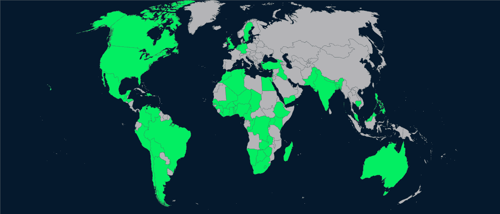

# 庆祝我们的 50+数据营捐赠合作伙伴

> 原文：<https://web.archive.org/web/20230101103238/https://www.datacamp.com/blog/celebrating-our-50-datacamp-donates-partners>

### DataCamp 捐赠规模翻倍！

在我们的[上一次 DataCamp 捐赠更新](https://web.archive.org/web/20221212135912/https://www.datacamp.com/community/blog/datacamp-donates)中，我们宣布我们已经向非营利组织捐赠了超过 10，000 份高级 DataCamp 订阅，以帮助全球弱势学习者。我们还承诺捐赠 25，000 份订阅的更大目标。

六个星期后，我们兴奋地报告说，DataCamp 捐赠计划的规模几乎翻了一番！我们现在已经向 50 多个非营利合作伙伴承诺了 20，000 份订阅。由于我们合作伙伴的外联和参与努力，DataCamp 捐赠订阅已分发给各大洲 60 多个国家的学习者。

### 欢迎新伙伴

是什么导致了免费数据营访问的爆炸？我们的一些最新合作伙伴，如 [Code for Nepal](https://web.archive.org/web/20221212135912/https://codefornepal.org/) 和 [Open Knowledge Nepal](https://web.archive.org/web/20221212135912/http://oknp.org/) 正在合作开展大型活动，以使偏远社区数字化和数据流畅。我们的许多合作伙伴组织，如[数据科学 Fem](https://web.archive.org/web/20221212135912/https://www.datasciencefem.com/) 和 [Ingressive For Good](https://web.archive.org/web/20221212135912/https://ingressive.org/) ，正在走出自己的国家，寻找在当今严峻的经济形势下需要帮助的全球学习者。DataCamp Donates 已经扩展到公立高中，为高中黑客马拉松的参与者提供免费订阅，如 [MakeSPP](https://web.archive.org/web/20221212135912/https://makespp.com/) 和 [CincyHacks 2021](https://web.archive.org/web/20221212135912/https://cincyhacks.com/) 。更多的合作伙伴已经将我们的计划传播给了他们社区中的其他非营利组织，产生了积极变化的滚雪球效应。

但最重要的是，这些组织和他们的学习者正在发现 DataCamp 平台对于在家工作时的职业发展和工作安置是多么有益。有了这样的成功案例，我们相信 DataCamp 的捐赠可以填补日益增长的全球技术技能缺口。

### 注册数据营捐赠！

你知道任何公立高中或非营利组织可以从与 DataCamp 的合作中获益吗？我们还有 5000 多份套餐可以赠送—请在 [【电子邮件保护】](/web/20221212135912/https://www.datacamp.com/cdn-cgi/l/email-protection#5a3e35343b2e3f1a3e3b2e3b393b372a74393537) 申请！

呼吁世界各地所有学生、失业者和低薪的有志数据专业人士:我们的数据营捐赠合作伙伴可能能够为您提供一年的免费数据营，如果您满足他们的会员资格要求，这因组织而异。[访问我们的常见问题解答](https://web.archive.org/web/20221212135912/https://support.datacamp.com/hc/en-us/articles/360051596574)找到离您最近的组织，并直接联系他们以获取更多信息。