# 机器学习中的分类:导论

> 原文：<https://web.archive.org/web/20230101102817/https://www.datacamp.com/blog/classification-machine-learning>

如今，许多行业都在处理不同类型的大型数据集。手动处理所有这些信息可能非常耗时，甚至从长远来看可能不会增加价值。从简单的自动化到机器学习技术，许多策略正被应用于更好的投资回报。这个概念博客将涵盖一个最重要的概念；机器学习中的分类。

我们将从定义什么是机器学习中的分类开始，然后明确机器学习中的两类学习者以及分类和回归的区别。然后，我们将介绍一些可以使用分类的真实场景。之后，我们将介绍所有不同类型的分类，并深入探讨一些分类算法的例子。最后，我们将提供一些算法实现的实践。

## 机器学习中的分类是什么？

分类是一种受监督的机器学习方法，其中模型试图预测给定输入数据的正确标签。在分类中，使用训练数据对模型进行全面训练，然后在用于对新的未知数据执行预测之前，对测试数据进行评估。

例如，一种算法可以学习预测给定的电子邮件是垃圾邮件还是 ham(没有垃圾邮件)，如下所示。

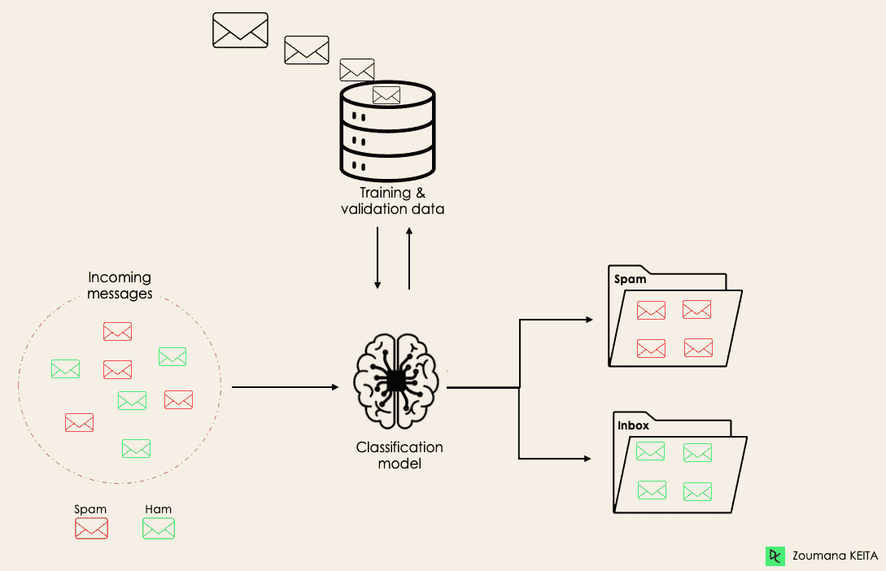在深入分类概念之前，我们先来了解两类学习者在分类上的区别:懒惰型和求知欲型学习者。然后我们会澄清分类和回归之间的误解。

#### 懒惰的学习者与渴望的学习者

机器学习分类中有两种类型的学习者:懒惰型和渴望型学习者。

**渴望学习者**是机器学习算法，首先从训练数据集建立模型，然后对未来数据集进行任何预测。他们在训练过程中花费更多的时间，因为他们渴望在训练过程中通过学习权重得到更好的概括，但是他们需要更少的时间来进行预测。

大多数机器学习算法都是积极的学习者，下面是一些例子:

*   逻辑回归。
*   支持向量机。
*   决策树。
*   人工神经网络。

**另一方面，懒惰的学习者或基于实例的学习者**不会立即从训练数据中创建任何模型，这就是懒惰方面的来源。他们只是死记硬背训练数据，每次有需要做预测的时候，就从整个训练数据中搜索最近邻，这使得他们在预测的时候非常慢。这类例子有:

*   k-最近邻。
*   基于案例的推理。

但是，一些算法，如 [BallTrees](https://web.archive.org/web/20220926112055/https://en.wikipedia.org/wiki/Ball_tree) 和 [KDTrees](https://web.archive.org/web/20220926112055/https://en.wikipedia.org/wiki/K-d_tree) ，可以用来改善预测延迟。

#### 机器学习分类与回归

机器学习算法主要有四类:监督、非监督、半监督和强化学习。

尽管分类和回归都属于监督学习的范畴，但它们并不相同。

*   当目标变量离散时，预测任务是一个 ***分类*** 。应用是对一段文本的潜在情感的识别。
*   当目标变量连续时，预测任务是一个 ***回归*** 。一个例子可以是给定一个人的教育程度、以前的工作经验、地理位置和资历水平来预测其工资。

如果你有兴趣了解更多关于分类的知识，关于 scikit-learn 的[监督学习](https://web.archive.org/web/20220926112055/https://www.datacamp.com/courses/supervised-learning-with-scikit-learn)和 R 中的[监督学习的课程可能会有所帮助](https://web.archive.org/web/20220926112055/https://app.datacamp.com/learn/courses/supervised-learning-in-r-classification)。它们让您更好地理解每个算法如何处理任务，以及实现它们所需的 Python 和 R 函数。

关于回归，R 中的[回归介绍和 Python 中的【statsmodels 回归介绍](https://web.archive.org/web/20220926112055/https://app.datacamp.com/learn/courses/introduction-to-regression-in-r)将帮助您探索不同类型的回归模型以及它们在 R 和 Python 中的实现。

## 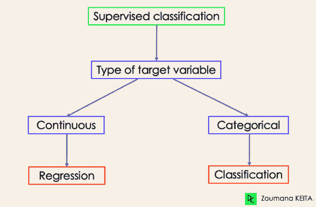现实生活中机器学习分类的例子

监督机器学习分类在我们日常生活的多个领域中有不同的应用。下面是一些例子。

#### 卫生保健

基于历史患者数据训练机器学习模型可以帮助医疗保健专家准确分析他们的诊断:

*   在新冠肺炎疫情期间，机器学习模型被实施来有效地预测一个人是否患有新冠肺炎。
*   研究人员可以使用机器学习模型来预测未来更有可能出现的新疾病。

#### 教育

教育是处理最多文本、视频和音频数据的领域之一。这种非结构化信息可以在自然语言技术的帮助下进行分析，以执行不同的任务，例如:

*   按类别对文档进行分类。
*   在申请过程中自动识别学生文档的潜在语言。
*   学生对教授反馈意见的分析。

#### 运输

交通运输是许多国家经济发展的重要组成部分。因此，各行业正在使用机器和深度学习模型:

*   来预测哪个地理位置的车流量会上升。
*   预测由于天气条件在特定地点可能发生的潜在问题。

#### 持续农业

农业是人类生存最有价值的支柱之一。引入可持续性有助于在不破坏环境的情况下提高农民的生产力:

*   通过使用分类模型来预测哪种类型的土地适合特定类型的种子。
*   预测天气，帮助他们采取适当的预防措施。

## 机器学习中不同类型的分类任务

在机器学习中有四种主要的分类任务:二进制、多类、多标签和不平衡分类。

### 二元分类

在二元分类任务中，目标是将输入数据分为两个互斥的类别。这种情况下的训练数据以二进制格式标记:真和假；正反；o 和 1；垃圾邮件和非垃圾邮件等。这取决于要解决的问题。例如，我们可能想要检测给定图像是一辆卡车还是一艘船。

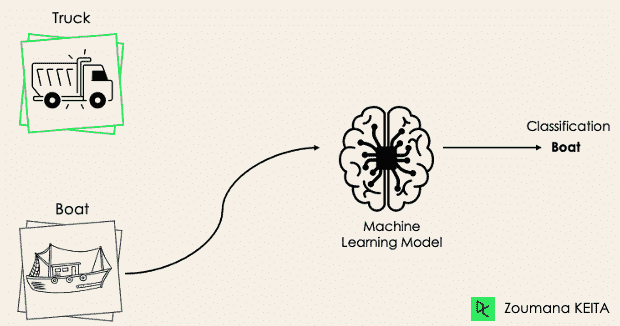

逻辑回归和支持向量机算法本来就是为二元分类设计的。然而，诸如 K-最近邻和决策树的其他算法也可以用于二进制分类。

### 多类分类

另一方面，多类分类具有至少两个互斥的类标签，其目标是预测给定输入示例属于哪个类。在下面的例子中，模型正确地将图像分类为平面。

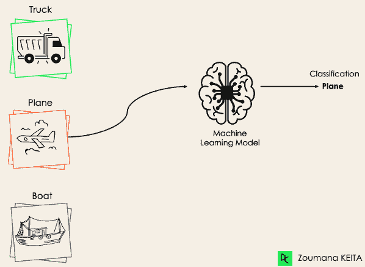

大多数二元分类算法也可以用于多类分类。这些算法包括但不限于:

*   随机森林
*   朴素贝叶斯
*   k-最近邻
*   梯度推进
*   SVM
*   逻辑回归。

但是等等！你不是说 SVM 和 Logistic 回归默认不支持多类分类吗？

*→没错。然而，我们可以应用二进制转换方法，例如一对一和一对全部，以使本地二进制分类算法适应多类分类任务。*

**一对一**:这种策略训练与标签对一样多的分类器。如果我们有一个 3 类分类，我们将有三对标签，因此有三个分类器，如下所示。

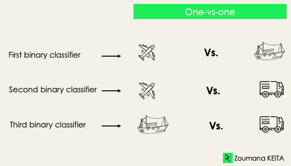

一般来说，对于 N 个标签，我们将有 Nx(N-1)/2 个分类器。每个分类器在单个二进制数据集上训练，并且通过所有分类器之间的多数投票来预测最终类别。一对一方法最适合 SVM 和其他基于内核的算法。

**One-versus-rest** :在这个阶段，我们首先将每个标签视为一个独立的标签，而将其余的标签组合起来仅视为一个标签。对于 3 类，我们将有三个分类器。

一般来说，对于 N 个标签，我们会有 **N** 个二元分类器。

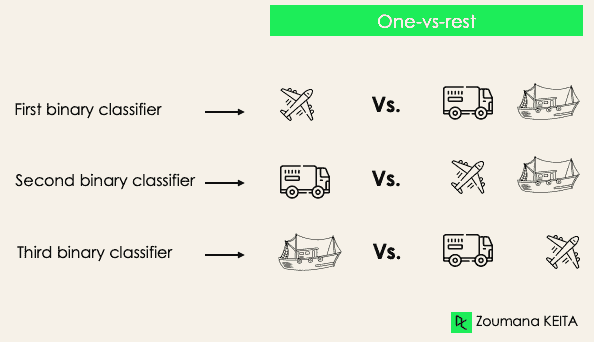

### 多标签分类

在多标签分类任务中，我们试图为每个输入示例预测 0 个或更多个类别。在这种情况下，不存在互斥，因为输入示例可以有多个标签。

这种情况可以在不同的领域中观察到，例如自然语言处理中的自动标记，其中给定的文本可以包含多个主题。与计算机视觉类似，图像可以包含多个对象，如下图所示:模型预测图像包含:一架飞机、一艘船、一辆卡车和一只狗。


不可能使用多类或二元分类模型来执行多标签分类。然而，用于这些标准分类任务的大多数算法都有其用于多标签分类的专用版本。我们可以举出:

*   *多标签决策树*
*   *多标签梯度增强*
*   *多标签随机森林*

### 不平衡分类

对于不平衡分类，示例的数量在每个类中分布不均匀，这意味着在训练数据中，一个类可能比其他类更多。让我们考虑下面的 3 类分类场景，其中训练数据包含:60%的卡车、25%的飞机和 15%的船。

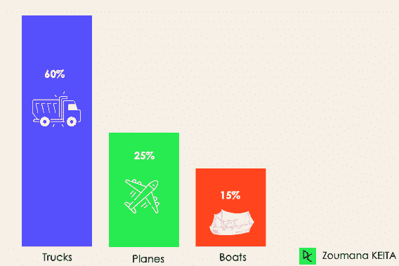

不平衡分类问题可能出现在以下场景中:

*   *金融行业欺诈交易检测*
*   *罕见病诊断*
*   *客户流失分析*

使用传统的预测模型，如决策树、逻辑回归等。在处理不平衡数据集时可能无效，因为它们可能偏向于预测具有最多观察值的类，而将那些数量较少的类视为噪声。

那么，这是否意味着这些问题已经被抛在脑后了呢？

当然不是！我们可以使用多种方法来解决数据集中的不平衡问题。最常用的方法包括采样技术或利用成本敏感算法的力量。

#### 取样技术

这些技术旨在通过以下方式平衡原件的分发:

*   *基于聚类的过采样:*
*   随机欠采样:从多数类中随机剔除样本。
*   SMOTE 过采样:从少数类中随机复制样本。

#### 成本敏感算法

这些算法考虑了错误分类的代价。他们的目标是最小化模型产生的总成本。

*   成本敏感的决策树。
*   成本敏感的逻辑回归。
*   *代价敏感支持向量机*。

### 评估机器学习分类算法的度量

既然我们对不同类型的分类模型有了一个概念，那么为这些模型选择正确的评估指标就变得至关重要了。在本节中，我们将涵盖最常用的指标:准确度、精确度、召回率、F1 评分、ROC(受试者操作特征)曲线下面积和 AUC(曲线下面积)。

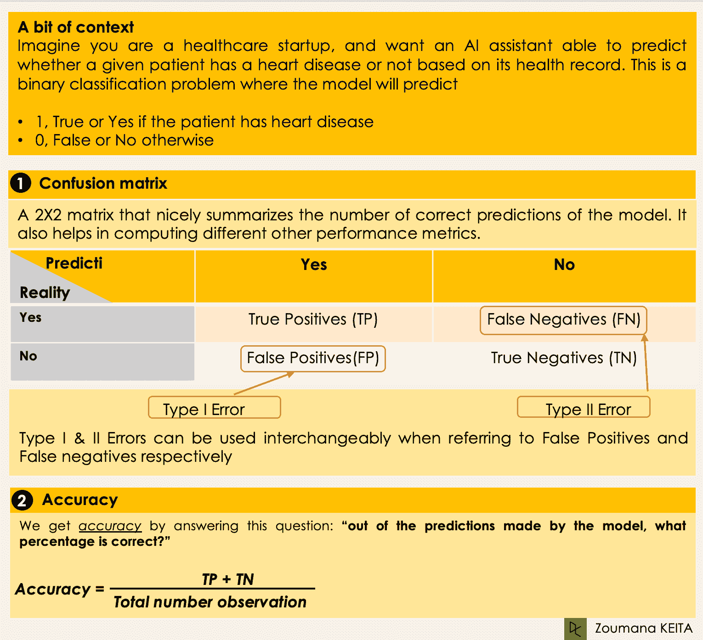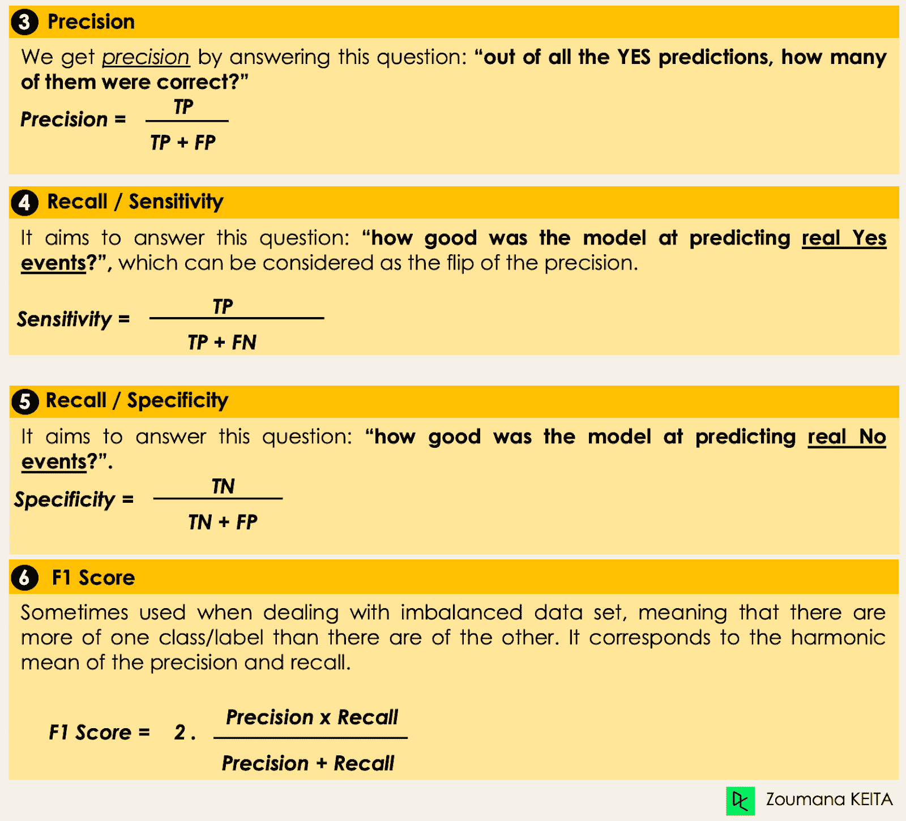

## 深入研究分类算法

我们现在已经有了所有的工具来实现一些算法。本节将介绍四种算法及其在[贷款数据集](https://web.archive.org/web/20220926112055/https://www.datacamp.com/workspace/datasets/dataset-python-loans)上的实现，以说明一些之前介绍过的概念，尤其是对于使用二元分类任务的不平衡数据集。为了简单起见，我们将只关注四种算法。

我们的目标不是要有最好的模型，而是说明如何训练下面的每一个算法。源代码可以在 [DataCamp 工作区](https://web.archive.org/web/20220926112055/https://app.datacamp.com/workspace/w/d5394eb3-ec60-4645-9227-67f0799ebe33)上获得，在这里你可以一键执行一切。

### 数据集中贷款的分布

*   查看数据集中的前五个观察值。

```py
import pandas as pd
loan_data = pd.read_csv("loan_data.csv")
loan_data.head()
```


*   数据集中的借款人资料。

```py
import matplotlib.pyplot as plt
# Helper function for data distribution
# Visualize the proportion of borrowers
def show_loan_distrib(data):
  count = ""
  if isinstance(data, pd.DataFrame):
      count = data["not.fully.paid"].value_counts()
  else:
      count = data.value_counts()

  count.plot(kind = 'pie', explode = [0, 0.1], 

              figsize = (6, 6), autopct = '%1.1f%%', shadow = True)
  plt.ylabel("Loan: Fully Paid Vs. Not Fully Paid")
  plt.legend(["Fully Paid", "Not Fully Paid"])
  plt.show()

# Visualize the proportion of borrowers
show_loan_distrib(loan_data)
```

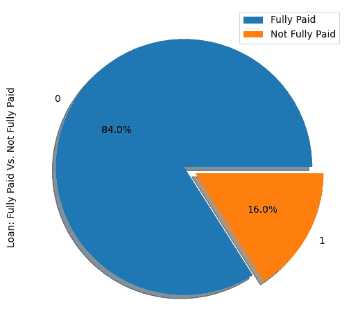

从上面的图表中，我们注意到 84%的借款人偿还了贷款，只有 16%没有偿还，这使得数据集非常不平衡。

### 变量类型

在此之前，我们需要检查变量的类型，以便我们可以对那些需要编码的变量进行编码。

我们注意到所有的列都是连续变量，除了需要编码的**目的**属性。

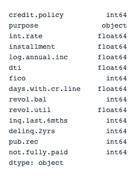

```py
# Check column types
print(loan_data.dtypes)
```

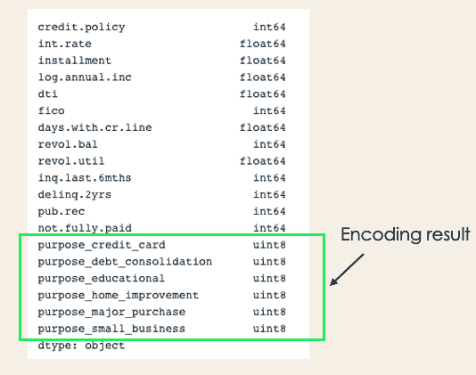

```py
encoded_loan_data = pd.get_dummies(loan_data, prefix="purpose",   

                                   drop_first=True)
print(encoded_loan_data.dtypes)
```

### 将数据分为训练和测试

```py
X = encoded_loan_data.drop('not.fully.paid', axis = 1)
y = encoded_loan_data['not.fully.paid']

X_train, X_test, y_train, y_test = train_test_split(X, y, test_size=0.30, 

                                           stratify = y, random_state=2022)
```

### 抽样策略的应用

这里我们将探讨两种采样策略:随机欠采样和 SMOTE 过采样。

#### 随机欠采样

我们将对多数类进行欠采样，它对应于“完全支付”(类 0)。

```py
X_train_cp = X_train.copy()
X_train_cp['not.fully.paid'] = y_train
y_0 = X_train_cp[X_train_cp['not.fully.paid'] == 0]
y_1 = X_train_cp[X_train_cp['not.fully.paid'] == 1]
y_0_undersample = y_0.sample(y_1.shape[0])
loan_data_undersample = pd.concat([y_0_undersample, y_1], axis = 0)

# Visualize the proportion of borrowers
show_loan_distrib(loan_data_undersample)
```

#### 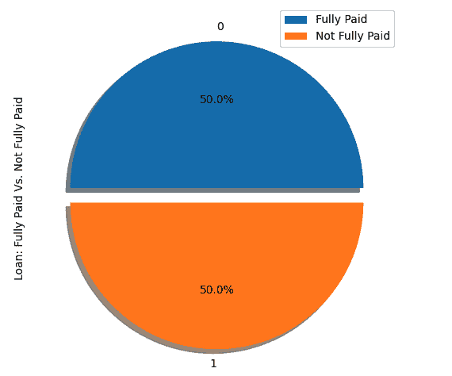

#### SMOTE 过采样

对少数类执行过采样

```py
smote = SMOTE(sampling_strategy='minority')
X_train_SMOTE, y_train_SMOTE = smote.fit_resample(X_train,y_train)
# Visualize the proportion of borrowers
show_loan_distrib(y_train_SMOTE)
```

应用抽样策略后，我们观察到数据集平均分布在不同类型的借款人中。

### 一些机器学习分类算法的应用

本节将对 SMOTE 采样数据集应用这两种分类算法。同样的训练方法也可以应用于欠采样数据。

#### 逻辑回归

这是一个可以解释的算法。它通过使用 sigmoid 函数模拟数据点属于给定类别的概率来对数据点进行分类。

```py
X = loan_data_undersample.drop('not.fully.paid', axis = 1)
y = loan_data_undersample['not.fully.paid']
X_train, X_test, y_train, y_test = train_test_split(X, y, test_size=0.15, stratify = y, random_state=2022)
logistic_classifier = LogisticRegression()
logistic_classifier.fit(X_train, y_train)
y_pred = logistic_classifier.predict(X_test)
print(confusion_matrix(y_test,y_pred))
print(classification_report(y_test,y_pred))
```

#### 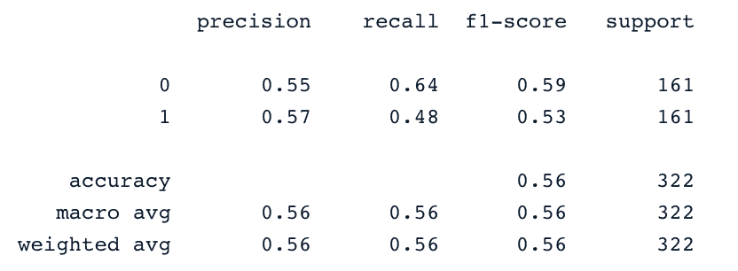

#### 支持向量机

该算法可用于分类和回归。它通过使用最大化边缘原则来学习绘制超平面(决策边界)。这个决策边界通过两个最接近的支持向量来绘制。

SVM 提供了一种称为内核技巧的转换策略，用于将非学习者可分离的数据投影到更高维空间，使它们线性可分离。

```py
from sklearn.svm import SVC
svc_classifier = SVC(kernel='linear')
svc_classifier.fit(X_train, y_train)

# Make Prediction & print the result
y_pred = svc_classifier.predict(X_test)

print(classification_report(y_test,y_pred))
```

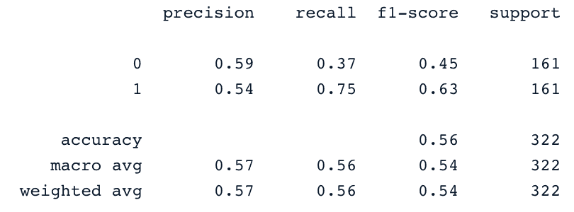

这些结果当然可以通过更多的功能工程和微调来改进。但是它们比使用原始的不平衡数据要好。

#### XGBoost

这个算法是一个著名的梯度提升树算法的扩展。这是一个伟大的候选人不仅打击过度拟合，而且速度和性能。

为了不让它变长，可以参考 Python 中的[基于树的模型的机器学习和 R](https://web.archive.org/web/20220926112055/https://www.datacamp.com/courses/machine-learning-with-tree-based-models-in-python) 中的[基于树的模型的机器学习。从这些课程中，您将学习如何使用 Python 和 R 来实现基于树的模型。](https://web.archive.org/web/20220926112055/https://app.datacamp.com/learn/courses/machine-learning-with-tree-based-models-in-r)

## 结论

这篇概念性的博客涵盖了机器学习中分类的主要方面，也为你提供了一些它们应用于不同领域的例子。最后，在执行欠采样和 SMOTE 过采样策略以生成用于模型训练的平衡数据集之后，介绍了逻辑回归和支持向量机的实现。

我们希望它能帮助你更好地理解机器学习中的分类这个主题。你可以通过跟随拥有 Python track 的[机器学习科学家](https://web.archive.org/web/20220926112055/https://www.datacamp.com/tracks/machine-learning-scientist-with-python)来进一步学习，它涵盖了监督、非监督和深度学习。它还很好地介绍了自然语言处理、图像处理、Spark 和 Keras。

SVM 流行的核有线性核、多项式核、高斯核、径向基函数(RBF)、拉普拉斯 RBF 核、Sigmoid 核、 Anova 核、贝塞尔函数核。

分类是一种有监督的机器学习方法，用于预测给定输入数据的正确标签。

我们可以使用 SVM 和神经网络。

有多种算法，但最流行的包括 k 近邻、决策树、朴素贝叶斯、随机森林和梯度推进。

当处理小数据集时，逻辑回归、支持向量机和朴素贝叶斯往往具有更好的泛化能力。