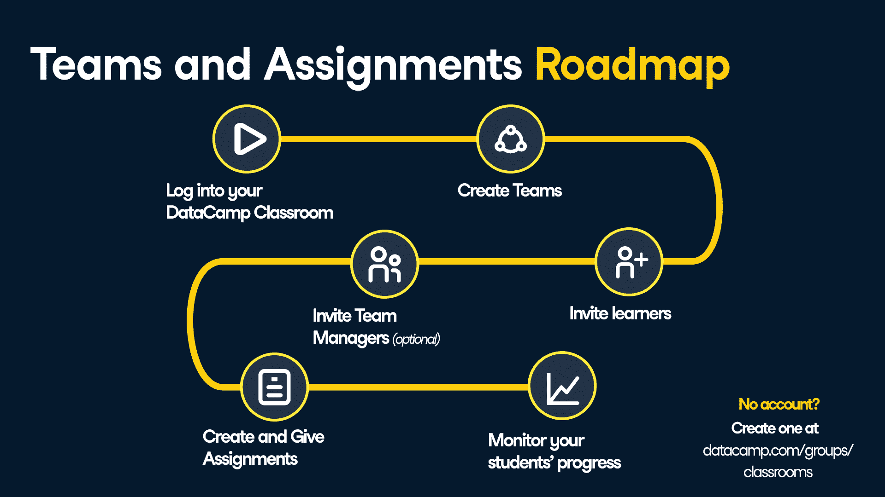
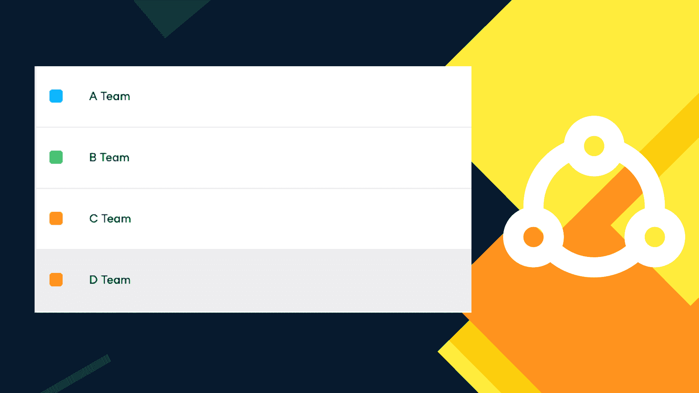
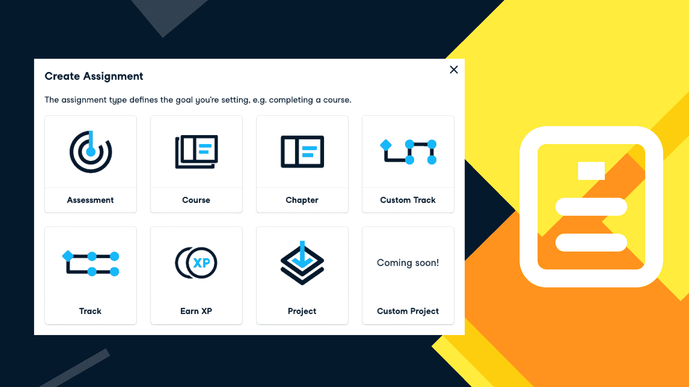

# 教师如何组织数据营课堂:团队和作业

> 原文：<https://web.archive.org/web/20221129041202/https://www.datacamp.com/blog/classrooms-teams-assignments>

****

**创建团队**

作为一名 DataCamp 组管理员，您拥有多种能力。其中之一就是创建团队来组织你的成员。管理许多学生可能会有压力，因此在团队功能的帮助下，您可以在平台本身中创建小组，并组织您的课堂。在那里，您可以查看各自团队中的所有学生，并为他们分配活动。

例如，如果你在一周的不同时间给三组不同的学生教同一门课，你可以为每组学生组成一个小组。或者同一班级内的小组项目呢？问题解决了。你甚至可以创建任意多的团队。教室管理怎么样？

创建不同学生的团队再简单不过了。一切都从你第一次拥有自己的教室开始。教师可以通过访问 [DataCamp 教室网页](https://web.archive.org/web/20220822105743/https://www.datacamp.com/groups/classrooms)申请教室。你所需要做的就是填写申请表，一旦他们被批准，就可以免费使用 DataCamp 六个月！

现在你已经准备好创建团队了。选择您的 DataCamp 教室组，并导航到左侧边栏上的团队选项。你可以给你的团队一个名字和一种颜色。您的团队现已创建。

创建团队后，现在是邀请学员的时候了。您可以通过键入成员的电子邮件地址来邀请他们，或者如果您的学术机构共享一个电子邮件域，您可以创建一个邀请链接。您还可以在 members 部分向任何团队添加预先存在的成员，个人可以加入多个团队。

如果你有很多学生和团队，指派团队经理会很有帮助。团队经理还可以专门为自己的团队创建任务，并查看团队成员的活动——非常适合教学助理！

**分配任务**

作业给你的学生提供了要完成的目标，也给你，他们的老师，提供了对他们进步的全面了解。在左侧的同一个侧边栏中，Assignments 为您提供了为您的班级创建的所有作业的视图。通过点击“创建任务”按钮，您可以[创建不同类型的任务](https://web.archive.org/web/20220822105743/https://support.datacamp.com/hc/en-us/articles/360050186713-Assignments-Overview#assignment-types-0-1)。你可以让你的学生获得一定数量的经验值，或者让他们完成一个技能轨道，比如 Python 中的[金融基础](https://web.archive.org/web/20220822105743/https://app.datacamp.com/learn/skill-tracks/finance-fundamentals-in-python)。一旦你选择了要分配的作业类型，就要设定一个截止日期，并给你的学生一个个性化的信息。一旦任务完成，你就可以积极地监控全班的成绩状况，看看谁迟到了，谁准时了。

在 DataCamp 教室中创建作业是跟踪学生数据科学学习进度的最有效方式。设置作业时，您可以对发送给学生的电子邮件进行个性化设置，以便为他们提供所需的所有信息。

通过在 DataCamp 上分配内容，您可以实时查看哪些学生已经完成或仍在完成作业。临近到期日时，系统会自动向学生发送电子邮件提醒。

在指定时间段结束时，您将访问显示学生提交内容的指标，分为三组:已完成、迟交和未交。这些数字总结在你的完成率中。此外，如果你分配一项技能评估任务，学生的总体分数将显示为新手、中级或专家。

使用我们的内置功能分配 DataCamp 内容不仅对您有帮助，对您的学生也有帮助。学生可以使用他们自己的学习仪表板来查看他们已完成和待完成的作业。

**针对所有数据营管理员**

管理你的班级并不困难，因为这些方法可以让你的学生体验个性化。这些功能也适用于 DataCamp 团队和企业帐户的所有管理员！像这样有组织的设置可以帮助您的学员找到成功之路，并充分利用 DataCamp 的平台。

以您喜欢的任何方式使用这两项功能，为您的学习者打造更加个性化和独特的数据科学之旅。

**今天就开始打造你的教室**

世界各地的大学、学院和学术机构的教师都有资格通过 DataCamp 教室免费获得六个月的 DataCamp 访问权限。美国、英国、比利时、波兰和澳大利亚的高中教师和学生也可以使用 DataCamp 教室，更多国家也将陆续推出。

今天就申请以正确的方式开始你的秋季学期！

