# 2022 年商业分析师薪酬完全指南

> 原文：<https://web.archive.org/web/20221129052847/https://www.datacamp.com/blog/complete-guide-to-business-analyst-salaries>

当你在找新工作时，你首先想到的可能是:他们会给我多少薪水？如果你正在寻找一个商业分析师的机会，那么有大量的职位可以提供有竞争力的薪水。

美国劳工统计局预测，2019 年至 2029 年间，对商业分析师的需求将增长 11%，高于所有职业的平均水平。商业分析师的需求量已经很大了，而且似乎需求只会随着时间的推移而增加。

新冠肺炎疫情催化了数字革命，这是推动商业分析师需求的一个重要因素。由于在疫情期间增加了对商业分析的投资，各种行业都在建立自己的数据分析团队和部门，以随着数字革命的发展而发展。

然而，缺乏具有分析能力的候选人来担当这样的角色——仅在美国就短缺 14 万到 19 万人。对分析师的热需求使 BAs 在赚取高薪方面处于有利地位，在其他技术职业中具有竞争力。

业务分析师[支持企业](https://web.archive.org/web/20221212135912/https://www.datacamp.com/blog/how-to-write-business-analyst-job-descriptions)的许多功能，他们的工资会根据他们的具体角色、技能、经验水平、地点甚至他们所在的行业而有所不同。

本文将研究这些标准如何影响 2022 年商业分析师的工资。我们的概述基于几个就业门户网站的数据，包括 [Glassdoor](https://web.archive.org/web/20221212135912/https://glassdoor.com/) 和 [PayScale](https://web.archive.org/web/20221212135912/https://www.payscale.com/) ，来自[美国劳工统计局](https://web.archive.org/web/20221212135912/https://www.bls.gov/)的公开数据，以及就业调查，如[奥赖利数据科学工资](https://web.archive.org/web/20221212135912/https://www.oreilly.com/radar/2021-data-ai-salary-survey)调查。这一重点将涵盖美国、英国、欧盟和加拿大，无论您身在何处，都能获得深刻的见解。

## 按经验列出的业务分析师薪金

### 商业分析师的平均工资

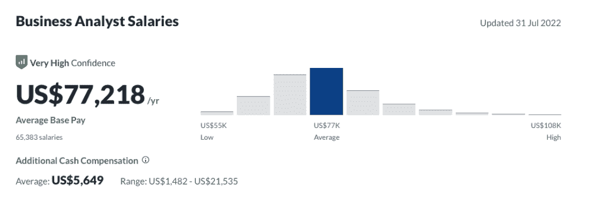

[来源:玻璃门](https://web.archive.org/web/20221212135912/https://glassdoor.com/)

商业分析师的平均收入是多少？根据 Glassdoor 的数据，在美国，BAs 的平均基本工资是每年 77218 美元。对这个数字的信心估计非常高，他们基于超过 65，000 的报告工资。

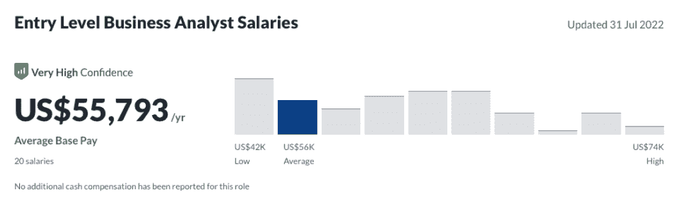

[来源:玻璃门](https://web.archive.org/web/20221212135912/https://glassdoor.com/)

### 入门级业务分析师工资

然而，商业分析师的工资会随着经验的不同而不同。继续关注美国，我们可以看到，作为一个进入商业分析师领域的人，你可能期望每年赚 55，793 美元。

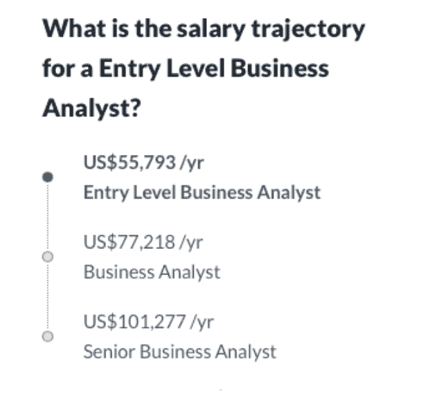

[来源:玻璃门](https://web.archive.org/web/20221212135912/https://glassdoor.com/)

### 高级商业分析师工资

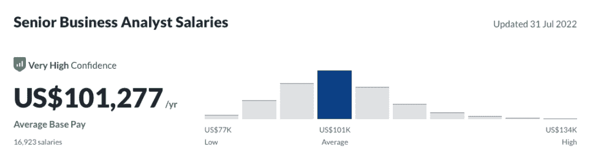

[来源:玻璃门](https://web.archive.org/web/20221212135912/https://glassdoor.com/)

而如果你是一名高级商业分析师，你的经验会给你 101，277 美元的平均年薪。显而易见，商业分析师的薪酬确实会随着资历的增加而增加。

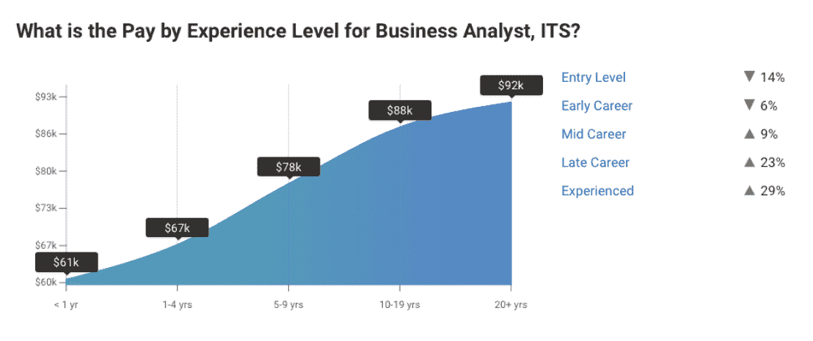

[资料来源:薪级表](https://web.archive.org/web/20221212135912/https://www.payscale.com/)

从 [PayScale](https://web.archive.org/web/20221212135912/https://www.payscale.com/) 看这张图表，我们可以看到一份更详细的报告，说明工作年限如何直接影响薪酬水平。根据他们的数据，入门级的 BAs 可以期望获得 6.1 万美元的收入，而有 20 年或以上工作经验的 BAs 可以获得 9.2 万美元的收入。

## 按地点列出的业务分析师薪金

位置是另一个会改变你预期收入的变量。让我们来看看这些领域的细分情况:

### 美国商业分析师的薪水

根据 Zippia 收集的数据，商业分析师在华盛顿、加利福尼亚、新罕布什尔、新泽西和俄勒冈赚得最多。在薪酬最高的华盛顿，商业分析师的平均薪酬为 93，191 美元。而 Floria 的商业分析师平均工资最低，为 63，126 美元，仍然高于全国各行业的年薪。

[资料来源:Zippia](https://web.archive.org/web/20221212135912/https://www.zippia.com/)

*地图上较暗的区域显示了全美 50 个州中商业分析师收入最高的地方。

### 英国的商业分析师工资

在英国，文学学士的平均工资为 42，768 英镑，远低于美国分析师的基本工资。此外，在英国，文学学士的工资轨迹并不是一条稳定的上升曲线

在成为高级分析师之前，初级 BA 的工资差别不大，他们的年薪约为 56，950 英镑。这显示了一些改进；然而，它没有美国的工资有竞争力。

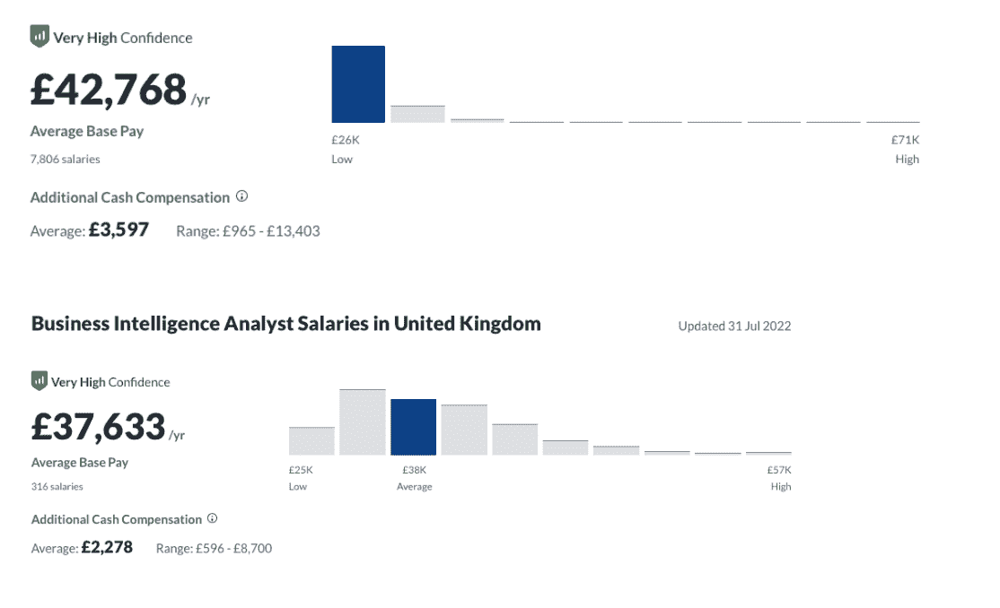

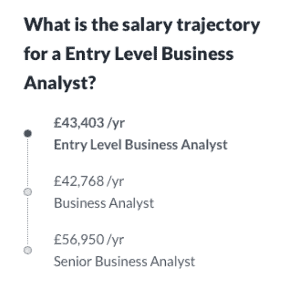

[来源:玻璃门](https://web.archive.org/web/20221212135912/https://glassdoor.com/)

### 欧盟的商业分析师工资

欧盟有 27 个成员国，因此薪酬差距很大。我们将举几个例子来说明整个欧洲的工资范围。

在欧盟，商业分析师最赚钱的地方之一是德国。在德国，学士学位的平均年薪为 5.5 万欧元，这被视为平均工资。作为一名高级学士，这一数字平均每年高达 77，008 欧元。

同样，在阿姆斯特丹和荷兰，高级分析师的基本工资预计为 52，645 欧元，最高可达 71，603 欧元。

在法国，平均薪酬基础略低，为每年 42308 欧元，与入门级求职者的薪酬差距不大。地中海的其他地区，如西班牙和意大利，商业分析师的工资要低得多。平均而言，你在西班牙的工资是 32，868 欧元，在意大利是 27，500 欧元。

### 加拿大的商业分析师工资

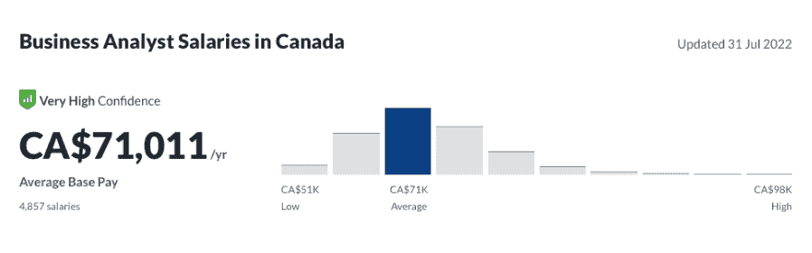

[来源:玻璃门](https://web.archive.org/web/20221212135912/https://glassdoor.com/)

与美国非常相似，加拿大可以为商业分析师提供丰厚的薪水。平均而言，这看起来约为 71，011 美元。一名高级分析师的收入最高可达 88，143 美元左右。

## 按职称列出的业务分析师薪金

“业务分析师”是一个涵盖从初级 IT 业务分析师到业务智能分析师等多种不同角色的职称。在这里，我们对 BA 下的一些职位的平均薪酬进行了细分，最低和最高薪酬职位之间的差距约为 30，000 美元。

商业分析师的资历和对技术的参与通常会提供更高的报酬。(美国的职位数据，通过[薪级表](https://web.archive.org/web/20221212135912/https://www.payscale.com/))。

### 商业管理分析师工资

利用 Oracle 等各种工具，为开发复杂的报告和分析商业智能(BI)解决方案提供高级分析专业知识。必须有丰富的管理和分析经验。

平均工资 60428 美元。

### 业务绩效分析师工资

评估系统的性能和结果。使用强大的研究和分析技能，绩效分析师跨团队工作，并在领导下优化客户增长。

平均工资 60678 美元。

### 二级业务分析师工资

为潜在的业务拓展收集和分析数据。业务分析师 II 需要精通统计，通过 SQL 等程序的认证，并能够承担领导角色。

平均工资 64981 美元。

### 商业智能分析师工资

将技术能力与商业敏锐性相结合，为业务各个方面背后的驱动力提供有价值的见解。执行竞争对手和行业分析，以确保业务的长期生存能力。BI 分析师需要具备一系列技能，包括统计学、数据可视化和管理、计算机编程等。许多公司会要求初级 BI 分析师拥有数年数据分析师或相关职位的经验。

平均工资 66791 美元。

### 应用业务分析师工资

作为组织的 IT 团队的一员，承担分析角色，以确保所使用的计算机应用系统满足组织的需求。应用分析师需要具备技术技能，包括对计算机语言的理解。

平均工资 66882 美元。

### 技术业务分析师工资

监督和实施技术项目和解决方案。主要目的是将业务需求转换成开发和技术团队容易理解的技术规范。这需要大约 3 年以上的数据分析经验，以及理解商业智能工具和编程语言。

平均工资 71489 美元。

### 敏捷业务分析师工资

在使用各种数据管理工具和流程方面为各种业务提供指导和建议。他们通常需要几年的案例建模经验，以及敏捷和 Scrum 方面的扎实经验。

平均工资 74000 美元。

### 商业解决方案分析师工资

在数据科学驱动的环境中，提供行业领先技术、报告工具、数据管理方法、基础架构和最佳实践方面的领导地位和专业知识。这个职位需要几年的金融解决方案经验。

平均工资 75243 美元。

### 系统业务分析师工资

帮助企业 IT 和软件的技术集成。他们需要业务系统分析方面的技术背景和强大的沟通技能，以解决客户业务的技术和非技术方面的差距。

平均工资 78095 美元。

### 高级 IT 业务分析师工资

负责提高 IT 产品和服务的质量，分析数据为业务决策提供信息，并找到满足业务需求的技术解决方案。

平均工资 90201 美元。

值得注意的是，PayScale 给商业分析师的平均基本工资比从 Glassdoor 收集的数据略低。然而，与职位相对应的工资范围与 Glassdoor 的调查结果显示的趋势相匹配。

## 自由职业者的商业分析师工资

随着在家工作的好处越来越多，越来越多的人想知道现在是否是尝试自由职业的合适时机。数据专业人员也不例外。最近几个月，热门自由职业者平台(如 Upwork)上的商业分析师职位数量激增。

如果你正在考虑这个选择，你可能想知道自由职业商业分析师挣多少钱。据 [Glassdoor](https://web.archive.org/web/20221212135912/https://www.glassdoor.co.uk/Salaries/us-freelance-data-scientist-salary-SRCH_IL.0,2_IN1_KO3,27.htm?clickSource=searchBtn) 报道，他们在美国的平均工资是 85796 美元。但是，没有足够的数据来显示一个工资范围。

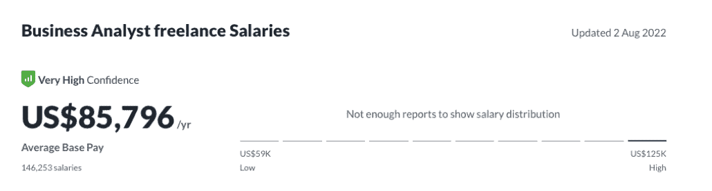

[来源:玻璃门](https://web.archive.org/web/20221212135912/https://www.glassdoor.co.uk/Salaries/us-freelance-data-scientist-salary-SRCH_IL.0,2_IN1_KO3,27.htm?clickSource=searchBtn)

无论如何，很难提供一个明确的估计，因为自由职业商业分析师的收入高度依赖于他们的技能、经验和评论等因素。

## 各行业的商业分析师薪酬

来自 PayScale 和 T2 的数据显示，医疗保健行业提供了一些最高的起薪。对于金融公司和软件应用程序，商业分析师的最低工资(年薪)估计分别在 40，471 美元和 40，293 美元之间。

### 医疗保健:商业分析师平均工资

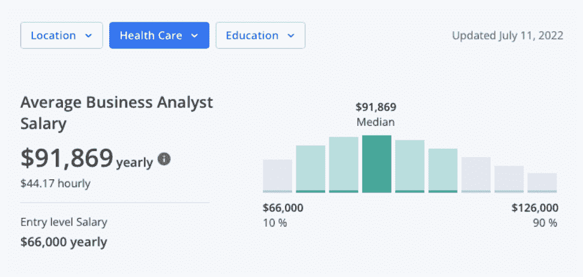

[资料来源:Zippia](https://web.archive.org/web/20221212135912/https://www.zippia.com/)

### 金融:商业分析师平均工资

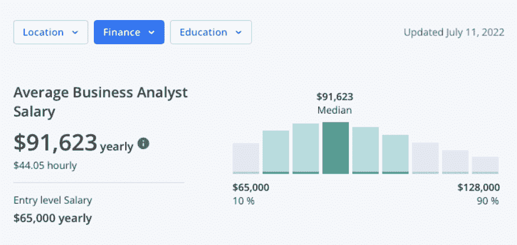

[资料来源:Zippia](https://web.archive.org/web/20221212135912/https://www.zippia.com/)

### 制造业:商业分析师平均工资

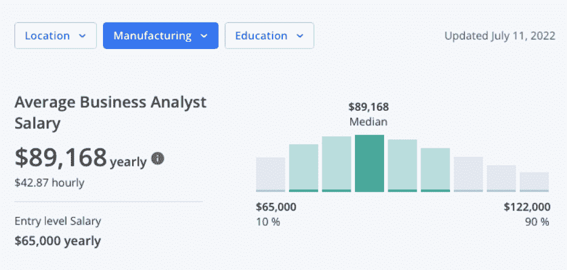

[资料来源:Zippia](https://web.archive.org/web/20221212135912/https://www.zippia.com/)

### 技术:商业分析师的平均工资

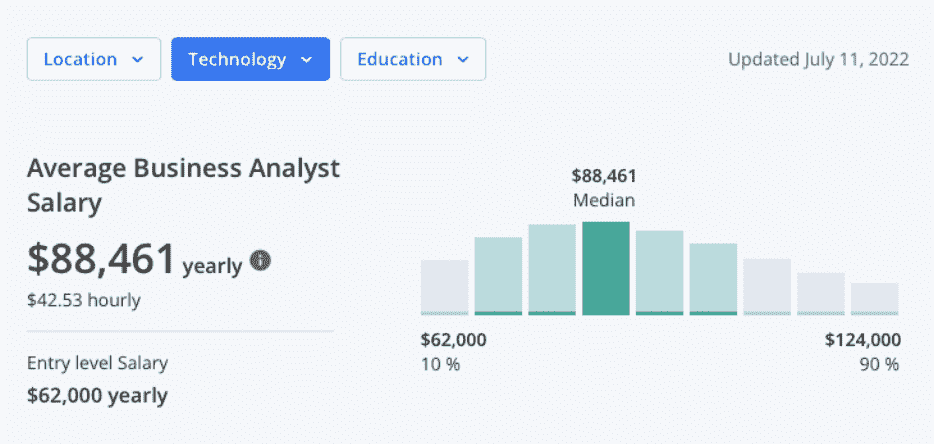

[资料来源:Zippia](https://web.archive.org/web/20221212135912/https://www.zippia.com/)

### 保险:普通商业分析师薪水

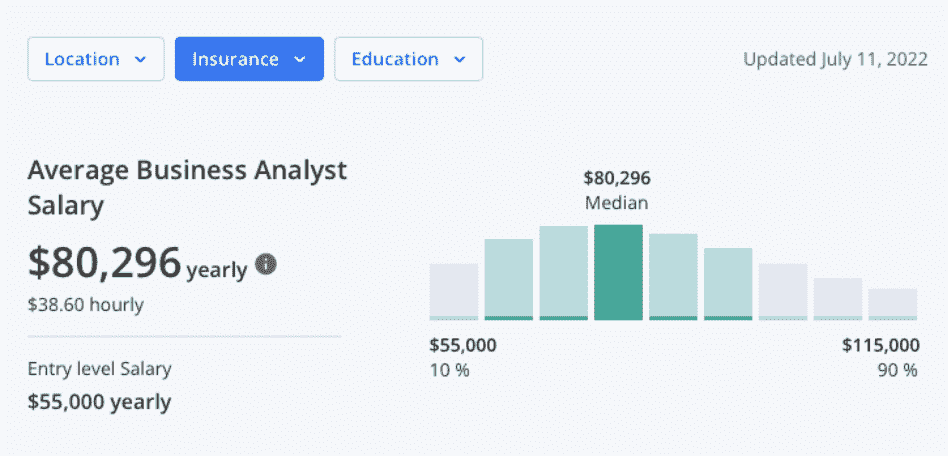

[资料来源:Zippia](https://web.archive.org/web/20221212135912/https://www.zippia.com/)

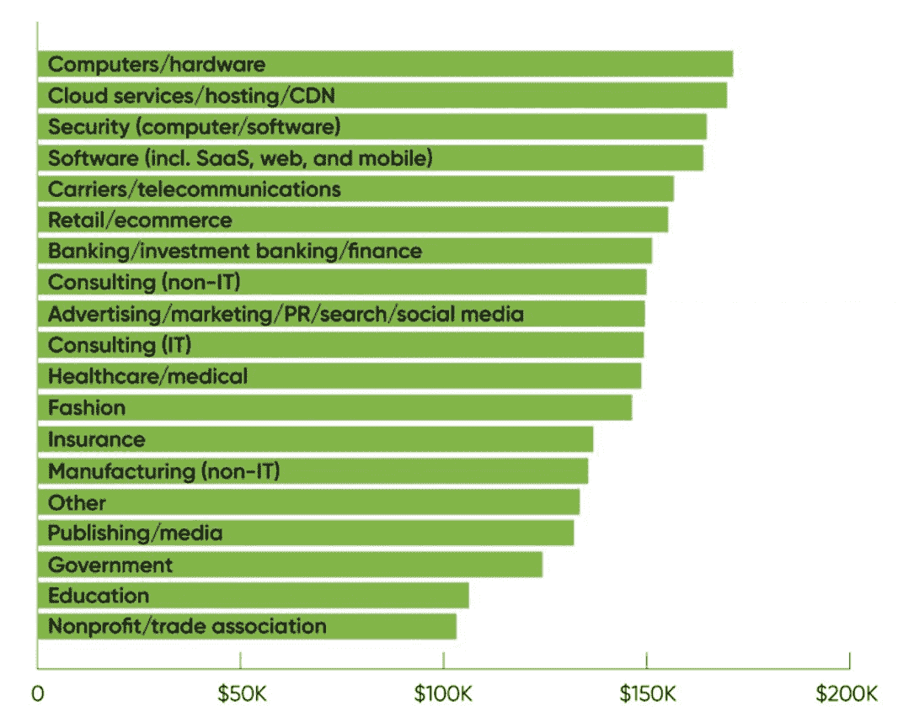

[资料来源:薪级表](https://web.archive.org/web/20221212135912/https://www.payscale.com/)

总体而言，在计算机行业(如计算机硬件、云服务、网络安全或软件开发)工作的数据专业人员报告的薪酬最高，平均薪酬从 171，000 美元(计算机硬件)到 164，000 美元(软件)不等。该数据还显示，除计算机行业外，包括银行、零售、时尚和保险在内的其他行业的薪酬极具竞争力(超过 10 万美元)。这与美国劳工统计局发布的最新[职业数据](https://web.archive.org/web/20221212135912/https://www.bls.gov/oes/current/oes152051.htm#ind)一致。

## 按技能列出的业务分析师薪金

由于业务分析师身兼数职，掌握一系列技术和软技能非常重要。商业头脑和技术知识之间的平衡因职位和公司而异。然而，一些非常有价值的技能可以激发你的收入潜力。

业务分析、需求分析、项目管理和数据分析方面的技能与高于平均水平的薪酬相关。

PayScale 的数据揭示了特定技能如何直接影响你作为商业分析师的薪水，尤其是在技术技能方面。例如，使用 Oracle 电子商务套件可以让你的薪水增加 51%。

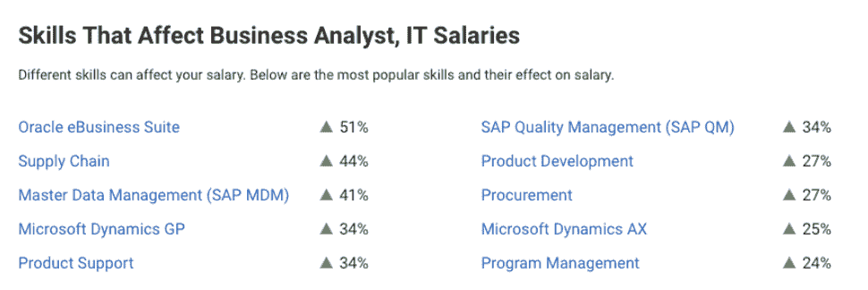

[资料来源:薪级表](https://web.archive.org/web/20221212135912/https://www.payscale.com/)

### 你能做些什么来增加你的薪水

正如本指南中所讨论的，业务分析师负责许多任务，因此需要各种技能，包括硬技能和软技能。

考虑到不断发展的数字环境，业务分析师不断提高技能以满足行业需求至关重要。考虑到这一点，[持续培训对于数据专业人员来说至关重要](https://web.archive.org/web/20221212135912/https://www.datacamp.com/blog/12-best-practices-to-grow-in-your-data-career)这不仅是为了跟上创新的速度，实现加薪或升职。

考虑一下如何通过以下建议提高你的薪水:

#### 高级学位

获得数据科学或相关学科的硕士或博士学位可以增加你在组织中的晋升机会。大多数大型科技公司都鼓励员工参加这类项目。

#### 通过课程提升技能

使用像 Datacamp 这样的平台来提高你的编程语言素养等等。不要错过探索我们庞大的[课程目录](https://web.archive.org/web/20221212135912/https://www.datacamp.com/courses-all)的机会，或者报名参加我们的[技能课程](https://web.archive.org/web/20221212135912/https://www.datacamp.com/tracks/skill)以拓展您的专业领域。

#### 获得认证

获得认证是获得或提高新的业务分析师技能的最快方法之一。根据 [O'Reilly 2021 年数据/人工智能薪酬调查](https://web.archive.org/web/20221212135912/https://www.oreilly.com/radar/2021-data-ai-salary-survey)，云认证，特别是 AWS 和微软 Azure，与薪酬增长最相关。对于业务分析师来说，如果你是一个更有经验的 BA，也可以考虑特定业务的认证，比如 IIBA 业务分析能力认证(CCBA)或者 IIBA 认证业务分析专家(CBAP)。DataCamp 提供行业公认的[数据分析师认证](https://web.archive.org/web/20221212135912/https://www.datacamp.com/certification)，帮助你在求职过程中脱颖而出。

#### 管理经验

寻找在工作中担任管理或领导角色的机会。例如，如果你管理更多的初级商业分析师，这种经验可以验证专业知识和资历，从而增加获得更多收入的可能性。

#### 更换雇主

考虑跳槽到一个愿意为你的技能付更多钱的新雇主。

#### 重新安置

其中一个更激烈的举措，但肯定会有戏剧性的效果，是转移到一个领域，有一个更高的商业分析师的工资率。

#### 探索不同的行业

正如我们所看到的，不同的行业 BA 的工资会有所不同。考虑将你的技能和经验转移到一个能提供更多回报的行业。

### 未来趋势

Linkedin 2021 年的就业报告显示，对数字技能的需求正在增加，而且没有放缓的迹象。该报告预测，未来五年，全球将新增 1.5 亿个科技相关工作岗位。 [Emsi Burning Glass](https://web.archive.org/web/20221212135912/https://www.economicmodeling.com/) 预测，尤其是商业分析师职位在未来 10 年将增长 5.9%。

在疫情期间，随着对数据和数字世界的依赖，对数据和分析的投资增加了。根据 EY 的一项研究，93%的公司表示他们计划继续增加在数据和分析领域的投资。根据联合市场研究的 [2021 年报告，大数据和数据分析市场在 2020 年的价值超过 1980.8 亿美元，预计到 2030 年将增长到 6841.2 亿美元。](https://web.archive.org/web/20221212135912/https://www.alliedmarketresearch.com/big-data-and-business-analytics-market)

随着市场的增长，对数据分析的投资也在增加，因此对 BA 专业人员的需求也在增加。企业间招聘商业分析师的竞争将会加剧，促使它们以更高的薪酬激励应聘者。

如果您正在考虑在数据世界中开始新的冒险，Datacamp 是开始的最佳地方。查看我们的课程目录，立即开始您的学习之旅。