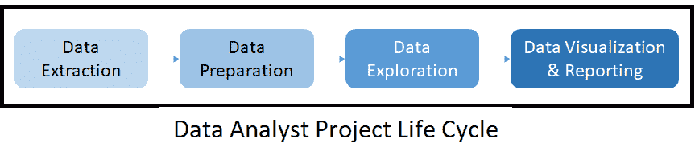
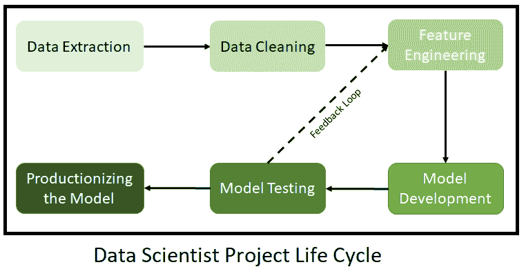

# 数据分析师与数据科学家:比较指南

> 原文：<https://web.archive.org/web/20221129041532/https://www.datacamp.com/blog/data-analyst-vs-data-scientist-a-comparative-guide>

互联网的出现和技术使用的增加导致了数据量的指数增长。企业越来越依赖于数据驱动的决策，这使得他们不得不争夺最佳人才库，以便从相关和可靠的来源高效地获取数据、存储数据并将其用于业务。

随着企业不仅在建立数据基础设施方面，而且在获得合适的人才库方面继续进行巨额投资，数据分析师和数据科学家的角色已经成为两个最受欢迎的角色。他们的流行源于几乎每个行业对这些数据专家的需求不断增长。

## 了解数据分析师和数据科学家之间的差异

数据分析师和数据科学家之间的区别源于他们所从事工作的性质。与数据科学家的实验性工作概况相比，数据分析师的概况主要是探索性的。

数据分析师和数据科学家之间的区别源于数据使用方面的专业知识水平。在这两者中，数据科学家应该更多地使用高级编程技术和计算工具。此外，数据科学家应该更擅长开发数据模型和算法。了解企业使用数据的不同方式有助于进一步明确各自的角色。

*   **描述性分析:**此类别的分析解决方案回答了业务问题的“是什么”和“为什么”部分。它们通过了解历史数据模式、趋势和异常情况提供可操作的见解。例如，确定多年来客户参与度的变化及其背后的原因可以使用描述性分析来解决。
*   **预测分析:**顾名思义，这类解决方案采用机器学习模型，利用过去的数据趋势来估计未来。例如，基于客户的历史参与度计算向客户交叉销售产品的概率是使用预测分析完成的。
*   **规范分析:**规范分析使用描述性和预测性分析的结果来制定改进的业务战略。同样，利用历史参与度和交叉销售的可能性，企业可以为客户确定最佳的产品组合。

数据分析师采用[描述性分析](https://web.archive.org/web/20220705201402/https://www.datacamp.com/data-courses/data-analysis-courses)来报告事实，有时还会基于这些见解通过建议的方式提供说明性分析。数据科学家负责整个分析之旅，主要关注预测分析，并利用数据为组织创造价值。

## 数据分析师与数据科学家:角色和职责的比较

数据分析师可能有许多其他的头衔，例如战略家、商业情报分析师、市场情报分析师或顾问，或者竞争情报分析师。无论确切的职称是什么，数据分析师通常被期望通过查询大量数据(主要是结构化的)然后将它们转换成对各种利益相关者有意义的报告来提供见解。因此，这个角色更多的是发现数据中的模式，生成数据可视化，并将这些见解传达给业务涉众。

相比之下，数据科学家执行的任务属于预测和说明性分析领域。例如，以打车软件服务为例，数据分析师将分析促销对打车活动的历史影响。另一方面，数据科学家可能会研究匹配算法，最有效地将司机与乘客匹配起来。

## 数据分析师和数据科学家的项目生命周期

**数据分析师**

下面详细介绍了由数据分析师处理的项目的生命周期通常是什么样子。

1.  **数据提取:**数据提取仅限于较小的数据集，因为数据分析师主要关注特定的业务场景。
2.  **数据清理和准备:**数据一旦提取出来，就以可视化的形式进行处理和总结，可以直观地突出基本事实、新兴趋势和异常现象。
3.  **数据探索:**在此活动中，分析师开始探索在数据准备阶段观察到的各种趋势和异常背后的原因。
4.  **数据可视化和报告:**接下来，分析师准备由业务评论组成的直观仪表板和管理报告，并与最终利益相关方分享。通常，一些自助式商业智能工具(如 Tableau 和 Power BI)用于此目的。

**数据科学家**

下面显示的流程图详细说明了数据科学家处理项目的各个阶段。

1.  **数据提取:**这是数据分析师和数据科学家的常用步骤。然而，数据科学家的数据源不仅仅局限于一组小表，而是大部分都是巨大的。在这种情况下，数据科学家和数据工程师一起工作。
2.  **数据清理:**在这一阶段，数据科学家花费大量时间深入了解数据，了解潜在问题，识别异常，并最终为下一阶段清理数据。
3.  **特征工程:**在数据科学家开始研究预测模型之前，他们会进行特征工程。特征工程是使用干净的数据创建变量的过程，这些变量预期对目标结果具有更好的预测能力。例如，为了建立预测模型来预测个体患糖尿病的可能性，除了身高和体重之外，身体质量指数也可以用作模型的附加输入。在这里，身体质量指数是一个使用身高和体重计算的工程特征。
4.  **使用 AI/ML 技术的模型开发:**数据然后被馈送到机器学习算法，以产生预测。有各种各样的机器学习算法，具有不同程度的复杂性和用例。阅读本指南，了解不同类型的机器学习算法之间的区别。
5.  **模型测试:**在这个阶段，数据科学家验证模型输出。对于不满意的结果，科学家重新访问模型参数，并对它们进行调整以达到期望的结果。但是，如果模型调整失败，数据科学家会回到绘图板，重新设计特性以支持后续的模型构建。
6.  **生产模型:**在模型开发和模型调整之后，软件工程和数据工程团队合作创建生产就绪的模型管道。这实现了与数据管道的无缝集成。最后一步，他们将代码形式化并部署到生产环境中。

现在，我们已经对数据分析师和数据科学家的角色和职责有了一个看法，接下来的问题是，哪些技能最能让你为承担这些角色做好准备？这里有一个关于这些角色技能要求的比较指南。

## 数据分析师与数据科学家:技能比较

这两个角色的技能要求非常相似。然而，每项技能的熟练程度差异很大。下表列出了数据分析师和数据科学家应具备的八项关键技能及其熟练程度:

| **技能对比指南** |   |   |
| **技能领域** | **数据分析师** | **数据科学家** |
| 数据工程 | 低的 | 中等 |
| 数据探索 | 高的 | 高的 |
| 数据可视化 | 高的 | 中等 |
| 工具和编程语言 | 中等 | 高的 |
| 数据建模和算法 | 低的 | 高的 |
| 商业领域知识 | 高的 | 高的 |
| 软件工程 | 低的 | 中等 |
| 沟通和展示 | 高的 | 高的 |

**数据分析师**

数据分析师的项目生命周期通常有两个阶段:洞察生成和洞察沟通。让我们了解一下每个阶段的技能要求:

*   洞察生成:为了生成可操作的、有影响力的洞察，数据分析师应该拥有足够的领域知识来有效地探索数据。任何一方面的专业知识不足都意味着对业务问题的理解不正确，并可能产生误导性的结果。考虑到当今组织中的技术环境，探索性分析要求分析师精通 SQL、Python 和 r 等编程语言。他们应该能够在函数式编程的范例中高效地编写代码。因此，掌握这些语言的工作知识至少可以更好地执行任何数据争论操作。精通数据工程可以极大地帮助数据分析师减少对数据团队的依赖。这对他们来说是一大优势。
*   洞察力沟通:能够有效地与高级利益相关者沟通并提出见解是一项重要的技能。为了提高效率，对 Tableau 和 Power BI 之类的数据可视化工具的良好掌握对数据分析师来说会很有用。由于洞察交流通常通过演示和仪表板进行，数据分析师很少需要生产代码。所以软件工程方面的知识一般都是退居二线。

**数据科学家**

尽管数据科学家处理的业务问题看起来五花八门，但他们管理的项目大体上都涉及建立预测模型并将其生产化。执行这些活动所需的技能如下:

*   预测建模:除了擅长数据探索和业务领域知识，数据科学家还应该很好地掌握各种数据建模技术和相关算法。因此，精通 Python 和 R 等开源语言是必要的。使用可视化工具是他们与各种利益相关者共享建模结果的先决条件。除此之外，数据科学家需要随意提取数据，并将数据管道需求有效地传达给工程团队。因此，拥有数据工程领域的技能是数据科学家的必备技能。
*   模型生产化:通常，来自数据模型的输出被输入到一个前端系统中，供一线用户访问。为了确保无缝集成，数据科学家需要开发 Restful APIs、JSON 提要和其他 web 服务。数据科学家在模型和 API 开发过程中编写的所有代码都需要为生产做好准备。因此，需要软件工程的工作知识来支持对面向对象编程的理解。

## 数据分析师与数据科学家:教育背景

本节将为您提供数据分析师和数据科学家通常拥有的教育资格、他们的研究领域以及一些关键的新兴趋势的高级视图。

### 学历的比较

根据 Burtch Works 2021 年的研究，数据分析师和数据科学家的教育水平对他们的薪酬有着重大影响，这一发现将在随后关于这两种角色的行业前景的章节中得到证实。

| **学历对比** |
| **学位等级比较** | **数据分析师** | **数据科学家** |
| 学士学位 | 14% | 7% |
| 硕士学位 | 67% | 44% |
| 博士学位 | 19% | 49% |

资料来源:【2021 年博奇工程研究

在接受调查的数据科学家总数中，49%拥有博士学位。然而，接受调查的数据分析师中只有 19%拥有博士学位

| **研究区域的比较** |
| **研究领域** | **数据分析师** | **数据科学家** |
| 数学/统计学 | 37% | 21% |
| 商业 | 21% | 8% |
| 工程 | 14% | 19% |
| 经济学 | 9% | 6% |
| 计算机科学 | 8% | 24% |
| 自然科学 | 5% | 21% |
| 社会科学 | 5% | 1% |

资料来源:【2021 年博奇工程研究

虽然计算机科学成为数据科学家最受欢迎的研究领域，但工程在这两种角色中的受欢迎程度正在逐渐提高。

### 主要趋势

根据[Burtch Works 2021 年研究](https://web.archive.org/web/20220705201402/https://www.burtchworks.com/wp-content/uploads/2021/06/Burtch-Works-Study-DS_Analytics-2021.pdf)的研究，数据科学和分析出现的主要人口趋势是:

*   与前几年相比，拥有博士学位的专业人士数量有了显著增长，前几年的数字显示出对学士或硕士项目的偏好。例如，在数据科学家的样本研究中，拥有博士学位的人从 2020 年的 43%增加到 2021 年的 48%。
*   许多拥有博士学位的经验丰富的分析专业人士和愿意承担企业角色的学术专业人士正在成为数据科学职位的新宠，这些职位能够将他们的广泛研究转化为业务应用。
*   数据科学和分析方面的传统 MBA 课程已经让位于商业分析硕士或数据科学硕士等课程，因为它们有更高的量化重点。在数据科学家中，商业学位从 2019 年的 12%下降到 2021 年的 8%

随着学生和专业人士倾向于参加各种高级课程来提高技能和重新培训自己，在线课程是一个很好的选择，可以在传统的大学环境之外捆绑专业认证。

## 数据分析和数据科学课程

鉴于数据分析师和数据科学家的角色和职责有着明显的区别，DataCamp 为这两种角色提供了符合其特定技能要求的职业轨迹。

### 数据分析师职业轨迹

#### [Python 数据分析师](https://web.archive.org/web/20220705201402/https://www.datacamp.com/tracks/data-analyst-with-python)(课程内容:62 学时)

本专题讲座从用于数据分析的 Python 编程语言的基础开始。在介绍了基础知识之后，本专题将深入探讨数据争论和数据可视化技术。还要学习从不同的来源获取数据，比如 web、数据库和 JSON 文件。此外，本专题还概述了探索性数据分析技术，并提高了学员对关系数据库和 SQL 概念的理解。

#### [数据分析师带 R](https://web.archive.org/web/20220705201402/https://www.datacamp.com/tracks/data-analyst-with-r) (课程内容:77 学时)

这个方向的重点是与 R 编程语言工作的数据分析师所需的基本技能。它提供了全面的内容，涵盖了最常用的 R 包，如 tidyverse、ggplot 和 dplyr。与 Python 课程类似，该课程有助于建立对数据分析师技能的中级理解，如数据源、操作和可视化。

#### [SQL 数据分析师](https://web.archive.org/web/20220705201402/https://www.datacamp.com/tracks/data-analyst-with-sql-server)(课程内容:41 小时)

这一职业方向有助于学习者深入理解 SQL Server、关系数据库的概念、它们的设计以及性能优化。

### 数据科学家职业轨迹

数据科学家的职业轨迹可以在 [Python](https://web.archive.org/web/20220705201402/https://www.datacamp.com/tracks/data-scientist-with-python) 和 [R](https://web.archive.org/web/20220705201402/https://www.datacamp.com/tracks/data-scientist-with-r) 中找到。它们帮助学习者深入 Python 的软件工程方面，如面向对象编程。他们也给出了统计和监督和非监督机器学习技术的概述。这些课程还提供每个里程碑的案例研究，让学习者实际接触现实生活中的问题。

#### [使用 Python 的数据科学家](https://web.archive.org/web/20220705201402/https://www.datacamp.com/tracks/data-scientist-with-python)(课程内容:88 小时)

本课程将带领学员踏上从初学者到数据科学家专家的旅程。除了介绍用于数据源、数据操作和数据可视化的 Python 之外，它还向学习者概述了函数式和面向对象的编程范例。该课程提供了对监督、非监督和聚类类别的机器学习算法的深入理解。除了学习数据科学概念，学习者还可以通过相关案例研究了解现实生活中的项目挑战。

#### [数据科学家与 R](https://web.archive.org/web/20220705201402/https://www.datacamp.com/tracks/data-scientist-with-r) (课程内容:88 小时)

对于使用 R 编程语言的数据科学家来说，这个职业跟踪深入研究 R，并向学习者介绍函数式编程方法。本课程还包括对机器学习算法的深入介绍，例如回归、分类和聚类等。

### 专业认证计划

以下认证有助于弥补就业市场中存在的数据技能差距。他们确保正确的技能遇到正确的机会，因为学习者可以展示他们的技能，而雇主在雇用正确的人才方面获得信心。该计划验证学习者在几个关键领域的能力，包括数据管理、探索性分析、统计实验、模型开发、生产环境编码以及沟通和报告。专家反馈和指导会议也有助于学习者获得为工作做好准备的信心。DataCamp 提供两种认证，一种是数据科学家认证，一种是数据分析师认证。

DataCamp 专业数据科学家认证分为四个阶段:

1.  定时评估:确定学习者在编程和机器学习等主题上的熟练程度。
2.  编码挑战:学习者的 R 或 Python 编码技能使用真实世界的数据集进行挑战。
3.  案例研究:学员将像数据科学家一样展示他们的发现。
4.  认证:完成上述三个阶段后，学习者将获得证书并进入职业服务团队。

DataCamp 专业数据分析师认证分为五个阶段:

1.  数据分析基础:在这一部分，将测试你对专业数据分析师应具备的核心分析方法的理解。
2.  探索性分析:处理一个问题，找到正确的数据，并通过 SQL 和 Python 或 r 中的编码挑战有效地格式化它。
3.  编码挑战:通过实际操作的 SQL 挑战来证明您清理和处理数据的能力。
4.  案例研究:通过与我们的认证团队进行记录案例研究，测试您分析和交流数据见解的能力。在这里，您需要分析一个业务问题，然后向特定的受众展示您的解决方案。
5.  认证:完成上述四个阶段后，学习者将获得证书并进入职业服务团队。

点击此处了解更多关于 DataCamp 认证计划的信息:

[DataCamp 的专业数据科学家认证计划](https://web.archive.org/web/20220705201402/https://www.datacamp.com/community/blog/datacamps-professional-data-scientist-certification-program)

[DataCamp 的专业数据分析师认证项目](https://web.archive.org/web/20220705201402/https://www.datacamp.com/certification/data-analyst)

[如何开始获得数据科学认证](https://web.archive.org/web/20220705201402/https://support.datacamp.com/hc/en-us/articles/4405170009751-DataCamp-Certification-An-Overview)

[DataCamp 认证常见问题解答](https://web.archive.org/web/20220705201402/https://support.datacamp.com/hc/en-us/articles/1500003936581-DataCamp-Certification-Frequently-Asked-Questions)

## 数据分析师与数据科学家:行业展望

2021 年的 Burtch Works 研究回顾了数据科学和数据分析专业人员的工资。这项研究表明，数据科学和分析团队的招聘前景看好。该研究报告称，2021 年，73%的数据科学和分析团队计划在 Q1/Q2 招聘员工，而 2020 年 1 月这一比例为 67%。此外，大约 81%的数据科学和分析团队计划在 2021 年第三季度/第四季度进行招聘。与 2021 年上半年的数字相比，这是一个显著的增长。

下表按级别汇总了数据分析师和数据科学家的薪资趋势。这些趋势同时适用于个人贡献者和管理者。这些级别还从较高的层面概述了数据分析师和数据科学家的职业发展道路。

| **个人缴费者工资中位数比较(IC)** |   |   |
|   | **2021 年工资中位数(美元)** |   |   |   |
| **集成电路电平** | **数据分析师** | **数据科学家** | **工作职责** | 平均。多年的经验。 |   |
| 一级 | Eighty thousand | Ninety-five thousand | 分析和建模的初级阶段和实践 | 0-3 岁 |   |
| 第二级 | One hundred and three thousand five hundred | One hundred and thirty thousand | 中级专业知识，动手操作，可以协助培训分析师 | 4-8 年 |   |
| 第三级 | One hundred and thirty-five thousand | One hundred and sixty thousand | 主题专家，可以担任导师角色，可以独立培训分析师 | 9 年多了 |   |

资料来源:[伯奇作品研究 202](https://web.archive.org/web/20220705201402/https://www.burtchworks.com/wp-content/uploads/2021/06/Burtch-Works-Study-DS_Analytics-2021.pdf) 1

| **经理工资中位数对比** |   |
|   | **2021 年工资中位数(美元)** |   |   |
| **经理级别** | **数据分析师** | **数据科学家** | **工作职责** |   |
| 一级 | One hundred and thirty-five thousand | One hundred and fifty thousand | 应该能够领导一个小团队，执行一个项目，并具有战术性 |   |
| 第二级 | One hundred and eighty thousand | Two hundred thousand | 应该能够领导整个部门，管理一个中等规模的团队并执行战略 |   |
| 第三级 | Two hundred and fifty thousand | Two hundred and fifty thousand | 担任高级/行政管理职位，管理大型团队并决定战略 |   |

资料来源:[伯奇作品研究 202](https://web.archive.org/web/20220705201402/https://www.burtchworks.com/wp-content/uploads/2021/06/Burtch-Works-Study-DS_Analytics-2021.pdf) 1

个人贡献者只对自己的表现负责。他们的工作不需要他们管理团队。然而，经理也监督其他员工的工作。

## 关键要点

数据分析师和数据科学家是相似的，因为他们都广泛地与数据打交道；它们只是在处理数据的方式上有所不同。一些关键的区分参数包括他们的教育背景、他们处理的数据量以及他们使用的编程水平。尽管数据科学家更有可能获得更高的薪水，但这一角色也承担着更大的责任和期望。如果您仍未决定走哪条路，您可能希望先尝试每条路的一两门课程，以便更清楚地了解您更喜欢哪种数据处理方式。