# 20 个各级数据分析项目

> 原文：<https://web.archive.org/web/20230101102817/https://www.datacamp.com/blog/data-analytics-projects-all-levels>

在学习了数据分析的基础知识之后，是时候通过参与项目来应用你的技能了。公司更喜欢招聘有多个项目经验的学生，他们正在寻找擅长数据摄取和清理、数据操作、概率和统计、预测分析和报告的员工。

这不是学习一门新的语言或工具。这都是关于理解数据和提取重要信息。您需要处理多个项目，以便更好地理解数据并为非技术人员生成报告。

这个博客将涵盖面向初学者、专业人士和毕业班学生的数据分析项目。此外，您将了解端到端项目，包括从数据导入到报告的所有基本步骤。

## 面向初学者的数据分析项目

作为初学者，您需要专注于数据的导入、清理、操作和可视化。

*   **数据导入**:学习使用 SQL、Python、R 或网页抓取导入数据。
*   **数据清洗**:使用各种 Python 和 R 库对数据进行清洗和处理。
*   **数据操作**:使用各种技术塑造数据集，用于数据分析和可视化。
*   **数据可视化**:使用绘图和图形显示数据。

### 数据导入和清理项目

#### 探索纽约 Airbnb 市场

在[探索纽约 Airbnb 市场](https://web.archive.org/web/20221222065622/https://www.datacamp.com/projects/1354)项目中，您将应用数据导入和清理技能来分析纽约的 Airbnb 市场。您将接收和组合来自多种文件类型的数据，并清理字符串和格式化日期以提取准确的信息。

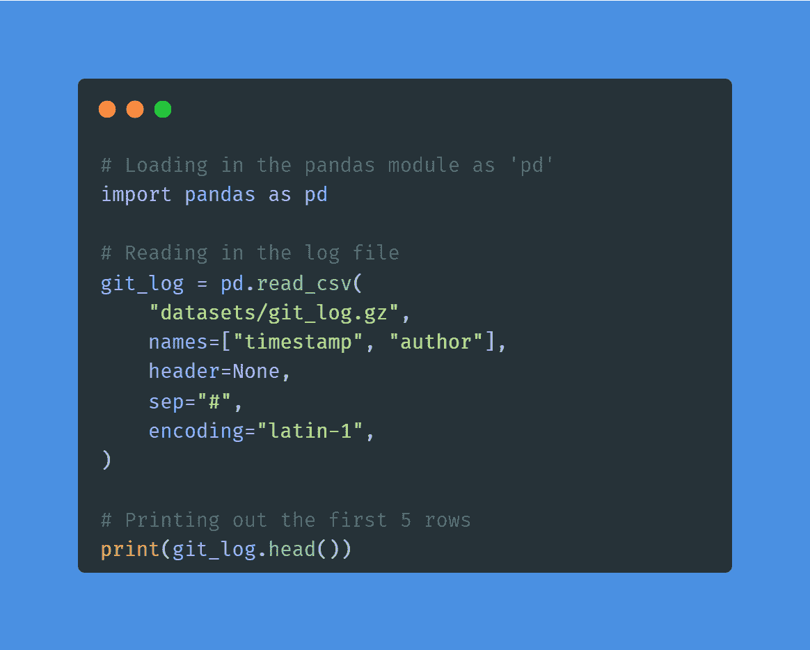

作者图片|项目代码

该项目非常适合希望获得数据导入和清理经验的初学者。您可以对这个[在线售票](https://web.archive.org/web/20221222065622/https://www.datacamp.com/workspace/datasets/sample-integration-redshift)数据集应用类似的方法，以便更好地处理数据。

通过参加短期课程了解有关数据导入和清理的更多信息:

*   [Python 导入数据简介](https://web.archive.org/web/20221222065622/https://www.datacamp.com/courses/introduction-to-importing-data-in-python)
*   [清理 Python 中的数据](https://web.archive.org/web/20221222065622/https://www.datacamp.com/courses/cleaning-data-in-python)

#### 古典小说中的词频

在经典小说中的[词频](https://web.archive.org/web/20221222065622/https://www.datacamp.com/projects/38)项目中，您将使用`requests`和`BeautifulSoup`从古腾堡项目网站上抓取一部小说。在抓取和清理了文本数据之后，你将使用 NLP 来查找莫比迪克中出现频率最高的单词。该项目向您介绍了 Python web 抓取和自然语言处理的世界。

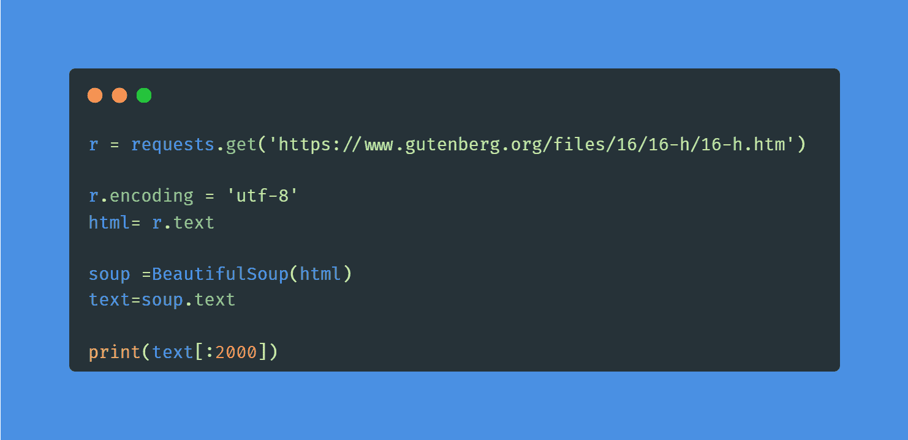

作者图片|项目代码

对于数据分析师和数据科学家来说，网络抓取是一项需要学习的基本技能。你可以参加一个简短的 [Web Scraping with Python](https://web.archive.org/web/20221222065622/https://www.datacamp.com/courses/web-scraping-with-python) 课程来理解 HTML 网页的工具和组件。

### 数据操作项目

#### 探索比特币加密货币市场

在[探索比特币加密货币市场](https://web.archive.org/web/20221222065622/https://www.datacamp.com/projects/82)项目中，你将探索比特币和其他加密货币数据。您将通过丢弃没有市值的加密货币、将比特币与其他货币进行比较以及为可视化准备数据来清理数据集。

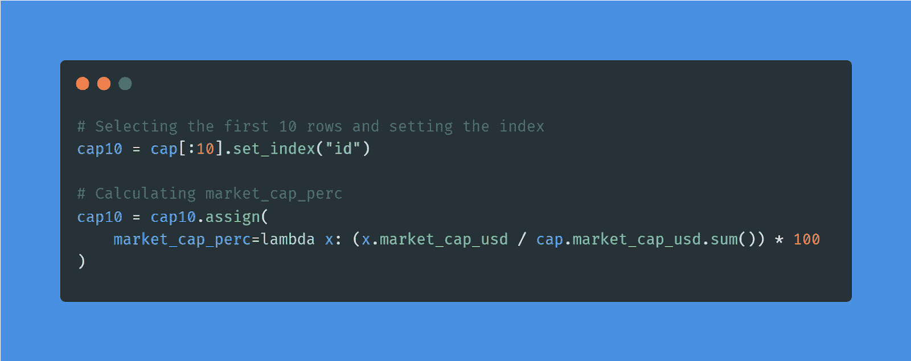作者图片|项目代码

您可以将类似的方法应用于[股票交易数据](https://web.archive.org/web/20221222065622/https://www.datacamp.com/workspace/datasets/dataset-r-stock-exchange)，并学习操纵数据进行数据分析。此外，你可以通过学习熊猫的[数据操作课程来学习数据转换、聚合、切片和索引。](https://web.archive.org/web/20221222065622/https://www.datacamp.com/courses/data-manipulation-with-pandas)

#### 分析你的 Runkeeper 健身数据

在[分析你的 Runkeeper 健身](https://web.archive.org/web/20221222065622/https://www.datacamp.com/projects/727)项目中，你将导入、清理、操作、分析 Runkeeper 七年的训练数据。对于学习复杂的数据过滤、转换和处理，这是一个完美的示例项目。此外，您将分析数据并提交一份详细的总结报告。

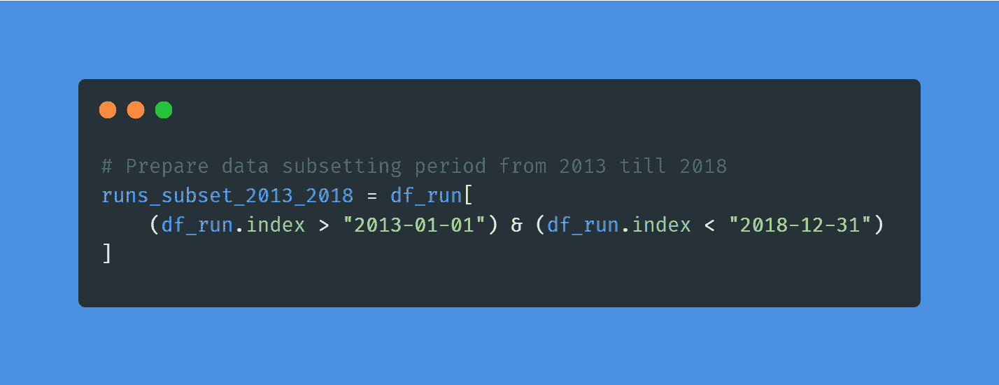

作者图片|项目代码

您可以将类似的方法应用到 [NBA 投篮数据](https://web.archive.org/web/20221222065622/https://www.datacamp.com/workspace/datasets/dataset-r-nba-shooting-data)中，获得更多的数据操作和分析经验，或者您可以参加 Python 课程中的[操作时间序列数据，以处理复杂的时间序列数据集。](https://web.archive.org/web/20221222065622/https://www.datacamp.com/courses/manipulating-time-series-data-in-python)

### 数据可视化项目

#### 想象新冠肺炎

在[可视化新冠肺炎](https://web.archive.org/web/20221222065622/https://www.datacamp.com/projects/870)项目中，您将使用最流行的 R 库`ggplot`可视化新冠肺炎数据。你将分析世界范围内的确诊病例，将中国与其他国家进行比较，学习对图表进行注释，并添加对数刻度。这个项目将教会你 R 程序员急需的技能。

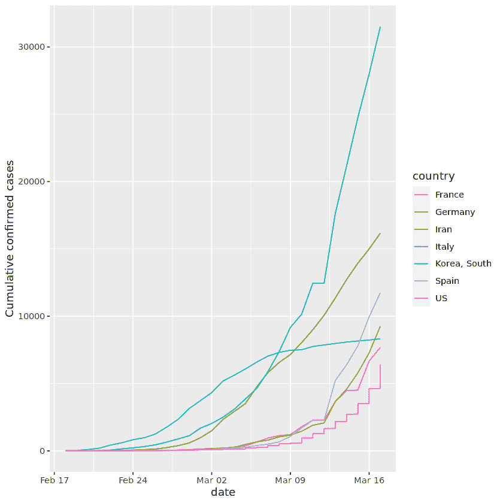

来自项目的图像

您可以将 ggplot 方法应用于[麻疹数据](https://web.archive.org/web/20221222065622/https://www.datacamp.com/workspace/datasets/python-measles)，获得更多数据可视化和分析的经验。此外，您可以通过 ggplot2 课程学习[中级数据可视化，以了解最佳数据可视化实践。](https://web.archive.org/web/20221222065622/https://www.datacamp.com/courses/intermediate-data-visualization-with-ggplot2)

#### Google Play 上的 Android 应用市场

在 Google Play 项目的 [Android 应用市场中，您将导入、清理和可视化谷歌 Play 商店数据，以了解 Android 应用市场。](https://web.archive.org/web/20221222065622/https://www.datacamp.com/projects/619)

您将:

1.  清理数据。
2.  请更正数据类型。
3.  探索应用类别。
4.  了解应用评分、大小、受欢迎程度和价格的分布。
5.  对用户评论进行情感分析。

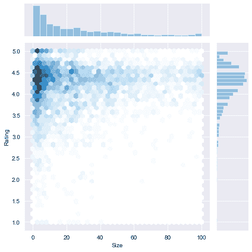

来自项目的图像

您可以将从项目中学到的经验应用于类似的数据集:[谷歌 Play 商店应用程序](https://web.archive.org/web/20221222065622/https://www.datacamp.com/workspace/datasets/dataset-r-google-play-store-apps)以获得更多可视化和探索数据的经验。

使用代码显示交互式数据可视化很容易，但是理解和解释数据很难。参加[了解数据可视化](https://web.archive.org/web/20221222065622/https://www.datacamp.com/courses/understanding-data-visualization)课程，解释可视化分布并学习交流复杂数据的最佳数据可视化技术。

## 高级数据分析项目

对于更高级的数据分析项目，你需要掌握数学、概率和统计。此外，您将执行探索性数据和预测性分析，以详细了解数据。

*   **概率&统计**:对数据进行均值、中值、标准差、概率分布算法、相关性。
*   **探索性数据分析**:探索数据分布，了解各种类型的列，了解趋势和模式。
*   **预测分析**:使用机器学习算法执行回归、分类、聚类和预测。

### 概率和统计项目

#### 来自社交媒体数据的实时洞察

对于[来自社交媒体的实时洞察](https://web.archive.org/web/20221222065622/https://www.datacamp.com/projects/760)项目，你将使用各种统计工具深入挖掘 Twitter 的热门趋势。你将了解本地和全球模式和共同趋势，并执行频率和语言分析。

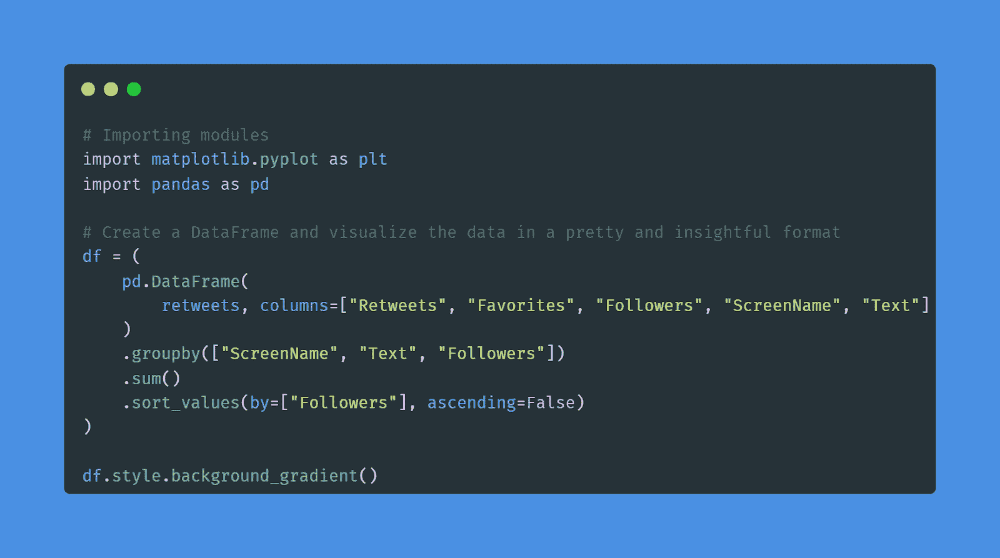

作者图片|项目代码

您可以在一个新的数据集上应用该项目中使用的类似方法:[互联网新闻和消费者参与度](https://web.archive.org/web/20221222065622/https://www.datacamp.com/workspace/datasets/dataset-r-news-articles)，并了解更多有关分析新闻趋势和消费者行为的信息。

#### 从情节摘要中寻找电影相似之处

在[从情节摘要](https://web.archive.org/web/20221222065622/https://www.datacamp.com/projects/648)项目中查找电影相似性，您将使用 NLP 和聚类来查找电影情节之间的相似性。如果您希望将统计技术应用于文本数据，这是一个完美的项目。

您将导入两个数据集，合并它们，执行标记化和词干化，将单词转换为向量，并使用 KMeans 执行聚类。此外，您将使用 Matplotlib、Linkage 和 Dendrograms 计算相似性距离并可视化结果。

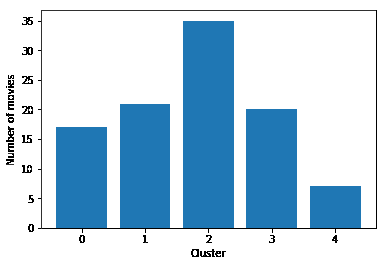

来自项目的图像

使用您从项目中获得的经验，并将它们应用到一个新的数据集:[网飞电影数据](https://web.archive.org/web/20221222065622/https://www.datacamp.com/workspace/datasets/dataset-r-netflix-movie-data)，获得将统计数据应用到文本数据的经验。

如果您有兴趣了解最常见的统计技术、概率、数据分布、相关性和实验设计，请参加[Python 中的统计学简介](https://web.archive.org/web/20221222065622/https://www.datacamp.com/courses/introduction-to-statistics-in-python)课程。

### 探索性数据分析(EDA)项目

#### 分析国际债务统计数据

在[Analyze International Debt Statistics](https://web.archive.org/web/20221222065622/https://www.datacamp.com/projects/754)项目中，您将使用世界银行的数据集编写 SQL 查询来探索和分析国际债务。SQL 是最流行和最基本的移动数据分析工具。

在项目中，您将会发现:

1.  不同的国家
2.  独特的债务指标
3.  这些国家所欠的债务总额
4.  债务最高的国家
5.  跨指标的平均债务额
6.  本金偿还的最高金额
7.  最常见的债务指标

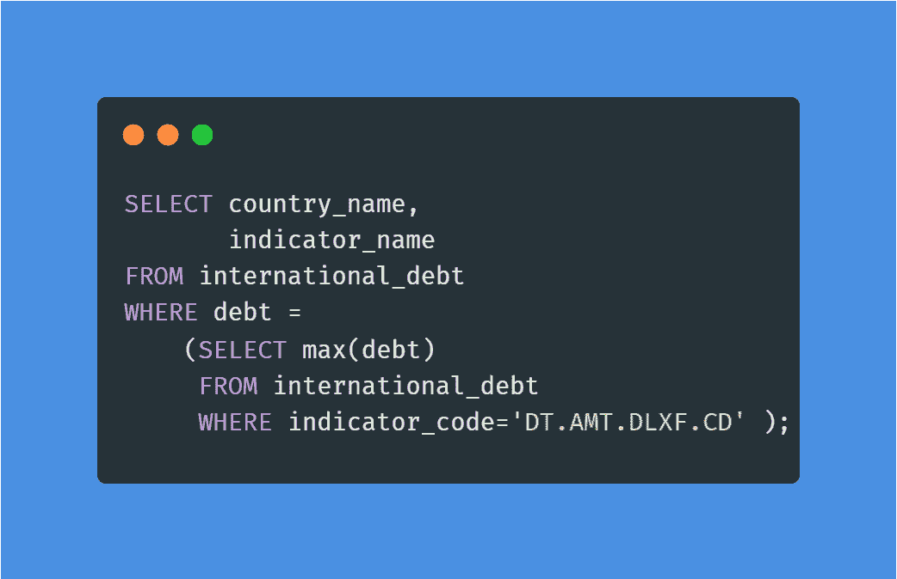

作者图片|项目代码

您将连接 [World Nations](https://web.archive.org/web/20221222065622/https://www.datacamp.com/workspace/datasets/sample-integration-mariadb) MariaDB 数据集，并应用类似的查询来获得处理和分析 SQL 数据库的额外经验。此外，您可以在 SQL 课程中[探索性数据分析，以提高处理各种 SQL 数据库的技术和查询。](https://web.archive.org/web/20221222065622/https://www.datacamp.com/courses/exploratory-data-analysis-in-sql)

#### 在办公室调查网飞电影和客串明星

在[调查网飞电影和《办公室》客串明星](https://web.archive.org/web/20221222065622/https://www.datacamp.com/projects/1237)项目中，您将使用数据操作和可视化来解决现实世界中的数据科学问题。您将执行深入的探索性数据分析，并从详细的图表中得出结论。

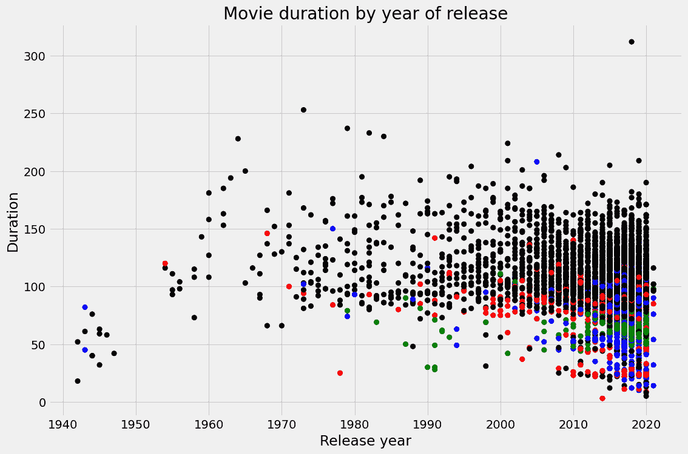

来自项目的图像

您可以通过将类似的技能应用到新的数据集来处理投资组合项目:[网飞电影数据](https://web.archive.org/web/20221222065622/https://www.datacamp.com/workspace/datasets/dataset-python-netflix-movie-data)。此外，您可以通过 Python 中的[探索性数据分析，了解更多关于数据清洗和验证的知识，了解关系和分布，探索多元关系。](https://web.archive.org/web/20221222065622/https://www.datacamp.com/courses/exploratory-data-analysis-in-python)

### 预测分析项目

#### 食品价格预测函数

在[食品价格预测函数](https://web.archive.org/web/20221222065622/https://www.datacamp.com/projects/515)项目中，您将对卢旺达的食品价格进行预测分析。您将使用 R 包导入、争论、操作和预测数据。它非常适合初学者和刚开始学习 R 语言和预测分析的专业人士。

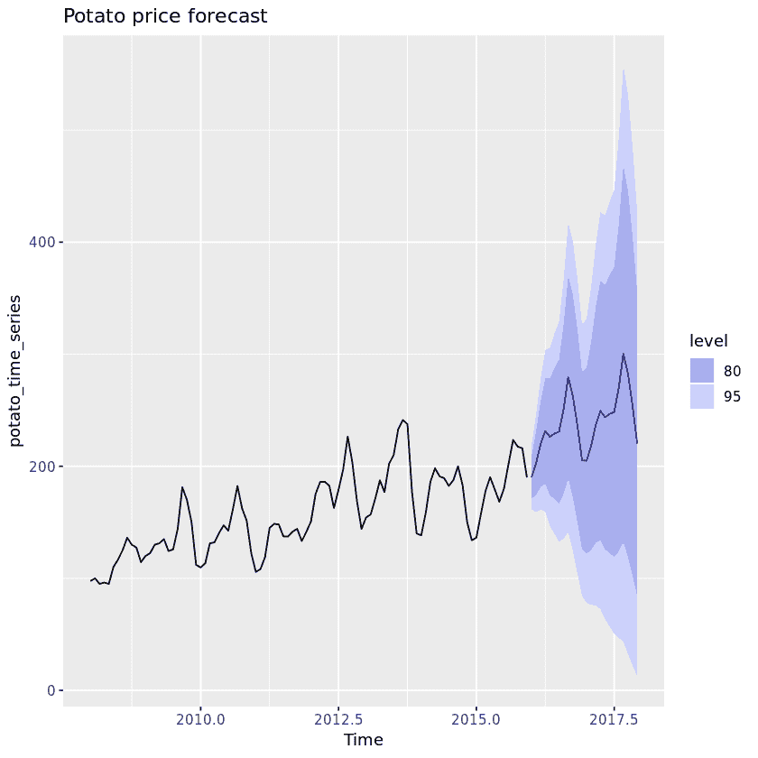

来自项目的图像

您可以为[贷款数据](https://web.archive.org/web/20221222065622/https://www.datacamp.com/workspace/datasets/dataset-python-loans)创建一个时间序列预测 R 函数，并使用 R 包更好地执行预测分析。此外，您还可以完成 R 课程中的[产品需求预测，以了解更多关于时间序列需求预测、混合回归和分层预测的信息。](https://web.archive.org/web/20221222065622/https://www.datacamp.com/courses/forecasting-product-demand-in-r)

#### 预测信用卡批准

在[预测信用卡批准](https://web.archive.org/web/20221222065622/https://www.datacamp.com/projects/558)项目中，您将构建预测信用卡申请批准的最佳执行机器学习模型。

首先，您将了解数据并估算缺失值。之后，您将对数据进行预处理，并在训练集上训练一个逻辑回归模型。最后，您将使用网格搜索来评估结果并改进模型性能。

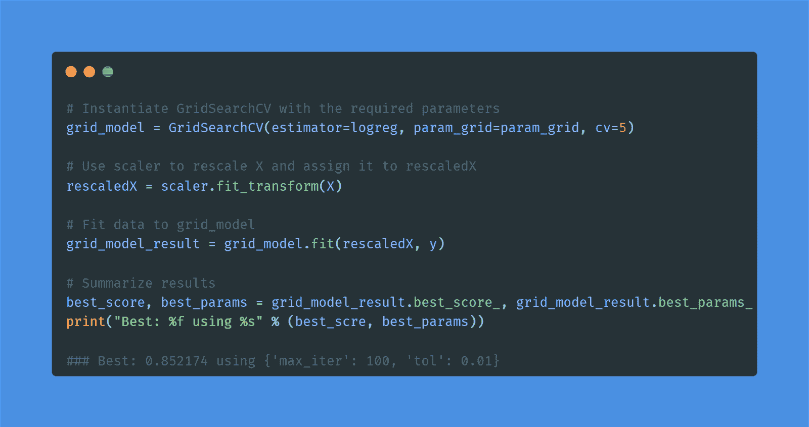

作者图片|项目代码

应用简单的机器学习算法是数据分析师生活中必不可少的一部分。您可以通过将类似的方法应用于新的数据集来获得更多经验:[银行营销](https://web.archive.org/web/20221222065622/https://www.datacamp.com/workspace/datasets/dataset-python-bank-marketing)。

通过参加 scikit-learn 课程的简短[监督学习，了解有关分类、回归、微调和预处理的更多信息。](https://web.archive.org/web/20221222065622/https://www.datacamp.com/courses/machine-learning-with-scikit-learn)

## 面向最后一年学生的数据分析项目

最后一年的学生项目通常是研究基地，需要至少 2-3 个月来完成。你将在一个特定的主题上工作，并尝试使用各种统计和概率技术来改善结果。

**注意**:数据分析最后一年项目的机器学习项目有增长趋势。

### 降低美国的交通死亡率

对于[降低美国交通死亡率](https://web.archive.org/web/20221222065622/https://www.datacamp.com/projects/462)项目，你会发现一个降低美国交通相关死亡的好策略。您将导入、清理、操作和可视化数据。此外，您将执行特征工程并应用各种机器学习模型(多元线性回归、KMeans 聚类)来得出庄严的和交流的结果。

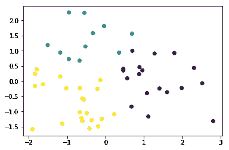

来自项目的图像

如果你想了解更多关于无监督学习的知识，请查看 Python 课程中的[聚类分析。](https://web.archive.org/web/20221222065622/https://www.datacamp.com/courses/cluster-analysis-in-python)

### 从音频数据中分类歌曲流派

在[对来自音频的歌曲流派进行分类](https://web.archive.org/web/20221222065622/https://www.datacamp.com/projects/449)项目中，您将应用机器学习算法对歌曲进行流派分类。

您将:

1.  准备数据集
2.  将它们分成训练集和测试集
3.  标准化数据
4.  对缩放数据应用 PCA
5.  训练决策树和逻辑回归比较性能
6.  平衡数据以获得更好的性能
7.  理解模型偏差
8.  应用交叉验证来评估我们的模型

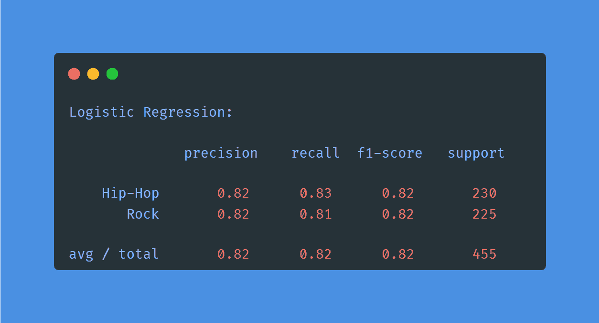

作者图片|项目结果

参加 Python 课程中的[线性分类器，了解更多关于逻辑回归和 SVM 的知识。](https://web.archive.org/web/20221222065622/https://www.datacamp.com/courses/linear-classifiers-in-python)

### 世界人口分析

[世界人口分析](https://web.archive.org/web/20221222065622/https://www.kaggle.com/code/hasibalmuzdadid/world-population-analysis)项目是执行深度探索性分析的最佳范例。您将探索各种列，可视化人口最少和最多的国家，并探索人口密度和增长率。此外，您将显示国家等级分布和相关图。

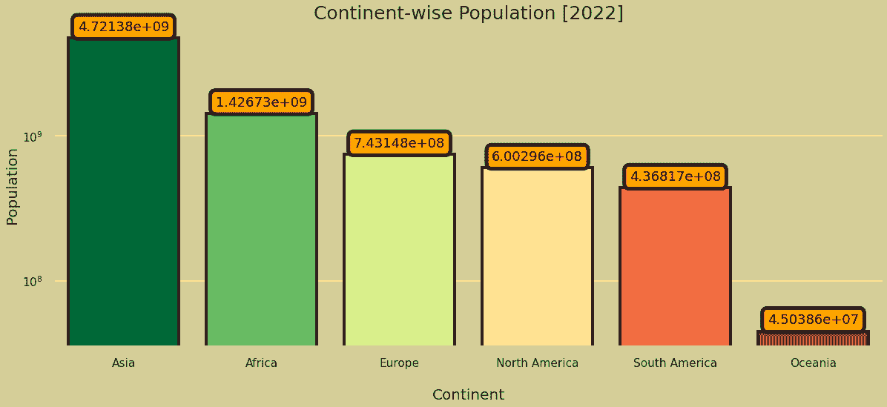

来自项目的图像

通过完成 Seaborn 的[中级数据可视化](https://web.archive.org/web/20221222065622/https://www.datacamp.com/courses/intermediate-data-visualization-with-seaborn)课程，学习用 Python 绘制数据可视化的简单方法。

### 工业中的数据科学和 MLOps 前景

[行业中的数据科学和 MLOps 前景](https://web.archive.org/web/20221222065622/https://www.kaggle.com/code/eraikako/data-science-and-mlops-landscape-in-industry#AI-job-roles-and-key-skills-needed-to-build-a-career-in-AI)项目是所有数据操作、可视化、探索性和地理空间分析的圣杯。你将学会有效地使用箱线图、甜甜圈图、条形图、热图、平行分类图、气泡图、漏斗图、雷达图、冰柱图和地图。此外，你将学会解释各种类型的图表。

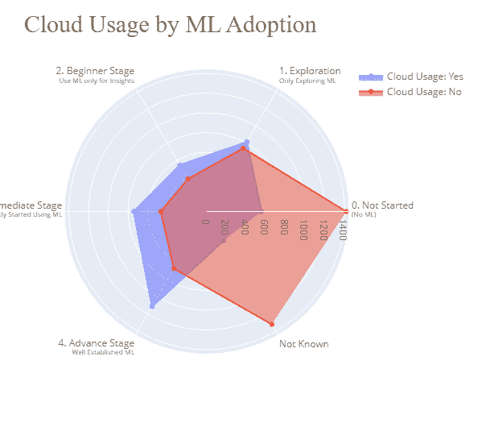

来自项目的图像

参加 Python 课程中的[使用 Plotly 进行数据可视化介绍，了解 Plotly 的高级特性和定制。](https://web.archive.org/web/20221222065622/https://www.datacamp.com/courses/introduction-to-data-visualization-with-plotly-in-python)

## 端到端数据分析项目

端到端项目对于您的简历和对数据分析项目生命周期的理解非常有用。

一般来说，你会:

1.  处理多个数据集
2.  了解数据分布
3.  应用数据清理和操作
4.  应用概率和统计技术
5.  执行数据分析和可视化
6.  使用机器学习模型进行预测分析
7.  创建报告或仪表板

### 用随机森林预测出租车费用

在[用随机森林](https://web.archive.org/web/20221222065622/https://www.datacamp.com/projects/496)预测出租车费用项目中，你将在纽约的出租车旅程中使用基于树的模型，根据位置、日期和时间来预测费用和小费的价值。此外，你将熟悉流行的 R 包`dplyr`、`ggplot2`和`randomForests`。

您将清理数据并将其在地图上可视化以了解乘车热点，使用树和随机森林模型预测出租车费用，在地图上显示预测，并分析结果。

来自项目的图像

如果您是 R 语言基于树的模型的新手，请参加带 R 的基于树的模型的[机器学习课程，成为专家。](https://web.archive.org/web/20221222065622/https://www.datacamp.com/courses/machine-learning-with-tree-based-models-in-r)

### 用曲奇猫测试手机游戏 A/B

A/B 测试新功能和新产品是数据分析师工作的重要部分。在[用 Cookie 猫进行手游 A/B 测试](https://web.archive.org/web/20221222065622/https://www.datacamp.com/projects/184)项目中，你将分析 A/B 测试的结果，Cookie 猫中的第一道门从 30 级移动到 40 级。

具体来说，您需要应用数据操作、统计、数据可视化和批判性思维来决定哪个版本是最好的。

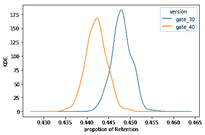

来自项目的图像

如果您是 A/B 测试的新手，请尝试完成[客户分析和 Python 中的 A/B 测试](https://web.archive.org/web/20221222065622/https://www.datacamp.com/courses/customer-analytics-and-ab-testing-in-python)课程，以了解 KPI，探索和可视化客户行为和应用，并分析 A/B 测试的结果。

### 使用 Python 进行时间序列分析和预测的端到端项目

在[时间序列分析和预测](https://web.archive.org/web/20221222065622/https://towardsdatascience.com/an-end-to-end-project-on-time-series-analysis-and-forecasting-with-python-4835e6bf050b)项目中，您将深入分析趋势，应用 ARIMA 模型进行预测，比较结果，并将结果可视化，以了解家具和办公用品的销售情况。

时间序列分析和预测项目在金融领域需求量很大，它们会帮助你找到一份高薪工作。你唯一需要做的就是解读各种趋势，准确预测数字。

**注**:财务分析和预测是一份高薪工作，但也是最辛苦的工作。

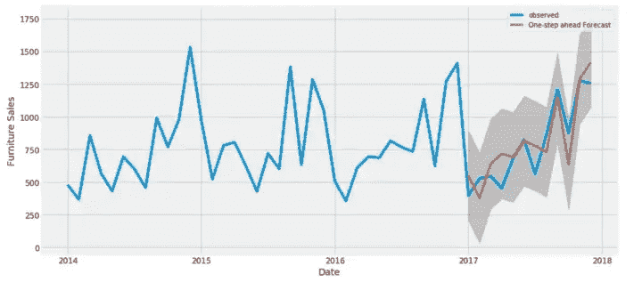

来自项目的图像

如果你正在努力分析和预测，尝试完成 Python 课程中的 [ARIMA 模型，了解 ARMA 模型，拟合未来，选择最佳模型，以及训练季节性 ARIMA 模型。](https://web.archive.org/web/20221222065622/https://www.datacamp.com/courses/arima-models-in-python)

### 构建多目标推荐系统

[构建多目标推荐系统](https://web.archive.org/web/20221222065622/https://www.kaggle.com/code/andradaolteanu/otto-i-was-warned-this-one-is-complicated#2.-Types-of-Events)项目的目标是预测电子商务点击、购物车添加和订单。简而言之，您将基于用户会话中以前的事件创建一个多目标推荐系统。

完成项目后，您将掌握:

1.  数据处理和分析
2.  了解会话和事件
3.  数据可视化和报告
4.  处理时间序列数据
5.  分析时间序列数据以探索用户行为
6.  预测最高点击量、购物车和订单

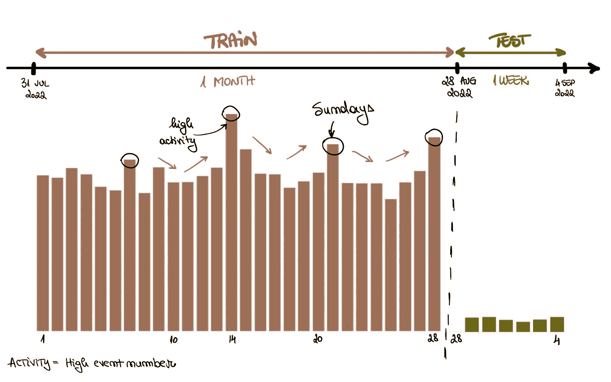

来自项目的图像

## 结论

学习完基本技能后，你需要建立一个强大的作品集来展示你的知识。此外，你将学习对你的职业生涯有益的新工具、特性和概念。

在这篇文章中，我们了解了初学者友好项目、高级项目、毕业班学生项目和端到端数据分析项目。此外，我们还涵盖了数据接收和清理、概率和统计、数据操作和可视化、探索性数据和预测性分析等项目。

那么，下一步是什么？完成至少 12 个项目后，尝试[获得专业数据分析师认证](https://web.archive.org/web/20221222065622/https://www.datacamp.com/certification/data-analyst)。这会增加你被雇佣的几率。你也可以查看我们关于[如何成为数据分析师](https://web.archive.org/web/20221222065622/https://www.datacamp.com/blog/how-to-become-a-data-analyst)的帖子，了解更多职业建议。