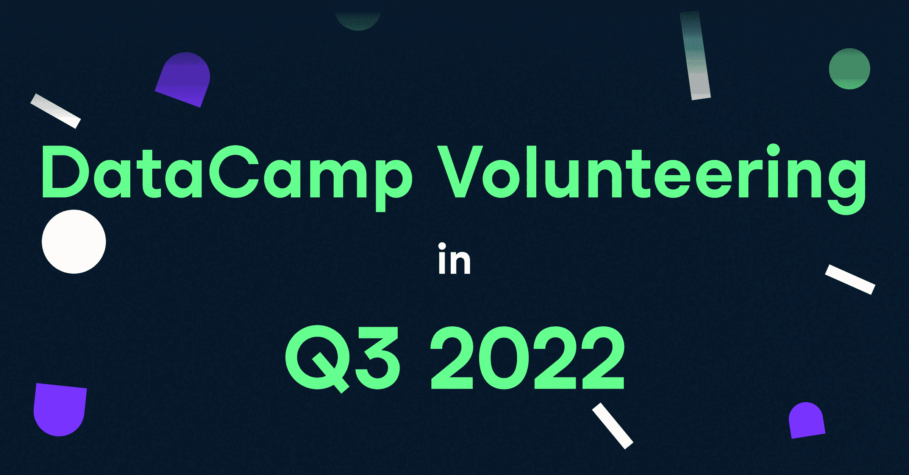
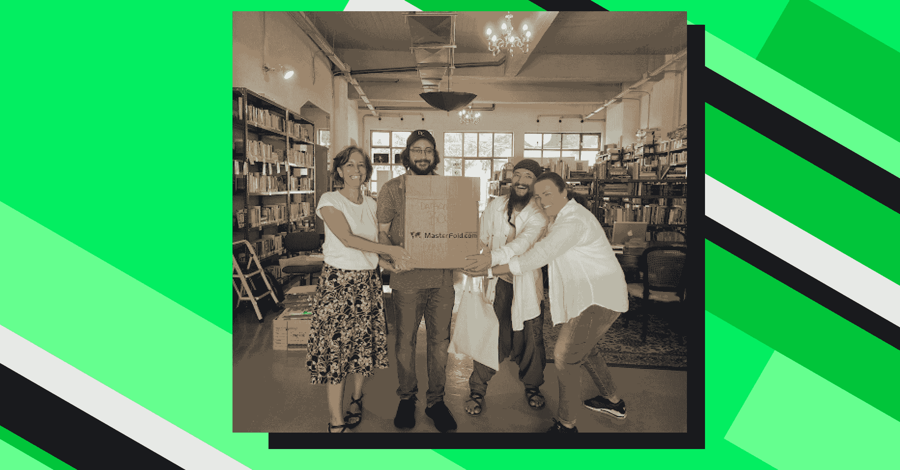

# 数据营志愿者:2022 年第三季度

> 原文：<https://web.archive.org/web/20221210075939/https://www.datacamp.com/blog/data-campers-volunteer-q3-2022>

## 

## 现场志愿服务

为了庆祝过去一周的国际志愿服务日，社会影响团队想向大家最后一次介绍我们在 2022 年的志愿服务。在过去的一年中，40 多名数据营员自愿提供了 100 多个集体工作时间，以支持全球弱势群体和个人的教育和就业能力。如果没有我们在 [【百分之承诺】](https://web.archive.org/web/20221211164854/https://www.percentpledge.org/) 的朋友们的组织支持，以及 14 个非常特殊的 DataCamp 捐赠非营利合作伙伴，这是不可能的。

我们的员工最满意的志愿者经历之一是与我们在 [STEM 教育学院](https://web.archive.org/web/20221211164854/https://www.stemeducationalinstitute.com/) 的合作伙伴在一起，该学院为多个城市的高风险青少年提供免费的暑期数据分析和创业训练营。通过免费使用 DataCamp 课程和 Workspace 作为 DataCamp 捐赠的一部分，他们已经能够更有效地接触到更多的年轻人，并保留更多的发展资金，作为现金奖学金提供给他们的学生，用于他们的本科职业生涯。

新学年即将开始，我们在哈莱姆区的一个社区中心拜访了他们在纽约的学生，为他们提供从高中过渡到大学，然后进入科技行业的指导。我们分成小组，就移动应用创意的商业提案进行合作，以促进社会公益，从而结束了这一天。

我们在美丽的希腊雅典度过了自九月疫情以来的第一个公司工作周。我们为当地的非营利图书馆举办了一场图书推广活动，我们需要书，这是雅典唯一的多语言图书馆。我们鼓励每个人从家里带一本任何语言的书到希腊，结果我们捐了 50 多本！如果你曾经在雅典，需要一个舒适、安静的地方阅读和放松，我们不能推荐这个图书馆！

## 为我们的数据营付出更多努力捐赠合作伙伴

我们喜欢照顾我们的 DataCamp 捐赠合作伙伴组织，而不仅仅是为他们提供一年免费使用 DataCamp 的机会。DataCamp 员工还自愿参加了 18 个独立的志愿者活动，为我们的 DataCamp 捐赠合作伙伴及其学员服务。这些活动包括讲座、研讨会、问答会、行政协助和一对一辅导，影响了数千名学习者。

我们以最民主的方式选择哪些非营利合作伙伴来提供这种特别关注。一些 DataCamp 捐赠合作伙伴组织请求我们的一些专家到场，我们的社会影响团队将他们与最适合该请求的 DataCamp 员工联系起来。但是，我们的大多数志愿者活动实际上都是出于我们员工的愿望，即联系和帮助他们所关心的特定社区。志愿服务时，数据营员通常会选择他们想要帮助的特定非营利组织或地理位置。我们的合作伙伴组织遍布 80 多个国家，分布在世界各地的 DataCamp 员工总是有一组精彩的社区来支持，就像他们一样多样化。

感谢所有 DataCamp 捐赠合作伙伴组织，让我们的员工与他们的社区学习者互动，并帮助他们的生活发生切实的变化，包括:

| [积极进取](https://web.archive.org/web/20221211164854/https://ingressive.org/) | [数据中的女性](https://web.archive.org/web/20221211164854/https://www.womenindata.org/) | [叙利亚青年大会](https://web.archive.org/web/20221211164854/https://www.syrian-youth.org/) |
| [贝鲁特艾](https://web.archive.org/web/20221211164854/https://beirutai.org/) | [流行的开发者](https://web.archive.org/web/20221211164854/https://developersinvogue.org/) | [BeCode](https://web.archive.org/web/20221211164854/https://becode.org/) |
| [简单步骤](https://web.archive.org/web/20221211164854/https://www.simplestepscc.org/) | [特征线](https://web.archive.org/web/20221211164854/https://breakline.org/) | [河流信托](https://web.archive.org/web/20221211164854/https://theriverstrust.org/) |

## 更多来自 2022 年的志愿者故事

无法满足这些美好的感觉？[查看我们上一篇关于志愿服务的博文](https://web.archive.org/web/20221211164854/https://www.datacamp.com/blog/datacampers-volunteer-summer2022)，其中详细介绍了 DataCampers 如何帮助伦敦的中学生探索职业道路和预算，如何向比利时的难民教授基本的数字技能，以及如何指导纽约市的难民撰写简历和面试工作。

要阅读更多关于 DataCamp 在世界各地所做的好事的故事，请查看我们博客的 [DataCamp 捐赠部分。我们的下一次志愿服务更新将在 2023 年的 Q2 举行。到时候见！](https://web.archive.org/web/20221211164854/https://www.datacamp.com/blog/category/datacamp-donates)