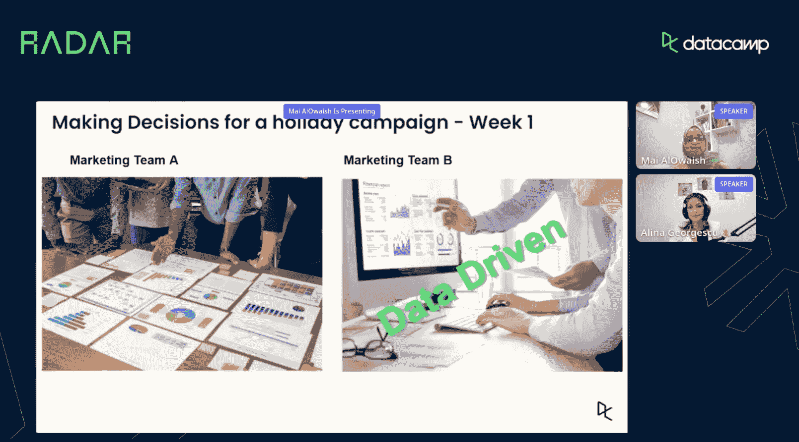
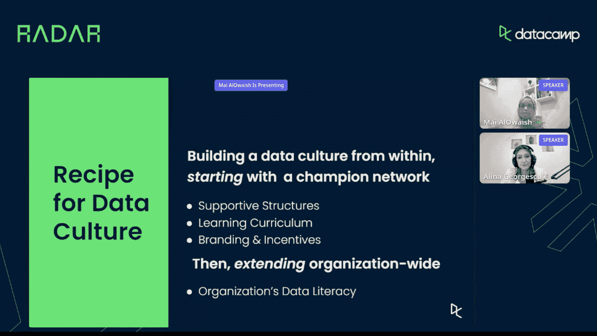
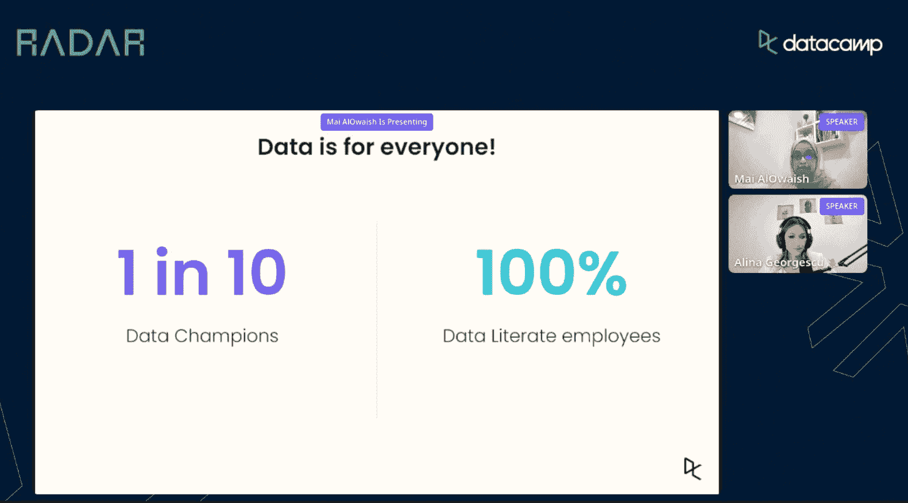

# 数据冠军:提升数据驱动型组织技能的秘密要素

> 原文：<https://web.archive.org/web/20221129052847/https://www.datacamp.com/blog/data-champions-the-secret-ingredient-to-upskilling-in-data-driven-organizations>

业务数据是任何公司运营绩效的关键。然而，要确保收集、翻译和优化正确的数据，需要不止一个人的努力。越来越多的公司不再招聘新的数据导向型员工，而是转向提升技能，作为创造数据文化的一种手段。

作为 DataCamp[RADAR conference](https://web.archive.org/web/20221001130356/https://www.datacamp.com/resources/webinars/radar-building-data-champions-at-gulf-bank)的一部分，Data camp 销售支持主管 Alina Georgescu 主持了“在海湾银行打造数据冠军:扩大内部数据人才流动”会议，海湾银行首席数据官 Mai AlOwaish 出席了会议。AlOwaish 向我们介绍了数据冠军的概念，并解释了海湾银行如何在公司培养数据文化。

在本帖中，我们回顾了 AlOwaish 的会议，在会议中，她分享了自己的经验，并为在贵公司营造数据文化提供了重要建议。

## **是什么造就了数据驱动型组织？两个不同营销团队的故事**

并不是每个看数据的人都是数据驱动的，AlOwaish 通过她的两个营销团队的故事争辩道，他们必须在营销活动的五天内驾驭暴跌的购买量。

团队 A 只查看了去年的数据，决定停止该活动，并将预算重新分配给另一个表现良好的活动。虽然他们认为他们正在做出数据驱动的决策，但他们只关注静态数据，因此错过了一些重要线索。

相反，B 组更谨慎地研究数据，包括实时数据，并继续活动，注意到会员人数上升，非活动购买增加。像团队 A 一样，通过查看报告中收到的指标之外的指标，团队 B 能够做出真正由数据驱动的决策，从而改善结果。

“我们需要让团队能够通过分析真正实现自助服务，”麦说，他认为 B 团队比其对手更受数据驱动。她认为，团队应该能够在特定的基础上探索新的想法，试验和处理数据，并为最佳的预期用途导航数据。然而，要做到这一点，关键因素是数据文化。

你如何发展数据文化？根据 AlOwaish 的说法，可以从组织内部建立数据文化，从宣传数据驱动决策重要性的冠军网络开始。一旦冠军网络形成并建立起来，一个组织然后开始推出一个企业数据素养计划。

**数据冠军网络如何在海湾银行打造数据文化**

根据 AlOwaish 的说法，建立数据冠军有一个秘诀，所有关键因素都以社区和技能为中心。以下是这些成分的分类:

*   确保组织有一个支持数据冠军的结构，并有行政和管理支持，以便每个部门都有数据冠军和专家，让团队的其他成员受益。
*   一套学习课程，旨在帮助冠军提升技能，并加快自助分析的使用。
*   强调技能提升重要性的激励措施和实践社区——都围绕着回答“这对我有什么好处？”。

建立冠军网络后，下一个挑战是为组织的其他成员推出数据素养计划。正如 Mai 所说，数据创造者和消费者都需要认识到数据的重要性，它是每个人在海湾银行取得成功的资产。

此外，精通数据还意味着能够辨别哪些数据适合公司的预期用途，适合合适的受众，适合合适的时间。

## **海湾银行的数据大使计划如何加速数据扫盲**

会议最后概述了数据大使计划，该计划于 2021 年至 2022 年在海湾银行实施。该计划是一个正式的数据素养计划，在海湾银行的每个部门提名数据冠军，并扩展到更广泛的组织。

在每个数据驱动的组织中，十分之一的人倾向于数据，这是创造可靠数据冠军的完美起点。因此，海湾银行从其总部的 1000 人中培养了 140 名数据大使。

“部门中任何接触数据的人都有资格成为数据大使，”AlOwaish 解释道，他还深入研究了冠军新获得的技能。海湾银行的技能提升项目提供了关于数据质量、数据可视化、自动化等方面的研讨会。数据冠军还被教授 Tableau 自助分析，直到一年后从该项目毕业。

从个人银行业务到人力资源、风险管理和 IT，这些冠军成为其部门数据的“关键人物”。

最后，为这些冠军举行了毕业典礼，并赠送了各种奖品和糖果，这进一步加强了该计划的社区方面。

除了数据冠军之外，其余的员工都参加了数据素养计划，以培养他们在数据方面的基本技能。

AlOwaish 坚信 EM Rogers 1962 年的创新扩散理论以及团队合作的积极但不断增加的影响，她在会议结束时分享了她最喜欢的一句话:“转型中人的因素与其基础设施相关因素一样是成功的基础，”作者是 Al Sumait、Helsper、Navarro、Al-Saif 和 Raut (2022)。

AlOwaish 解释说，人的因素是真正让数据文化在组织中扎根的因素。新的工具和工作流固然重要，但建立一个积极参与的冠军网络是一个组织在建立数据文化的道路上能够取得的最大胜利之一。

要观看麦的完整会话，请在这里收听点播记录[。](https://web.archive.org/web/20221001130356/https://www.datacamp.com/resources/webinars/radar-building-data-champions-at-gulf-bank)