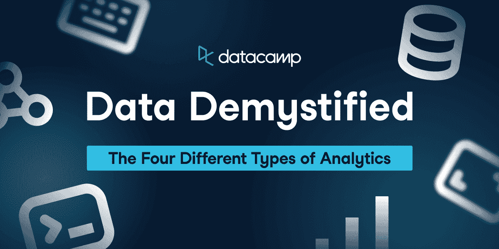
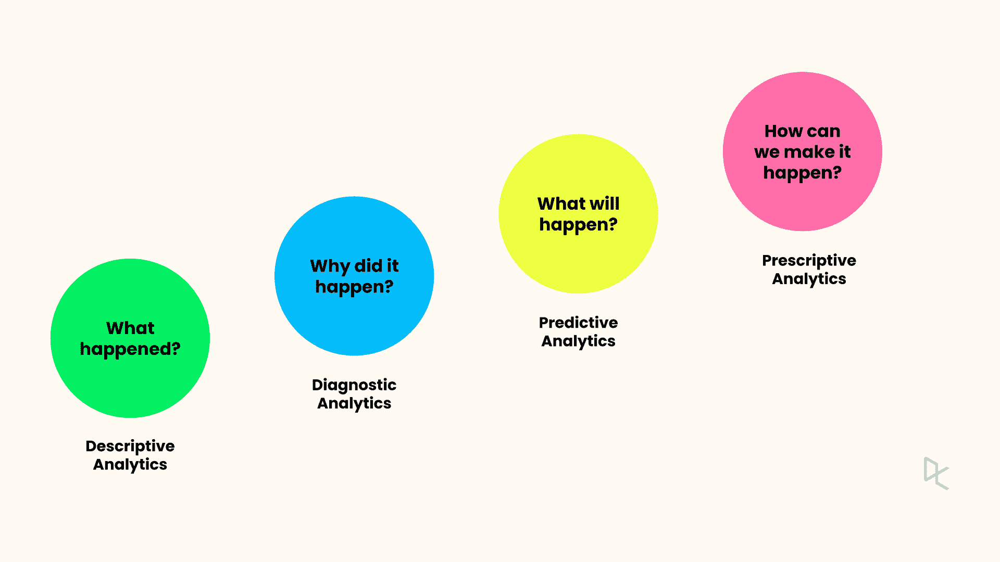

# 数据去神秘化:四种类型的分析

> 原文：<https://web.archive.org/web/20221129041202/https://www.datacamp.com/blog/data-demystified-the-four-types-of-analytics>

欢迎来到为期一个月的数据揭秘系列的第四部分。作为[数据扫盲月](https://web.archive.org/web/20220926064314/https://www.datacamp.com/data-literacy-month/)的一部分，该系列将阐明数据世界的关键概念，回答你可能不敢问的问题，并在此过程中获得乐趣。如果你想从头开始，请阅读我们系列的第一篇文章:[什么是数据集](https://web.archive.org/web/20220926064314/https://www.datacamp.com/blog/data-demystified-what-exactly-is-data)？

在本条目中，我们将探索不同类型的分析，从描述性到规范性，确定数据可以回答的不同类型的问题，概述示例等。

## 四种问题，四种分析

数据可以用来回答几乎无限多的问题，但我们可以将这些问题分成四类。这自然会导致不同类型的数据分析:每个问题类别都有相应的分析类型。

| **问题类型** | **分析类型** |
| 发生了什么事？ | 描述性分析 |
| 为什么会这样？ | 诊断分析 |
| 会发生什么？ | 预测分析 |
| 我们怎样才能做到这一点？ | 规定性分析 |

这四种类型的分析按复杂程度的递增顺序列出。根据数据项目的范围，完成一个完整的分析可能涉及几种类型的分析。

在深入研究不同类型的分析之前，让我们考虑一个现实世界中的病人去看医生。首先，医生将对病人进行检查，以获得对症状的描述。接下来，他们将试图诊断引起症状的医学问题。第三，他们将试图预测症状会随着时间的推移如何变化(病人会变好还是变坏)。最后，他们会为病人开出治疗方案。

## 描述性分析:理解发生了什么

描述性分析回答“发生了什么？”或者“发生了什么？”。

描述性分析中使用的主要技术是[计算汇总统计](https://web.archive.org/web/20220926064314/https://www.datacamp.com/courses/introduction-to-statistics)和[绘图数据可视化](https://web.archive.org/web/20220926064314/https://www.datacamp.com/courses/data-visualization-for-everyone)。汇总统计包括数据计数、平均值(如平均值和中值)以及变化度量(如范围和标准偏差)。

你可以在下一条[描述性统计](https://web.archive.org/web/20220926064314/https://www.datacamp.com/blog/data-demystified-an-overview-of-descriptive-statistics)中了解更多关于汇总统计的信息。此外，您可以查看下面的备忘单，深入了解[数据可视化](https://web.archive.org/web/20220926064314/https://www.datacamp.com/cheat-sheet/data-viz-cheat-sheet)。

### 描述性分析示例

让我们看一个例子。假设您想要了解贵公司的收入驱动因素。您对销售数据进行描述性分析，回答以下问题:

*   上个月销售了多少？(销售的计数。)
*   平均交易额是多少？(平均销售价格。)
*   每个商店的总销售额之间有多大的差异？(各店总销售额的标准差。)
*   每天的总销售额是多少？(总销售额对日期的折线图。)

## 诊断分析:了解原因

描述性分析通常会产生新的问题。在销售示例中，您可能会看到某个星期四的总销售额出乎意料地低。知道发生了什么是一个有用的起点，但这不是一个令人满意的分析结论。下一个显而易见的问题是，“为什么那个星期四销售额低？”。

这是一个需要诊断分析的问题。一般来说，诊断分析会回答“为什么会发生某些事情？”这种形式的问题。通常，某事物是一个出乎意料的高或出乎意料的低值，也称为异常值。

诊断分析通常包括以下步骤:

1.  形成关于为什么会发生不寻常的事情的假设。
2.  获取与可能原因相关的数据。
3.  对数据子集执行描述性分析(“数据挖掘”)。
4.  拟合统计模型，如[回归](https://web.archive.org/web/20220926064314/https://www.datacamp.com/courses/introduction-to-regression-in-r)来检查原因和异常事件之间的关系。

需要注意的一点是，在许多情况下，您只能确定您测量的内容和可疑原因之间的关系。你无法证明这真的是原因。在即将到来的数据去神秘化条目中，我们将涉及[相关性与因果关系的陷阱](https://web.archive.org/web/20220926064314/https://www.datacamp.com/blog/data-demystified-correlation-vs-causation)。

### 诊断分析示例

回到我们的销售示例，在上个月的一个星期四发现总销售额出乎意料地低之后，您决定对销售数据执行诊断分析。

*   **形成假设**:你的第一个假设是，由于你的网站出现故障，阻碍了在线销售，导致销售额下降。
*   **获取数据**:获取网站性能数据。
*   **描述性分析**:你画了一个随时间变化的表现线图，但在那个周四看不到下跌。接下来，计算网上和店内的总销售额，发现某个国家/地区的店内销售额较低。
*   **形成另一个假设**:你回忆起那个国家的那个地区在那个星期四有一场恶劣的暴风雨，并且假设那可能赶走了顾客。
*   **获取数据**:检索每个商店位置的天气数据。
*   **拟合统计模型**:使用天气作为模型的输入，将[时间序列](https://web.archive.org/web/20220926064314/https://www.datacamp.com/courses/time-series-analysis-in-python)模型拟合到总销售数据中。这表明恶劣的天气与较低的销售额有关。

## 预测分析:了解将会发生什么

数据分析不仅仅让你了解过去。第三种类型的分析是预测。这些可以是对未来的预测，其中的预测被称为预测，但这并不是必须的。预测还可以围绕客户是否符合特定的[客户群](https://web.archive.org/web/20220926064314/https://www.datacamp.com/courses/customer-segmentation-in-python)或[交易是否是欺诈性的](https://web.archive.org/web/20220926064314/https://www.datacamp.com/courses/fraud-detection-in-python)。预测分析中涉及的主要技术是统计模型，尽管在预测的上下文中，它们通常被称为机器学习模型。

您可以在《数据去神秘化》的第三个条目中读到更多关于机器学习的内容，关于[数据科学、人工智能、机器学习和深度学习](https://web.archive.org/web/20220926064314/https://www.datacamp.com/data-demystified-the-difference-between-data-science-machine-learning-deep-learning-and-artificial-intelligence)之间的区别。

### 预测分析示例

在诊断出低销售额的问题后，您的老板现在担心下一季度，并想知道未来几个月的收入情况。因此，您使用与之前相同的时间序列模型来预测未来的销售额。

你的老板也想知道，根据谁最有可能买东西，他们应该瞄准哪些潜在客户。因此，你可以根据客户的属性，如他们以前的购买历史和估计收入，创建一个[机器学习模型](https://web.archive.org/web/20220926064314/https://www.datacamp.com/tracks/marketing-analytics-with-python)，来预测他们购买的概率。

## 规范分析:我们如何实现它？

数据分析的一大好处是，你可以用它来帮助你做出更好的决策。也就是说，你不是凭直觉，而是根据数据做出决策。规定性分析帮助你回答“我们应该做什么？”。

规范分析中使用的技术基于诊断和预测分析的机器学习模型，让您探索不同的场景。此外，说明性分析包括优化，以从各种选择中发现最佳可能方案。

### 说明性分析示例

你的老板左右为难。收入预测没有董事会希望的那么高，所以你的老板现在面临着压力，需要想办法增加收入。他们向您寻求数据驱动的解决方案。

*   在你和你的老板之间，你想出了一些改变店内/网上销售组合以及改变关键产品价格的可能方案。
*   您可以使用预测分析来预测每一种情况。
*   在发现一些有希望的场景后，您可以使用优化将场景优化为最佳结果。

## 想了解更多？

我们希望您喜欢这篇关于不同类型数据分析的简短介绍。在下一篇系列文章中，我们将更深入地探索描述性分析，并重点关注描述性分析中的[统计技术。](https://web.archive.org/web/20220926064314/https://www.datacamp.com/blog/data-demystified-an-overview-of-descriptive-statistics)

*   [查看我们为数据扫盲月计划的内容](https://web.archive.org/web/20220926064314/https://www.datacamp.com/data-literacy-month/)
*   [开始了解我们的数据主题技能课程](https://web.archive.org/web/20220926064314/https://www.datacamp.com/tracks/understanding-data-topics)
*   [订阅数据框架播客](https://web.archive.org/web/20220926064314/https://www.datacamp.com/podcast)
*   [查看我们即将举办的活动](https://web.archive.org/web/20220926064314/https://www.datacamp.com/webinars)
*   [阅读我们下一篇关于描述性统计的数据去神秘化系列文章](https://web.archive.org/web/20220926064314/https://www.datacamp.com/blog/data-demystified-an-overview-of-descriptive-statistics)