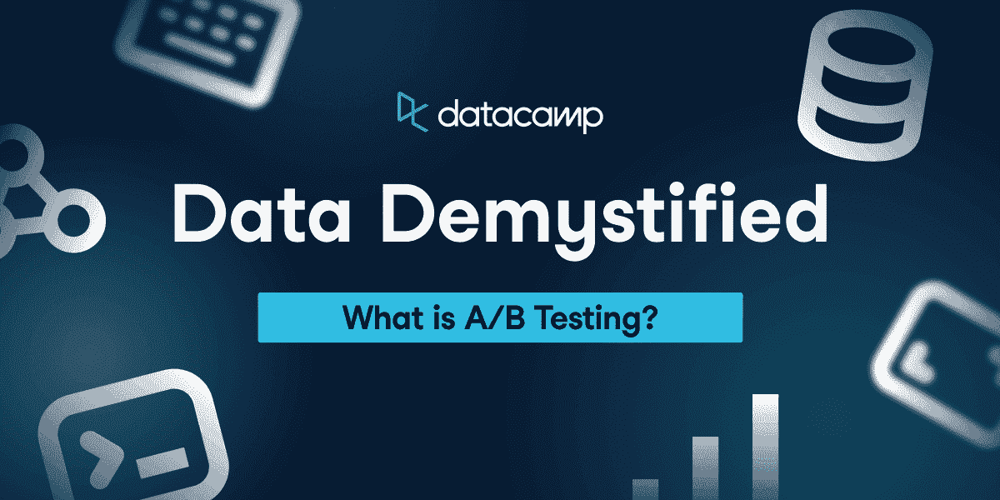
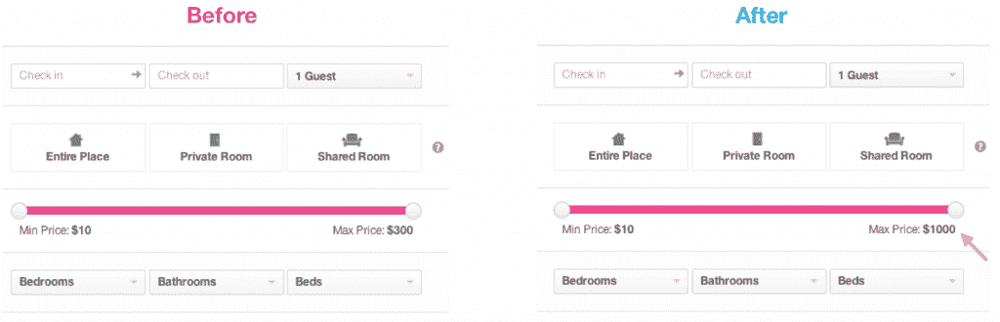
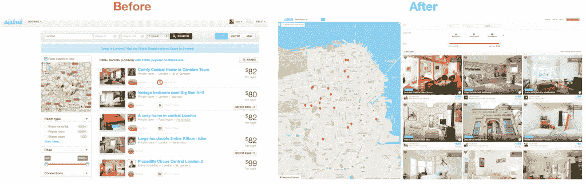
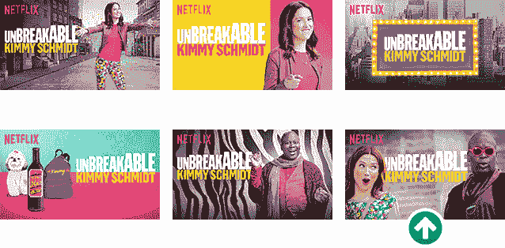
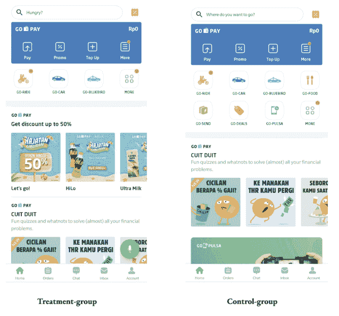

# 数据揭秘:什么是 A/B 测试？

> 原文：<https://web.archive.org/web/20221129041202/https://www.datacamp.com/blog/data-demystified-what-is-a-b-testing>

欢迎来到为期一个月的数据揭秘系列的第七部分。作为[数据素养月](https://web.archive.org/web/20221210092835/https://www.datacamp.com/data-literacy-month)的一部分，该系列将阐明数据世界的关键概念，回答你可能不敢问的问题，并在此过程中获得乐趣。如果你想从头开始，请阅读我们系列的第一篇文章:[什么是数据集？](https://web.archive.org/web/20221210092835/https://www.datacamp.com/blog/data-demystified-what-exactly-is-data)

在这个条目中，我们将探索数据中的一个主要用例:A/B 测试。虽然你可能没有听说过它——如果你曾经使用过数字服务或网站——但很有可能你自己也参加过 A/B 测试。在整篇博文中，我们将概述什么是 A/B 测试，它们通常是如何设置的，以及 Airbnb、网飞和 Gojek 等热门服务中一些著名的 A/B 测试示例。

## 什么是 A/B 测试？

A/B 测试比较同一事物的两个版本的性能，通常是一个网页或一个数字产品。更广泛地说，A/B 测试是一个框架，它可以让您快速设置实验，使用统计分析来分析它们的结果，并根据您的结果做出决策。

A/B 测试帮助团队验证关键问题，例如“改变按钮的颜色会增加点击次数吗？”或者“使用一张或另一张电影海报会增加电影标题的浏览量吗？”。

A/B 测试确立了[因果关系](https://web.archive.org/web/20221210092835/https://www.datacamp.com/blog/data-demystified-correlation-vs-causation)。如果一个带有红色按钮的主页比一个蓝色按钮驱动更多的点击——在其他条件不变的情况下——我们可以得出结论，红色按钮导致点击的增加。不用说，A/B 测试对于寻求优化产品的数据驱动团队来说是一个方便的工具。

## A/B 测试是如何工作的？

A/B 测试可以创造奇迹，但前提是必须一丝不苟地遵循这些步骤。以下是设计成功的 A/B 测试的一些关键步骤:

### 1.阐明一个假设

假设说明了测试变量的变化如何影响总体的性能指标。假设的一个例子如下:

将“添加到购物车”按钮的颜色从蓝色更改为红色(测试变量)将提高所有桌面用户(群体)的转换率(性能指标)。

一个常见的陷阱是在一个实验中有多个测试变量，这使得很难梳理出每个变化对度量的影响。

### 2.创建测试变量的控制和处理版本

A/B 测试中的术语“A/B”指的是你正在测试的东西的两个版本。

通俗地说，控制是产品的“版本 A”或者你正在测试的测试变量的现有版本。而“版本 B”是您正在测试的测试变量的处理或新版本。

使用添加到购物车按钮的相同示例，控件(版本 A)是现有的蓝色添加到购物车按钮，而处理(版本 B)是新的红色按钮。

### 3.确定统计显著性的样本量

根据用例以及服务拥有的用户数量，不可能对所有人运行 A/B 测试。下一个最好的选择是在用户的子集或样本上运行 A/B 测试。为了做到这一点，从业者通常确定一个足够大的用户统计显著样本，以便他们对总体做出结论。

例如，当我们再次查看添加到购物车按钮的例子时，A/B 测试将在一部分桌面用户上运行，而不是在所有桌面用户上运行。

### 4.选择随机分组进行控制和治疗

实验中的每个用户要么看到版本 A，要么看到版本 b。我们如何决定一个用户是被给予控制还是治疗？

为了确保测试公平公正，从业人员通常将样本随机分为治疗组和对照组(如中所示，每个用户接受治疗或控制的概率相同)和相等(如中所示，治疗组和对照组的规模相同)。

### 5.运行测试，并分析结果

基础工作完成后，A/B 测试就可以开始了。一旦达到足够大的样本，就可以分析 A/B 测试的结果。

为了分析结果，我们计算了试验指标(转化率)在治疗组和对照组之间的差异。如果差异足够显著，我们可以自信地得出结论，一个版本确实比另一个版本更好。

### 6.迭代，迭代，迭代

如果在 A/B 测试中出现了一个明显的赢家，高级版本现在可以上线了！从业者还对数据进行深入研究，以更好地理解用户的行为。A/B 测试只是优化过程的一小部分。从运行 A/B 测试中提取的知识可以激发新的想法和假设，这些想法和假设的有效性反过来可以被测试。

## A/B 测试示例

大多数科技公司对 A/B 测试并不陌生。事实上，你可能已经在控制组或治疗组中进行了你所使用的 A/B 测试。以下是一些著名的野外 A/B 测试的例子，来自当今最受欢迎的网站和服务之一:

### 1.Airbnb 的 A/B 测试

A/B 测试的几个优秀例子来自 Airbnb。Airbnb 一直有很强的实验和 A/B 测试文化。在这篇 2014 年的[博客文章](https://web.archive.org/web/20221210092835/https://medium.com/airbnb-engineering/experiments-at-airbnb-e2db3abf39e7)中，他们深入探讨了他们如何测试搜索页面上价格过滤器的最大值从 300 美元到 1000 美元的变化。

*Airbnb 测试更改最高价格过滤器*

在另一个例子中，该团队展示了一个重新设计的主页的例子，并讨论了它如何影响 Airbnb 平台的使用。虽然有点技术性，但这篇文章提供了一个很好的例子，说明 A/B 测试是如何帮助 Airbnb 作为一个产品取得成功的。

*Airbnb 使用 A/B 测试来决定更好的用户界面*

### 2.网飞的 A/B 测试

通过一系列的 A/B 测试，网飞为各种标题选择了[最佳作品，并明显增加了流媒体播放的小时数。A/B 测试的一个很好的副产品是它们揭示了对用户行为和用户体验的深刻见解。例如，通过运行这个测试，网飞确定带有表情的面部情绪的艺术作品表现得非常好。](https://web.archive.org/web/20221210092835/https://netflixtechblog.com/selecting-the-best-artwork-for-videos-through-a-b-testing-f6155c4595f6)

*网飞的《坚不可摧的童菲·史密特》的艺术样本*

### 3.Gojek 的 A/B 测试

在印度尼西亚无处不在的一体化应用程序 Gojek 使用 A/B 测试来找到在其主页上显示的[最佳产品数量。然后，产品团队使用反馈来决定向所有用户推出哪个实验变体。这是在 Gojek 发现的众多 A/B 测试用例之一。你也可以通过](https://web.archive.org/web/20221210092835/https://blog.gojek.io/introducing-litmus-gojeks-own-experimentation-platform)[收听这一集 DataFramed](https://web.archive.org/web/20221210092835/https://www.datacamp.com/podcast/building-high-performing-data-teams) 来了解更多关于 Gojek 的数据文化。

*Gojek 使用一个内部实验平台来决定他们的主页设计*

## 立即开始使用数据

我们希望你喜欢这个关于 A/B 测试的简短介绍。在本系列的下一篇文章中，我们将看看数据可视化的世界，并分解如何解释当今最常用的可视化。

如果您想立即开始您的数据学习之旅，请查看以下资源。

*   [查看我们为数据扫盲月计划的内容](https://web.archive.org/web/20221210092835/https://www.datacamp.com/data-literacy-month)
*   [开始了解我们的数据主题技能课程](https://web.archive.org/web/20221210092835/https://www.datacamp.com/tracks/understanding-data-topics)
*   [订阅数据框架播客](https://web.archive.org/web/20221210092835/https://www.datacamp.com/podcast)
*   [查看我们即将举办的活动](https://web.archive.org/web/20221210092835/https://www.datacamp.com/webinars)
*   [阅读我们的数据去神秘化系列的下一篇文章，了解捕捉趋势的数据可视化](https://web.archive.org/web/20221210092835/https://www.datacamp.com/blog/data-demystified-data-visualizations-that-capture-trends)