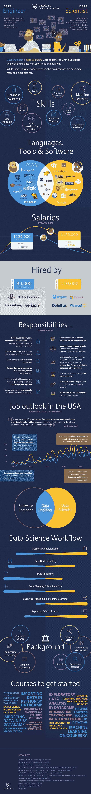

# 数据工程与数据科学信息图

> 原文：<https://web.archive.org/web/20230101103415/https://www.datacamp.com/blog/data-engineering-vs-data-science-infographic>

如果你对分析领域感兴趣，你可能听说过数据工程和数据科学这两个术语，但是你知道它们的区别吗？尽管历史上这两种职业有相当多的重叠，但它们都变得越来越不同。DataCamp 制作了一个信息图来帮助你理解每个角色的技能和职责。你也将有机会比较工资，流行的软件和工具，以及一些教育资源来帮助你开始！

