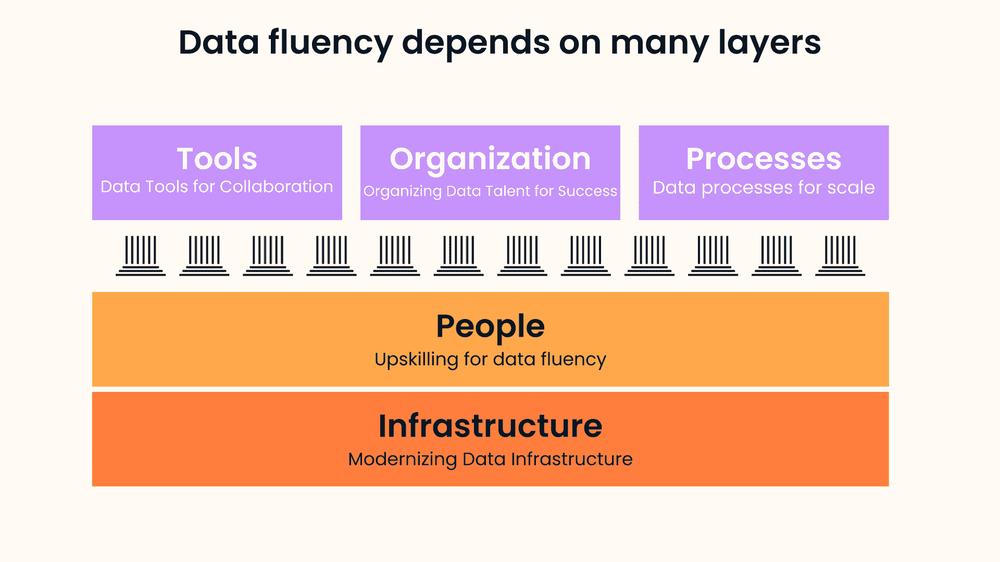

# 2021 年的数据流畅度

> 原文：<https://web.archive.org/web/20221129033105/https://www.datacamp.com/blog/data-fluency-in-2021>

去年 8 月，DataCamp 的产品研究副总裁 Ramnath Vaidyanathan 主持了一个由三部分组成的网络研讨会系列[,主题是利用我们的 IPTOP 框架扩展数据科学。IPTOP 框架打破了每一个组织层次，使数据科学民主化，并在组织范围内实现数据流畅。](https://web.archive.org/web/20220525040729/https://www.datacamp.com/resources/webinars/scaling-data-science-at-your-organization-part-1)

IPTOP 代表基础设施、人员、工具、组织和流程。这个由三部分组成的网络研讨会系列详细介绍了组织如何利用这些手段来实现数据科学的民主化，并在此过程中实现数据流畅。下面是这些杠杆的细目分类:

## 1 -基础设施

任何数据策略的目标都是将原始数据转化为洞察力和决策。这要求组织安全高效地收集、记录和存储数据，以便所有人都能访问。因此，这涉及到理解支持数据访问的最佳实践和框架，确保数据治理，阐明数据谱系，等等。

## 2 人

可以说，人是框架中最关键的杠杆，因为如果组织成员不具备处理数据的技能，组织就不会充分利用他们的数据。这就是为什么培养组织中每个人的必要数据技能[对于数据科学的民主化和数据的流畅是必不可少的。](https://web.archive.org/web/20220525040729/https://www.datacamp.com/resources/webinars/l-and-d-leaders-data-fluency)

## 3 -工具

虽然基础架构使组织能够从数据中获得洞察力，但工具可以促进和激励整个组织使用通用的数据语言。这就是为什么有必要了解可用于特定任务的可能工具的范围，并投资和构建降低数据科学工作准入门槛的工具。

## 4 -组织

扩展数据科学的一个重要方面是如何组织数据专业人员。鉴于在大多数公司中，报告结构和议程推动工作，组织结构必须为你的公司建立可持续的成功。因此，在组织内设置和组织数据科学人才需要仔细考虑。

## 5 个流程

最后，扩展数据科学需要在惯例、最佳实践和流程上保持一致。促进一致性对于促进协作和避免孤立的组织至关重要。这允许所有的团队在一个公共的数据语言下一起工作并无缝地交流。

上周，我们发布了 2021 年的[数据趋势和预测。我们的预测触及了 IPTOP 框架中的每一个层面，从通过增加云采用和元数据工具(基础设施)实现更强大的数据访问，到对数据提升技能的更高承诺(人员)，更协作和更强大的工具(工具)，管理运营中的机器学习模型的新兴角色(组织)，最后是数据讲述和可视化的最佳实践(流程)。](https://web.archive.org/web/20220525040729/https://www.datacamp.com/resources/whitepapers/data-trends-and-predictions-2021)

这就是为什么我们很高兴地重申我们的承诺，即带来数据科学从业者和领导者关于如何最好地扩展数据科学和实现数据流畅的最新和最重要的见解。

在 2021 年，我们将举办一系列月度网络研讨会，讨论不同行业如何利用数据科学，组织如何管理其数据并实现更好的数据访问，提升数据科学人才技能的最佳实践，如何降低使用现代工具处理数据的门槛，如何组织和雇佣最佳数据科学人才，以及如何设置流程以实现数据驱动，等等。

请关注我们的[即将举办的活动](https://web.archive.org/web/20220525040729/https://www.datacamp.com/webinars)页面，了解最新动态——2021 年再见！