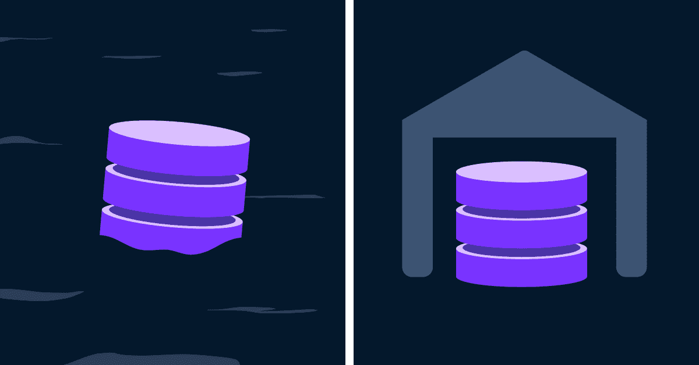

# 数据湖与数据仓库

> 原文：<https://web.archive.org/web/20230101103328/https://www.datacamp.com/blog/data-lakes-vs-data-warehouses>

谈到存储大数据，两个最受欢迎的选项是数据湖和数据仓库。数据仓库用于分析归档的结构化数据，而数据湖用于存储所有结构的大数据。

在这篇文章中，我们将解开两者之间的差异。下表将它们的差异分为五类。

|   | 数据湖 | 数据仓库 |
| --- | --- | --- |
| **数据类型** | 来自各种公司数据源的非结构化和结构化数据 | 为适应关系数据库模式而构建的历史数据 |
| **目的** | 经济高效的大数据存储 | 商业决策分析 |
| **用户** | 数据科学家和工程师 | 数据分析师和业务分析师 |
| **任务** | 存储数据和大数据分析，如深度学习和实时分析 | 通常是用于聚合和汇总数据的只读查询 |
| **尺寸** | 存储所有可能用到的数据—可能会占用数 Pb！ | 仅存储与分析相关的数据 |

## 数据类型

清理数据是一项关键的数据技能，因为数据自然会以混乱和不完美的形式出现。未经清理的原始数据被称为*非结构化数据*——它包含了世界上大多数数据，如照片、聊天记录和 PDF 文件。经过清理以适应模式、组织成表并由数据类型和关系定义的非结构化数据被称为*结构化数据*。这是湖泊和仓库的根本区别。

数据湖存储来自各种来源的数据，如物联网设备、实时社交媒体流、用户数据和 web 应用程序交易。有时这些数据是结构化的，但通常情况下，这是非常混乱的，因为数据是直接从数据源获取的。另一方面，数据仓库包含经过清理以适应关系模式的历史数据。

## 目的

数据湖用于经济高效地存储来自多个来源的大量数据。允许任何结构的数据可以降低成本，因为数据不需要符合特定的模式，因此更加灵活和可伸缩。然而，结构化数据更容易分析，因为它更干净，并且有一个统一的查询模式。通过将数据限制在一个模式中，数据仓库对于分析特定数据决策的历史数据非常有效。

您可能会注意到，数据湖和数据仓库在数据工作流中是相辅相成的。摄取的公司数据将立即存储到数据湖中。如果出现特定的业务问题，就从湖中提取一部分被认为相关的数据，对其进行清理，并将其导出到数据仓库中。

## 用户

数据湖和数据仓库对不同的用户很有用。数据分析人员和业务分析人员通常在数据仓库中工作，这些数据仓库包含了为他们的工作而处理的明确相关的数据。数据仓库需要较低水平的编程和数据科学知识才能使用。

数据湖是由数据工程师建立和维护的，他们将数据湖集成到数据管道中。数据科学家与数据湖的合作更加密切，因为它们包含更广泛、更现代的数据。

## 任务

数据工程师使用数据湖来存储传入的数据。然而，数据湖不仅限于存储。请记住，非结构化数据更加灵活和可扩展，这通常更适合大数据分析。大数据分析可以使用 Apache Spark 和 Hadoop 等服务在数据湖上运行。对于深度学习来说尤其如此，深度学习需要在不断增加的训练数据量中具有可扩展性。

对于分析师用户来说，数据仓库通常设置为只读，他们主要是读取和聚合数据以获得洞察力。由于数据已经清理和存档，通常不需要插入或更新数据。

## 大小

数据湖的规模大得多并不奇怪，因为它们保留了可能与公司相关的所有数据。数据湖的大小通常是 Pb，也就是 1,000！数据仓库对存储什么数据更具选择性。

## 结论

当您决定使用数据湖还是数据仓库时，仔细检查这些类别，看看哪一个最适合您的用例。如果你有兴趣深入了解它们的区别或学习如何设计数据仓库，请查看我们的[数据库设计](https://web.archive.org/web/20220630234746/https://www.datacamp.com/courses/database-design)课程！

不要忘记，有时你需要两种储物解决方案的组合。在构建数据管道时尤其如此。你可以在我们的[数据工程简介](https://web.archive.org/web/20220630234746/https://www.datacamp.com/courses/introduction-to-data-engineering)和[用 Python 构建数据工程管道](https://web.archive.org/web/20220630234746/https://www.datacamp.com/courses/building-data-engineering-pipelines-in-python)课程中看到这一点。