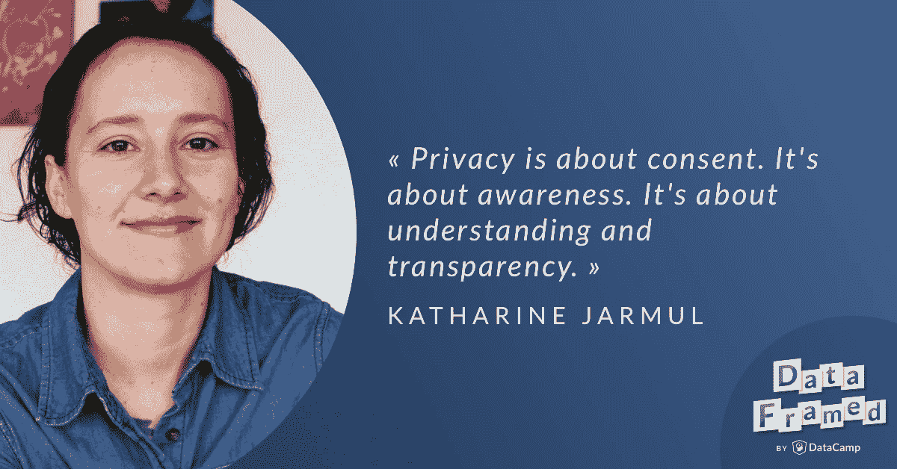

# 新冠肺炎时代的数据隐私

> 原文：<https://web.archive.org/web/20221129041328/https://www.datacamp.com/blog/data-privacy-in-the-age-of-covid-19>

DataCamp 播客 DataFramed 的主持人 Hugo Bowne-Anderson 最近采访了 Cape Privacy 的产品负责人 Katharine Jarmul。

## [介绍凯瑟琳·贾马尔](https://web.archive.org/web/20220525171530/https://www.datacamp.com/community/podcast/Data-Privacy-Age-of-COVID-19)

雨果·鲍恩·安德森:嗨，凯瑟琳。

Katharine Jarmul: Hi Hugo.

雨果·伯恩·安德森:你好吗？

凯瑟琳·贾穆尔:很好。你好吗

雨果·鲍恩·安德森:非常好。所以我要读你的简历，就像 Ryan 读我的一样，这样每个人都知道你是谁。凯瑟琳正在做一件让我非常兴奋的事情。她是 Cape Privacy 的产品负责人，这是一家建立系统以利用安全、隐私、保护机器学习和协作数据科学的公司。凯瑟琳从 2008 年开始使用代码，用她自己的话说，来解决和创造问题。2010 年，她在洛杉矶帮助演出了第一部《皮拉第斯》，并与人合著了一本奥莱利的书。她是数据营的教练。她喜欢关注机器学习、对抗性攻击、数据隐私和道德以及工作流自动化基础设施方面的最新发展，通常很健谈。健谈又暴躁，这是她的原话，再一次，跟上她最新的恶作剧，这是 [@KJAM](https://web.archive.org/web/20220525171530/https://twitter.com/kjam) ，K-J-A-M。

Hugo Bowne Anderson: Katherine，正如我刚才所说，是一名数据营讲师。她有一门关于 Python 自然语言处理入门的课程。我忘了，直到我查了这个，你们还有一个项目叫做谁在发微博？特朗普还是特鲁多？在我推测的地方，人们做一些自然语言处理来找出谁的推文，我推测的是什么...抱歉，继续。

凯瑟琳·贾穆尔:不，说吧。是的，我们收集了特朗普总统和特鲁多之间的一些推文，我们基本上在那里训练了一个分类器。所以，如果你已经完成了我的课程，而你还没有完成这个项目，那就去看看这个项目吧。酷的是，在最后你会检查，它可能会有点欺骗如何工作。

Hugo Bowne Anderson:我们在这里讨论数据隐私和我们今天的处境。我想说的是，目前我们遍布全球。非常感谢你们全天收看。凯瑟琳目前在柏林，瑞安在佛罗里达，我目前在澳大利亚。因此，我们从全球各地为您带来这个，但我们今天在这里谈论的是数据隐私。凯瑟琳和我过去曾就数据隐私进行过多次交谈。如果你喜欢这个对话，你可以去听一听我们几年前关于隐私的对话，那时 GDPR 进来了，在 DataFramed 播客上。但我们在这里谈论的是数据隐私，但在冠状病毒时代，现在发生了什么变化？但在我们开始之前，我想，你知道，每个人在数据科学方面都有不同的起源故事，凯瑟琳，所以我想你可以告诉我们一些关于你最初是如何进入它的。

凯瑟琳·贾穆尔:是的，非常有趣的故事。所以。我从小就非常擅长数学和计算机。我并不认为作为一个小女孩在数学和计算机方面真的很先进很奇怪，我可以感谢我的父母对我的支持，以及一群非常棒的老师。然而，当我进入大学时，我第一次意识到这可能有点奇怪，因为我的新生中女性不到 1%。所以，这对我来说有点尴尬。我最终转行，成为了经济学和里坡科学的双学位，我觉得计算机科学不再适合我了。那时的数据科学除了我所学的统计学之外，已经完全死亡了，例如，在政治学和经济学中，数据科学实际上非常有用，是的。这是不久前的事了。那应该是，我在 2004 年毕业，然后我有点意外地陷入了数据科学。所以，我最终获得了新闻学硕士学位，当时我在《华盛顿邮报》工作，我将大量的数据可视化和其他东西与故事结合在一起。我们习惯称之为互动，我吸引了负责他们应用团队的人的目光，他说，“嘿，你想过来帮我们做些事情吗？”

Katharine Jarmul:然后我开始为记者建立数据库，为记者建立不同的互动和地图。我开始潜心研究统计学，从那以后我就一直这样做。那是在 2007 年到 2008 年之间，是的，从那以后我一直在做这件事。它时断时续，但的确如此，因为自 2010 年代初以来，机器学习确实发生了变化，带来了很多希望。所以，我真的很喜欢 DataCamp 和人们的自学。我想我仅仅通过提问、寻找好的导师和保持好奇心就学到了很多。所以，我真的很欣赏数据营任务中的那种元素。

雨果·鲍恩·安德森:太棒了。我们非常感谢。令我着迷的是，你很早就意识到了自己的数学和计算技能以及 ComSci 技能。然后你去了新闻业，然后你被数据库和系统管理之类的东西拖了回来。但你不仅仅是，这听起来很可怕我要说的是，我要说你不仅仅是一个数据科学家，而且你还可以实际操作计算机，但我真正的意思是，我认为一堆数据工程的东西，实际的计算机科学，和软件工程的技能，对不对？

凯瑟琳·贾穆尔:是的。是啊。我的意思是，在 2008 年和 2009 年，我认为大多数人认为数据科学是“你能建立一个图表来配合我的数据库吗？”我敢肯定，在我的圈子之外，这是更先进的，但这是我们在数据新闻领域的最大进步。然后，在我最初工作的一些初创公司，我有点沉迷于数据质量和数据争论，这种类型的事情，因为当时的大多数问题是正确回答问题，我们必须确保我们甚至收集了正确的数据，甚至在正确的地方寻找。

雨果·鲍恩·安德森:这仍然是个问题，对吗？当然你也是，你的奥赖利的书是关于数据争论的。它甚至可能被称为数据争论，我不记得了，但是-

凯瑟琳·贾马尔:是的。是啊是啊是啊。我是说，这是个不幸的案例。我认为情况正在好转，至少现在越来越多的人开始关注我们在数据质量方面存在的问题，这是一种理解和测试。我要为远大前程欢呼。他们在这个领域做了一些很好的工作，政府部门也是，数据从何而来？是在什么情况下收集的？我认为很多这样的事情有助于推动围绕质量的对话，也可以推动围绕隐私的对话，这就是我们今天要讨论的内容。

Hugo Bowne Anderson:非常正确，我认为数据测试，你绝对是对的，如果你有新的数据进来，你想保持你的模型，而不是假设它们以你认为的方式工作，那么数据测试会涉及模型漂移和概念漂移。

凯瑟琳·贾穆尔:是的。

## 海角隐私

雨果·鲍恩·安德森:所以，也许在我们开始之前，你也可以告诉我们一些关于海角隐私的事情。我做了一个非常简短的电梯间推介，但也许你可以告诉我们更多。

凯瑟琳·贾穆尔:是的，是的。六个月前我加入了 Cape Privacy。这是一个了不起的团队。他们在我加入之前就在一起了，他们真的专注于加密机器学习的研究。因此，真正确定的是，是否有可能以合理的方式在机器学习中使用一些加密方案。这是过程的一部分。他们建立了一个开源的 TF Encrypted，代表 TensorFlow Encrypted，它使用一种叫做安全多方计算的加密方案。你可能以前听说过安全计算。这是做 TensorFlow 的基础，如果你问我，我会觉得很酷。所以我联系了他们。他们正在寻找一个产品负责人，所以我加入了，这个探索的一部分是让这个惊人的团队以研究为导向，深度学习专业化，密码专家，许多在云架构和这些类型的事情上非常有深度的知识工程师，并让我们的思想集中起来，创造出人们可以使用的东西，是的，我们很兴奋。我们的首次发布将在六月底。

Katharine Jarmul:所以，请继续关注，这真的是关于协作数据科学的。那么，我们如何让不同的专家参与进来呢？也许安全专家或数据隐私或法律专家和数据科学家一起真正利用先进的隐私和安全技术。

Hugo Bowne Anderson:这听起来是非常令人兴奋的工作，也是一个非常令人兴奋的团队。你说张量流，对吧？

凯瑟琳·贾穆尔:嗯嗯(肯定的)。

Hugo Bowne Anderson:我不想太快陷入兔子洞，但是在开源软件包上进行安全的尊重隐私的机器学习的想法，有像谷歌这样的公司的治理，这是一个想法和可能的未来的网络，对吗？

Katharine Jarmul:是的，是的，是的，团队肯定有计划支持 Pytorch。PyTorch 也已经有一些工作了。当然，有人可能会说，as 也主要由一家更大的公司支持。考虑这些事情很有趣，比如我们需要与人们所在的系统集成，我们也在联邦空间中做一些事情。其中一些与其他联合学习平台重叠，如 TF Federated 或 TensorFlow Federated，还有一些可能是独立构建的，但我们是开放核心的。所以，总会有开源版本。我们非常期待社区的反馈。所以，如果你想玩它，请加入。

雨果·鲍恩·安德森:太棒了。所以，在我们进入隐私之前，我不想这样做，我可能会把事情搞砸。我最近一直在读你刚刚提醒我的这本书。这就像和雨果一起阅读时光。它变成了一个读书俱乐部，但它实际上是非常相关的。斯图尔特·罗素的《人类兼容》考虑了很多事情，包括隐私。所以，他说“隐私故事有多个层面。第一，如果私人助理对你一无所知，它真的有用吗？大概不会。”现在他开始挑衅了。然后他说，“第二，如果个人帮助不能从多个用户那里获取信息来更多地了解普通人和与你相似的人，他们真的有用吗？大概不会。那么，这两件事不就暗示着我们在日常生活中不得不放弃隐私才能受益于 AI 吗？”

凯瑟琳·贾马尔:哦，好的。好吧。

雨果·鲍恩·安德森:它说“原因是学习算法可以使用安全的多方计算技术对加密数据进行操作，这样用户就可以从共享中受益，而不会以任何方式损害隐私。”

凯瑟琳·贾穆尔:是的。这就是我们建造的。

雨果·鲍恩·安德森:哦，你要用脏话来解释，这肯定是不合适的，但原因之一，这是对话中真正令人兴奋的部分。我们真的不会谈论如何加密数据来开发有原则的机器学习算法，但在我读到的和我们一直在谈论的内容中，在便利性、实用性和隐私之间有一种假设的权衡，这可能是一个稻草人，我们将谈论的是我们不断被告知在隐私和安全之间有一种权衡，在危机时刻，为了安全，我们需要放弃隐私。我们也看到了 911 之后发生的事情，对吗？在那里，我们放弃了很多隐私，然后随着斯诺登的揭露，我们放弃了一大堆其他的隐私，它甚至没有该死的工作，对不对？就像我们放弃了很多东西，却不知道这些东西最终看起来毫无用处。所以，思考这是否真的是一个错误的二分法，我认为这将是非常有趣的。

凯瑟琳·贾穆尔:是的。是啊。

## 数据隐私空间的缩减

Hugo Bowne Anderson:所以，在进入新冠肺炎之前，也许你可以给我一个数据隐私领域的概述。我知道我们可能会花几天时间来讨论这个问题，但这只是你认为最大的挑战。

Katharine Jarmul:是的，最大的挑战之一，也是真正吸引我从事 Cape Privacy 工作的原因之一，是关于生产研究。因此，在数据隐私领域有着惊人的研究深度。几十年来，有人一直致力于隐私的计算或量化。例如，当我们看辛西娅·德沃克关于不同隐私的最初起源的工作时，对吗？所以，围绕着可量化的隐私，有所有这些惊人的理论和相当多的深奥的数学，然而，即使当我们在 NEURIPS 看到这样的事情时，也有一个关于生产中的差异隐私的很好的小组。大部分是，是的，有点。是啊，没关系。还没到那一步没关系，但我认为现在真的是时候让我们看看“我们能把研究生产化吗？”以及“我们真的可以用我们知道的和我们关心的真实世界用例和真实世界威胁来推动研究吗？”这意味着，当然，就像研究人员和工业人员之间的良好关系。我认为这是整个机器学习社区一次又一次提出的问题。

Katharine Jarmul:伦理学研究中还有一个问题，就是我们如何从理论的角度来看待我们所知道的，并为这种不完美的生产系统，或不完美的社会以及所有这些其他的事情创造它。

Hugo Bowne Anderson:Cynthia Dwork 在苹果公司做了一些工作，对吗？还是我瞎编的？

凯瑟琳·贾穆尔:她在微软做了一些，我不记得她后来去了哪里。苹果有一个差分隐私团队，致力于生产差分隐私。所以，他们发布了一篇论文，我想大约两年前，差不多，关于他们如何围绕你的键盘数据收集做不同的隐私保护。真的是一篇好文章。所以，他们在这方面也做了一些工作，我认为现在真正重要的一件事是，我希望继续重要的是，我看到越来越多的人提出问题，担心数据隐私。我从新闻媒体、Python 数据科学家、整个社区都看到了这一点，我认为，随着我们对 COVID 19 的反应越来越深入，我认为现在围绕其中一些主题有很多真正富有成效的公开对话，我希望这种对话能够继续下去，因为提问、获得信息和保持好奇心对于像这样的事情从理论到现实非常非常重要。

Hugo Bowne Anderson:我确实认为我们现在进行对话非常重要，我认为隐私、数据伦理和人工智能伦理的一扇窗户打开了，但不清楚这扇窗户会打开多久。所以，让我们开始工作吧。对吗？

凯瑟琳·贾穆尔:是的。是啊。我希望这不是一时的流行。我们真的会说，“哦，嗯，我从多方面关注这个问题。我想了解更多。”我不是说每个人都必须成为专家，但是我希望今天在这里的一些人会说，“哦，嗯，我对这个很好奇。我不想知道更多了。我想有所贡献。我想在自己的项目中尝试问一些这样的问题。”那会很有帮助。

雨果·伯恩·安德森:当然。那么，不要太专业，对于我们正在谈论的事情，解决方案空间中的一些可能性看起来像什么？

凯瑟琳·贾穆尔:是的。是啊。这有时取决于问题。因此，有许多不同的，我们经常提到的高级隐私技术或高级安全技术，包括各种安全计算或加密技术。像差分隐私这样的技术，我相信我们稍后会深入探讨。k-匿名化或其他匿名化方案，等等。还有一些技术可能更简单明了，比如混淆、散列、假名化等等。所以，有很多很多不同的工具。真正的问题是，或者说我在 Cape Privacy 的日常工作中肯定会思考的问题是:如果不是专家，你如何知道什么工具适合这项工作，然后你如何评估安全威胁模型是什么？或者从隐私的角度来看你真正关心的是什么？这真的很难，你不应该成为专家。无论你决定投身于数据科学的哪个领域，你都已经是专家了。

凯瑟琳·贾穆尔:你不能真的要求每个人都增加一个专业领域。因此，我们正在做的一些事情，我认为真正有助于解决方案空间的是更好的意识、更好的教育，以及让数据科学家能够说，“好的，我可以在这里参考，我可以看到有用的东西。我可以理解什么是真正的威胁，然后我可以轻松地实施一些东西，而不必成为隐私专家。”其中一些也是关于多个人的投入。因此，有时如果你有一个法律部门，也许他们应该以一种富有成效的方式成为对话的一部分。如果你有一个非常棒的安全团队，那么他们应该是这些对话的一部分。这是关于每个人都能够分享他们的专业知识。在座的各位，作为数据科学专家，以及他们各自领域内的其他人，我认为，如果你们有这种跨领域合作或跨学科团队，他们实际上可以达到另一个层次的理解，即解决方案适合问题。

雨果·伯恩·安德森:你看到了吗？我的意思是，公司并不总是有安全专家、法律团队或这些...

雨果·鲍恩·安德森:安全专家或法律团队或诸如此类的事情。我想知道您是否认为未来大多数公司都会有数据隐私团队、数据安全团队、数据风险团队或专家之类的团队？

凯瑟琳·贾穆尔:我认为总体来说，比如说消费者意识，我认为普通人对定期收集数据的意识正在提高。现在很多时候，当人们只想说，“嗨，你做什么？”我说我致力于隐私机器学习。

凯瑟琳·贾穆尔:他们会说，“哦，好吧，是的，我很担心。我家里有个 Alexa。可以吗？”

凯瑟琳·贾马尔:我说，“是的，希望如此。以下是一些需要考虑的事情。如果你想深入研究，这里有一些文章。”但我认为更多的时候，我挑战我的同行，我的数据科学家同事和机器学习人员说，当我们考虑系统时，我们需要考虑多少这些因素？

Katharine Jarmul:我认为在过去的八年左右的时间里，推动机器学习和数据科学的更道德的方法的运动，我觉得它也与数据隐私问题很好地结合在一起。因为实际上，在某种程度上，隐私就是同意。这是关于意识。这是关于理解和透明。其中一些与我们围绕伦理的辩论重叠得很好。

雨果·鲍恩·安德森:我喜欢。我喜欢你说的是关于什么而不是它是什么的原因，是因为我认为现在在很多方面这是一个模糊的术语。我们试图弄清楚隐私的真正含义。

Hugo Bowne Anderson:举个例子，我的意思是大约 10 年前，如果我们根据电子邮件中的关键词获得定向广告，我们中的任何人都会感到惊讶，对吗？然后突然几年，当那发生时，我们被激怒了。然后一两年后，它就像，“哦，不，这只是谷歌。”那只是谷歌。

凯瑟琳·贾穆尔:完全没问题。

雨果·伯恩·安德森:对吗？当然，在这个范围内，我们也有扎克伯格，他说，“隐私并不意味着，等等……”不管他说什么，对。我其实已经不听歌词了。但他确实说得有道理，在 Alexa 时代、智能手机时代以及诸如此类的时代，我们对隐私的观念已经发生了变化。但我们确实需要发展，这是你正在努力的许多事情，这些稳健的，有原则的方法，甚至如何进行这些对话，并授权个人用户，公民，消费者用户，无论我们这些天想称呼自己什么，来做出这些决定。

凯瑟琳·贾穆尔:是的，我的意思是，我认为这里也有一些关于集体行动的东西，对吗？还有关于不羞辱人。有时候，让我们说，从一个更深入的隐私社区或安全社区，人们可能会说，“嗯，如果你买了一个 Alexa，你值得它。”或者类似这样的。我认为实际上类似于你之前分享的那本书的引言，人们应该对拥有或尝试新事物持开放态度，但要围绕潜在的风险建立一些意识，特别是代表开发这些技术的团队和开发这些技术的公司建立责任，以实际思考和提出正确的问题，测试事物和创新，并尝试再次将研究生产化。

Katharine Jarmul:我认为这不仅是一个真正全面的技术挑战，这是我们经常进行的工作，而且也是我们为该领域本身设定的一个目标，还记得那些很难找出我们如何在机器学习系统中推理数据隐私的时候吗？那是过去的事了，现在我们有了如何做出选择的路线图。

雨果·鲍恩·安德森:没错，我认为你经常听到这样的话，“哦，你买了一台 Alexa，你知道你会得到什么。”这也是一种羞辱，尤其是当人们使用“你活该”这样的词语时。这让我想起当人们说，“你为什么关心隐私？你有什么好隐瞒的？”对吗？而且有这么多，我的意思是可以马上抓到你。但是把举证的责任放在那些想要保护自己隐私的人身上，我认为是极其荒谬的。

雨果·鲍恩·安德森:而且它甚至没有承认，历史上我们一次又一次地知道，处于权力地位的人滥用了接触他人隐私的权利。除了我们定义的事实之外，我的意思是我们发展了我们的身份感，并通过我们只了解自己的东西来定义我们自己，我们自己的很多东西是通过我们认为是私人的和我们认为是公共的东西来定义的，并对这些东西进行控制。那么当它丢失时会发生什么呢？

凯瑟琳·贾穆尔:是的，我真的很喜欢，当我想到隐私时，我喜欢引用达纳·博伊德的定义。她花了一些时间研究年轻女性如何与不同的技术互动，以及私人空间与公共空间相比的原因。这真的是关于期望，这是关于期望，比如说，当我在这里与你分享一些东西时，我不希望它是私人的，因为我在这里，我们都在一起交谈，我希望有一段美好的时光。

凯瑟琳·贾穆尔:但如果我们在打电话，我说，“嘿，”你知道，我在告诉你一些关于我生活的个人事情，这是一个共同的理解。我实际上通常甚至不需要告诉你，“嘿，请不要与任何人分享这个。”根据上下文，这是隐含的。所以困难的事情是我们如何在一个技术系统中实现那种环境和那种同意，对吗？这是一个很好的挑战。

雨果·伯恩·安德森:当然。我可以向任何对此感兴趣的人强烈推荐 dana boyd 的书《青少年的网络生活很复杂》。这是一项关于青少年使用大量社交媒体的技术社会学研究，非常令人大开眼界。太棒了，凯瑟琳。凯瑟琳，在这样一个危机时刻，围绕数据隐私的对话会有什么变化？为什么呢？我们看到了哪些变化，为什么会看到这些变化？我们需要思考什么？

凯瑟琳·贾穆尔:是的。现在发生了很多事情。这个周末，我花了很多时间阅读安全社区中围绕不同类型架构的辩论。这个，那个，所以我们可以更深入地从技术角度，更深入地讨论集中还是分散，联系追踪，等等，等等。

凯瑟琳·贾穆尔:但真正让我印象深刻的是我几周前读到的罗斯·安德森，他在安全工程领域很有名，他的文章名为“现实世界中的联系追踪”如果你没看过，我可以非常非常推荐。他拆穿了很多错误的论点，作为交换，你提到雨果，这是我们唯一能对抗冠状病毒的方法是立即放弃所有的隐私。从安全的角度和公民的角度来看，这可能不是一个很好的论点。我们以前见过这种情况。安全与隐私...巴尔，美国司法部长给了这个论点很多作为拥有加密后门的理由。

凯瑟琳·贾穆尔:如果我们少一些隐私，我们就会更安全，这是一个持续了几十年的论点，经常由已经掌握了我们大量信息的当权者提出。我认为，在这种时候，有时我们需要问一个问题，将更多的数据整合到一个地方意味着什么？

凯瑟琳·贾穆尔:当我们看到谷歌现在正在帮助 NHS 开发预测模型时，我们可以考虑一下这个问题。在最前沿，这似乎很好。但从数据隐私的角度来看，我们已经知道去年 Deep Mind 和 NHS 发生了什么，一堆数据在没有任何同意的情况下被共享，没有人被警告，没有人被赋予选择退出的能力。就像这些我们知道的基本步骤，我认为很多人会愿意提供数据，但从来没有人问过。当我们看到这些轻率的反应时，我认为这是一个很大的问题。更不用说追踪接触者是否是我们现在处理新冠肺炎危机的最好方法了。

Hugo Bowne Anderson:我认为有一个相关的问题，你知道，当然，也许我们可以放弃隐私的某些方面，但最好能看到数据将如何使用，模型将如何使用，如果有日落条款，它会保留在任何政府官员和谷歌员工都可以访问的数据库中吗？

雨果·鲍恩·安德森:事实上，我上周已经给你们讲过这个故事了。我要讲一个我被隔离期间的简短故事。所以对于我们所有的观众来说，一个月前我从纽约飞回澳大利亚，我被隔离了。这是一个政府授权的军队在一个酒店房间里强制隔离 14 天。酒店房间里有电话，就像酒店房间一样。这部电话有两三个用途。

雨果·鲍恩·安德森:第一，一个家伙从另一个房间打电话过来，他说，“你好，我是 1212 房间的本。”他说，“我要成立一个脸书小组，这样我们就可以抱怨这里发生的一切。”所以我加入了这个脸书小组，但是护士每天都打电话来，然后我接到一个女人的电话，她说她在新南威尔士工作...那是我所在的州，悉尼所在的州，新南威尔士州警察局，我说，你和新南威尔士州警察局合作是什么意思？她说，“我和他们一起工作。”

雨果·伯恩·安德森:我说，“你为他们工作吗？”

雨果·鲍恩·安德森:她说:“不，我不知道。”

雨果·伯恩·安德森:我问，“你为谁工作？”

雨果·鲍恩·安德森:她说，“很不幸，雨果，我无权说，我为政府工作，但我只能告诉你这些。”她说，"听着，我打电话是想知道你去哪儿了？你乘哪趟航班来的？之后你会去哪里？护照号码？出生日期？这类事情。”

雨果·鲍恩·安德森:我说，“哦，好吧，你打算怎么处理这些数据？”

雨果·鲍恩·安德森:她说，“我正在把它输入政府数据库。”

雨果·鲍恩·安德森:我说，“什么？谁能接触到它？”

雨果·鲍恩·安德森:她说，“哦，不，没关系。只是用来追踪接触者的。我要把它放进去。”

雨果·鲍恩·安德森:我当时想，“不，但是它会在那里呆多久？谁能接触到它？”

雨果·鲍恩·安德森:她没有说不要担心。我猜她被告知不要说别担心。但那是我得到的感觉。我什么都没告诉她。

雨果·鲍恩·安德森(Hugo Bowne Anderson):我说，“看，派一个带警徽的警察到我家门口，我很乐意和他们聊天。但我不会在电话里告诉你这些信息。”但我实际上意识到的是，她的工作也是在这个过程中与我建立一种小关系，并在许多方面让我感觉良好，以便获得她需要的信息，我认为这是出于一个良好的目的，但我不知道这些信息将在多长时间内、以何种类型的永久形式对任何人开放。我认为这就是我们正在处理的问题，对吗？

凯瑟琳·贾穆尔:是的。我的意思是，我们经常问的一个问题是，无论是在安全领域，还是我在 Cape Privacy 的一些工作中经常问自己的问题是，什么是信任关系，它们如何与我们的隐私概念互动？我认为这是一个很好的例子。

凯瑟琳·贾穆尔:所以当你友好时，有一种信任的纽带，作为人类，特别是作为信任、乐观、快乐的人类，我们希望这种联系，尤其是现在比以往任何时候都更需要，对吗？你可能在家里，你可能只和你的家人互动，你甚至可能独自生活。我们想要那些债券。当然是在酒店房间里，对吧？你想要那些债券，对吗？再说一次，这可能不是恶意的。她大概也想和别人联系吧？但这是关于我们是否理解风险，我们是否能真正评估与信任关系相关的风险？

凯瑟琳·贾穆尔:所以他们就像是手牵手在玩游戏，我们想要信任他人。信任他人的风险是什么？交出你的个人旅行细节有什么风险？有风险吗？如果没有，好吧，很好。但是我们真的能以一种有意义的方式评价它吗？作为人类，我认为我们经常低估隐私风险。我不认为我们被训练或教导过，或者我们学了很多关于如何，比方说，不向我们联系的人透露个人信息。

凯瑟琳·贾穆尔:我也不想让人们变得不可信，但这是关于我们能不能利用比如说科技？我们能否利用像 GDPR 和 CCPA 这样有权删除数据的法规，我们能否以有意义的方式强制执行这些法规，以便当你在电话中说，“嘿，这是一种信任关系，我可以理解风险的原因，哦，顺便说一下，他们可以给我发送删除确认，一旦这一切结束，他们就可以确认我的数据使用了什么模型。我可以看到，甚至有一天我可以同意我的数据被用于的每一项数据科学活动，因此我实际上可以对它进行推理，我可以想象它，我可以做出自己的选择，对吗？”

Katharine Jarmul:因为有些是关于授权和自我决定，一旦我们平等地获得信息，就如何使用和存储数据以及何时删除数据而言，对吗？

Hugo Bowne Anderson:你简要地提到了我们现在更多地考虑数据血统和数据来源。几乎就像一个未来的数据来源，了解数据的去向，而不是来源。

凯瑟琳·贾穆尔:完全正确。并且能够说，“这是我舒服的地方，这是我不舒服的地方。”在数据伦理社区或负责任的数据社区中，围绕数据信任有一个很好的概念，即我们可以集体汇集数据，并围绕它创建一个合同，“我们提取这些健康数据，以便可以用来对抗癌症，或绘制基因组或任何其他事情，但我们禁止它用于这些其他事情。”现在，如果我们对整个系统进行真正的治理，那么我们实际上可以在某种程度上实施这些类型的事情。

## 数据再现

雨果·鲍恩·安德森:所以我不想走得太远，但老实说，我控制不了自己。当谈到如何使用数据、数据信任、为某些用途而使用数据，以及删除的权利时，我们怎么能想到这些呢？在数据复制或复制数据的时代，我怎么能相信你告诉我你已经删除了我的数据，而你可以复制它一千次呢？对吗？

凯瑟琳·贾穆尔:是的。这是一个非常好的问题，例如，我们肯定会在 Cape Privacy 解决这个问题。例如，在 GDPR，它要求数据最小化，对吗？我们如何实施数据最小化，这实际上是为了避免大型组织中敏感数据的重复因素，但即使在较小的组织中，我们也能看到这一点，其中一些是关于定义系统的能力和定义系统中的规则的能力，对吗？

Katharine Jarmul:所以我们开始讨论系统工程，或者如果有人对这里的安全工程感兴趣，他们会开始说，“哦，好吧，我可以开始推理了。”我们一直在研究的一个问题是，是否有合法的删除证明？是否可以证明数据何时被复制？当然，还有一些技术方法，它们需要可见性，需要系统的透明性。他们要求你知道你的系统是如何工作的，也许你知道，也许你不知道。但我鼓励，尤其是我的自学数据科学的同事们，开始思考这个问题，我们如何验证我们是否删除了数据？我如何验证我们使用的模型，Hugo 的数据被删除了？我怎么才能找到使用 Hugo 数据的模型呢？我们越是开始思考如何去做这些事情，我们就越有机会去做。

Hugo Bowne Anderson:这实际上是一个很好的观点，考虑到使用我的数据的模型，事实上你可以删除我的数据，但你可以将它编码在一个预测模型中，对我进行预测，或者正如我们最近讨论的那样，你可以丰富我的数据，然后是你从我这里获得的数据，或者你实际上投入了大量资源和资本来丰富它。所以你拥有丰富的数据，对吗？

凯瑟琳·贾穆尔:是的。我的意思是，这是一个巨大的争论，即使是在法律领域，对于像 GDPR 这样的更大的法规，这意味着什么？我希望会有更多的后续跟进。我花了一周时间阅读数据伦理委员会的报告，该委员会是在德国成立的，旨在思考人工智能系统并思考其中的伦理问题。他们发布了那份报告。该报告将提交给欧盟政府，乃至整个欧盟，未来几年可能会有一些深入的对话，并可能提出一项以人工智能为中心的法规。

雨果·伯恩·安德森:太好了。在提到那份报告之前你提到了一些事情。也许我们一开始就不应该收集所有的数据，并假设它有价值，因为它是一个立法功能，本质上没有跟上现代 JavaScript 可以与一堆爬行软件一起发布的事实。

Hugo Bowne Anderson:我最近读了一篇关于 Stripe tracking 的文章，或者我猜是一篇 exposé，一篇文章，或者是一篇博客，如果你使用 Stripe JavaScript，它实际上会向 Stripe 发送一堆导航信息。甚至连运营网站的母公司也不知道，他们这样做是为了欺诈检测，可能有很多方面，比如，机器人在页面上的移动与人类非常不同，这类事情。所以可能是反机器人。然而，也有很多方法可以做到这一点，而不需要收集每个人的导航动作和历史。还有一部分原因是条款和条件不太清楚这是怎么回事。

凯瑟琳·贾穆尔:有些是关于记录事情，保持透明，有些也在问这是我们解决这个问题的最好方法吗？我认为这实际上与新冠肺炎的对话非常契合。就好像这是我们现在需要的最佳解决方案吗，或者这只是一个我们可以做的解决方案，因为我们听说过它，它听起来像一个好主意？

Hugo Bowne Anderson:我想马上去新冠肺炎，但是你提到的条款和条件可能不太清楚。谁阅读条款和条件？

凯瑟琳·贾马尔:是的。好像是啊，没人有时间，我有。

Hugo Bowne Anderson:同意和知情同意之间的区别是一个大问题。尤其是当跨国公司拥有擅长保护自己的大型法律团队时...我自己作为一个消费者用户，我没有获得这种类型的资本，对不对？还是那种类型的劳动？

凯瑟琳·贾穆尔:是的。我的意思是，在 GDPR 知情同意是一个巨大的推动，你应该能够对你同意的事情进行推理。《纽约时报》,我相信是《纽约时报》,有一个非常惊人的图表，展示了隐私政策随着时间推移的可读性。你可以看到样本，像谷歌的在一个时间点需要像博士水平几乎词汇理解，它花了 14 分钟阅读。是啊。

雨果·鲍恩·安德森:是的。它实际上将其与其他几本书进行了比较，包括伊曼纽尔·康德的《纯粹理性批判》的第一卷。它表明，有几个，像 Airbnb 或任何条款和条件，比像最密集的哲学文本人类有史以来产生的更难阅读。对吗？

凯瑟琳·贾穆尔:是的。德国哲学是相当臭名昭著的，所以是的。

Hugo Bowne Anderson:但是我记得，有人在 Twitter 上说，明确地说，康德的《纯粹理性批判》第一卷并不是最难的。我就想，来吧。但就像是四个或其他什么的，对吗？

雨果·鲍恩·安德森:那么科技如何帮助我们呢？科技能拯救我们吗，凯瑟琳？

凯瑟琳·贾穆尔:所以我的意思是单靠技术什么也做不了，对吗？只有技术擅长计算，擅长自动化和加速进程，我认为现在是一个很好的提醒，告诉我们不能用技术解决社会问题。

凯瑟琳·贾穆尔:冠状病毒是一种健康危机。这是疫情。这也是一个社会危机。这是一场正在世界各地发生的经济危机，我们不会用更好的机器学习模型来解决它。我们只需要深呼吸，然后说，没关系。我们实际上仍然可以使用我们在数据和机器学习方面的技能，以积极的方式做出贡献。这并不意味着急于下载数据集说，哦，我算出来了，发表出来，第二天发给每个人。这意味着真正退一步，问一些关键的问题。

Katharine Jarmul:新冠肺炎有很多问题都不存在，比如说，跟踪个人的运动或发布智能相机，可以通过告诉我是否发烧来跟踪冠状病毒。这些类型的事情都是仓促的解决方案，没有经过深思熟虑。

Katharine Jarmul:相反，有大量新的报告，例如，网络钓鱼攻击，垃圾邮件攻击，冠状病毒相关的网络安全威胁。这是机器学习还没有真正大规模渗透的一个领域，我们实际上可以在这方面提供帮助，对吗？医院的能力规划，不是从冠状病毒追踪的角度，而是从一个角度，让我们来思考这个问题...我知道你最近和致力于这个问题的人谈过话，对吗？我想你是在和负责产能规划和供应规划的人交谈。

Hugo Bowne Anderson:是的，我们和 Penn Medicine 一起举办了一个网上研讨会，他们开发了一个开源模型，比如计算出需要多少张床，多少个呼吸器，多少个人防护设备。

凯瑟琳·贾穆尔:是的。是啊。物流，就像在解决物流问题，操作，研究为什么我们供应不足的问题方面受过训练的人？我们能帮上什么忙？什么是物资的公平分配？再说一次，不仅仅是匆忙下载，而是花时间去问有需要的人什么是真正有益的？因此，从本地第一视角来看，这甚至是在你的社区内进行讨论，建立一些人们可以在线分享他们需要的东西的地方。你可以用一些你学过的自然语言处理方法，如果你上过我关于这些数据集的课，你可以说，“哦，是不是有这样的需求，我们可以一起分组，确保我们有一个大的分组，以最大限度地减少交付人员的暴露量。”

凯瑟琳·贾穆尔:食物银行，有很多当地的食物银行正在尝试做一些事情。当然，除了通过手机追踪他们的行动，还有许多其他方法可以帮助一线工作人员，对吗？

凯瑟琳·贾穆尔:最后，了解更先进的隐私和安全技术。如果你有一些额外的思维带宽，这没什么，如果你没有，但刚刚开始学习和谈论它们，思考它们，并在你自己的工作中应用它们，我认为，这已经是向前迈出的一步，你可以在这段时间内避免，再次，这种急于找出最简单的解决方案，整个锤子方法，如果你有一把锤子，一切看起来像钉子。

Katharine Jarmul:所以我认为有一些这样的问题，我鼓励人们走出舒适区，尝试在跨职能空间中思考，尝试与你通常不会思考数据科学问题的人一起思考，实际上接受他们的输入和反馈，并以此推动它，而不是“哦，我已经知道该做什么了。让我下载这个数据集，第二天我会给你一个模型。”

## 接触者追踪

Hugo Bowne Anderson:我们已经多次提到了很多人目前正在考虑的东西，联系追踪应用程序。我们被政府要求去应用商店把它们放在我们的手机上，对吗？因此，也许你可以给我们一些你对联系人追踪应用程序的看法，一个月前我在纽约，现在我在悉尼，它们是平坦曲线的非常不同的部分，数量和密度也非常不同。我想知道在这个时间点上接触追踪是否对所有城市都有意义。然后是这是否可行，我们需要记住什么，以及诸如此类的事情。我知道这里面有很多问题，但也许我们可以从接触追踪开始。

凯瑟琳·贾穆尔:是的。所以联系追踪，我们必须从多方面考虑，对吗？从技术角度来看，让我们先深入研究一下，因为这很有趣，我们现在有很多关于集中式和分散式收集方法的争论。支持集中化的理由通常是，你需要一个中央权威机构或某种验证，来证明你所拥有的数据是真实和正确的。也许有一些东西。但也有分散的论点，这是稍微更多的隐私保护，也许只有在使用某些数据隐私机制后才集中。

Katharine Jarmul:这让我想到一些事情，例如，我们在 Cape Privacy 工作的联合分析的概念，每个人都可以将更新发送到一个安全的聚合点，在那个时间点加密，然后将最终结果推送给所有参与者。

Katharine Jarmul:所以有一些方法可以考虑这个问题，也可以更好地了解和理解信息是如何被使用的。某种程度上的验证，当然，验证主要是关于我们能验证数据质量吗？当大多数人想到这些冠状病毒追踪应用程序时，有多少人会打开它，并开玩笑地报告他们生病了或类似的事情？会有一个非零的数字。

凯瑟琳·贾穆尔:另一个技术问题是蓝牙甚至 wifi 和 GPS 的使用是不精确的。它可以让我接近一个实际上在门的另一边的邻居。它可以让我在一辆经过某个地方的公共汽车上，或者一个人站在红灯前。从最近的科学研究来看，确定人们是否在一个封闭的空间里可能要好得多。这需要完全不同的传感器和测量方法。

Katharine Jarmul:最后，从技术角度来看，当我们看到苹果和谷歌的合作关系时，它并不适用于 20 亿台设备。因为他们年纪较大，旧设备更可能是低收入群体和老年人，他们实际上是更大的风险人群。那么，我们是否会提出一个纯技术解决方案，而您需要最新、最好的解决方案，但最脆弱的用户却没有最新、最好的解决方案。那我们的解决方案到底是什么？我们会给每个人发新的 iPhones 吗？这就是解决办法吗？我们必须在更高的层面上思考这个问题。

Katharine Jarmul:当然还有其他的问题，这是一个很大的接触追踪和平坦曲线是关于你附近的医院容量。我没看到有人问的一个关键问题不是这个，你为什么不呆在家里？顺便说一下，如果人们不在家，他们可能会去工作，他们可能会去工作，因为他们不能呆在家里养活自己，对吗？所以我们需要观察我们自己判断和批评别人，我们不是他们，我们不知道他们的需求是什么。

凯瑟琳·贾穆尔:其次，为什么我们的医院没有为流行病做好准备？即使从统计学的角度来看，我们知道它们不是不可能的或者非常不可能的。其中一些是关于思考我们医院的成本模式。一位法国官员曾说过这样一句名言，“即使大楼没有着火，我们也要付钱给消防员。”也许我们也需要考虑我们的医疗保健系统，即使没有疫情，我们也需要做好充分准备。

雨果·鲍恩·安德森:我想在那里谈很多事情。你提到了高危人群。与此相关的是，我认为我们正在看到，我们将看到不同的人口统计数据也将在尊重他们的隐私方面获胜。这是我们已经看到的事情。弗吉尼亚·尤班克斯写了一本很棒的书叫《自动化不平等》,这本书讲的是三个大规模的模型，它们决定了在洛杉矶无家可归的人们中，谁将得到住房，在哪里。它还决定谁有资格获得福利，我想是在宾夕法尼亚州，另一个模型预测哪些孩子处于危险中，我不记得在哪里，家庭暴力虐待和报告。

雨果·鲍恩·安德森:在所有这些案例中，尤班克斯一次又一次地创造了“数字济贫院”这个术语，它本质上是指大规模的监控系统，能够监视美国社会经济下层的人们。实际上，我认为创造数字济贫院这个术语是一个非常好的活跃的命名，因为它给了我们一个历史线索来思考当前正在发生的事情。

Hugo Bowne Anderson:但是我们确实看到所有我们先前存在的社会偏见被大规模的推理和决策系统所强化，对吗？我认为，我们会看到类似的事情发生在 COVID 的隐私方面，就像我们在身体健康方面一样。我的意思是，我们已经看到了美国有色人种的感染率和死亡率，对吗？

凯瑟琳·贾穆尔:是的。这里面有很多东西。我不确定我们是否有时间深入了解所有的内容；然而，今年夏天我在混沌交流营做了一个名为隐私即特权的演讲。我深入研究了许多不同的领域，当然弗吉尼亚·尤班克斯的工作也在其中，但它是关于隐私几乎不可逆转地与内部特权联系在一起的方式，比方说也像特别是现在联系紧密的社会，人工智能为你服务的能力与反对你的能力是其中的一部分，对吗？所以 Alexa 帮助了我。AI 是来帮忙的。数据收集可以提供帮助。

凯瑟琳·贾马尔:与囚禁我的人工智能对抗。AI 是来禁锢的。AI 是来致残或杀人的，对吗？当我们思考这个问题时，尤其是作为数据科学家，对吗？那些正在构建系统的人，我们也必须考虑谁会从中受益，谁会因此而遭受损失。

凯瑟琳·贾穆尔:如果我们不能思考这些问题，我们应该成立一个跨学科团队。结交在人道主义部门和人类服务部门工作的朋友，在那里开始更深层次的联系和更深层次的对话，你知道，向前迈出两步是很难的。很难。我是个乐观主义者。我总是想，“哦，事情会变得完美的。”

凯瑟琳·贾穆尔:但是我们周围也必须有人提醒我们，“嘿，事情不会总是完美的。”我们应该再次思考这些风险因素，思考这些信任因素，思考并准备好如何出错，以及它将如何与更大的社会系统互动，比如说，不平等和不平等的资源分配和压迫，对吗？

Hugo Bowne Anderson:所以，我想回到接触追踪，特别是，谈谈...哦...当我看到谷歌和苹果喜欢合作处理敏感、隐私的东西时，我想到了我的科技公司空间，他们如何看待隐私，我对他们看待隐私的方式有多满意。没有一个是好的，对吗？但当我看这个光谱时，苹果在一边，而谷歌在另一边非常非常远。所以我对这些公司的合作产生了认知上的不协调。你经历过类似的事情吗？或者你对此有什么想法？

凯瑟琳·贾穆尔:所以我首先要说的是，我认识并见过在苹果和谷歌从事数据隐私工作的人。我认为两家公司都有很多非常有想法的个人和研究人员，脸书现在也有一群非常活跃的人在研究隐私和数据科学。Snapchat 也是如此。因此，当你开始深入数据隐私时，比如说，在数据科学和机器学习中，在你可能意想不到的地方有这些玩家，这是令人惊讶的。

雨果·鲍恩·安德森:我同意，但是回到你之前的观点。

凯瑟琳·贾马尔:[相声]不踢那些人，因为我认为他们做得真的很好....是啊。

雨果·鲍恩·安德森:对不起，我只是想说这是一个如何部署的问题，对吗？

凯瑟琳·贾穆尔:没错。

Hugo Bowne Anderson:它是否与任何公司的商业动机一致？

Katharine Jarmul:是的，我对苹果-谷歌计划最大的担忧是，除了我们将如何处理旧设备之外，对我来说，这似乎是跳到一个我们不确定是否有效，也不确定是否需要的解决方案。

凯瑟琳·贾穆尔:这部分是因为它如何传播存在太多的不确定性，有不同的菌株吗？一个人康复后还能再得到它吗？所有这些事情仍然在不断变化，对吗？也就是说，我们不想构建一个解决方案，每个人都认为它可以解决一些问题，然后发现它甚至与真正的解决方案无关，对吗？

Katharine Jarmul:这是我的一些主要担忧，嗯，你知道，人们会想，“哦，我下载了应用程序，所以现在这意味着我是冠状病毒安全的，也许这是一种错误的安全感。然后，如果我们以一种非常严格的方式使用这个应用程序，比如说，你的雇主可能会看到，有多少人可能会失去工作或被告知留在家里，而他们实际上对冠状病毒并不呈阳性？

Katharine Jarmul:我们以一种无处不在的方式进行测试是多么不可预测。我们测试过所有有症状的人吗？我们也测试过大批没有症状的人吗？有一位统计学家在德国与罗伯特·科赫研究所一起工作，他一直在推动更大范围的测试抽样，因为仅仅是设立测试地点和让人们自我报告，你就可以想象会是有症状的人，也可能是那些在日常新闻中过度担心自己健康的人。还有比如我没去过我当地检测，所以不知道。我可能是无症状的吧？因此，从科学的角度来看，所有这些东西我们都不知道，我们不想在没有实际咨询正在研究这个问题的科学家之前就匆忙找到解决方案。你知道吗？

Hugo Bowne Anderson:我还读到我们可能有高达 30%的假阴性率，对吗？

凯瑟琳·贾穆尔:没错。是啊。

雨果·鲍恩·安德森:同样来自纽约，我不知道我是否告诉过你，我接受了测试，他们使用的语言非常棒。她说测试，医生说测试没有检测出存在...相反，结果是阴性的，我认为这真的非常非常酷。我告诉你吧，棉签真的粘满了。她把我的头靠在墙上，把这个东西直接推到那里。我同情那个测试老虎的傻瓜。我告诉你，凯瑟琳。

凯瑟琳·贾穆尔:是的，是的。我是说，有些也是。我的意思是，我一直在想的一些事情，有一篇来自深度学习人工智能通讯的非常棒的文章，就像没有伤害一样。比方说，它是关于发布基于不完整数据或不完整场景的模型。你说的话也让我想起了杰西卡·霍尔曼最近的一个数据怀疑论播客

Katharine Jarmul:她的团队研究数据科学中错误和不确定性的可视化。就像当我们谈论这些事情时，我的意思是，即使是我在报纸上或我一直在消费的其他媒体上看到的一些关于新冠肺炎的报道，也许我有一个水平，因为我有一些统计培训和背景。但是想想普通人，比如说，人类，以及他们的数学知识水平。他们能推断出感染的风险吗？他们能对这些测试的可验证性进行推理吗？他们能对建立在某一特定人群的有限或过采样数据上的模型的预测能力进行推理吗？

凯瑟琳·贾穆尔:我们必须负责任地报告这些信息和数据，因为我们是一群知道数据是关于什么的人的信任成员。因此，我们必须真正确保这一点非常清楚，并找出更好的方法来表示这一点，而不是像我们作为一个群体那样谈论错误或不确定性。

雨果·伯恩·安德森:当然。我确实记得在 2016 年总统大选后，人们出来说，“哦，预测是错误的。”这个陈述，本身，完全误解了，我理解，但是我完全误解了概率预测是什么。如果你说某件事有 10%的可能性，但它仍然发生了，那只是 10 分之一的事情发生了，对吗？

Hugo Bowne Anderson:实际上，Allen Downey 在这方面有一些精彩的帖子，当我在 DataFramed 上和他聊天时，他有一个想法，我很喜欢他的一个想法，就是报纸可以通过每天做模拟来报道这些概率预测，看看是什么和报道这个未来，以便让人们习惯-

雨果·伯恩·安德森:是的。Nate Silver 和 FiveThirtyEight 的人使用了一种更有原则，更有意识的语言，说这有五分之一的可能性会发生，有四分之一...相反，“这是 10%的可能性，”人们可能会以各种方式误解。但我们也渴望确定性，对吗？

凯瑟琳·贾穆尔:是的。

雨果·鲍恩·安德森:我们需要变得更加适应不确定性。

凯瑟琳·贾穆尔:是的，这是真的。确保人们知道或拥有，比如说，正确的思维框架，为他们自己和他们的社区做出负责任的选择，对吗？霍尔曼教授提到的一个图表是，我不知道你是否看到了，我想这又是纽约时报的一个，在那里你可以追踪并看到在美国，基于种族，某人生活在贫困线以上或以下的概率。仅仅通过创建一个图形，而不是大的条形图，实际上有，“一个人出生，他们结束贫困。一个人出生了，他们却没有，”通过视觉化的方式，比如视觉取样，人们更容易理解。围绕这一点，围绕我们如何让人们对系统进行推理，我们可以做更多的工作。我知道我们正在做的一些工作是我们如何允许人们合理地思考隐私和系统，对吗？

雨果·鲍恩·安德森:《纽约时报》在这方面做了很多很棒的东西。我的意思是，他们早期做的是互动的，像 3d 可视化之类的东西...我记得这是一个它有工作报告，它看起来像是在上升，但他们显示，如果它是静止的，所有不同的方式都可以基于采样。他们有一个类似的，这是一些选举投票，它报告某某领先，但它表明，作为一个抽样的功能，它可以解决所有不同的方法。它显示了互动。

凯瑟琳·贾穆尔:是的。我鼓励人们，我知道 DataCamp 有几门可视化课程。如果你没有用过，即使你想，“哦，我只是想建立 ML 模型，”即使当我们考虑机器学习时，也有很多有趣的可视化应用。所以，抓住机会投入到新的事物中。

## 不确定性和风险的区别

雨果·鲍恩·安德森:我认为另一件重要的事情是，人们开始更多地谈论不确定性和风险之间的区别。你可能会把这些称为风险方面的已知未知和不确定性方面的未知未知，但我认为这是当你在赌场玩的时候，或者说你在掷硬币或玩轮盘赌。你在玩轮盘赌，你知道几率，对吧？你在冒险。你知道确切的分布是什么，你知道所有可能的排列和你的机会是什么。

雨果·鲍恩·安德森:不确定的是，如果桌子被操纵了，而你不知道如何操纵。那么你实际上没有这方面的信息。所以想想你知道什么和不知道什么。我认为我们现在在全球经历的一个真正的、真正的、深刻的挑战是有太多的不确定性。这不仅仅是风险。我们其实，我们不知道，对吧？

凯瑟琳·贾穆尔:是的，我们现在有很多未知，谢天谢地，我认为更多的是未知，如果有人在双方都进行了已知对未知的练习，我们有很多未知的未知开始变成已知的未知，这很好。这是一个好的运动。希望最终他们会进入已知领域，但是，是的，我们需要对我们在生物科学和健康科学领域的朋友有一点耐心，想办法帮助他们的研究，这样我们才能找到应对当前危机的好办法。

## 行动呼吁

雨果·伯恩·安德森:没错。所以我想在一分钟后回答观众的问题。但在此之前，我很想知道你是否有最后的行动号召或你希望人们在未来几周或几个月关注或思考的事情？

Katharine Jarmul:是的，我会要求人们，不要过早地投入到技术解决方案中，而是把注意力放在你的当地社区，花时间接触当地社区领导人，在这个领域工作的社区团体，首先贡献你的时间，你的体贴和你的精力。也许其中一部分是教你自己和你周围的人一些关于隐私，关于机器学习，关于机器学习中的隐私的新东西。让我们试着对此采取一些集体行动。不是集体羞辱，而是集体授权。

凯瑟琳·贾穆尔:同样，我也想说，请专注于照顾好你自己。你不一定要成为英雄，如果你不能首先照顾好自己，你就不能成为英雄。所以我想说的是，现在我的许多朋友也觉得他们必须做些什么来帮助他们，你有没有问过自己你需要什么？在帮助别人之前，一定要戴上自己的面具。用航空公司的那个。我们走着瞧。但是首先真正照顾好你自己和你身边的人，然后开始考虑更大的社区。

## 问与答(Question and Answer)

Hugo Bowne Anderson:非常感谢你，Katharine，也谢谢你采取了这样一种有意识的、人性化的和感同身受的方法。我真的很感激。我们有很多很棒的问题。第一个，我们已经讨论过了，但是，我的意思是，我没有答案，所以我要问你。Rughavendra 问道:“我希望我对你的名字的发音有点正确，现在有没有一种解决方案可以检查你的数据是否被删除了？”

凯瑟琳·贾穆尔:不，不幸的是，没有通用的解决方案。是的，我想这是很多人都在做的事情。有一些系统是围绕这一点的。现在，我们可以讨论的是他们是否已经遍历了整个问题空间。因此，它可能已经确认它已从主数据库中删除，但它无法确认工件或中间数据源，或者数据集是否已下载到本地数据科学家的计算机上等等。所以这是一个开放性的问题。这不是一个可以解决的公开问题，但它还没有被积极部署。

Hugo Bowne Anderson:我仍然会回到复制这个概念。我是 90 年代中期的一名青少年，这意味着，不管是好是坏，我将承认轻微的非法活动。或者我会说我的一些朋友。我的一些同学-

凯瑟琳·贾马尔:你在 Napster 上吗？

雨果·鲍恩·安德森:他们会刻录光盘，凯瑟琳。他们会买下来带回家烧掉 20 个。我试图阻止他们，但他们每天都这么做。然后，当然，iPods 出来了，突然有点 torrenting 和所有这一切。比如，当你有这种类型的重复时，你怎么会想到验证删除呢？所以一堆其他的好问题。Andrew 问道，这太棒了，“为了登录某个英国酒吧或商店的 wifi”首先，谢谢你，安德鲁。我实际上在一家酒吧工作，在伦敦高霍尔本街的路易丝公主酒吧，我深深怀念那些日子。我和一群澳大利亚酒保住在一起，我和他们共用一个房间。听着，老实说，我现在很怀念英国的酒吧。但是 Andrew 问道:“为了登录这个 wifi，注册过程有时会要求输入出生日期。问题是，这合理吗？这是出于什么目的？还是为了收集信息而收集信息是一种滥用，储存多久？谁能接触到？又是出于什么目的？”安德鲁说，“我认为这是不合理的，但我会感谢你的想法，请。”

凯瑟琳·贾穆尔:是的，我的意思是，我们看到很多这样的同意...从监管的角度来看，当然有一些关于年龄的同意，对不对？有一个适用于未成年人的具体规定，这个定义在不同的司法管辖区是不同的。有些人可能会说，“哦，如果我们认为你不满 13 岁，我们就不会跟踪你，但如果你超过 13 岁，我们就有权跟踪你。”它藏在某个条款和条件里，很明显只有我读过。

凯瑟琳·贾穆尔:但是，人们问这个问题可能有一些法律上的原因。因此，他们不应该说一些迟钝的话，比如“请告诉我你的访问年龄”，而是应该直截了当地说，“这是我们网站的功能，这是数据访问的工作方式。如果你同意，你必须确认你已经超过 14 岁，“或者其他什么。不幸的是，我认为这就是我所说的同意屏幕的黑暗模式。

雨果·鲍恩·安德森:我完全同意。在此基础上，我认为我们在这个问题中看到的一些东西是，好吧，让我们只说访问互联网是一项基本人权。这是我所相信的。我知道谁知道，我知道谁不知道。这绝对是非常重要的事情，你可以认为有人要求你放弃信息，以获取某些情况下你有权获得的信息，作为某种赎金。从这种意义上来说，这确实是不公平的，这也是我鼓励大家团结起来反对的。

凯瑟琳·贾穆尔:是的。我的意思是，透明度，特别是在这种类型的隐性同意中，数据将在哪里使用，以及如何和什么第三方可能会或可能不会，比如说，跟踪你的数据访问。这也是我在隐私方面提到的事情，因为当你使用免费 wifi 时，特权往往是你在用数据交换服务。但并不是每个人都有家庭无线网络。所以我们也需要思考这些问题。

我们有一个来自 Orhn 的问题，O-R-H-N，Orhn 问，“嗨，Hugo 和 Katharine。感谢网上研讨会。”真可爱。"我一直在 DataCamp 上关注你的 Python 课程."太棒了。”“我的问题是关于健康垂直隐私的。我一直在咨询一家视频咨询初创公司，他们一直在努力扩展他们在不同国家的数据分析来源，因为不同的国家和卫生管理部门需要不同类型的隐私法规。国际上是否有数据隐私法规的集体信息来源？"

雨果·鲍恩·安德森:我将在此基础上继续努力。我想你和我在过去几年里已经讨论过这个问题了。举例来说，GDPR，如果你是一家小型创业公司，并试图弄清楚它到底意味着什么，那么你可能会招致的法律费用在很多方面都是真正的抑制因素。这项立法非常重要，但对于一家公司来说，在另一方面搞清楚它是一个巨大的挑战。所以我认为这个问题也更普遍地说明了这一点。

Katharine Jarmul:是的，我的意思是，这是我们目前正在努力解决的日常挑战的一个重要部分，即如何根据监管和其他风险(比如模型中的专有信息或可能没有完全信任的公司之间的数据共享)来确定利用哪些隐私技术。所以有些是关于建模的，比如我们想要建立的系统是什么，那里有什么风险和威胁？在这种情况下，风险可能是监管风险，对吗？所以完全可以理解这是一个困难的空间。

Katharine Jarmul:我在合规和监管领域跟踪了很多不同的人，试图跟上形势。尽管他们的总部设在美国，IAPP 有一个很好的...我认为所有的东西都是英文的，它不总是像，比方说，当我读德国的报道时那样具体。然而，IAPP 对许多不同的事物进行了令人印象深刻的比较。这是一个主要面向隐私专业人士的组织。因此，我可以建议你在那里检查一下，一定要关注我们在 Cape Privacy 建设的东西，因为它的一部分是让人们，让小型创业公司和其他团队在这些关键问题上工作，同时仍然符合监管要求，甚至可能在默认或设计的隐私空间内。再说一次，你不需要成为专家来做出正确的选择，不幸的是，现在看起来就是这样。

雨果·鲍恩·安德森:我们还有时间回答最后一个问题。不幸的是，我们还没有接触到所有人，但是请不要客气，在 Twitter 上联系凯瑟琳或者我自己，分别是 [@KJAM](https://web.archive.org/web/20220525171530/https://twitter.com/kjam) 和 [@hugobowne](https://web.archive.org/web/20220525171530/https://twitter.com/hugobowne) 。或者在 LinkedIn 上。我们可能需要一些时间来回复你，但是请保持联系。

雨果·鲍恩·安德森:好的，最后一个问题是，“嗨，凯瑟琳，”这是罗伯说的，“嗨，凯瑟琳。”嘿，罗柏。嘿，伙计。他是英国政府的数据科学家。所以我才叫他伙计。这是一个很棒的问题。Rob 说:“自然，公共数据信任是一个很大的兴趣领域。你，凯瑟琳，提到单靠技术不能解决所有问题。在你看来，公共数据信任领域的非技术优先事项是什么？”

凯瑟琳·贾穆尔:是的。非常非常好的问题。最大的问题之一是，或者说我从在该领域工作的人那里了解到的一个问题是，从法律的角度来看，我们能否在遵守法规的同时建立数据信任？因为当然有很多预防措施，比如说，尤其是围绕电子健康记录。正如前一个提问者所指出的，他们不是，比方说，在所有司法管辖区通用，所以我们很快遇到一个问题，如果我的 EHR，如果我的电子健康记录数据存储在加拿大的一个数据托管机构，但我是一个欧洲居民，那么它变得非常模糊，我必须对这些事情给予同意的类型。假设想要使用它的公司在巴西，那么我们就开放了一整套数据、许可和透明度等方面的国际管辖权。

Katharine Jarmul:所以从法律的角度来看，我知道围绕数据信任有很多可以深入探讨的地方。然后，我会从人道主义数据科学的角度挑战我们，如果我们的非技术方面是我们理解那里的问题吗？我们理解把一堆数据放在一起的问题吗？从这个角度来看，我们正在制造相当大的安全风险。然后，我们是否了解如何向人们传达数据是如何被使用的？这超出了它的实际用途，这当然是一个巨大的技术问题，也只是一个信任问题。所以这也是我的一个挑战，人们能思考隐私风险吗？如果机器学习对人们来说是新的，他们可以进行推理吗？人们能对不确定性、错误、统计数据进行推理吗？所以我们必须回答这些问题以及更大的技术问题。

Hugo Bowne Anderson:这是一个很好的问题，也是一个精彩的回答。我希望我们有更多的时间，但是我们现在不得不结束了。我们这里仍然有将近 1000 人，在这里逗留一个半小时来进行这样的谈话真是不可思议。我要感谢 Ryan，他是我们网上研讨会项目背后的超级明星之一，我还要感谢 DataCamp 的所有人，是他们让这些网上研讨会成为可能。

雨果·鲍恩·安德森:我们又一次收到了很多我们无法回答的问题。所以请随时在 Twitter 和 LinkedIn 上联系我们。网上研讨会的录音将在为期一周的网上研讨会结束后通过电子邮件发送出去。不要错过明天的网络研讨会，该研讨会将于美国东部时间上午 11:00 举行，主题是如何推出首个在线数据素养计划。再次感谢您的加入。最大的感谢当然，非常感谢你，凯瑟琳带来了你的-

凯瑟琳·贾穆尔:谢谢你，雨果。

雨果·鲍恩·安德森:...专业知识和精力。我邀请你来是因为我喜欢我们的每一次谈话，这总是一次疯狂的经历，这超出了我所有的期望。我得说实话。

凯瑟琳·贾穆尔:我也是。感谢每一个加入的人。请随意联系。我保证会对一些我们没有深入研究的主题进行一些解释，比如差分隐私和联邦学习。所以如果你想更深入地了解这个问题，可以在推特上联系我。

Hugo Bowne Anderson:我刚刚听说，Katharine 每天都会发推文解释所有这些技术概念。我期待着 180 年，无论他们增加了多少角色，或者更少。

Katharine Jarmul: 240?

雨果·伯恩·安德森:不管是什么。

凯瑟琳·贾穆尔:谢谢你，雨果。一如既往，和你聊天是如此的愉快。

雨果·鲍恩·安德森:太棒了。太感谢你了，凯瑟琳。谢谢大家。我只是对着墙说的，但是谢谢你。好吧。我要走了。