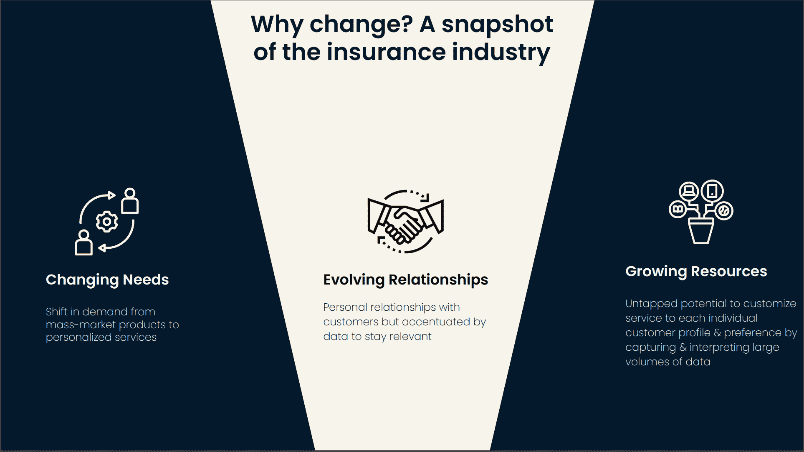

# 当今保险业中的数据科学

> 原文：<https://web.archive.org/web/20221129045128/https://www.datacamp.com/blog/data-science-in-insurance-today>

如今，高绩效的保险组织正在利用数据科学在竞争激烈的环境中推进其业务。在最近的一次网络研讨会中，安联比荷卢经济联盟的区域首席数据和分析官 Sudaman Thoppan Mohanchandralal 讨论了保险领域数据科学的现状以及该行业中令人兴奋的机器学习用例。

## 为什么数据科学在当今的保险行业很有价值

最近，该行业的需求已经转向更加个性化的服务，而不是那些吸引大众市场的服务。麦肯锡的这份报告描述了苏达曼提到的这种转变。它解释了如何通过战略性个性化营销和服务产品与大规模消费者建立深厚的一对一关系。

个人客户可用数据的大规模增长以及机器学习和资源的进步，使得需求和关系的这些变化成为可能。在本文的[中，IBM 讨论了保险公司在创建相对于吸引大众的产品的个性化服务时，如何观察到盈利时间提高了 22-25%。这些产品只能使用机器学习进行规模化开发。](https://web.archive.org/web/20220809202103/https://www.ibm.com/thought-leadership/institute-business-value/report/insurance-data-personalization)

## 保险数据科学的现状

Sudaman 在网上研讨会中解释说，当机器学习用于预测而不是因果推理时，以及当问题足够独立时，它会提供价值。截至今天，当组织试图将这些算法用作水晶球或黑盒，而不是告知人类探索方向的工具时，机器学习失败了。以下是网上研讨会中涉及的一些使用案例:

### 1.保险索赔中的欺诈检测

机器学习在有大量数据的预测任务上表现非常好。因此，[欺诈检测](https://web.archive.org/web/20220809202103/https://www.datacamp.com/courses/fraud-detection-in-python)是训练和部署逻辑回归或决策树等分类算法的绝佳用例。这个系统可以用来标记看起来可疑的索赔。这使得欺诈预防对分析师来说变得更加易于管理，因为它将通过暴露最有可能是欺诈的索赔来增强他们的工作流程。

### 2.为保留活动识别客户

提高任何组织规模的另一个重要用例是提高[客户保持率](https://web.archive.org/web/20220809202103/https://www.datacamp.com/courses/machine-learning-for-marketing-in-python)。机器学习可以帮助识别哪些客户有离开您组织的风险。从长远来看，大规模识别这些客户并为他们留下来提供激励将带来更好的客户终身价值，从而实现更深层次的个性化。

### 3.利用时间序列数据优化定价(风险溢价建模)

了解客户提出索赔的风险对于确定正确的价格和提供索赔的计划结构至关重要。所有的保险公司都在某种程度上这样做。随着可用数据的扩展，可以提高确定客户风险状况的模型准确性，从而为个人提供更具竞争力的价格。

### 4.未来疾病预测

与前面的用例类似，了解未来的疾病风险在投资组合优化和定价中至关重要。讨论保险业将如何支付超过 1000 亿美元的 COVID 相关索赔。虽然提前预测疫情具有挑战性，但了解和预测健康结果将使保险公司能够优先考虑和个性化他们的服务。

### 5.投资组合优化

我们将讨论的最后一个用例是投资组合优化。投资组合管理由几个步骤组成:识别要分析的有意义的风险分组，通知最优决策，以及识别机会。这些子任务都可以通过数据科学优化技术解决。

如果您想了解更多关于保险数据科学的未来，请点击此处收听网络研讨会[。](https://web.archive.org/web/20220809202103/https://www.datacamp.com/resources/webinars/future-of-data-science-in-insurance-1)

