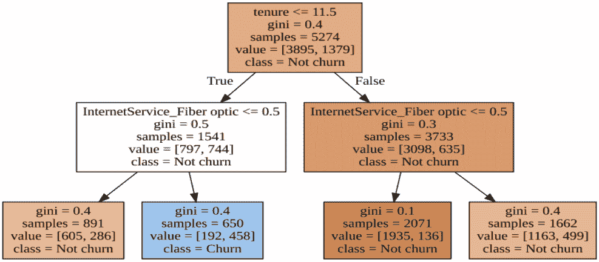

# 营销中的数据科学:客户流失率预测

> 原文：<https://web.archive.org/web/20230101103007/https://www.datacamp.com/blog/data-science-in-marketing-customer-churn-rate-prediction>


## 介绍

在过去的 10-15 年里，随着数字技术的进步，营销策略发生了很大的变化。知名品牌和较小的市场已经收集了大量关于交易、客户购买、偏好、购买力、购买活动、人口统计、评论等的数据。所有这些数据都可以帮助营销人员了解客户在不同阶段的行为，从购买意图到真正购买并成为固定客户。这就是数据科学发挥潜力的地方。

数据科学将营销大数据转化为可操作的见解，即使有时乍一看不太直观，例如，一些不明显的消费者行为模式和共现现象。因此，营销人员可以更清楚地了解他们的目标受众，吸引新客户并留住现有客户，优化他们的营销策略，提高公司的知名度，创建更成功的广告活动，涉及新的渠道，并反过来使公司的收入最大化。

营销中最典型的数据科学用例之一是客户流失率预测。让我们更详细地讨论这个话题。

## 营销中的数据科学用例:客户流失率预测

客户流失是指客户取消他们一直在使用的服务的订阅，并因此不再是该服务的客户。客户流失率是在预定义的时间间隔内流失客户的百分比。这与追踪新客户的客户增长率相反。

客户流失率是客户满意度和公司整体业务健康的一个非常重要的指标。除了在任何业务中都会发生的自然流失，或者某些服务的典型季节性流失，还有其他因素可能意味着公司出现了问题，应该加以解决。这些因素是:

*   缺乏或低质量的客户支持，
*   负面的客户体验，
*   转向条件或价格策略更好的竞争对手，
*   顾客的优先考虑改变了，
*   长期客户不会感到满意，
*   服务没有达到顾客的期望，
*   财务问题，
*   对客户付款的欺诈保护。

高客户流失率对任何公司来说都是一个严重的问题，原因如下:

*   它与公司的收入损失相关。
*   获得新客户比留住现有客户要花费更多的钱。对于竞争激烈的市场来说尤其如此。
*   在因为糟糕的客户服务而导致客户流失的情况下，公司的声誉可能会因为不满意的前客户在社交媒体或评论网站上留下的负面评论而严重受损。

对于所有基于订阅的服务来说，客户维系是业务战略的一个重要组成部分。为了预测客户流失率并采取相应的预防措施，有必要收集和分析有关客户行为的信息(购买间隔、成为客户的总时间、取消、后续电话和信息、在线活动)，并找出哪些属性及其组合是有离开风险的客户的特征。提前知道哪些客户可能会很快流失，尤其是在高收入或长期客户的情况下，可以帮助公司准确地关注他们，并制定有效的策略来试图说服他们留下来。该方法可以包括给这样的客户打电话，提供礼物、折扣、相同价格的订购升级或任何其他定制的体验。

从技术上讲，客户流失预测是一个典型的机器学习分类问题，当客户根据是否有流失风险被标记为“是”或“否”时。让我们在真实世界的数据上研究一下 Python 中的这个用例。

我们将在电信业务模型中对客户流失进行建模，在这种模型中，客户可以在一个主协议下拥有一家电信公司的多种服务。该数据集包含已清理客户活动的特征和指定客户是否流失的流失标签。

让我们来看看数据，探索流失率分布:

```py
import pandas as pd

telcom = pd.read_csv('telco.csv')
print(f'Number of customers: {telcom.shape[0]:,}\n'
      f'Churn values: {set(telcom['Churn'])}\n\n'
      f'Churn distribution, %:\n{round(telcom.groupby(['Churn']).size()/telcom.shape[0]*100).convert_dtypes()}')
```

```py
Number of customers: 7,032
Churn values: {0, 1}

Churn distribution, %:
Churn
0    73
1    27
dtype: float64
```

27%的客户翻盘，这是一个相当高的比率。但是，与之前的数据科学用例相比，这个数据集似乎没有严重的类别不平衡问题。

现在，我们将对数据进行预处理，以便进一步应用机器学习技术来执行流失预测。这包括将数据分成训练集和测试集，并提取特征和目标变量:

```py
from sklearn.model_selection import train_test_split

target = ['Churn']
custid = ['customerID']

cols = [col for col in telcom.columns if col not in custid + target]

X = telcom[cols]
y = telcom[target]

X_train, X_test, y_train, y_test = train_test_split(X, y, test_size=0.25)
```

我们将用于预测流失标签和估计结果准确性的第一个建模算法是一个简单的逻辑回归分类模型:

```py
from sklearn.linear_model import LogisticRegression
from sklearn.metrics import accuracy_score

lr = LogisticRegression()
lr.fit(X_train, y_train)
predictions = lr.predict(X_test)
print(f'Test accuracy: {round(accuracy_score(y_test, predictions), 4)}')
```

```py
Test accuracy: 0.8009
```

接下来，让我们向我们的逻辑回归模型添加一个功能，即在 L1 正则化的缩放数据上运行它，以在模型构建的同时执行特征选择。C 参数(正则化强度的倒数)的不同值对模型精度有影响。现在，让我们将 C 值设置为 0.025:

```py
lr = LogisticRegression(penalty='l1', C=0.025, solver='liblinear')
lr.fit(X_train, y_train)
predictions = lr.predict(X_test)
print(f'Test accuracy: {round(accuracy_score(y_test, predictions), 4)}')
```

```py
Test accuracy: 0.7969
```

现在，我们将调整 L1 正则化的 C 参数，以发现降低模型复杂性的最佳值，同时保持良好的模型性能指标。为此，我们将遍历不同的 C 值，在每个值上构建逻辑回归实例，并计算性能指标。

列表 C 是预先用参数的可能值创建的。l1_metrics 数组由 3 列组成，第一列是 C 值，接下来的两列是非零系数计数和模型精确度分数的占位符。让我们试试这种方法:

```py
 C  Non-Zero Coeffs  Accuracy
0  1.0000             23.0  0.801479
1  0.5000             22.0  0.799204
2  0.2500             21.0  0.802048
3  0.1000             20.0  0.802617
4  0.0500             18.0  0.802048
5  0.0250             13.0  0.796928
6  0.0100              5.0  0.790102
7  0.0050              3.0  0.783276
8  0.0025              2.0  0.745734
```

我们可以看到，较低的 C 值减少了非零系数(即，用于建模的特征)的数量，从而降低了模型的复杂性，但是它们也降低了模型的准确性。似乎 0.05 的 C 值是最佳值:它将特征的数量减少到 18 个，同时给出比非正则化模型中略高的准确度分数。

现在，让我们尝试另一种建模算法—决策树模型:

```py
from sklearn.tree import DecisionTreeClassifier

clf = DecisionTreeClassifier()
clf.fit(X_train, y_train)
predictions = clf.predict(X_test)
print(f'Test accuracy: {round(accuracy_score(y_test, predictions), 4)}')
```

```py
Test accuracy: 0.7275
```

为了选择更精确的模型，同时避免过度拟合，我们可以尝试调整树深度(max_depth 参数)并确定其最佳值。从技术上讲，这个过程与上面选择逻辑回归模型的最佳 C 参数的过程非常相似:在这里，我们将遍历 max_depth 参数的多个值，为每个值拟合一个决策树，然后计算性能指标。

已经预先用参数的可能值创建了列表 depth_list。depth_tuning 数组由两列组成，第一列填充深度候选值，另一列是准确度分数的占位符。让我们应用这种方法，找到最佳树深度:

```py
depth_list = list(range(2, 15))
depth_tuning = np.zeros((len(depth_list), 2))
depth_tuning[:, 0] = depth_list

for index in range(len(depth_list)):
    clf = DecisionTreeClassifier(max_depth=depth_list[index])
    clf.fit(X_train, y_train)
    predictions = clf.predict(X_test)
    depth_tuning[index, 1] = accuracy_score(y_test, predictions)

col_names = ['Max_Depth', 'Accuracy']
print(pd.DataFrame(depth_tuning, columns=col_names))
```

```py
 Max_Depth  Accuracy
0         2.0  0.756542
1         3.0  0.783276
2         4.0  0.782708
3         5.0  0.791809
4         6.0  0.778157
5         7.0  0.780432
6         8.0  0.757110
7         9.0  0.762230
8        10.0  0.763936
9        11.0  0.752560
10       12.0  0.745165
11       13.0  0.732651
12       14.0  0.727531
```

因此，准确度分数首先随着深度增加而增加，然后开始下降。在 max_depth 为 5 时，树显示最高的准确度分数，因此我们可以将该值视为最佳树深度。

在确定逻辑回归和决策树模型的最佳参数值后，让我们重新构建这些模型，然后检测和解释推动客户流失上升或下降的主要因素。

对于逻辑回归模型，我们将提取并研究结果系数的指数:

```py
# Reconstructing the best model
lr = LogisticRegression(penalty='l1', C=0.05, solver='liblinear')
lr.fit(X_train, y_train)
predictions = lr.predict(X_test)

# Combining feature names and coefficients into one dataframe
feature_names = pd.DataFrame(X_train.columns, columns=['Feature'])
log_coef = pd.DataFrame(np.transpose(lr.coef_), columns=['Coefficient'])
coefficients = pd.concat([feature_names, log_coef], axis=1)

# Calculating exponents of the coefficients
coefficients['Exp_Coefficient'] = np.exp(coefficients['Coefficient'])

# Removing coefficients that are equal to zero
coefficients = coefficients[coefficients['Coefficient']!=0]
print(coefficients.sort_values(by=['Exp_Coefficient']))
```

```py
 Feature  Coefficient  Exp_Coefficient
21                          tenure    -0.907750         0.403431
4                 PhoneService_Yes    -0.820517         0.440204
17               Contract_Two year    -0.595271         0.551413
8                  TechSupport_Yes    -0.418254         0.658195
16               Contract_One year    -0.414158         0.660896
5               OnlineSecurity_Yes    -0.412228         0.662173
6                 OnlineBackup_Yes    -0.143100         0.866667
3                   Dependents_Yes    -0.039299         0.961463
7             DeviceProtection_Yes    -0.017465         0.982687
11            PaperlessBilling_Yes     0.071389         1.073999
1                SeniorCitizen_Yes     0.097904         1.102857
19  PaymentMethod_Electronic check     0.188533         1.207477
22                  MonthlyCharges     0.901454         2.463182
```

我们可以看到，对变动几率影响最大的特征是任期。一般来说，系数指数低于 1 会降低赔率，而高于 1 会增加赔率。

对于决策树模型，我们将提取并绘制 if-else 规则:

```py
# Reconstructing the best model
clf = DecisionTreeClassifier(max_depth=5)
clf.fit(X_train, y_train)
predictions = clf.predict(X_test)

from sklearn import tree
import graphviz

# Exporting a graphviz object from the trained decision tree
exported = tree.export_graphviz(decision_tree=clf,
                                out_file=None,
                                feature_names=cols,
                                precision=1,
                                class_names=['Not churn', 'Churn'],
                                filled=True)
graph = graphviz.Source(exported)
display(graph)
```



我们获得了一个好看的决策树可视化，可以解释为一组从顶部开始的 if-else 规则。我们再次看到，客户任期是推动客户流失的最重要的变量。决策树可以构建成更多层，这将提供对其他变量的更多洞察。

作为潜在的前进方向，我们可以尝试进一步调整模型参数，使用不同的训练/测试分割方法，应用和比较其他机器学习算法，并分析各种分数类型来评估模型性能。

如果你想更深入地研究客户流失率预测和数据科学在营销中的其他应用，这门关于用 Python 进行营销的[机器学习的课程可能是一个很好的起点。](https://web.archive.org/web/20220628140236/https://app.datacamp.com/learn/courses/machine-learning-for-marketing-in-python)