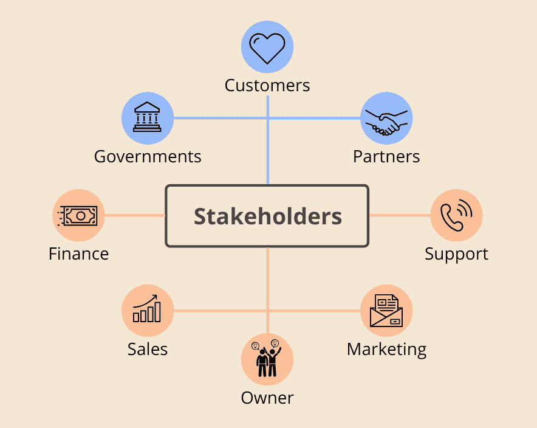
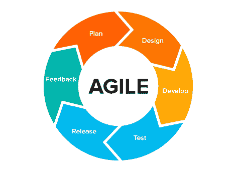
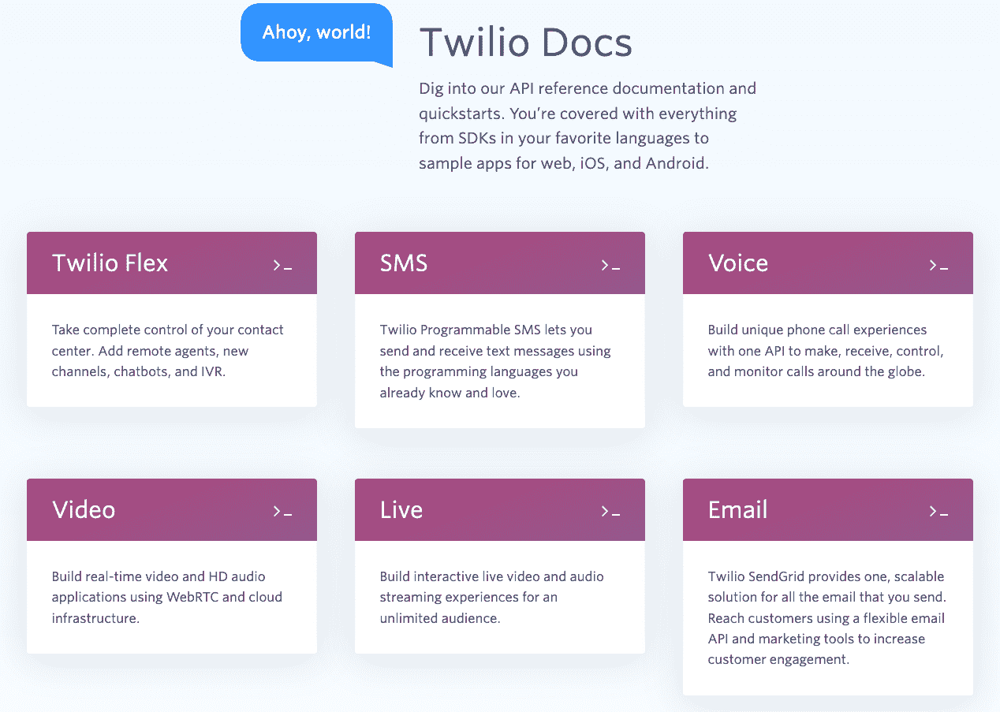
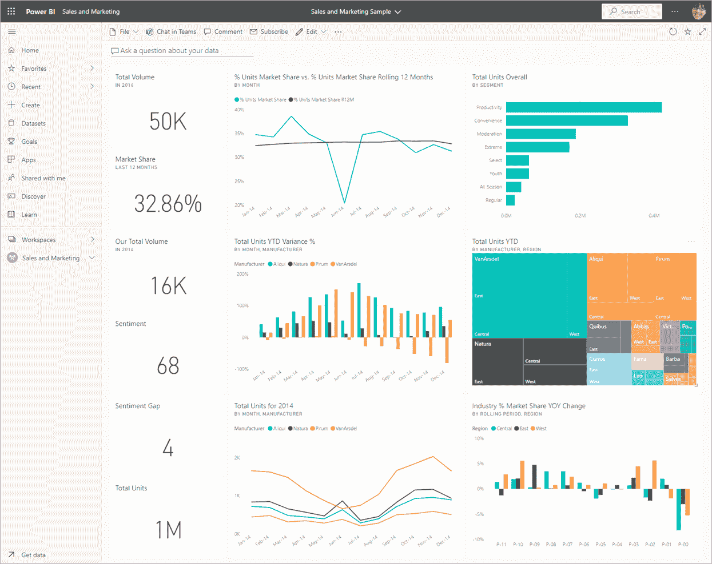
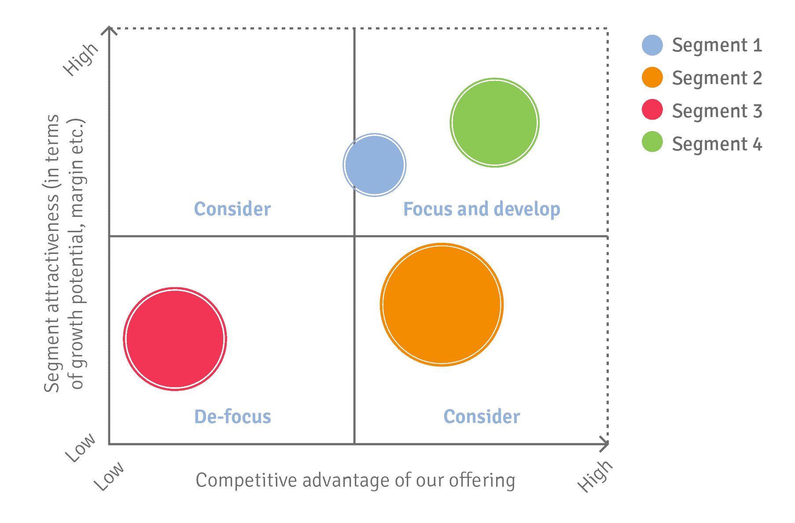
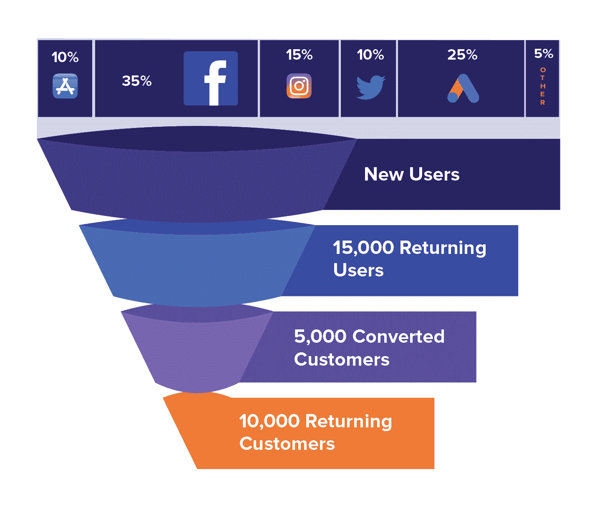
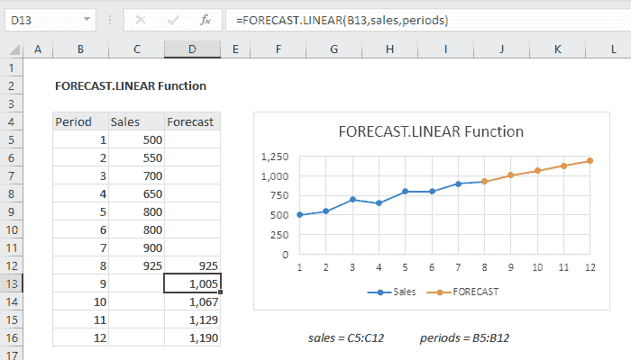

# “数据科学家”头衔之外的数据科学角色

> 原文：<https://web.archive.org/web/20221129041532/https://www.datacamp.com/blog/data-science-roles-beyond-the-title-data-scientist>

2011 年，《哈佛商业评论》称数据科学为“21 世纪最性感的工作”。此后，对数据科学的需求不断增长。《财富》报道称，自 2016 年以来，数据科学家的职位空缺[增加了 480%。这种增长如此巨大，以至于到 2020 年](https://web.archive.org/web/20220702223919/https://fortune.com/education/business/articles/2022/03/08/glassdoors-no-3-best-job-in-the-u-s-has-seen-job-growth-surge-480/)[仍然缺少 25 万名数据科学专业人员](https://web.archive.org/web/20220702223919/https://quanthub.com/data-scientist-shortage-2020/)。

不幸的是，那些渴望在数据科学中发挥作用的人可能会发现自己受到了打击。浏览一下数据科学的工作描述就会发现一系列令人生畏的技能。数据科学职位的激烈竞争也让一些申请者被他们梦想的工作拒绝。

然而，许多人没有意识到数据科学家的职业轨迹可能是非线性的。没有“数据科学家”头衔的工作也能让一个人具备宝贵的数据科学技能！这些技能包括统计学、数据处理、机器学习、编程、商业敏锐度和讲故事的技能——所有这些对于数据科学家来说都是必不可少的。

这里有几个角色可以成为你成为数据科学家的垫脚石。这些技术性和非技术性的角色可以帮助你打入这个行业。

## 非技术数据角色

### 数据/分析翻译

被麦肯锡称为“[新的必备角色](https://web.archive.org/web/20220702223919/https://www.mckinsey.com/business-functions/mckinsey-analytics/our-insights/analytics-translator)”的分析翻译器帮助企业领导人优先考虑他们的业务问题，然后将这些业务目标传达给数据专业人员。分析翻译得到业务领导的认可，并确保数据团队构建的解决方案产生商业价值。

“你不断打破技术概念，让每个人都说同一种语言，”Fortive 的技术分析师 Gruschow 说，她[描述她的角色](https://web.archive.org/web/20220702223919/https://builtin.com/data-science/analytics-translator)。根据麦肯锡的说法，一个优秀的分析翻译候选人应该具有企业家精神、良好的项目管理技能和一般的技术流利性(尽管编程专业知识是可选的)。如果你有这些技能，分析翻译的角色可能会适合你。

### 数据科学产品经理

数据科学产品经理(PM)拥有数据科学产品从概念化到发布的路线图。他们与业务团队合作，确定数据科学如何解决业务难题。然后，项目经理与数据专业人员和开发人员密切合作，制定产品需求，监督产品开发，并定义成功标准。

*一个产品经理经常与各种各样的利益相关者沟通([来源](https://web.archive.org/web/20220702223919/https://www.christianstrunk.com/blog/how-to-manage-stakeholders) )*

每个公司都有自己独特的数据科学产品。商业智能公司的数据科学产品经理可能监督数据可视化工具的开发，而流媒体公司的另一位产品经理可能拥有应用内推荐功能的路线图。那些对利益相关者管理有诀窍并且对数据科学有广泛理解的人适合这个角色。

### 数据战略顾问

数据策略顾问设计、构建和实施提高业务绩效的数据策略。顾问与企业领导者合作，评估公司的数据能力，并为数据驱动型组织提出路线图。

一名顾问确定了公司如何利用数据技术来解决他们的问题。根据公司的成熟程度，战略可能会有所不同。对于一个年轻的组织，顾问可能会建议实施数据管理和治理工具。对于成熟的组织，顾问可能会建议使用创新的云解决方案。那些有咨询背景的人可能会觉得这个职位很有吸引力。最重要的是，那些对各种数据框架(如数据治理、数据管理、商业智能、高级分析、机器学习和云平台)有一些实际知识的人被认为非常适合这个角色。

### 技术项目经理

技术项目经理计划、组织和指导技术数据科学项目。项目经理管理项目可用的资源，确保项目在预算范围内按时交付。

当项目经理从概念到启动监督一个项目时，他们的角色相当多样化。他们计划项目大纲，安排项目任务，评估项目阶段，与利益相关者沟通，并管理产品愿景。为了管理跨职能的项目团队，他们使用像 Scrum 和 Agile 这样的开发方法。

*敏捷方法论([来源](https://web.archive.org/web/20220702223919/https://www.wearemarketing.com/blog/what-is-the-agile-methodology-and-what-benefits-does-it-have-for-your-company.html) )*

技术项目的角色适合那些有管理经验的人。拥有数据科学、软件工程或 UI/UX 技术背景的候选人很可能在获得技术项目经理的职位方面具有优势。

### 技术作家

随着数据科学产品数量和规模的增长，对技术文档的需求也在增长。正确而简洁的文档是开发人员向最终用户传达指令的最佳方式之一。

*Twilio 的技术文件示例([来源](https://web.archive.org/web/20220702223919/https://www.twilio.com/docs) )*

技术作家通过提供入门指南、深入的产品文档和关于技术产品的 API 参考资料来填补这一空白。他们还与开发工程师、产品经理和项目经理密切合作来设计文档。技术作者应该有技术背景，这样他们就可以很容易地与技术团队互动。如果你对技术写作感兴趣，在开始找工作之前，你可能想在你的文件夹中包含[份你的技术写作样本。](https://web.archive.org/web/20220702223919/https://woz-u.com/blog/technical-writing-for-data-science/)

## 技术数据角色

### 商业智能分析师

商业智能分析师使用数据分析和可视化来帮助组织做出数据驱动的业务决策。商业智能分析师的日常工作包括解释关键数据以获得洞察力。为了传达这些见解，BI 分析师以仪表板或演示幻灯片的形式维护指标和可视化。因此，BI 分析师精通数据库工具(SQL)、商业智能工具(如 Tableau)和电子表格工具(如 Excel)。

BI 分析师的一个令人兴奋的项目是自动化现有的报告流程。例如，HelloFresh 的 BI 分析师通过[创建实时仪表板](https://web.archive.org/web/20220702223919/https://www.tableau.com/learn/articles/business-intelligence-examples)消除了手动数据报告的需要。然后，营销团队利用这些报告优化营销活动，进而提高客户保留率。

*power bi 仪表板示例*

### 数据分析师

数据分析师与 BI 分析师有许多相似之处。像 BI 分析师一样，数据分析师负责提供准确的业务指标，并为业务利益相关者提取可操作的见解，以做出数据驱动的决策。

在一些公司，数据分析师可能会参与高级分析项目。此类项目可能需要数据分析师与产品、业务和工程团队合作，以推动关键的业务决策。例如，数据分析师的任务可能是创建一个客户细分，这可以用来制定特定于细分的策略。

*数据分析师可以执行客户细分( [来源](https://web.archive.org/web/20220702223919/https://www.b2binternational.com/what-we-do/markets/account-based-marketing/) )*

根据工作范围的不同，数据分析师可能不仅需要了解 SQL、BI 工具和电子表格工具，还需要了解编程语言(如 Python 或 R)。在从事高级分析项目时，扎实的统计知识也将有助于数据分析师。

### 市场部分析师

营销运营分析师实施营销流程并分析营销绩效。此类流程可以包括使用 CRM 软件的销售线索管理和客户参与。营销分析师分析客户和供应商数据，以发现机会并优化营销流程。例如，分析师可能会进行漏斗分析，以找到客户转化过程中最薄弱的环节。

*漏斗分析示例(来源: [Clevertap](https://web.archive.org/web/20220702223919/https://clevertap.com/blog/funnel-analysis/) )*

此外，营销运营分析师可以执行假设测试来优化营销绩效。通过适当的 A/B 测试，分析师可能会发现电子邮件标题中的表情符号会显著提高年轻受众的点击率。这个角色对于那些擅长营销的人来说是一个很好的敲门砖。它也是应届毕业生的理想选择，因为 NCSU 报告称，高达 45%的营销运营分析师职位要求不到两年的工作经验，80%的职位要求学士学位。

### 金融分析师

财务分析师检查财务数据，识别投资机会，并评估业务建议的结果。具体来说，他们分析宏观经济因素、微观经济条件和公司基本面之间的相互作用。金融数字是金融分析师的饭碗。为了评估一家公司的健康状况，他们会检查毛利率、净利润率、增长率、股本回报率和每股收益等指标。

分析师还使用统计方法(如回归分析)和高级财务模型(如贴现现金流分析)对公司的未来业绩和价值进行预测。

*财务分析师执行的简单回归分析示例([来源](https://web.archive.org/web/20220702223919/https://exceljet.net/excel-functions/excel-forecast.linear-function) )*

据 Investopedia 称，拥有学士学位(最好是会计、经济学、金融或统计学)或 MBA 学位的人很有可能成为金融分析师。

### 机器学习工程师

根据 LinkedIn 的数据，MLE 是 2022 年增长最快的 25 个职位之一。MLEs 设计、构建和生产机器学习模型。因此，他们精通设计模型架构，编排机器学习管道，以及监控生产中的 ML 解决方案。

例如，在打车公司工作的 MLE 可能会监控其生产匹配人工智能将司机与骑手匹配起来所用的时间。MLE 与数据科学家合作，确保时间不超过预定义的阈值。MLE 角色适合那些具有强大编程能力的人，比如软件工程师或数据工程师。MLEs 还应该有很强的数学和统计学基础，对机器学习模型有很扎实的理解。

## 打造您的数据职业生涯

专注于数据科学家这一角色的热切求职者可能会在求职过程中忽略这些头衔。我们的建议？如果你能在工作中学习数据科学技能，不要害怕追求数据科学家以外的职位。正如史蒂夫·乔布斯优雅地说的，“你不能向前看把点点滴滴连接起来…所以你必须相信这些点点滴滴会在你的未来以某种方式连接起来。”

*本文最初发布在 DataCamp 认证社区上，这是一个专为所有成功完成 DataCamp 认证的学员提供的平台。要访问该社区以获取更多有助于您站在数据行业前沿的内容， [立即获得认证](https://web.archive.org/web/20220702223919/https://www.datacamp.com/certification) ！*

Raven is DataCamp’s Certified Community Manager. As a trained anthropologist and a lover of people, Raven believes in the power of coming together to foster connections, learning, growth, and belonging.