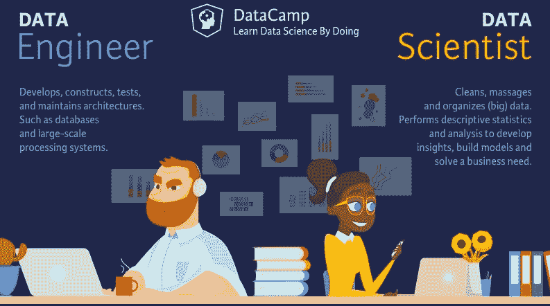
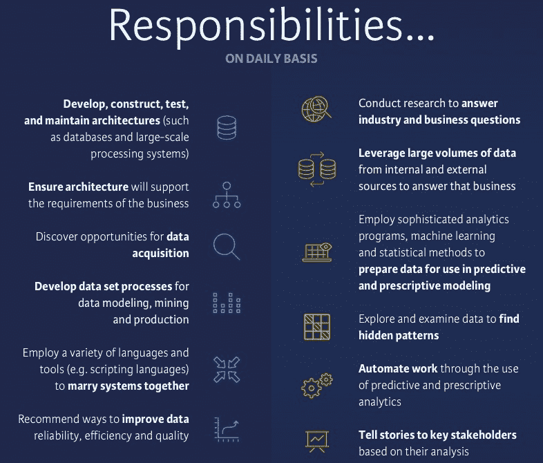
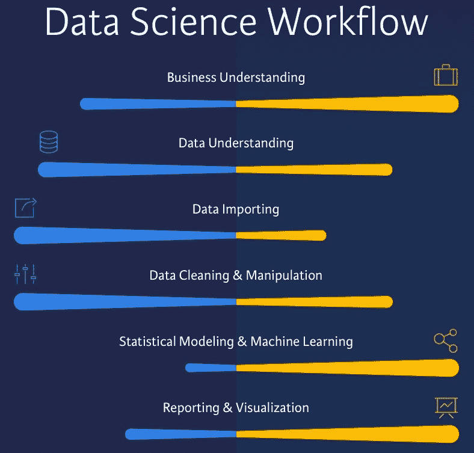
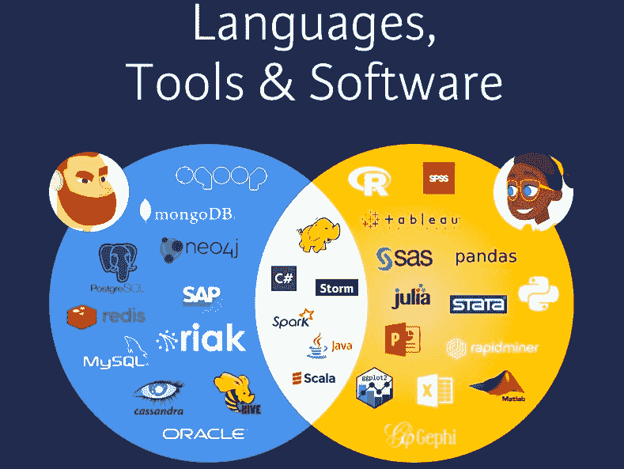
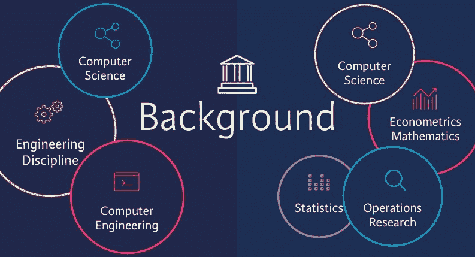
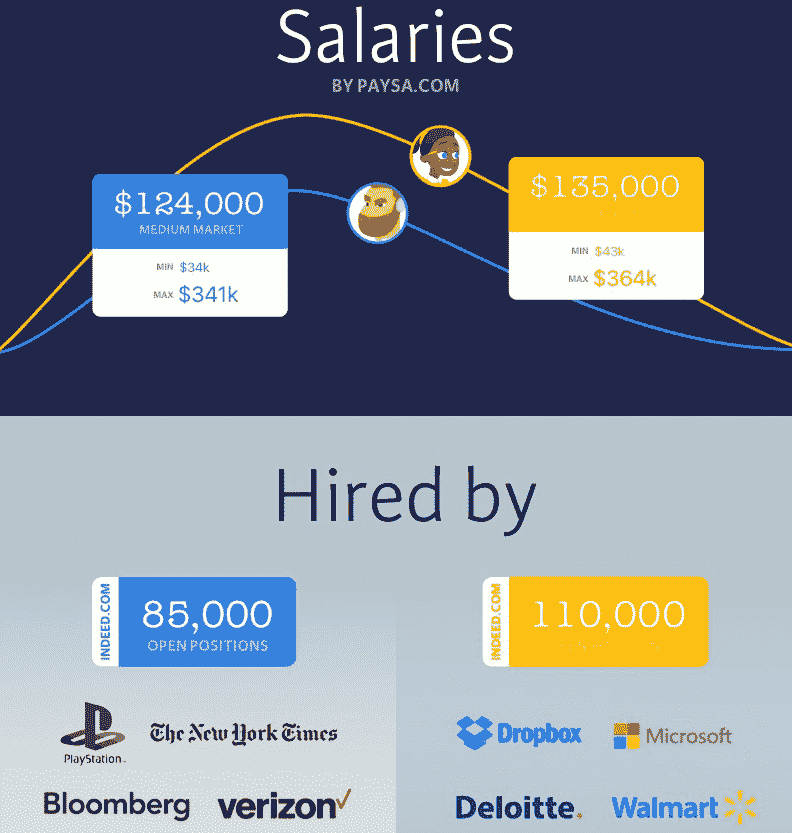
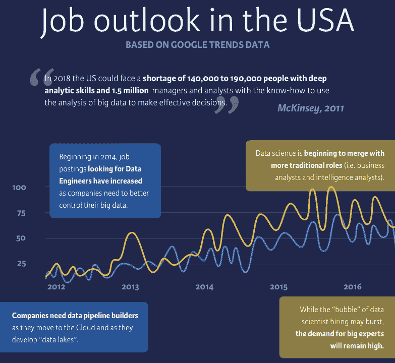

# 数据科学家 vs 数据工程师

> 原文：<https://web.archive.org/web/20230101103415/https://www.datacamp.com/blog/data-scientist-vs-data-engineer>

关于数据科学角色的讨论并不新鲜(记得 DataCamp 在 2015 年推出的[数据科学行业](https://web.archive.org/web/20220818122742/https://www.datacamp.com/community/tutorials/data-science-industry-infographic/)信息图):公司对获取数据科学人才的日益关注似乎与一系列全新的数据科学角色和职位的创建齐头并进。在第一篇文章发表两年后，这种情况仍在继续！

最近，有很多关于不同数据科学角色之间的区别的文章，更具体地说，是关于数据科学家和数据工程师之间的区别。也许兴趣的激增是因为这些年来观点确实发生了变化:几年前，人们更关注从数据中检索有价值的见解，而数据管理的重要性已经慢慢开始在行业中深入人心。因为最终,“垃圾进，垃圾出”的原则仍然适用:你可以建立最好的模型，但是如果你的数据不是定性的，你的结果将会很弱。

数据工程师的角色逐渐成为人们关注的焦点。

今天的博客文章将展示数据科学家和数据工程师之间最重要的区别，重点是[职责](#responsibilities)、[工具、语言&软件](#tools)、[教育背景](#education)、[薪水&招聘](#salaries)、[工作前景](#job)和[资源](#resources)，您可以使用它们开始数据科学或工程工作！

如果您更喜欢看可视化演示和参考资料，请务必查看相应的信息图“[数据工程与数据科学](https://web.archive.org/web/20220818122742/https://www.datacamp.com/community/blog/data-engineering-vs-data-science-infographic/)”。

## 责任

### 数据工程师的职责

数据工程师是开发、构建、测试和维护架构的人，例如数据库和大规模处理系统。另一方面，数据科学家是清理、处理和组织(大)数据的人。

您可能会发现动词“按摩”的选择特别奇怪，但它更多地反映了数据工程师和数据科学家之间的差异。

一般来说，双方为获得可用格式的数据所做的努力是相当不同的。

数据工程师处理包含人为、机器或仪器误差的原始数据。数据可能未经验证，并且包含可疑记录；它是无格式的，可以包含特定于系统的代码。

数据工程师需要推荐并有时实施提高数据可靠性、效率和质量的方法。为此，他们需要使用各种语言和工具将系统结合在一起，或者尝试寻找机会从其他系统获取新数据，以便特定于系统的代码可以成为数据科学家进一步处理的信息。

与这两者密切相关的事实是，数据工程师需要确保现有的架构支持数据科学家和利益相关者(业务)的需求。

最后，为了将数据交付给数据科学团队，数据工程团队需要为数据建模、挖掘和生产开发数据集流程。

### 数据科学家的责任

数据科学家通常已经获得了通过第一轮清理和处理的数据，他们可以使用这些数据来输入复杂的分析程序和机器学习及统计方法，为预测和说明性建模准备数据。当然，为了构建模型，他们需要研究行业和业务问题，并且他们需要利用来自内部和外部来源的大量数据来满足业务需求。这有时也包括探索和检查数据以发现隐藏的模式。

一旦数据科学家完成了分析，他们将需要向关键利益相关者展示一个清晰的故事，当结果被接受时，他们将需要确保工作自动化，以便可以每天、每月或每年向业务利益相关者提供见解。

很明显，双方需要共同努力来争论数据，并为关键业务决策提供见解。技能组合有明显的重叠，但这两者在行业中逐渐变得更加不同:数据工程师将使用数据库系统、数据 API 和工具进行 ETL，并将参与数据建模和建立数据仓库解决方案，而数据科学家需要了解统计、数学和机器学习以建立预测模型。

数据科学家需要了解分布式计算，因为他需要访问已经由数据工程团队处理过的数据，但是他或她还需要能够向业务利益相关者报告:关注讲故事和可视化是必不可少的。

就关注数据科学工作流程的步骤而言，这意味着什么，您可以在下图中看到:

## 语言、工具和软件

当然，这种技能上的差异会转化为双方使用的语言、工具和软件的差异。下面的概述包括商业和开放源码的替代品。

尽管双方使用的工具在很大程度上取决于角色在公司环境中的构想，但您会经常看到数据工程师使用 SAP、Oracle、Cassandra、MySQL、Redis、Riak、PostgreSQL、MongoDB、neo4j、Hive 和 Sqoop 等工具。

数据科学家将利用 SPSS、R、Python、SAS、Stata 和 Julia 等语言建立模型。毫无疑问，这里最受欢迎的工具是 Python 和 R。当您使用 Python 和 R 进行数据科学研究时，您最常求助于 ggplot2 之类的包，以便在 R 或 Python 数据操作库 Pandas 中实现令人惊叹的数据可视化。当然，当您在从事数据科学项目时，还有许多软件包会派上用场，如 Scikit-Learn、NumPy、Matplotlib、Statsmodels 等。

在这个行业中，你还会发现商业 SAS 和 SPSS 做得很好，但其他工具，如 Tableau、Rapidminer、Matlab、Excel、Gephi 也将成为数据科学家的工具箱。

你再次看到数据工程师和数据科学家之间的一个主要区别，对数据可视化和讲故事的强调，反映在提到的工具中。

你可能已经猜到了，双方共有的工具、语言和软件是 Scala、Java 和 C#。

这些语言不一定同时受数据科学家和工程师的欢迎:你可以说 Scala 更受数据工程师的欢迎，因为与 Spark 的集成对于设置大型 ETL 流特别方便。

Java 语言也是如此:目前，它在数据科学家中的受欢迎程度正在上升，但总的来说，它并没有被专业人员广泛地用于日常生活。但是，总的来说，你会看到这些语言出现在这两个职位的空缺职位上。对于双方可能共有的工具也可以这么说，比如 Hadoop、Storm 和 Spark。

当然，工具、语言和软件方面的比较需要在您工作的具体环境中以及您如何解释所讨论的数据科学角色中进行；在某些特定的情况下，数据科学和数据工程可以紧密地结合在一起，在这种情况下，数据科学和数据工程团队之间的区别确实很小，有时，这两个团队会被合并。

这是否是一个伟大的想法是足够的材料进行另一场讨论，这不是今天的博客的范围。

## 学历

除此之外，数据科学家和数据工程师可能还有一些共同点:他们的计算机科学背景。这个研究领域在两种职业中都很受欢迎。当然，你也会看到数据科学家经常学习计量经济学、数学、统计学和运筹学。他们通常比数据工程师更有商业头脑。你经常会看到数据工程师也有工程背景，而且更多的时候，他们已经接受了一些计算机工程方面的教育。

然而，所有这些并不意味着你找不到从以前的研究中积累了运营知识和商业头脑的数据工程师。

您必须认识到，一般来说，数据科学行业是由来自各种不同背景的专业人士组成的:物理学家、生物学家或气象学家找到数据科学之路并不罕见。其他人的职业转向了数据科学，他们来自 web 开发、数据库管理等领域。

## 薪资和招聘

谈到工资，数据科学家的中等市场平均年薪为 135，000 美元。最低为 43，000 美元，最高为 364，000 美元。对于数据工程师来说，中型市场稍低一些:他们的平均收入为 124，000 美元，他们的最低和最高工资也低得多:最低为每年 34，000 美元，最高为 341，000 美元。

薪酬差距的确切来源尚不完全清楚，但这可能与空缺职位的数量有关:根据 indeed.com 的数据，数据工程师的空缺职位约为 8.5 万个，而市场上数据科学家的空缺职位约为 11 万个。

目前希望聘用数据工程师的公司有 PlayStation、纽约时报、彭博和威瑞森，但在过去，Spotify、脸书和亚马逊等公司也聘用过数据工程师。另一方面，数据科学家目前在 Dropbox、微软、德勤和沃尔玛等公司都很受欢迎。

## 就业前景

如前所述，角色和头衔的创建需要反映不断变化的需求，但其他时候，它们是作为一种区别于其他招聘公司的方式而创建的。

除了对数据管理问题的兴趣增加之外，公司还在寻找更便宜、灵活和可扩展的解决方案来存储和管理他们的数据。他们希望将数据迁移到云中，为此，他们需要构建“数据湖”，作为对现有数据仓库的补充，或者作为运营数据存储(ODS)的替代。

在未来几年中，数据流将需要被重定向和替换，因此，招聘数据工程师的职位发布的关注和数量在这些年中逐渐增加。

自从炒作开始以来，数据科学家的角色就一直很受欢迎，但如今，公司正在寻求组成数据科学团队，而不是雇佣拥有沟通技能、创造力、聪明、好奇心、技术专长等的独角兽数据科学家。对于招聘人员来说，很难找到体现公司所寻找的所有品质的人，而且需求显然超过了供应。

你可能会认为“数据科学家泡沫”已经破裂。也可能以后还是会爆。

有一件事将贯穿始终:对热衷于数据科学主题的专家的需求将一直存在。这些专家的工作前景非常乐观:据麦肯锡(McKinsey)称，2018 年，美国可能会缺少 14 万至 19 万名具有深度分析技能的人，以及 150 万名知道如何利用(大)数据分析做出有效决策的经理和分析师。

## 数据工程和数据科学入门

你看，有足够多的理由开始使用数据。:)而这恰恰是不会成为大问题的事情。

在 DataCamp，如果你想[开始学习数据工程](https://web.archive.org/web/20220818122742/https://www.datacamp.com/data-courses/data-engineering-courses)，我们有理想的课程，例如，DataCamp 的[在 Python 中导入数据](https://web.archive.org/web/20220818122742/https://www.datacamp.com/courses/importing-data-in-python-part-1/)和[在 R 中导入数据](https://web.archive.org/web/20220818122742/https://www.datacamp.com/courses/importing-data-in-r-part-1/)课程。

但是，当然，对于那些想要开始学习数据科学的人来说，还有[探索性数据分析](https://web.archive.org/web/20220818122742/https://www.datacamp.com/courses/exploratory-data-analysis-in-r-case-study/)、数据科学的[R 简介](https://web.archive.org/web/20220818122742/https://www.datacamp.com/courses/free-introduction-to-r/)、[机器学习工具箱](https://web.archive.org/web/20220818122742/https://www.datacamp.com/courses/machine-learning-toolbox/)和数据科学的[Python 简介](https://web.archive.org/web/20220818122742/https://www.datacamp.com/courses/intro-to-python-for-data-science/)课程。

今天就开始互动学习吧！

数据工程师是开发、构建、测试和维护架构的人，例如数据库和大规模处理系统。数据工程师处理包含人为、机器或仪器错误的原始数据，他们的主要职责之一是清理数据，以便数据科学家可以对其进行分析。