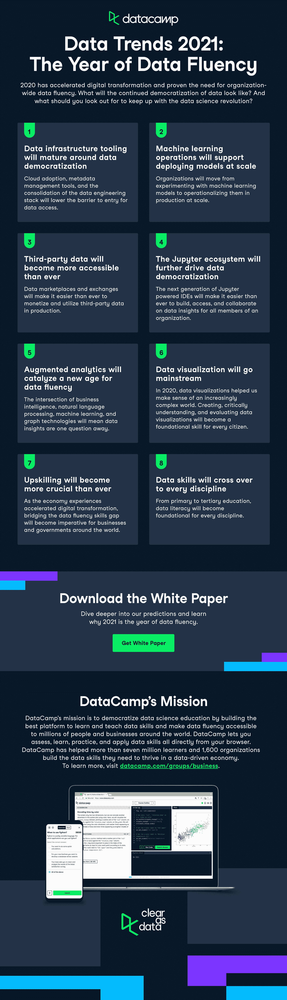

# 2021 年数据趋势:数据流畅之年[信息图]

> 原文：<https://web.archive.org/web/20221129033105/https://www.datacamp.com/blog/data-trends-2021-the-year-of-data-fluency-infographic>

过去的一年是动荡不安的，许多教训今天仍在揭示。新冠肺炎危机加速了数字化转型，迫使现有组织对其流程进行数字化，对其业务模式进行现代化，支持数据访问，并提高其员工的技能以适应数据驱动的时代([微软](https://web.archive.org/web/20220525042842/https://www.youtube.com/watch?v=FoIOFEp2HiY))。像 Zoom、亚马逊和 PayPal 这样的数字化、数据驱动型组织受益于这种新常态([《金融时报》](https://web.archive.org/web/20220525042842/https://www.ft.com/content/844ed28c-8074-4856-bde0-20f3bf4cd8f0))，并巩固了它们在各自市场的领导者地位。新冠肺炎危机也证明了每个人都需要成为数据流畅、知情的公民([数据大学](https://web.archive.org/web/20220525042842/https://www.dataversity.net/the-dangers-of-data-illiteracy-coronavirus-and-data-distortions/))，因为数据可以用来告知和误导我们疫情的状况。

今年，我们站在大加速的边缘。世界各地的组织都在寻求提高他们的数字弹性，并在此过程中变得更加数据驱动。数据科学革命总是让不可能变成可能。借助数据科学方法和技术，专业团队致力于解决自动驾驶汽车、算法交易程序和蛋白质折叠等重要问题。然而，真正的数据科学革命[使广泛传播](https://web.archive.org/web/20220525042842/https://www.datacamp.com/resources/webinars/scaling-data-science-at-your-organization-part-1)成为可能，组织中的每个人都可以理解数据，交流来自数据的见解，并利用数据做出更明智的决策。这是关于创建数据流畅的组织和社会，其中每个人都具备了他们需要被告知的必要技能，公民和雇员。

在接下来的一年甚至更长的时间里，我们将会看到在数据流畅性方面更好的工具，对技能的更高重视，以及在整个组织中对数据更丰富、更容易的访问。

如果您想深入了解我们的 2021 年趋势，请下载我们的白皮书。

