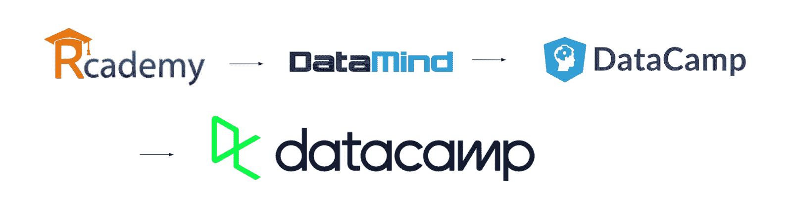
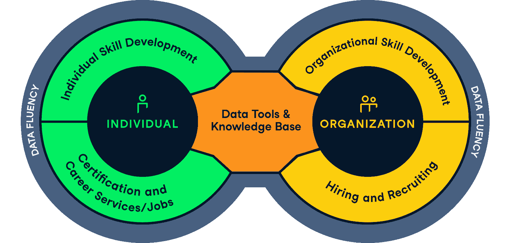

# 数据营 2.0

> 原文：<https://web.archive.org/web/20221129034451/https://www.datacamp.com/blog/datacamp-20>

七年前，DataCamp 成立，目标是通过构建一个经济实惠、引人入胜且可扩展的数据科学教育平台，让世界变得更加数据流畅。如今，100 多名员工共同承担着消除数据文盲的使命。随着全球许多国家的教育成本飙升，经济机会越来越依赖于对数据的理解和利用，我们的使命变得前所未有的重要。在一个数据是新黄金的世界，数据技能给人们和组织提供了前进的机会，在 DataCamp，我们希望将这种机会扩展到每个人。

我们亲眼目睹了对数据科学教育的惊人需求，因为 DataCamp 的增长超出了我们最大的预期:我们现在正在帮助超过 1，600 家企业和 150，000 名个人订户培养数据技能。今年，超过 200 万门课程将在 DataCamp 上完成，DataCamp 的收入在过去三年中增长了惊人的 1，232%，使我们在 2019 年和 2020 年进入德勤科技 500 强排名的前 100 名！

但是我们相信我们可以做得更多。

在通往更加流畅的数据世界的征途上，仍有许多重大障碍。

我们认为 3 个最大的障碍是:

1.  *劳动力市场效率低下——*
    劳动力市场中存在巨大的供需不平衡(从数据工程师或数据科学家等技术性很强的职位到技术性较低的公民数据职位)。此外，许多申请人很难表明他们的技能水平，许多组织也很难找到合适的人才。DataCamp 能够帮助学习者找到适合他们的工作，并帮助组织找到合适的数据人才，从而很好地应对这一劳动力市场挑战。提供可扩展、负担得起且值得信赖的资格认证是解决劳动力市场效率低下的一个重要方面。

2.  *大多数数据工具缺乏协作—*
    协作是理解和利用数据的核心。但是，尽管数据专业人员的数量正在快速增长，但他们缺乏能够随着数据团队的增长而轻松扩展并有助于促进和鼓励协作的工具。因此，来自数据团队的见解通常分散在各种工具中，分析是重复的，等等。此外，在许多组织中，作为数据科学家或分析师开始工作并不容易。您可能会浪费时间访问数据、查找数据、重复分析、使用损坏或有错误的仪表板等。这种分散的方法和知识库不仅效率低下，而且威胁到数据工作的质量控制、数据人才的低生产率以及组织的巨大财务成本。

3.  *缺乏数据流畅技能—*
    为了确保更多的人能够获得数据技能，我们必须拥有可扩展的、吸引人的和负担得起的教育工具。拥有超过 700 万注册学习者的 DataCamp 在提供最好的边做边学学习产品方面取得了长足的进步，是当今的市场领导者。也就是说，我们相信还有很大的改进和创新空间，因为我们希望接触到更多的学习者。例如，有机会免费或以极低的价格向全球低收入客户提供 DataCamp 学习产品。

***我们相信，我们可以通过解决这三个挑战中的每一个来创造一个良性循环，从而战胜数据盲。***

*这是我们对未来几年我们的产品发展的设想:*

在消费者方面，学习者正在加入 DataCamp 以提高数据流畅性。我们使他们能够通过评估跟踪他们的进展，通过项目获得真实世界的经验，并最终为他们提供获得认证并使用该证书找工作的选项。与此同时，我们让学习者能够轻松地开始在云中进行数据分析和数据科学，并让他们能够创建自己的数据科学工作组合，与同事、朋友和潜在雇主分享。

在组织方面，学习产品有助于提升组织的数据流畅性，而评估工具允许他们了解整个组织中人员的技能水平及其随时间的演变。此外，资格认证可以是一种简单的工具，可以明确技能水平，并帮助组织评估和找到合适的人加入组织。随着组织的数据流畅性的提高，任何人都可以访问具有所有关键见解的知识库，并能够有效地协作和利用这些见解。

### 团队成长和领导变化

DataCamp 2.0 愿景是与客户、员工、领导成员和投资者对话的结果；令人兴奋的是终于可以公开分享了。

作为这一新愿景的一部分，我们正在重组我们的管理团队。我将重回首席执行官的位置。作为 DataCamp 的创始人之一，我很高兴能够再次领导 DataCamp，因为我们正在努力通过数据科学的民主化来创建一个数据流畅的世界。Martijn 将成为首席运营官，最初的工作重点是发展 B2B 业务，而 Dieter 将作为新产品主管领导我们围绕数据团队和职业服务的协作平台的创新工作。我们在董事会和所有主要投资者的全力支持下做出了这一决定，我们很高兴能够推进这一愿景。

为了实现 DataCamp 2.0，我们计划在明年雇佣 50 多名新的 DataCamp 人员。如果你有兴趣加入我们，并对我们未来的道路感到兴奋，请确保关注我们的[职业页面](https://web.archive.org/web/20220630232110/https://www.datacamp.com/careers)。

—乔纳森