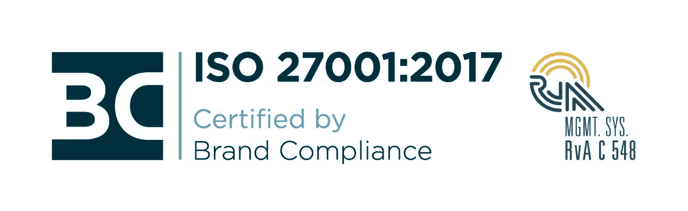

# DataCamp 获得 ISO 27001:2017 认证

> 原文：<https://web.archive.org/web/20221129041328/https://www.datacamp.com/blog/datacamp-awarded-iso-270012017-certification>

DataCamp 很荣幸获得 ISO 27001:2017 认证，这是一项全球信息技术安全标准。这反映了 DataCamp 团队的辛勤工作，以及我们在信息安全领域对最佳实践和高标准的执着追求。

ISO 27001:2017 是国际公认的信息安全标准，规定了信息安全管理系统的要求。为了获得认证，一家公司必须证明它有一个系统的和持续的方法来管理敏感的公司和客户信息。只有经认可的独立审计师才能授予 ISO 27001:2017 认证。DataCamp 的外部审计由[品牌合规部](https://web.archive.org/web/20220627140353/https://brandcompliance.com/en/)进行。

在当今的数字世界中，我们的企业客户理所当然地对信息的可靠性和安全性有了更高的期望。我们希望向我们的客户保证，DataCamp 已经过独立审计和认证，我们的信息安全管理系统符合 ISO 27001:2017。

这一认证不仅是我们骄傲的时刻。这表明我们致力于保护我们的数据和客户数据的机密性、完整性和可用性；以及确保我们系统的稳健性。