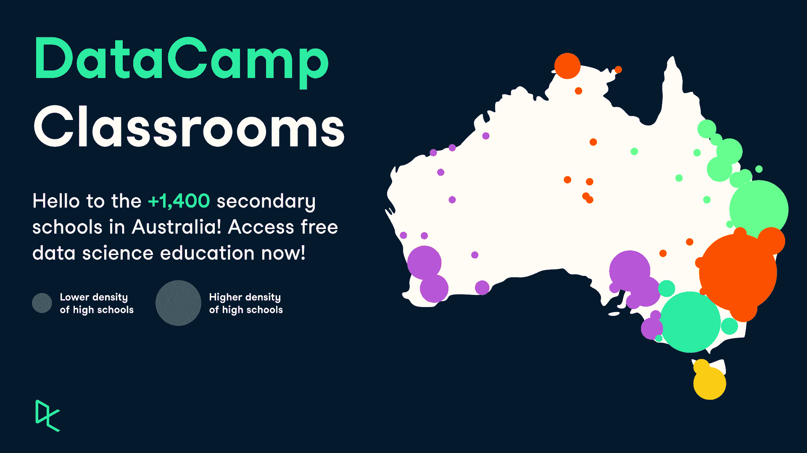

# 数据营教室登陆澳大利亚高中

> 原文：<https://web.archive.org/web/20221129052847/https://www.datacamp.com/blog/datacamp-classrooms-australia>

我们正在为澳大利亚的所有中学教师和学生启动数据营教室。继美国、英国、比利时和波兰之后，我们将推出第五个为所有 16 岁及以上学生提供免费数据科学教育的国家。世界各地的大学教师和学生仍然可以使用 DataCamp 教室。

## 什么是 DataCamp 教室？

DataCamp 教室为教师提供 6 个月的可更新免费访问我们全面的数据科学学习平台的机会。您和您的学生可以访问我们的所有课程和工具，如工作空间、认证和工作，以提高您的学生的职业准备。申请简单快捷。访问[https://www.datacamp.com/groups/classrooms](https://web.archive.org/web/20221212135824/https://www.datacamp.com/groups/classrooms)，点击“创建我的免费课堂”。您将被重定向到页面底部的表单。填写所需信息。确保使用你学校的电子邮件域名和教员网页的链接，证明你是你所指学校的老师。当您的申请被接受后，您的 DataCamp 教室将可以通过您在“组”部分的帐户进行访问。在那里，你可以邀请你的学生加入这个账户，并关注他们在这个学期的进展。

## 为什么是澳大利亚？

DataCamp 的社会影响团队每天都在带头开展 DataCamp 捐赠和课堂项目。我们将活动重点放在大规模推广和交流上，让弱势群体意识到他们可以免费受益的奇妙资源，并发展这些项目。但我们也花时间与这些社区保持直接联系。通过我们的 [【电子邮件保护】](/web/20221212135824/https://www.datacamp.com/cdn-cgi/l/email-protection#88ece7e6e9fcedfbc8ece9fce9ebe9e5f8a6ebe7e5) 电子邮件地址，我们收到了无数关于我们的项目以及人们如何参与其中的请求。我们将每个人都视为独一无二的，并希望为他们提供足够的支持。

两个月前，澳大利亚一所高中的电子教学负责人 David Fenwick 联系我们，询问高中免费使用 DataCamp 的事宜。尽管当时澳大利亚的中学还没有 DataCamp 教室，但这并不意味着我们不会提供帮助。我们收到的每一条消息都是发现我们的社区并让他们参与我们传播免费数据素养教育的使命的巨大机会。要在一所中学启动 DataCamp 教室，我们需要知道该国所有高中的名称和私人电子邮件域。这是我们告诉大卫的。当大卫很快带着需要的数据回来时，我们都很高兴。我们感谢他的支持，并将这篇文章视为向他和所有参与 DataCamp 社区的成员表达谢意的一种方式。我们非常感谢他的支持，并且知道分享他对该计划的参与将激励许多人为我们的使命做出贡献。

## 你们也可以把数据营教室带到你们国家的高中

我们想分享这个故事来激励你用一个简单却极具影响力的行动为你的社区做出有意义的贡献。如果您与我们分享一份 excel 列表，您也可以免费为您所在国家的数百万人推动数据科学教育的民主化:

*   学校名称
*   私人/独特的电子邮件域(gmail，雅虎，hotmail…不接受)
*   +其他可选数据(学校地址、私立或公立……)

这很容易，但对高中生和未来几代人来说也是一种转变。我们已经有许多其他国家将在今年年底公布。然而，你仍然有机会为这个项目做出贡献，并对你的国家产生重大影响。我们缺少许多国家的高中数据。您可以在向全球所有高中推广免费数据科学教育方面发挥重要作用。

请在 [【电子邮件保护】](/web/20221212135824/https://www.datacamp.com/cdn-cgi/l/email-protection#7612191817021305361217021715171b065815191b) 将您的高中名单发送给我们！

## 特别鸣谢

我们要感谢大卫对这个项目的巨大贡献。他提供给我们的列表对我们今天发布的公告产生了重大影响。感谢所有已经在使用 DataCamp 教室的教师和学生，感谢他们帮助我们在全世界传播免费的数据科学教育。点击此处[https://www.datacamp.com/groups/classrooms](https://web.archive.org/web/20221212135824/https://www.datacamp.com/groups/classrooms)了解更多信息并申请 DataCamp 课堂。如果您有任何问题，请访问我们的[常见问题解答](https://web.archive.org/web/20221212135824/https://support.datacamp.com/hc/en-us/articles/4407010316823-DataCamp-Classrooms-Frequently-Asked-Questions#h_01FDWVAV89SDFMQMEGH7M9ZE19)。

