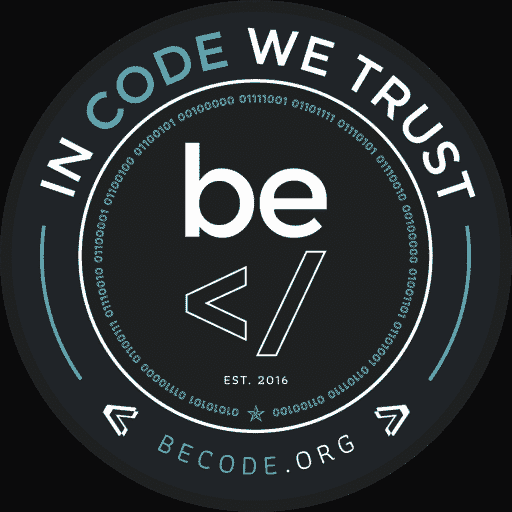
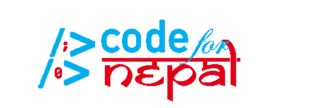
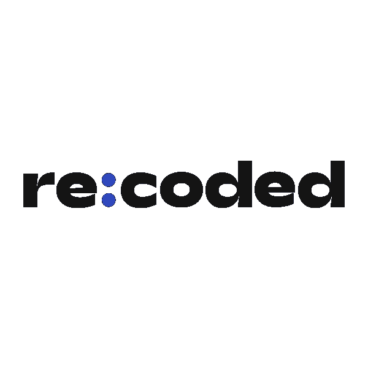
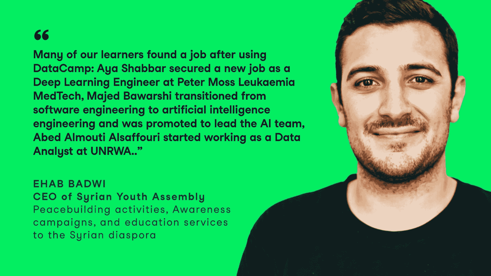
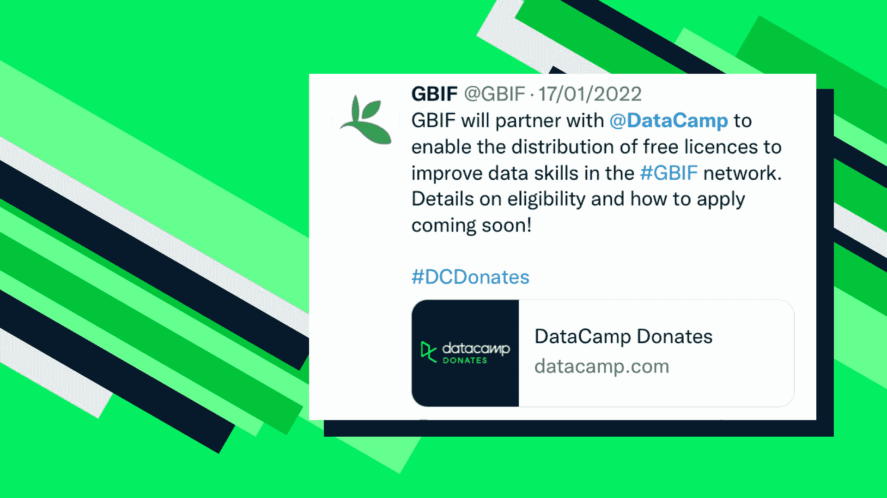
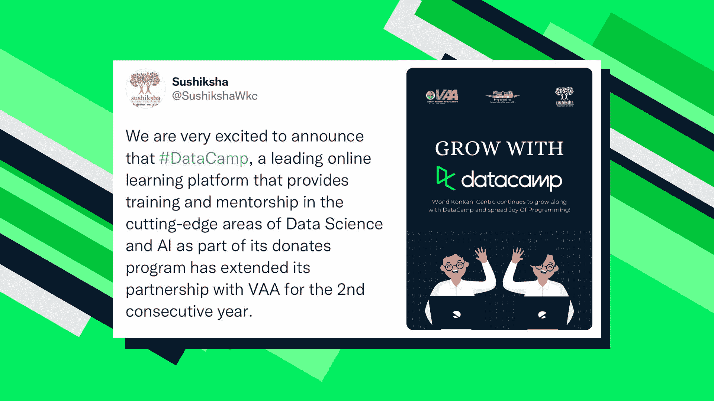
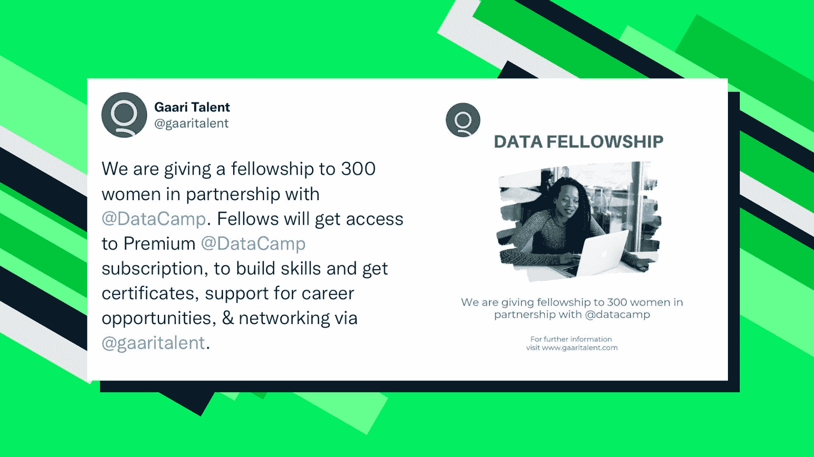
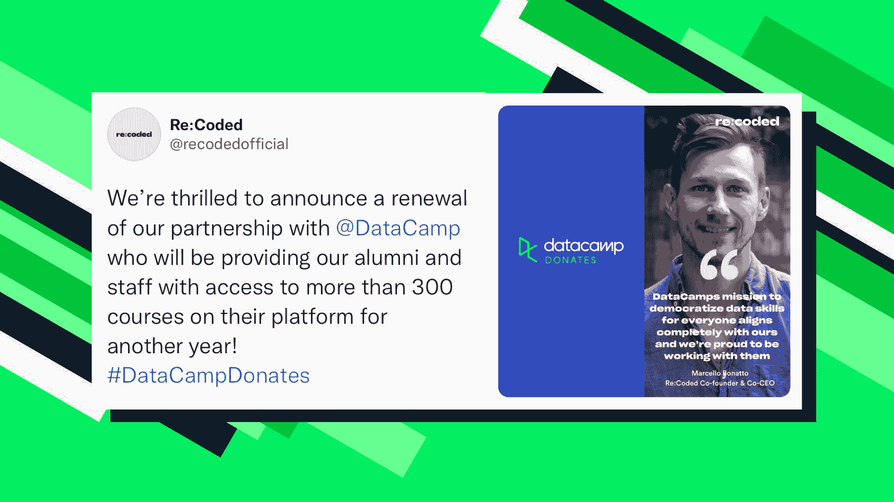
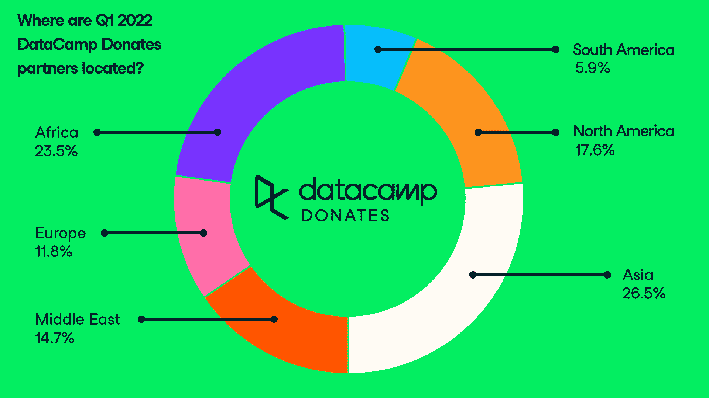

# 数据营捐赠 Q1 2022 文摘

> 原文：<https://web.archive.org/web/20221129041532/https://www.datacamp.com/blog/datacamp-donates-digest-q1-2022>

今年年初是加速 DataCamp 捐赠计划的绝佳时机。事实上，世界慢慢开始从 COVID 中复苏，非营利组织需要额外的支持，以最好地装备他们的员工和成员迎接未来。此外，出现了新的国际紧张局势，DataCamp Donates 希望支持直接参与全球人道主义救援的新合作伙伴。

### 新的合作伙伴和许可证:打破记录

在 Q1 2022 中，我们加入了 32 家组织，这是有史以来单季度加入 DataCamp 捐赠的合作伙伴组织数量最多的一次。

我们自豪地欢迎了 29 位新面孔和 4 位回归的合作伙伴:

*   总计超过 4500 个许可证
*   与 2021 年第四季度相比，许可证数量增加了 74%。

| **归来的伙伴** |
|  |  |  |
| **新伙伴** |
| **[180 度咨询](https://web.archive.org/web/20220705181712/https://180dc.org/)** | **[后鲁汶](https://web.archive.org/web/20220705181712/https://www.aftleuven.be/)** | **[【巴西课件】](https://web.archive.org/web/20220705181712/https://brasilcursinhos.org/)** |
| **[码社@ VCE](https://web.archive.org/web/20220705181712/https://vvce.ac.in/student-clubs/code-club/)** | **[代号](https://web.archive.org/web/20220705181712/https://www.codekevudah.org/)** | **[数据点亚美尼亚](https://web.archive.org/web/20220705181712/https://datapoint.am/)** |
| **[快速数据科学社](https://web.archive.org/web/20220705181712/https://www.linkedin.com/company/fdssisb/)** | **[弗雷德·布兰登火焰基金会](https://web.archive.org/web/20220705181712/https://fbflamesfoundation.org/)** | **[Gaari 天赋](https://web.archive.org/web/20220705181712/http://www.gaaritalent.com/)** |
| **** | **[这一来学院](https://web.archive.org/web/20220705181712/https://galcollege.org.il/)** | **[GDSC](https://web.archive.org/web/20220705181712/https://gdsc.community.dev/fast-national-university-nuces-karachi-campus/)** |
| **** | **[GDSC](https://web.archive.org/web/20220705181712/https://widscr.com/)** | **[GDSC](https://web.archive.org/web/20220705181712/https://gdsc.community.dev/obafemi-awolowo-university/)** |
| **[GDSC 图普马尼拉](https://web.archive.org/web/20220705181712/https://gdsctup.com/)** | **[海天教育&领导力项目](https://web.archive.org/web/20220705181712/http://www.uhelp.net/)** |  |
| **[哈佛广场数据分析集团](https://web.archive.org/web/20220705181712/https://www.harvardanalytics.org/)** | **[【激励一代人与人性支持基金会】非洲](https://web.archive.org/web/20220705181712/http://www.ighusufafrica.org/)** | **[它步柬](https://web.archive.org/web/20220705181712/https://cambodia.itstep.org/news-en/powerup-cambodia)** |
| **[朝鲜科学文化教育社团联合会](https://web.archive.org/web/20220705181712/https://cafe.naver.com/kosce)** | **[妈妈们码社区](https://web.archive.org/web/20220705181712/https://mumswhocode.net/)** | **[PyData 内罗毕](https://web.archive.org/web/20220705181712/https://www.meetup.com/PyData-Nairobi/)** |
|  | **[图灵俱乐部](https://web.archive.org/web/20220705181712/https://theturingclub.in/)** | **[WiDS 哥斯达黎加](https://web.archive.org/web/20220705181712/https://widscr.com/)** |

### 他们对我们的评价:给予的艺术

#### GBIF

我们很荣幸与全球生物多样性信息中心 GBIF 合作，帮助他们的成员成为数据专家。一个由世界各国政府资助的组织，旨在提供关于地球上所有类型生命的数据的方便和开放的访问。他们的任务一年比一年更加重要，全球变暖的后果也更加明显。

#### subhiksha

[Sushiksha](https://web.archive.org/web/20220705181712/https://sushiksha.konkanischolarship.com/) 为刚开始职业生涯的康卡尼学生提供支持。康卡尼人是印度的一个少数民族语言群体。我们很高兴能帮助他们的社区取得成功，最终让他们的文化在他们的国家和世界范围内得到更多的关注。

#### Gaari Talent

[Gaari Talent](https://web.archive.org/web/20220705181712/https://gaaritalent.com/) 赋予索马里妇女数据科学技能，使她们融入国家劳动力队伍，并帮助她们突破就业玻璃天花板。索马里妇女从事全职工作的可能性比索马里男子低七倍。她们仅占索马里劳动力的 31%,相比之下，撒哈拉以南非洲地区妇女的平均比例为 45%。由于 DataCamp，Gaari Talent 向索马里妇女提供了数百份数据奖学金，并与乐施会合作，向这些妇女提供免费电脑。

#### 回复:编码

[Re:coded](https://web.archive.org/web/20220705181712/https://www.re-coded.com/) 始于 2016 年，数百万伊拉克人因 ISIS 的崛起而流离失所，住进难民营。他们组织了一个编码训练营来培训伊拉克人，提高他们在东道国的就业能力。今天，他们扩展到也门和土耳其，95%的成员在完成他们的数据科学计划后找到了工作。DataCamp 很荣幸第二年与 Re:coded 合作，帮助他们支持全球数百名校友。

### 国际扩张:说“嗨！”去 3 个新的国家

DataCamp Donates 尽可能广泛地传播其根基，因为数据科学挑战现在在全球范围内变得更加相关，因为我们应该致力于平等地为每个国家服务。在 Q1 2022 年，我们迎来了来自 22 个不同国家的组织，而捐赠计划首次在 3 个新国家开展:索马里、哥斯达黎加和亚美尼亚。

DataCamp Donates 目前在 90 多个国家开展业务。

### 接下来会发生什么？将 DataCamp 捐赠的影响力提升到 Q2 的新高度

#### 支持乌克兰难民

自俄罗斯入侵乌克兰以来，DataCamp 的社会影响小组一直在加倍努力，与向乌克兰难民提供直接支持的主要组织合作。

我们很高兴与世界领先的人道主义救援组织之一的直接救援组织合作。迄今为止，直接救济已经为乌克兰难民提供了价值超过 2 亿美元的医疗和必需品。 [DataCamp 将使直接救援的团队能够提高救援和反应的准确性和有效性](https://web.archive.org/web/20220705181712/https://www.datacamp.com/blog/datacamp-donates-spreads-data-literacy-to-help-the-most-vulnerable-with-direct-relief)。

我们不会就此止步。我们已经与其他应该欢迎乌克兰难民的非营利组织建立了合作伙伴关系，如 Niya 和 PowerCoders，以及欧洲教师的其他私人努力。此外，由于波兰欢迎大部分乌克兰难民，我们优先考虑将 [DataCamp 用于波兰所有中学的教室](https://web.archive.org/web/20220705181712/https://www.datacamp.com/blog/datacamp-for-classrooms-is-now-free-to-polish-secondary-school-teachers-and-students)，并自豪地宣布，自 2022 年 5 月 8 日起，所有波兰高中和大学的教师和学生都可以免费访问 DataCamp。

#### 申请延期至 2022 年 5 月 31 日

DataCamp 捐赠申请截止日期延长至 2022 年 5 月 31 日！全世界的非营利组织都有资格免费使用 DataCamp。成为当地英雄倡导全民数据扫盲并加入全球数据营社区捐赠合作伙伴，如直接救济、CDP、叙利亚青年大会、护理权利、数据中的妇女、海地教育和领导计划等。

现在就在这里申请:[https://www.datacamp.com/donates/apply](https://web.archive.org/web/20220705181712/https://www.datacamp.com/donates/apply)，或者通过 [【电子邮件保护】](/web/20220705181712/https://www.datacamp.com/cdn-cgi/l/email-protection#2c4843424d58496c484d584d4f4d415c024f4341) 联系我们，这样我们可以帮助您并回答您可能有的任何问题。