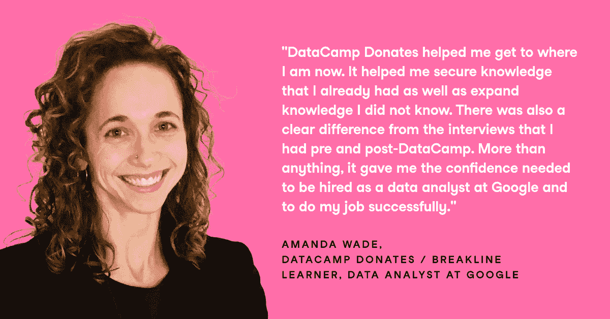

# DataCamp 捐赠是向数据分析师职业过渡的最佳方式

> 原文：<https://web.archive.org/web/20221129041532/https://www.datacamp.com/blog/datacamp-donates-is-the-best-way-to-transition-into-a-data-analyst-career>

尽管年轻的专业人士被告知这些花言巧语，职业道路和面试过程是最远离线性的事情。这更像是第一次坐过山车:充满了曲折、急转弯、山丘、令人惊讶的大落差和环路，有时会让我们回到起点。这适用于我的职业道路和我在过渡到科技行业时面临的求职过程，但在 Breakline 和 DataCamp 捐赠的帮助下，旅程似乎顺利得多。

研究生一毕业，我就开始了金融职业生涯，这个领域对我来说是陌生的，超出了我以为大学毕业后等待我的范围。市场运行的方式毫无意义，我总是想象华尔街只对极其富有的人开放。我尽了最大努力来运用我的数学和编程技能，但总是不满意，不被赏识，也不承担我的责任。这对我投入的时间和精力几乎没有影响，所以我决定重新开始找工作。

LinkedIn 和我建立的个人关系是我在数据科学领域确定职位的第一选择。定量分析和数据科学之间的联系似乎是合乎逻辑的。几个月过去了，数百份申请都没有回音，我越是看不到任何希望，就越是绝望地想要找到一份工作。直到有一天，暴线教育的一名代表向我介绍了他们的项目，该项目帮助女性、POC 和退伍军人将职业生涯转移到科技行业。隔断线帮助你写简历，执行完美的电梯推销，回答行为问题，谈判工资，等等，来描绘你的技能如何符合工作描述的画面。这个令人惊叹的项目增加了我进行对话和进入面试的信心，但对我来说最大的困难是面试的技术筛选和案例研究部分。

拥有数学学位，人们会认为我不会害怕技术问题，但当我面对技术筛选时，面试官会问我:“1+1 是什么？”经过一番摸索后，我的答案是三。无论我做了多少练习题，读了多少书，看了多少视频，似乎都没有帮助或给我信心在这一阶段取得成功。在表达了这些担忧之后，Breakline 与 DataCamp Donates 合作，为其参与者提供免费访问这个在线平台的机会，我是第一批获得访问权的人之一。

从第一天起，我就迷上了数据营，因为我有太多的活动可以选择:课程、评估和项目。职业生涯让我致力于构建和巩固我的 R 和 SQL 知识，同时提高我的 Python 技能。每天，当我坐在沙发上，和我的伴侣一起看电视时，我会把我的笔记本电脑放在我的膝盖上，花一个或四个小时进行编码。晚上躺在床上，我会在手机应用程序上完成多项选择知识练习。该平台使学习变得有趣和互动，与我尝试过的其他项目相比，它通过慢慢增加练习题的难度来让你进行批判性思考。

增加我的知识很重要，因为我是终身学习的倡导者，而排行榜更是激励我这样做的原因。一旦我找到了排行榜，我的竞争天性就爆发了，我需要粉碎竞争。在学习成为一名成功的数据科学家所需的技能的同时，参加比赛并保持领先是一件非常有趣的事情。这让我对自己的能力更加自信。我为接下来的技术面试做好了准备。对我来说幸运的是，这次面试是在谷歌，一家我对有机会为之工作感到兴奋的公司，但实际为之工作的前景似乎难以置信。

随着面试的临近，DataCamp 继续很好地为我服务。我练习统计测试和机器学习算法，以确保我的假设检验、p 值、对数回归和 k 均值聚类的知识在我的头脑中根深蒂固。对于我知道我将在面试中面对的案例研究来说，无指导案例研究是极好的练习。这些作业有助于确保我的 R 和 SQL 知识为技术筛选做好准备。我准备好了，有史以来第一次，我走出面试时没有感到失败的恐惧，而是胜利了，因为我尽了最大努力来展示我的技能。DataCamp 帮助我在面试中感到自信，当我开始在谷歌工作时，它继续帮助我取得成功。无论我的职业道路接下来会把我带到哪里，我知道我会有 DataCamp 作为辅助工具，帮我度过过山车。