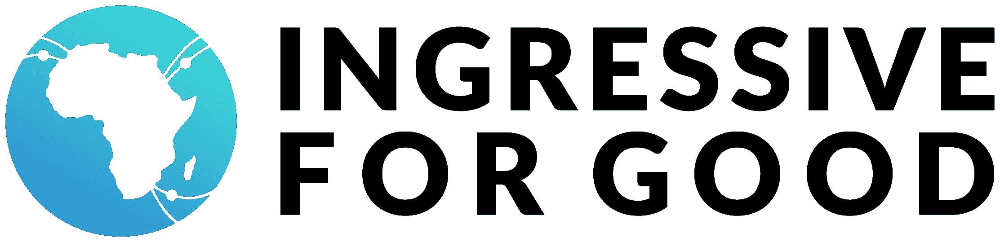
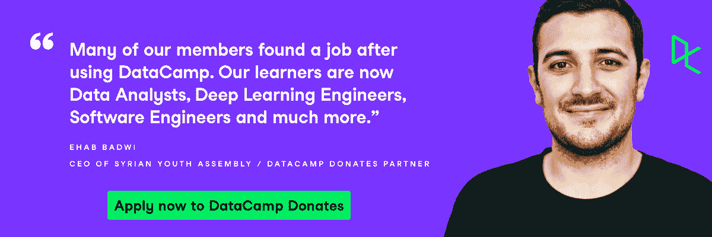

# 数据营捐赠 Q2 2022 文摘

> 原文：<https://web.archive.org/web/20221129035725/https://www.datacamp.com/blog/datacamp-donates-q2-2022-digest>

随着今年第二季度的结束，DataCamp 与新老合作伙伴的捐赠继续保持强劲势头。我们欢迎 25 个新的非政府组织加入该计划，以及 11 个熟悉的非政府组织，他们非常愿意重新点燃自己的使命，向其成员传播数据素养。总的来说，我们已经加入了 36 个组织，这是 DataCamp 捐赠计划的季度最高纪录。

说到季度新高，仅在 2022 年的 Q2，我们向有需要的人提供的许可证就超过了 DataCamp 捐赠计划第一年的总数！这要感谢我们出色的合作伙伴。

| [阿杜尼数据](https://web.archive.org/web/20220818194809/https://adunni.org/) | [加纳的 AIESEC](https://web.archive.org/web/20220818194809/https://aiesecgh.net/) | [应用数学&数据科学俱乐部 FTU2](https://web.archive.org/web/20220818194809/https://mdsftu2.com/?fbclid=IwAR0jLMG_LsRypdfEku6wDU0rsVoCqkQtoSdSDv0QvqVUBQ4Wt2t1DiD6Uv8) | [明爱](https://web.archive.org/web/20220818194809/https://www.caritas.org/) | [伤害预防中心&控制(CIPC)](https://web.archive.org/web/20220818194809/https://smhs.gwu.edu/reaganinstitute/injury) |
| [百合文化中心和 edilbot montemayor segue](https://web.archive.org/web/20220818194809/https://centroculturallems.com/) | [直接卸压](https://web.archive.org/web/20220818194809/https://www.directrelief.org/) | [EnFocus](https://web.archive.org/web/20220818194809/https://en-focus.org/) | [Fiuba 咨询俱乐部](https://web.archive.org/web/20220818194809/https://www.fiubaconsultingclub.com/) | [Fundapi](https://web.archive.org/web/20220818194809/https://www.fundapi.org/) |
| [巴赫利亚大学谷歌开发者学生俱乐部](https://web.archive.org/web/20220818194809/https://gdsc.community.dev/bahria-university-islamabad-campus/) | 突尼斯的 GDSC 国家工程学院 | [GDSC 黎巴嫩大学](https://web.archive.org/web/20220818194809/https://gdsc.community.dev/lebanese-university-faculty-of-sciences/) | [GDSC 维多利亚大学](https://web.archive.org/web/20220818194809/https://gdsc.community.dev/the-virtual-university-of-pakistan-islamabad-campus/) | [一代英国](https://web.archive.org/web/20220818194809/https://uk.generation.org/) |
| Pathcehck 基金会全球健康研究所 | [获奖者科学创新与教育中心](https://web.archive.org/web/20220818194809/https://ds361x.editorx.io/ebonyilaureates) | [MLSA 苏库尔律师大学](https://web.archive.org/web/20220818194809/https://www.linkedin.com/company/mlsc-sibau/) | [尼娅](https://web.archive.org/web/20220818194809/https://niya.ai/) | [QSIDE 研究所](https://web.archive.org/web/20220818194809/https://qsideinstitute.org/) |
| 印度尼西亚 RISTEK Fasilkom 大学 | 释迦牟尼 | [技能实验室](https://web.archive.org/web/20220818194809/https://skilllabasia.com/) | [STEM 教育学院](https://web.archive.org/web/20220818194809/http://www.stemeducationalinstitute.org/about-us.html) | [菲律宾大学统计学会](https://web.archive.org/web/20220818194809/https://upstatsoc.wixsite.com/upstatsoc?fbclid=IwAR2AfPTuj7t_2ivUGKnfYMmCJk8efJ9RHECFK38tBr7uoUhe6tkxjkgqHNM) |

**回归合作伙伴:让数据科学教育更上一层楼**

| **** |

| [贝鲁特艾](https://web.archive.org/web/20220818194809/https://beirutai.org/) | [CDP](https://web.archive.org/web/20220818194809/https://www.cdp.net/en) | [为妇女基金会](https://web.archive.org/web/20220818194809/https://www.ftwfoundation.org/) | [GDSC 费聿锋大学](https://web.archive.org/web/20220818194809/https://gdsc.community.dev/dha-suffa-university/) | [GDSC·赫尔万](https://web.archive.org/web/20220818194809/https://gdsc.community.dev/helwan-university/) |
| [陪同人员](https://web.archive.org/web/20220818194809/https://minders-fci.org/minders) | [功率编码器](https://web.archive.org/web/20220818194809/https://powercoders.org/) | [她代号非洲拉各斯大学](https://web.archive.org/web/20220818194809/http://shecodeafrica.org/) | [叙利亚青年大会](https://web.archive.org/web/20220818194809/https://www.syrian-youth.org/) | [Z 轴](https://web.archive.org/web/20220818194809/https://zaxis.ge/) |

在 Q2 会议结束时，我们有 122 个活跃的合作伙伴组织，使用了 32，000 个许可证！这表明 DataCamp 捐赠继续增长，并为数据扫盲建立了一个更广泛的社区。没有他们的帮助，扩展到世界的不同角落是不可能的，因此我们要感谢每一个合作伙伴在向他们的学习者传播高质量数据科学教育方面发挥的独特作用。

但是这还不是全部！我们与世界各地的社区建设组织的合作并不仅限于发放许可证。随着这些许可证的使用，我们也取得了巨大的成功，看到了成功故事的实现。

**合作伙伴亮点-值得期待的一年**

***RISTEK Fasilkom UI***

Ristek Fasilkom UI 是印度尼西亚大学的学生组织，从 1989 年开始培养学生对科学技术的兴趣。多年来，他们开发了大量的项目组合，因为他们的价值观是通过创新和包容来创造影响。作为我们在印度尼西亚的第一个学生组织，我们非常高兴能够帮助该组织的学生学习所有关于数据科学的知识，为他们未来的职业生涯做好准备。

***Fiuba 咨询俱乐部***

Fiuba Consulting Club 是一家由来自阿根廷布宜诺斯艾利斯的学生和应届毕业生创办的组织，旨在弥合理论与实践之间的差距。他们利用咨询的概念，使学生更接近现实世界的问题，并鼓励他们跨学科和创造性地解决这些问题。我们很高兴与他们合作，帮助这些学生提高数据科学技能。哦，我们很高兴通过这次合作来到阿根廷！

***技能实验室***

来自尼泊尔的 Skill Lab 旨在通过提高大学生的技能、技能或再技能来开发他们的潜力，并缩小学术界和产业界的差距。他们通过为不同类型的工作角色提供高水平的实践培训，并在此过程中整合必要的软技能，来发展学生的技能。我们期待着这一合作伙伴关系带来更多令人兴奋的故事，因为我们的目标是为他们的成员提供必要的数据技能。

**为 12，000 名非洲年轻人提供改变人生的数据营奖学金**

Q2 2022 成为我们迄今为止最好的一个季度的一个重要原因是我们与我们在 [的朋友们重新建立了最富有成效的合作伙伴关系，这是对](https://web.archive.org/web/20220818194809/https://www.datacamp.com/blog/empowering-more-than-12000-young-african-with-a-data-science-scholarship) 的一种永远的侵蚀。I4G 引领了新一代以数据为中心的非洲人。通过向超过 12，000 名非洲人颁发 DataCamp 捐赠奖学金，来自非洲各地的成员可以免费访问 DataCamp，开始学习更多关于数据科学的知识。我们被 I4G 团队和他们所有的学习者带给这项变革计划的热情所震撼。 [在这里阅读全文](https://web.archive.org/web/20220818194809/https://www.datacamp.com/blog/empowering-more-than-12000-young-african-with-a-data-science-scholarship) ！

**每天一台笔记本电脑，消除技能差距——data camp 向 STEM 教育学院捐赠笔记本电脑**

虽然随着我们在该计划中的发展，我们向外看，但我们永远不会忘记我们办事处所在国家的合作伙伴——美国、英国和比利时。社会影响团队和其他 DataCampers 成员一起，自愿抽出时间，用我们捐赠的笔记本电脑指导纽约 STEM 教育学院的学生，帮助这些孩子在 DataCamp 中学习。请继续关注关于这一合作关系的更多令人兴奋的消息！

*data camp 的社会影响经理 Nathaniel Taylor-Leach 与 Nikisha 和 Franz Alcindor 一起，他们收到了为参加 STEM 教育学院的哈莱姆青少年捐赠的 20 台笔记本电脑。*

谁在统治世界？哥斯达黎加教数据科学的女孩！

哥斯达黎加数据科学妇女组织的成员通过使用 DataCamp，帮助大学和高中学生为下一代女性数据科学家提供适当的教学和工具，以迎接数据驱动的未来。在他们的帮助下，哥斯达黎加妇女有希望获得更好的就业机会。在这里阅读更多关于 [的文章！](https://web.archive.org/web/20220818194809/https://www.datacamp.com/blog/how-datacamp-donates-is-helping-young-women-in-costa-rica-engage-in-data-science)

**芝加哥高中的优等生通过格林伍德项目学习数据科学，为未来的金融科技职业做准备**

来自绿林项目的金尤美·a 凭借她在数据营学习的经验，获得了一份金融服务行业的实习工作。格林伍德项目是一个非营利组织，旨在通过与公司合作，找到招聘、保留和晋升的公平解决方案，为黑人和拉丁裔学生创造职业道路。 看她有什么要说的！

**DataCamp 教室再次扩展到更多的高中**

DataCamp 致力于最大限度地利用一切机会，为学校提供最好的数据科学教育和通往成功的自然之路。在短短一年多的时间里，我们为美国、英国、比利时和(最近)波兰的高中教师提供了 130 多间免费的 DataCamp 教室。

自大规模乌克兰难民危机以来，波兰接收了大量寻求庇护的难民。在这些寻求庇护者(尤其是年轻人)规划自己的未来之路时，让他们掌握正确的技能和资源是确保他们获得所需成功的一个好方法。我们一直在寻找各种方法，在不增加全球教育成本的情况下，为人们提供 DataCamp 捐赠等机会。

**今天就申请 DataCamp 捐赠，成为你所在社区的英雄**

如果您有兴趣加入日益壮大的合作伙伴社区，他们都分享为每个人民主化数据技能的相同阶段，请查看我们的 DataCamp 捐赠页面 [此处](https://web.archive.org/web/20220818194809/https://www.datacamp.com/donates) 。非营利组织有资格获得一年免费访问 DataCamp 的机会，并使其弱势群体能够在我们这个数据驱动的世界中竞争、合作和创造。

代表 https://www.datacamp.com/donates/apply的非政府组织立即申请，或通过 [【电子邮件受保护】](/web/20220818194809/https://www.datacamp.com/cdn-cgi/l/email-protection#9cf8f3f2fde8f9dcf8fde8fdfffdf1ecb2fff3f1) 联系我们，以便我们可以帮助您解决任何问题。您的数据科学之旅只是一个开始。那里见！

