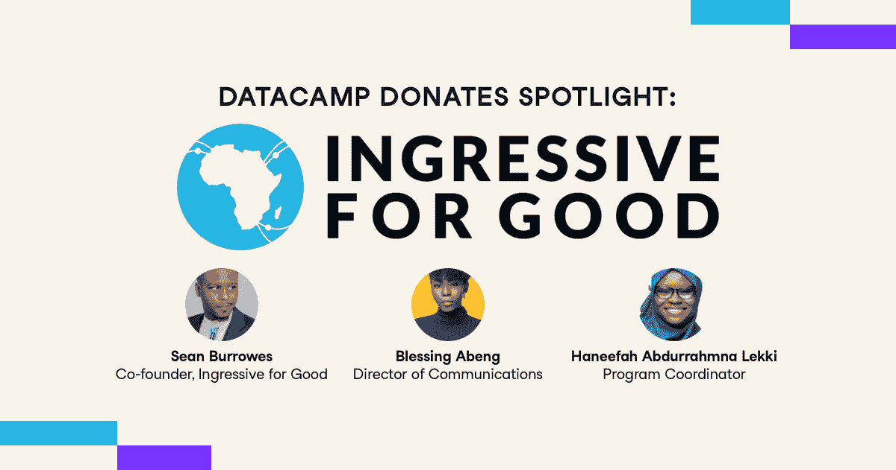

# DataCamp 捐赠聚光灯:积极进取

> 原文：<https://web.archive.org/web/20221129033105/https://www.datacamp.com/blog/datacamp-donates-spotlight-ingressive-for-good>

我们非常感激[菲利克斯·阿尤拉](https://web.archive.org/web/20221212135912/https://www.datacamp.com/community/blog/felix-ayoola)给我们介绍了《永远的入侵》(I4G)。我们很荣幸能够帮助 I4G 实现其培训 100 万非洲青年并帮助 5000 人找到工作的使命。

### 你能描述一下你作为 DataCamp 捐赠合作伙伴的经历吗？

Sean Burrowes，联合创始人:I4G 与 DataCamp 建立了合作关系，为我们的社区提供他们的平台。这个过程非常棒。我对 DataCamp 的高度参与印象深刻。对数据营奖学金的需求甚至超过了我们最大胆的估计。这就是为什么我们非常感谢 DataCamp 将他们的承诺从 1，500 个许可证增加到 6，000 个。我希望其他 edtech 公司注意到贵公司的极端慷慨及其产生的巨大积极影响。

祝福传播总监阿本:已经很神奇了。这种合作是天衣无缝的。这个过程非常简单明了。

项目协调员 Haneefah Abdurrahmna Lekki:我们可以很容易地跟踪成员的学习进度。考虑到许多人因为新冠肺炎疫情而失业，DataCamp 的捐赠来得正是时候。我们在科技界的许多社区成员需要提升他们的技能或者完全学习新的技能。

### 您的社区成员如何看待 DataCamp？

巴:大多数人通过电子邮件和社交媒体分享惊人的反馈。他们太棒了。大多数人都非常满意。

### 您如何评价他们与 DataCamp 的合作？

哈尔:非常好的婚约。

巴:甚至可以说是非同寻常。

### DataCamp 将数据教育民主化的使命如何与贵组织的目标相契合？

HAL:数据在跟踪我们的目标和成功率方面一直很重要。这完全符合我们的目标和目的。

巴:是的。我们都相信，为了更安全的未来，每个人都应该获得高质量的教育和数据技能发展。特别是，我们的目标是让有需要的非洲年轻人掌握技术技能，帮助他们影响和促进非洲的社会和经济发展。通过我们与 DataCamp 的合作，对技术感兴趣的年轻人现在可以获得由行业专家策划的专业技能和职业学习课程，以帮助他们提高数据技能，并向技术职业迈出下一大步。

SB:数据是新的石油。这将使我们能够为未来的技术和第四次工业革命定位我们的非洲技术人员社区。

### 这种合作关系对您的组织有什么好处？

SB:它增加了社区内的整体参与度和可货币化的技能组合。

巴:这种伙伴关系帮助我们的社区成员提高了技能，这以其自己的方式帮助我们增加了非洲青年的赚钱能力。

### 你如何看待 DataCamp 上的学习体验？

哈尔:我喜欢用户界面。它非常容易导航。

巴:超级有效。我们的许多社区成员已经在实施 DataCamp 并练习新技能。他们获得了自信来推销自己的工作。

### 使用 DataCamp 与面对面教育相比如何？

巴:只要你下定决心去做，效果是一样的。

### DataCamp 上最有用的功能和工具是什么？

巴:[手机 app](https://web.archive.org/web/20221212135912/http://datacamp.com/mobile) 无缝。我也喜欢[引导和非引导项目](https://web.archive.org/web/20221212135912/http://datacamp.com/projects)。

### 到目前为止你最喜欢的课程是什么？

BA: [电子表格中的财务分析](https://web.archive.org/web/20221212135912/https://learn.datacamp.com/courses/financial-analytics-in-spreadsheets)。互动性超强。

### 你会向其他非政府组织推荐 DataCamp 吗？

哈尔:当然。DataCamp 是全球社区成员学习和提升技能的绝佳平台。

巴:是的。DataCamp 是一个拥有优秀员工的组织，他们会竭尽全力确保高效入职。他们的流程旨在确保两个组织的成功。

是的，我会的。DataCamp 团队太棒了。他们为你提供支持和激情，让你感受到自己的价值。社会影响可能是一个艰难的空间，DataCamp 捐赠无疑使支持那些最需要它的人变得更加容易！

DataCamp 向非营利组织、公立学校和政府机构捐赠合作伙伴，为弱势群体提供一年的免费 DataCamp。[我们最近承诺捐赠 25，000 份订阅](https://web.archive.org/web/20221212135912/https://www.datacamp.com/community/blog/datacamp-donates)，许多订阅仍然可用！如需代表组织申请，请通过 [【邮件受保护】](/web/20221212135912/https://www.datacamp.com/cdn-cgi/l/email-protection#4d2922232c39280d292c392c2e2c203d632e2220) 向团队发送邮件。有关更多信息和资格要求，请查看我们的[常见问题](https://web.archive.org/web/20221212135912/https://support.datacamp.com/hc/en-us/articles/360051596574)。