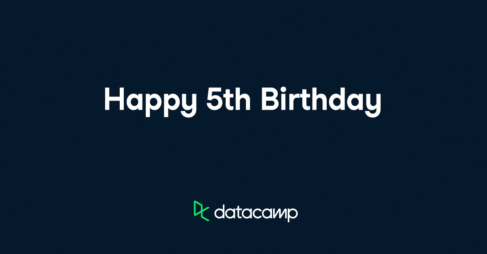
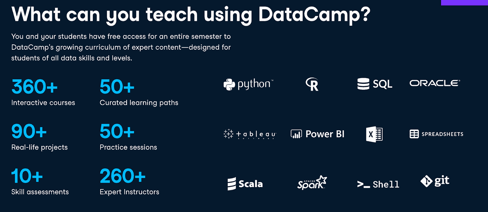
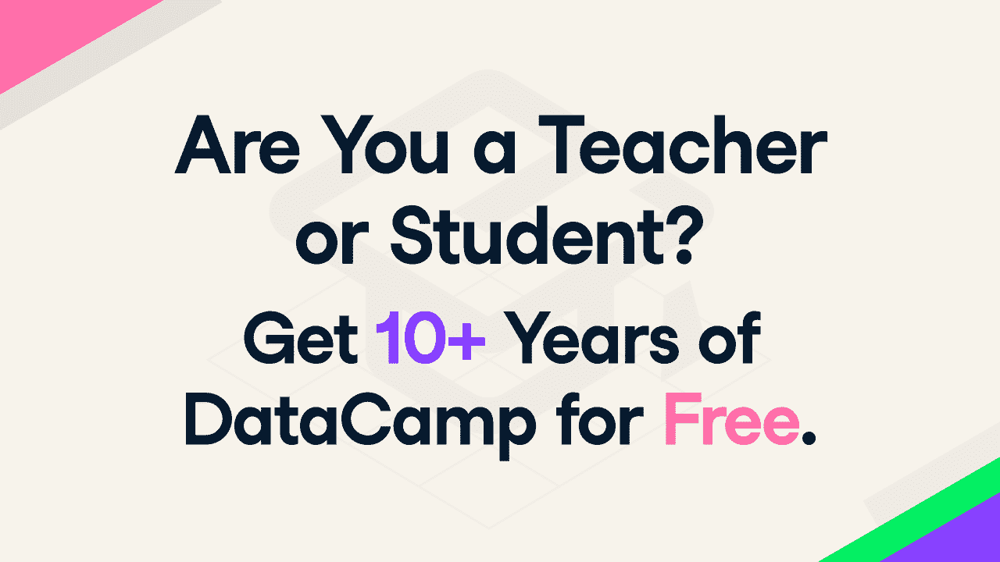

# 课堂数据营现在对比利时中学教师和学生免费开放

> 原文：<https://web.archive.org/web/20221129050302/https://www.datacamp.com/blog/datacamp-for-classrooms-is-now-free-to-belgian-secondary-school-teachers-and-students>

当我们敞开心扉去建立一个社区时，在短短的五年里我们所能取得的成就是惊人的。例证:我们现在已经向全球超过 650，000 名教师和学生提供了免费的数据科学教育。这相当于 30 多个麦迪逊广场花园或 O2 体育场的容量(或者 15 个国王巴多因体育场，对于我们在比利时的朋友来说)。

## 比利时所有中学教室的数据营

说到比利时，我们将[教室数据营](https://web.archive.org/web/20221212135819/https://www.datacamp.com/groups/classrooms)带到了它的中学！现在，比利时的任何高中教师都可以快速、轻松地申请教室数据营，获得批准后可以免费使用我们的整个课程六个月([包括 Tableau！并邀请他们所有的学生来参加这个有趣的活动。](https://web.archive.org/web/20221212135819/https://www.datacamp.com/blog/datacamp-and-tableau-partner-to-teach-young-people-data-visualization "DATACAMP FOR CLASSROOMS DataCamp and Tableau Partner to Teach Young People Data Visualization")

除了世界各地的学院和大学之外，DataCamp for Classrooms 现在还可以在 DataCamp 设有办公室的每个国家的高中使用:美国、英国，现在是比利时。我们期待将这一服务扩展到全球更多的中学教师和学生。我们的社会影响团队目前正在努力将我们的平台扩展到乌克兰和邻国正在处理难民危机的中学。

## 如何申请

如果你在这些国家的 32，000 多所高中中的一所教书，你和你的学生可以免费访问 DataCamp 提供的所有内容。[课堂数据营你已经覆盖了](https://web.archive.org/web/20221212135819/https://www.datacamp.com/groups/classrooms)。您可以在浏览器中学习数据科学概念，并将其应用于个人或学校计算机上的真实数据集，而无需下载任何软件。我们有没有提到你也不需要信用卡？[用你学校的电子邮件地址在五分钟内申请](https://web.archive.org/web/20221212135819/https://www.datacamp.com/groups/classrooms)。

没错，这不是免费试用。我们不希望教师或学生为数据营自掏腰包。现在不会，以后也不会。我们认为教育是一项基本人权。这就是为什么教师可以每六个月向 DataCamp 重新申请教室，以更新访问权限。我们永远不会向他们要信用卡。不仅如此，他们可以接触到无限量的学生。*

老师们——不要等到秋季学期才开始为数据驱动的未来训练自己。[今天就向 DataCamp 申请教室](https://web.archive.org/web/20221212135819/https://www.datacamp-staging.com/groups/classrooms#academic_form)开始学习！只要你是中学、学院或大学的合格教师，DataCamp 将为你和你的年轻学者的整个学术生涯提供支持。

**

**学生必须年满 16 岁才能在 DataCamp 上注册帐户。在美国，13 至 15 岁的学生，一旦他们的老师得到学生家长或监护人的书面同意，就可以创建免费的数据营账户。很抱歉，12 岁及以下的学生目前无法在 DataCamp 上创建帐户。*