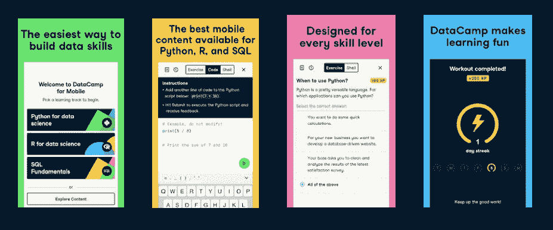

# 移动数据营:最佳移动编码

> 原文：<https://web.archive.org/web/20221129034451/https://www.datacamp.com/blog/datacamp-for-mobile-mobile-coding-at-its-best>

## 我们的移动应用程序已经改头换面了！

DataCamp Mobile 拥有全新的、经过改进的用户体验。移动学习不再是完成为台式电脑设计的完整课程，而是围绕课程进行组织，所以你一眼就能看到你将学到什么。即使你只有五分钟的空闲时间，你也能衡量自己取得了多大的进步。这对于学习者的动机是一个很大的进步，因为你可以用更短的单元取得进步。

我们已经推出了一系列关于 SQL、R 和 Python 的新课程，包括 SQL 入门和 R 入门的完整教程。

[https://web.archive.org/web/20220524175951if_/https://www.youtube.com/embed/dir9FHN80ag](https://web.archive.org/web/20220524175951if_/https://www.youtube.com/embed/dir9FHN80ag)

## 在您的移动设备上运行真实代码

我们的移动课程给你完整的编程体验——它们完全等同于我们的官方课程。当您打开移动应用程序时，您将访问完整的编辑器，我们将启动一个服务器，让您运行真正的代码并看到真正的结果。你在手机上编写代码是为了获得完全交互的体验——这不仅仅是多项选择。在移动优化代码编辑器(包括自动完成)的帮助下，移动学习从未如此有效。

> 最后，一个真正让编码变得有趣的应用。—Navistonv

## 从任何地方无缝学习

现代学习需要灵活性和便利性，这正是我们独立的移动应用程序所能提供的。通过 DataCamp for Mobile，我们提供了一个全面的学习解决方案。DataCamp 课程的所有进度都会无缝同步到您的帐户。你可以在你的桌面上开始一门课程，然后在我们的移动应用程序上重新开始。这是一种真正移动友好的学习方式。

> 现在事情应该这样做！—pyggh

## 保持技能敏锐的有趣方法

熟能生巧，你会想养成锻炼新技能的习惯。这就是我们将学习游戏化的原因，这样学习就不会像工作一样。您将积累经验点并获得实时反馈。挑战你的朋友或同事，看看你能持续学习多少天。

> 出色的移动实践。—灰色 0417

## 开始

[开始使用移动设备](https://web.archive.org/web/20220524175951/https://datacamp.app.link/MKQyDIGRabb)我们的 Python 数据科学家、R 数据科学家和 SQL 基础课程，更多课程即将推出！

